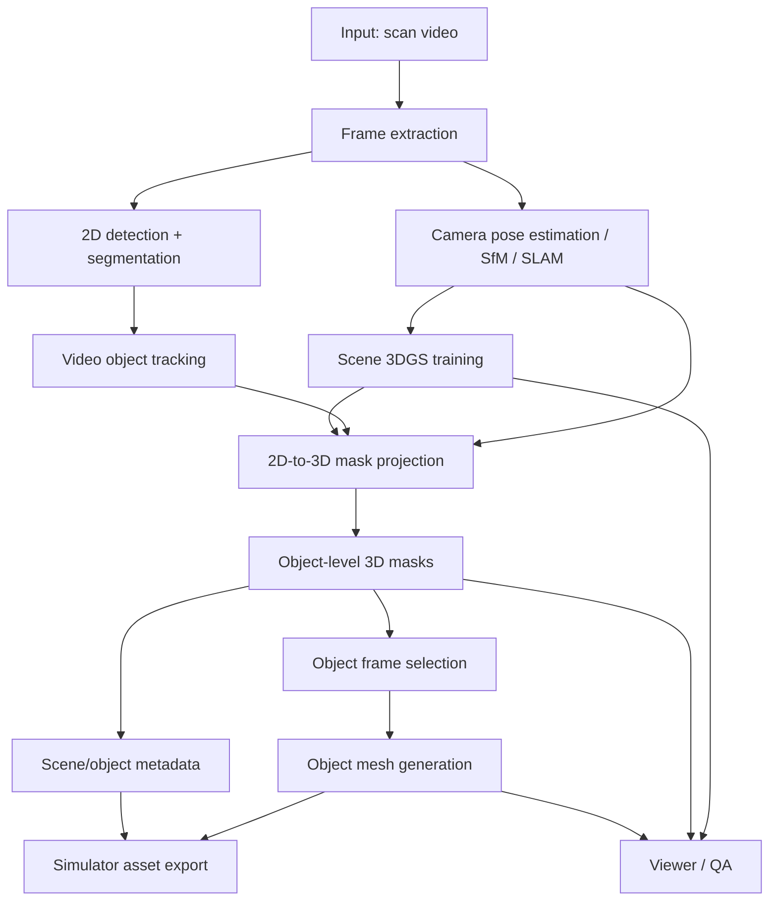

# Video2Mesh 技术调研草案：从空间扫描视频到语义 3DGS 与可仿真物体 Mesh

## 1. 背景与任务目标

我们希望构建的系统不是“从单张图片生成一个看起来合理的 3D 场景”，而是从真实空间扫描视频中恢复一个可分析、可拆分、可导入仿真器的三维场景资产。理想输入是一段围绕室内或局部空间拍摄的扫描视频；理想输出包括场景级 3D Gaussian Splatting、每个物体的 3D 语义/实例 mask、每个物体对应的高质量相关帧，以及每个物体独立的 mesh 资产。

更具体地说，目标系统应该完成以下链路：

```text
空间扫描视频
  -> 抽帧、相机位姿估计、稀疏/稠密重建
  -> 场景级 3DGS
  -> 帧级 2D detection / segmentation / tracking
  -> 2D mask 跨帧关联并融合到 3D
  -> 物体级 3D 语义/实例 mask
  -> 每个物体自动选择相关帧
  -> 每个物体 mesh 重建
  -> 仿真器可用资产包
```

最终产物不应该只是视觉展示，而应该具备明确的几何、语义和资产组织结构。例如：

- `scene.splat` 或 `.spz`：场景级 3DGS，用于快速可视化和沉浸式浏览。
- `objects/<object_id>/mask_3d.*`：每个物体在 3DGS、点云或 mesh 顶点空间里的 mask。
- `objects/<object_id>/frames.json`：该物体相关帧列表，包含可见面积、遮挡程度、视角评分和对应 2D mask。
- `objects/<object_id>/mesh.glb`：可导入仿真器的单物体 mesh。
- `objects/<object_id>/metadata.json`：类别、语义名称、尺度、姿态、坐标系变换、碰撞体、材质和来源帧。
- `scene_manifest.json`：场景级索引，描述坐标系、单位、相机轨迹、物体列表和资产路径。

这类系统与单图 3D 生成的关键区别在于：它必须尊重输入视频的真实空间结构，保持物体之间的相对位置、尺度和可见性；并且需要将“场景重建”和“物体资产生成”连接起来。

## 2. 两个参考项目总览

当前工作区中有两个相关项目：

- `SceneVersepp`
- `image-blaster`

它们都与目标任务有关，但覆盖的是不同层面。

`SceneVersepp` 是研究型 3D 场景理解项目，主题是把互联网级未标注视频提升成 3D 场景理解监督信号。它关注的是 3D object detection、3D instance segmentation、layout、视觉语言问答和导航等任务。对 Video2Mesh 来说，它最有价值的地方是提供了一个“视频/重建场景如何组织成 3D supervision”的参考框架。

`image-blaster` 是生成式资产流水线，目标是从单张图片快速创建 3D 环境、物体 mesh 和音效。它通过 World Labs Marble 生成静态环境 splat，通过 FAL 上的 Hunyuan 3D 或 Meshy 生成单物体 mesh，并提供 React/Three.js viewer 查看资产。对 Video2Mesh 来说，它最有价值的地方是单图物体 mesh 生成、资产目录组织和 viewer。

需要特别强调：这两个项目不是天然上下游。`SceneVersepp` 并不会直接输出 `image-blaster` 所需的物体参考图；`image-blaster` 也不会处理视频相机位姿、跨帧 mask、3DGS 训练或 3D semantic mask。它们分别覆盖了“3D 场景理解”和“单图资产生成”的两端，中间还需要设计并实现桥接模块。

## 3. SceneVerse++ 详细理解

### 3.1 项目定位

`SceneVersepp` 对应的论文方向是将未标注互联网视频提升为结构化 3D scene understanding 数据。仓库根目录的 `README.md` 将项目概括为一个 automated data engine，能够从 web videos 中构建 instance-level point clouds、object layouts、spatial VQA 和 vision-language navigation 等训练信号。

从代码结构看，公开仓库主要包含三部分：

```text
SceneVersepp/
  data_processing/
  SpatialLM/
  PQ3D/
```

这三部分分别对应：

- `data_processing`：视频下载、抽帧和相机位姿可视化。
- `SpatialLM`：3D object/layout detection 训练、推理与评估。
- `PQ3D`：3D instance segmentation 训练和数据生成。

因此，这个仓库更像是“数据处理 + 训练代码 + 公开数据集适配”，而不是一个可以直接输入任意扫描视频并输出语义 3DGS 的完整应用。

### 3.2 data_processing：视频与相机数据处理

`SceneVersepp/data_processing` 中有三个主要脚本：

- `download_videos.py`
- `extract_images.py`
- `view_camera_poses.py`

`download_videos.py` 会遍历数据集目录下包含 `data_info.json` 的 scene folder，并根据其中的 `video_url` 下载 YouTube 视频，默认保存为 `video.mp4`。

`extract_images.py` 会读取 `data_info.json` 里的 `data_frames`，从 `video.mp4` 中抽取指定帧，输出到：

```text
images/
crop_images/
```

其中 `crop_images/` 会做 resize 和 center crop，方便后续模型使用。

`view_camera_poses.py` 会读取一个 scene 的 `mesh.ply` 和 `camera_info.json`，用 Open3D 显示场景 mesh 与相机 frustum。它假设 scene folder 中已经有：

```text
mesh.ply
camera_info.json
```

这说明 `SceneVersepp` 的公开处理脚本已经站在“场景 mesh 和相机位姿已存在”的阶段。它能帮助理解 SVPP 数据结构，但并不包含从新视频估计相机位姿或训练 3DGS 的部分。

### 3.3 SVPP 数据形态

从 `SpatialLM/data_generation/svpp/generate_layout.py` 和 `PQ3D/data_process/generate_dataset.py` 可以看到，SVPP scene 通常依赖以下文件：

```text
<scene_name>/
  data_info.json
  video.mp4
  images/
  crop_images/
  mesh.ply
  camera_info.json
  metadata.json
```

这些文件的大致含义如下：

| 文件 | 作用 |
| --- | --- |
| `data_info.json` | 记录视频 URL、使用的 frame ids 等视频来源信息。 |
| `video.mp4` | 下载后的原始视频。 |
| `images/` | 从视频抽取的原始帧。 |
| `crop_images/` | 经过 resize/crop 的帧。 |
| `mesh.ply` | 场景级 mesh 或点云/网格数据。 |
| `camera_info.json` | 相机内参和每帧外参。 |
| `metadata.json` | 物体级实例信息，包含类别和点级实例归属。 |

其中 `metadata.json` 对 Video2Mesh 尤其重要，因为它表达了物体实例与 3D 点之间的关系。在 `SpatialLM` 中，`metadata.json` 会被读取为 instance-level box；在 `PQ3D` 中，它会被读取为点级 instance label。

从这个角度看，Video2Mesh 可以借鉴 SVPP 的数据组织方式，把自己的中间结果也整理成类似结构：

```text
<scene_id>/
  video.mp4
  frames/
  camera_info.json
  scene_3dgs/
  point_cloud.ply
  metadata.json
  objects/
```

其中 `metadata.json` 可以作为跨模块的核心语义文件，记录每个 object id 的类别、3D mask、相关帧、bbox、mesh 路径和仿真属性。

### 3.4 SpatialLM：3D object/layout detection

`SceneVersepp/SpatialLM` 是对 SpatialLM 的适配。它的主要目标是从点云中预测场景 layout 和物体 boxes。

SVPP 数据生成流程大致是：

```bash
python data_generation/svpp/generate_layout.py \
  --data_root /path/to/svpp_data \
  --save_path ./data/svpp \
  --voxel_size 0.02 \
  --workers 16 \
  --process_number -1 \
  --label-map ./scannetv2-labels.combined.tsv

python data_generation/svpp/generate_dataset.py \
  --dataset_dir ./data/svpp \
  --dataset_name svpp \
  --code_template_file ./code_template.txt
```

`generate_layout.py` 会读取每个 scene 的 `mesh.ply` 和 `metadata.json`，将物体实例转换成类似如下的文本 layout：

```text
bbox_0=Bbox(chair,1.2,0.4,0.8,0.0,0.6,0.5,1.0)
bbox_1=Bbox(table,2.1,1.5,0.7,0.0,1.2,0.8,0.7)
```

这个 layout 表示：

- 物体类别。
- 3D 中心位置。
- 绕 z 轴旋转角。
- 3D box 尺寸。

`generate_dataset.py` 会把点云和 layout 组合成 ShareGPT 风格训练样本，让模型学习从 point cloud 到 layout code 的映射。推理脚本 `inference.py` 通过 prompt 让模型生成 layout，支持 `all`、`arch`、`object` 三种 detection 类型。

对 Video2Mesh 来说，SpatialLM 的价值主要在于：

- 提供一种“点云到 object boxes”的 3D grounding 思路。
- 提供 `Bbox(...)` 形式的结构化 layout 表达。
- 可作为 3D mask 生成后的几何摘要或 sanity check。
- 可用于辅助 frame selection，例如从 3D bbox 判断物体空间范围。

但 SpatialLM 本身不解决：

- 视频到点云/3DGS 的重建。
- 2D mask 到 3D mask 的融合。
- 物体 mesh 生成。
- 仿真器资产导出。

### 3.5 PQ3D：3D instance segmentation

`SceneVersepp/PQ3D` 是对 PQ3D 的适配，用于 SceneVerse++ 数据生成和 3D instance segmentation 训练。

数据处理脚本 `PQ3D/data_process/generate_dataset.py` 会读取 scene mesh 和 metadata，并生成 PQ3D 训练所需的中间数据：

```text
training_datas/
  segments/
  base/<dataset_name>/scan_data/
    instance_id_to_label/
    pcd_with_global_alignment/
  aux/<dataset_name>/segment_id/
```

其中：

- `instance_id_to_label` 保存 instance id 到语义类别的映射。
- `pcd_with_global_alignment` 保存点坐标、颜色和 instance label。
- `segment_id` 保存 over-segmentation 或重新切分后的 segment id。

PQ3D 的模型配置中使用 Mask3D / MinkowskiEngine 风格的点云 backbone，输出 query-based mask。配置文件 `configs/svpp_gt.yaml` 用 SVPP 预训练，`configs/svpp_gt_scannet_fps.yaml` 用 ScanNet fine-tune。

对 Video2Mesh 来说，PQ3D 的价值主要在于：

- 提供 3D instance segmentation 的训练框架。
- 展示如何把点云、segment、instance label 组织成训练数据。
- 展示如何从 scene-level 3D 数据学习 object-level masks。

但要注意，当前公开代码依赖 `metadata.json` 中已有的 point-level instance assignment。也就是说，它默认训练数据里已经知道每个点属于哪个物体。对于一个新的空间扫描视频，Video2Mesh 仍然需要先生成这类 3D instance label，或者训练一个模型在新点云上预测它。

### 3.6 SceneVerse++ 对 Video2Mesh 的启发与限制

SceneVerse++ 对目标系统的启发可以概括为：

1. 用统一 scene folder 管理视频、帧、相机、mesh、metadata。
2. 用 `metadata.json` 记录 object instance 和 3D 点/segment 的对应关系。
3. 用 3D detection/layout 作为场景语义摘要。
4. 用 3D instance segmentation 训练或预测物体级 mask。

它的限制也很明确：

1. 不直接训练或输出 3DGS。
2. 不包含从任意新视频做 SfM/SLAM/3DGS 的完整流程。
3. 不包含 2D segmentation 到 3D mask 的自动融合模块。
4. 不包含 object frame selection。
5. 不包含单物体 mesh 生成和仿真器导出。

因此，SceneVerse++ 更适合作为数据结构和 3D scene understanding 方法参考，而不能直接作为 Video2Mesh 的完整实现。

## 4. image-blaster 详细理解

### 4.1 项目定位

`image-blaster` 的 README 将项目描述为：从单张图片创建 3D environments、SFX 和 meshes。它依赖 Claude skills、World Labs 和 FAL，可以快速把一张输入图变成：

- 静态环境 Gaussian splat。
- 动态物体的 `.glb` / `.obj`。
- 环境音和物体音效。
- 可在浏览器中查看的 Three.js 场景。

它更像是一个资产生成工具或 demo pipeline，而不是研究型视频重建系统。

### 4.2 项目目录与产物约定

`image-blaster` 的核心资产目录是：

```text
image-blaster/
  input/
  worlds/
    <world-slug>/
      project.json
      scene.json
      image.json
      source/
      output/
        world/
        sfx/
        <object-slug>/
```

其中：

- `input/` 用于临时放入用户输入图片。
- `worlds/<slug>/source/` 存放稳定的源图和图像分析 JSON。
- `worlds/<slug>/image.json` 存放合并后的场景理解和候选物体。
- `worlds/<slug>/output/world/` 存放 World Labs 生成的环境资产。
- `worlds/<slug>/output/<object-slug>/` 存放某个物体的 `object.json`、参考图和 3D model。
- `scene.json` 存放 viewer 中的物体摆放状态。

生成文件采用 index convention：

```text
N-slug.ext
.N-slug-request.json
```

例如一个 world generation 可能生成：

```text
0-world.json
0-world-plate.png
0-world.glb
0-world-pano.png
0-world-thumbnail.webp
0-world-full_res.spz
.0-world-request.json
```

这个约定对 Video2Mesh 很有参考价值，因为我们也需要为每个物体保存不同阶段的结果，例如 selected frame、mask crop、reference image、mesh、collision mesh 和 request metadata。

### 4.3 World Labs Marble：单图到静态环境 splat

`image-blaster/.claude/scripts/world/generate-world.mjs` 调用 World Labs Marble API。它可以输入图片或文本 prompt，输出 world assets。关键产物包括：

- `.spz`：Gaussian splat 格式的环境表现。
- `.glb`：collider mesh。
- panorama image。
- thumbnail image。
- JSON response metadata。

`image-blaster` 的 viewer 只加载本地文件，provider URL 主要作为 provenance 和 resume metadata。

这个模块与 Video2Mesh 的“场景 3DGS”目标看起来接近，但有一个本质差异：

- `image-blaster` 的环境 splat 是从单张图生成的，偏生成式 hallucination。
- Video2Mesh 目标中的场景 3DGS 应该从扫描视频重建，尽量保留真实几何和相机一致性。

因此，World Labs Marble 可以作为快速 demo 或 fallback，但不应该作为真实扫描重建的主路径。

### 4.4 Hunyuan 3D / Meshy：单图到物体 mesh

`image-blaster/.claude/scripts/asset-pipeline/generate-single-asset.mjs` 是单物体 3D 生成的主要脚本。它支持：

- Hunyuan 3D。
- Meshy。
- 先通过 image edit 提取干净物体参考图。
- 再把参考图送入 3D provider 生成 `.glb`、`.obj` 等模型文件。

Hunyuan 3D 相关参数包括：

- `--face-count`
- `--enable-pbr`
- `--generate-type Normal|LowPoly|Geometry`
- `--polygon-type triangle|quadrilateral`

Meshy 相关参数包括：

- `--target-polycount`
- `--topology`
- `--should-remesh`
- `--should-texture`
- `--enable-pbr`

对 Video2Mesh 来说，这部分可以直接作为早期原型的物体 mesh 生成后端。我们可以先从每个物体选出最佳帧或最佳 crop，然后调用类似流程生成 mesh。

但长期看，单图物体 mesh 会有局限：

- 背面几何通常是模型补全，不一定与真实物体一致。
- 对薄结构、透明物体、反光物体和遮挡物体效果不稳定。
- 尺度和姿态需要额外从 3D 场景中恢复。
- 生成 mesh 与场景 3D mask 的几何可能无法严格对齐。

因此，单图 mesh 适合作为 v0/v1 的快速可用路线；后续更理想的是引入多视角 object-centric reconstruction。

### 4.5 React/Three.js Viewer

`image-blaster/app` 是一个 React + Three.js viewer，核心能力包括：

- 加载 world splat。
- 加载 collider mesh。
- 加载单物体 mesh。
- 支持物体摆放和 scene project。
- 支持 audio、physics、character/fly controller。

相关文件包括：

- `image-blaster/app/src/components/WorldViewer.tsx`
- `image-blaster/app/src/utils/worldLoader.ts`
- `image-blaster/app/src/types/world.ts`

这对 Video2Mesh 很有价值。即使我们不用 `image-blaster` 的单图 world generation，也可以复用或参考它的 viewer，构建一个检查系统输出的可视化界面：

- 显示重建出的真实场景 3DGS。
- 高亮某个 object 的 3D mask。
- 显示选中的相关帧。
- 加载物体 mesh 并与原始 3D mask 对齐比较。
- 编辑物体 pose 和导出仿真配置。

### 4.6 image-blaster 对 Video2Mesh 的启发与限制

image-blaster 的启发包括：

1. 资产目录组织清晰，适合管理多阶段生成结果。
2. 有单图物体 mesh 生成 pipeline，可以作为早期 mesh backend。
3. 有可交互 viewer，适合做结果质检和 demo。
4. 有 provider request metadata 的管理机制，方便复现和恢复。

它的限制包括：

1. 输入是单张图片，不是视频扫描。
2. 不处理相机位姿估计。
3. 不训练真实场景 3DGS。
4. 不做 2D mask tracking。
5. 不做 2D-to-3D semantic fusion。
6. 不保证生成 mesh 与真实场景几何严格对齐。

## 5. 目标系统推荐技术路线

### 5.1 总体架构

推荐将 Video2Mesh 设计为多个相对独立的模块：

```text
Video2Mesh/
  video_ingest/
  reconstruction/
  segmentation_2d/
  tracking/
  mask_fusion_3d/
  object_frame_selection/
  object_mesh_generation/
  asset_export/
  viewer/
```

对应的数据流如下：



### 5.2 视频预处理与抽帧

输入视频需要先拆成帧，并记录 frame id、timestamp、分辨率和图像路径。可以参考 `SceneVersepp/data_processing/extract_images.py` 的方式，但 Video2Mesh 应该支持更通用的输入：

```text
scenes/<scene_id>/
  input/
    video.mp4
  frames/
    000000.png
    000001.png
  frame_index.json
```

`frame_index.json` 可以记录：

- 原始视频路径。
- FPS。
- 抽帧间隔。
- 每帧 timestamp。
- 是否为关键帧。
- 图像尺寸。

早期实现可以每隔固定帧数抽取一帧，例如 2 fps 或 5 fps；后续可以根据运动模糊、视角变化和覆盖率做 adaptive frame selection。

### 5.3 相机位姿与场景 3DGS

场景重建建议先走传统 SfM + 3DGS 路线：

1. 使用 COLMAP 从抽帧估计相机内外参和稀疏点云。
2. 使用 3D Gaussian Splatting 实现训练场景 3DGS。
3. 导出相机轨迹、稀疏点云、3DGS 文件和渲染检查结果。

中间文件建议组织为：

```text
reconstruction/
  colmap/
    cameras.bin
    images.bin
    points3D.bin
  cameras.json
  sparse_points.ply
  scene_3dgs/
    point_cloud/
    config.json
    output.splat 或 output.ply
```

如果输入来自手机 ARKit/ARCore/Polycam/Record3D 等扫描工具，也可以优先使用已有 camera poses，以减少 COLMAP 失败风险。

这一阶段的主要成功标准是：

- 相机轨迹稳定。
- 3DGS novel view 渲染与原视频视角一致。
- 场景尺度可恢复或可通过人工标定。
- 输出坐标系后续可用于 mask projection 和仿真器导出。

### 5.4 帧级 2D segmentation / detection / tracking

每帧需要识别可拆分物体。可选路线包括：

- open-vocabulary detection：根据文本类别或自动 caption 找物体。
- instance segmentation：生成每帧物体 mask。
- video object tracking：跨帧保持同一物体 ID 一致。

一个 practical pipeline 可以是：

```text
GroundingDINO / OWL-ViT / YOLO-world
  -> SAM / SAM2
  -> video tracking / mask propagation
  -> per-frame instance masks
```

输出建议为：

```text
segmentation_2d/
  frames/
    000000.instances.json
    000000.mask.png
  tracks/
    track_0001.json
    track_0002.json
```

每个 track 应该记录：

- `track_id`
- `category`
- `category_confidence`
- `frames`
- 每帧 bbox
- 每帧 mask path
- 可见面积
- 遮挡或截断评分

这一阶段的难点是跨帧 ID consistency。2D detector 每帧单独运行容易产生 ID 抖动，因此需要 tracking 或后处理，把同一物体在不同帧中的 mask 合并为同一 object track。

### 5.5 2D mask 到 3D mask 的融合

这是目标系统的核心桥接模块。它需要把每帧的 2D object mask 利用相机位姿投影到 3DGS 或点云上，最终得到每个物体的 3D semantic / instance mask。

可以考虑两种实现路线。

第一种是点云空间融合：

1. 从 COLMAP sparse/dense point cloud 或 3DGS centers 获取 3D points。
2. 对每个 3D point，根据相机内外参投影到多个帧。
3. 检查投影位置是否落入某个 2D mask。
4. 对每个 point 累积 object id 投票。
5. 用最大投票或置信度模型决定 point-level object label。

第二种是 Gaussian 空间融合：

1. 使用每个 Gaussian 的中心点作为投影对象。
2. 结合 Gaussian opacity、scale 和可见性筛选。
3. 对每个 Gaussian 累积 object track 的 mask votes。
4. 得到 Gaussian-level semantic mask。

点云空间更容易实现和调试；Gaussian 空间更贴近最终 3DGS 表达。建议早期先用点云空间融合，后续再将 label transfer 到 Gaussian splats。

输出可以设计为：

```text
semantic_3d/
  objects.json
  point_labels.npy
  gaussian_labels.npy
  object_masks/
    object_0001.npy
    object_0002.npy
```

`objects.json` 应该记录：

- object id。
- 类别。
- 3D bbox。
- mask confidence。
- 支持它的帧数。
- 最佳可见帧。
- 对应 2D track id。

### 5.6 每个物体自动选帧

选帧的目标是为 mesh generation 提供尽可能干净、完整、有代表性的物体图像。对每个 object track，可以为每一帧计算评分：

```text
score =
  visible_area_score
  + sharpness_score
  + viewpoint_score
  + mask_confidence_score
  - occlusion_penalty
  - truncation_penalty
  - motion_blur_penalty
```

常用指标包括：

- 2D mask 面积占图像比例。
- bbox 是否贴边，判断是否被截断。
- Laplacian variance，判断清晰度。
- 与相邻 mask 的 overlap，判断遮挡。
- 物体在 3D bbox 上的视角覆盖。
- 是否有多个互补视角。

输出建议为：

```text
objects/<object_id>/
  selected_frames.json
  crops/
    000123.png
    000287.png
  masks/
    000123.png
    000287.png
```

`selected_frames.json` 需要记录每张图的评分和选择原因，方便后续调试。例如：

```json
{
  "object_id": "object_0004",
  "category": "chair",
  "selected_frames": [
    {
      "frame_id": 123,
      "image": "frames/000123.png",
      "mask": "segmentation_2d/frames/000123.object_0004.png",
      "score": 0.91,
      "visible_area": 0.18,
      "sharpness": 0.83,
      "truncation": 0.02,
      "notes": "largest clear frontal view"
    }
  ]
}
```

### 5.7 每个物体 mesh 重建

mesh generation 可以分为三个阶段。

第一阶段是快速原型：单图 mesh generation。直接复用 `image-blaster` 的思路，对每个物体的最佳 crop 调用 Hunyuan 3D 或 Meshy，输出 `.glb` 或 `.obj`。

第二阶段是多图辅助：为同一物体选择多个互补视角，先用 image editing 生成 clean object references，再用支持多视角或 image set 的 3D reconstruction/generation 模型。

第三阶段是 3DGS-to-mesh：用 object masks 和注册相机位姿，从训练好的 3DGS 渲染 object-centric 多视角 RGB/depth/normal/mask，再把 masked depth/normal 观测融合成 surface。这个阶段不应只把 sparse point cloud 或 Gaussian centers 直接连成网格；那只能作为 debug baseline。

当前 object mask cloud 直接转 mesh 的失败形态已经很明确：表面会被打碎成大量 disconnected triangle islands，伴随 holes、floating sheets 和非 watertight 区域。根因是点云本身稀疏、不均匀、带悬浮噪声，并且局部三角化会把错误邻域硬连成薄片。因此这条路线只能用于快速看位置和 bbox 规模，不能作为最终物体 mesh。

早期推荐路线：

```text
best object crop
  -> background removal / clean reference
  -> Hunyuan 3D or Meshy
  -> generated mesh
  -> scale and pose alignment using 3D mask bbox
  -> simulator export
```

长期推荐路线：

```text
trained 3DGS + object masks + registered camera poses
  -> object-centric multi-view RGB/depth/normal/mask rendering
  -> TSDF fusion over masked observations
  -> marching cubes / Poisson surface extraction
  -> optional NeuS-style SDF refinement
  -> connected-component filtering / hole filling / simplification / watertight QA
  -> texture baking
  -> physics collider generation
  -> simulator export
```

### 5.8 仿真器资产导出

仿真器通常不只需要 mesh，还需要尺度、姿态、坐标系、碰撞体、材质和物理属性。建议导出结构如下：

```text
exports/simulator/
  scene_manifest.json
  scene_background.spz
  objects/
    object_0001/
      mesh.glb
      collider.glb
      material.json
      metadata.json
```

`metadata.json` 可以包含：

```json
{
  "object_id": "object_0001",
  "category": "chair",
  "name": "chair_0001",
  "scale": [1.0, 1.0, 1.0],
  "position": [0.0, 0.0, 0.0],
  "rotation_quat": [0.0, 0.0, 0.0, 1.0],
  "bbox_center": [1.2, 0.4, 0.8],
  "bbox_size": [0.6, 0.5, 1.0],
  "semantic_id": 4,
  "physics": {
    "type": "rigidbody",
    "mass": 3.0,
    "collider": "collider.glb"
  }
}
```

如果目标仿真器是 Isaac Sim、MuJoCo、Genesis、PyBullet、Habitat、Unity 或 Unreal，导出格式会不同，但核心信息类似。早期可以先导出通用 `.glb + JSON manifest`，后续再写具体 simulator adapter。

## 6. 两个项目如何复用

### 6.1 可复用 SceneVerse++ 的部分

`SceneVersepp` 可复用或参考的部分包括：

1. SVPP scene folder 组织方式。
2. `data_info.json` / `camera_info.json` / `metadata.json` 的数据理念。
3. `SpatialLM` 的 layout 表达和 object bbox 生成方式。
4. `PQ3D` 的 3D instance segmentation 数据格式。
5. 点云、segment、instance label 的训练数据组织方式。

推荐在 Video2Mesh 中引入类似 SVPP 的 scene metadata，但扩展字段以支持 3DGS 和 mesh：

```json
{
  "scene_id": "room_001",
  "coordinate_system": "z_up",
  "unit": "meter",
  "objects": {
    "object_0001": {
      "category": "chair",
      "track_id": "track_0007",
      "bbox_3d": {},
      "mask_3d": "semantic_3d/object_masks/object_0001.npy",
      "selected_frames": "objects/object_0001/selected_frames.json",
      "mesh": "objects/object_0001/mesh.glb"
    }
  }
}
```

### 6.2 可复用 image-blaster 的部分

`image-blaster` 可复用或参考的部分包括：

1. `worlds/<slug>` 风格的资产目录。
2. `object.json` 的物体意图和 provenance 记录。
3. `generate-single-asset.mjs` 的单图到 mesh pipeline。
4. World/object generation request metadata 管理方式。
5. React/Three.js viewer。
6. `.spz`、`.glb`、object placement、physics viewer 的前端加载方式。

最直接的复用方式是：Video2Mesh 先生成每个物体的最佳 crop，然后把它组织成 `image-blaster` 风格的 object folder，再调用单物体生成脚本。

例如：

```text
objects/object_0001/best_crop.png
  -> image-blaster style object reference
  -> Hunyuan 3D / Meshy
  -> objects/object_0001/mesh.glb
```

后续可以把 `image-blaster/app` 改造成 Video2Mesh 的 QA viewer：

- 左侧显示场景和物体列表。
- 中间显示真实扫描得到的 3DGS。
- 点击物体时高亮其 3D mask。
- 右侧显示 selected frames 和 generated mesh。
- 支持导出 simulator asset bundle。

### 6.3 需要新增的桥接模块

两项目之间缺失的关键桥接模块包括：

| 模块 | 输入 | 输出 | 作用 |
| --- | --- | --- | --- |
| Video2GS | 视频帧 | camera poses、3DGS、点云 | 从真实视频重建场景。 |
| 2D Segmentation + Tracking | 视频帧 | per-frame masks、object tracks | 得到跨帧一致的物体候选。 |
| 2D-to-3D Mask Fusion | masks、camera poses、3DGS/点云 | 物体级 3D mask | 把图像语义提升到三维。 |
| Object Frame Selector | tracks、3D mask、frames | selected frames/crops | 为每个物体挑选重建参考图。 |
| Mesh Backend Adapter | selected frames | object mesh | 调用 Hunyuan/Meshy 或多视角重建。 |
| Simulator Exporter | 3D mask、mesh、metadata | 仿真器资产包 | 导出可用资产和 manifest。 |

## 7. 关键技术难点

### 7.1 视频重建质量与尺度恢复

如果视频存在快速运动、模糊、低纹理墙面、反光表面或重复纹理，COLMAP/SfM 可能失败。即使相机轨迹成功，重建的尺度也通常是任意尺度，需要通过已知物体尺寸、深度传感器、ARKit scale 或人工标定恢复米制单位。

仿真器对尺度非常敏感，因此 Video2Mesh 不能只输出视觉上合理的模型，还需要明确单位和坐标系。

### 7.2 2D mask 跨帧一致性

每帧单独检测会产生 object id 抖动。例如同一把椅子在不同帧中可能被分配成多个实例，也可能与相邻椅子混淆。解决方案需要结合：

- mask tracking。
- appearance embedding。
- 3D geometric consistency。
- temporal smoothing。
- human-in-the-loop correction。

对于室内多相似物体场景，如多把椅子、多本书、多只杯子，这个问题会特别明显。

### 7.3 3D mask 融合噪声

2D mask 投影到 3D 时会遇到：

- 相机位姿误差。
- depth/visibility 不准。
- 物体遮挡。
- mask 边界不稳定。
- 透明和反光物体难以分割。
- Gaussian splat 没有显式 surface connectivity。

因此 3D mask 不应该只做一次硬投票，还需要置信度、可见性、空间平滑和后处理。例如可以在点云上做 connected component filtering，去掉离群点；或在 Gaussian graph 上做 label smoothing。

### 7.4 mesh 生成与真实几何对齐

单图生成 mesh 的外观可能好，但与真实 3D mask 不一定一致。典型问题包括：

- mesh 尺寸与真实 bbox 不匹配。
- 正面好看但背面错误。
- 物体底部或遮挡部分被 hallucinate。
- 细长结构断裂。
- mesh 原点、朝向、重心不适合仿真。

因此需要额外做 mesh alignment：

1. 根据 3D mask bbox 缩放 mesh。
2. 根据物体主方向旋转 mesh。
3. 将 mesh 底部对齐地面或 mask 下边界。
4. 生成简化 collider。
5. 检查 mesh 是否与场景其他物体严重穿插。

### 7.5 仿真器物理属性缺失

真实仿真器通常需要：

- mass。
- friction。
- restitution。
- collider shape。
- static/dynamic 属性。
- articulation 信息。
- semantic category。

从视频中很难直接恢复这些属性，因此 v0 可以使用类别默认值。例如椅子、桌子、柜子默认 static 或 rigidbody，墙面和地板默认 static，杯子和小物体默认 rigidbody。后续可以引入材质识别和 LLM 规则库生成物理参数。

## 8. 阶段性开发计划

### Phase 1：单视频到 3DGS

目标：选择一个小型室内扫描视频，跑通抽帧、相机位姿估计和场景 3DGS。

主要产物：

- `frames/`
- `cameras.json`
- `sparse_points.ply`
- `scene_3dgs/`
- 渲染质量检查视频或图片。

验收标准：

- novel view 渲染可接受。
- 相机轨迹没有明显漂移。
- 场景尺度有初步标定方案。

### Phase 2：2D segmentation + tracking

目标：对抽帧结果生成帧级 object masks，并保持跨帧 object id 一致。

主要产物：

- `segmentation_2d/frames/*.json`
- `segmentation_2d/tracks/*.json`
- 每个 object track 的可视化视频。

验收标准：

- 主要物体能被识别。
- 同一物体跨帧 ID 基本稳定。
- 输出 mask 能用于后续投影。

### Phase 3：投影融合得到 3D object masks

目标：将 2D masks 融合到点云或 Gaussian centers，得到每个物体的 3D mask。

主要产物：

- `semantic_3d/objects.json`
- `semantic_3d/point_labels.npy`
- `semantic_3d/object_masks/*.npy`
- 3D mask 可视化结果。

验收标准：

- 每个主要物体有独立 3D mask。
- mask 空间位置与原场景一致。
- 大面积错误标签可通过后处理减少。

### Phase 4：自动选帧并接入 mesh 生成

目标：为每个物体选择最佳帧/crop，并调用单图 mesh backend 生成 mesh。

主要产物：

- `objects/<object_id>/selected_frames.json`
- `objects/<object_id>/best_crop.png`
- `objects/<object_id>/mesh.glb`

验收标准：

- 每个主要物体至少生成一个 mesh。
- mesh 尺度和位置可初步对齐 3D mask。
- 失败案例有日志和 fallback。

### Phase 5：导出仿真器资产包

目标：将场景背景、物体 mesh、pose、scale、semantic id 和 physics metadata 打包导出。

主要产物：

- `exports/simulator/scene_manifest.json`
- `exports/simulator/objects/*/mesh.glb`
- `exports/simulator/objects/*/collider.glb`
- simulator adapter 脚本。

验收标准：

- 至少能在一个目标仿真器或 Three.js viewer 中加载。
- 物体位置、尺度和朝向大致正确。
- 背景场景和物体资产可分离显示。

### Phase 6：viewer 与评估指标

目标：构建 QA viewer 和基础评估指标，用于快速发现重建、mask 和 mesh 的错误。

viewer 需要支持：

- 场景 3DGS 浏览。
- object mask 高亮。
- selected frames 显示。
- mesh 与 mask 对齐比较。
- 导出 manifest 检查。

评估指标包括：

- 相机位姿重投影误差。
- 3DGS PSNR/SSIM/LPIPS 或主观渲染检查。
- 2D mask tracking consistency。
- 3D mask coverage / compactness。
- mesh-bbox alignment error。
- simulator import success rate。

## 9. 建议实验与评估

### 9.1 最小可行实验

建议先选择一个小型室内场景作为最小样例，例如：

- 一张桌子、两把椅子、一个柜子。
- 视频长度 30-60 秒。
- 拍摄时缓慢绕场景移动。
- 尽量避免强反光、透明物体和严重运动模糊。

这个实验不追求全类别泛化，而是验证完整链路：

```text
video -> 3DGS -> object masks -> selected frames -> object meshes -> viewer/export
```

### 9.2 对比实验

建议设计三类 mesh 生成对比：

1. 单图 mesh：只使用每个物体的最佳帧 crop。
2. 多图 mesh：使用多个 selected frames。
3. 3DGS-to-mesh：从 3DGS 多视角渲染 depth/normal/mask，再做 TSDF fusion / Poisson / NeuS-style surface extraction。

比较维度包括：

- 形状真实性。
- 纹理质量。
- 与原场景 bbox 的对齐程度。
- 背面/遮挡区域合理性。
- 仿真器导入成功率。
- 生成耗时和失败率。

### 9.3 消融实验

可以考虑以下消融：

- 是否使用 tracking，只用 per-frame segmentation 会怎样。
- 是否使用 3D consistency 来合并 object tracks。
- 选帧策略：最大面积 vs 综合评分。
- 3D mask 融合：硬投票 vs 置信度加权 vs spatial smoothing。
- mesh 生成：best crop vs clean plate/reference edit。

### 9.4 人工标注小基准

为了量化效果，可以人工标注少量数据：

- 5-10 个视频场景。
- 每个场景 5-20 个主要物体。
- 少量关键帧 2D mask。
- 粗略 3D bbox 或手工检查的 3D mask。

这样可以评估：

- 物体发现召回率。
- 跨帧 ID consistency。
- 3D mask 与人工检查结果的一致性。
- mesh 可用率。

## 10. 推荐文件结构草案

Video2Mesh 后续可以采用如下结构保存每个场景：

```text
data/
  scenes/
    room_001/
      input/
        video.mp4
      frames/
        000000.png
        000001.png
      frame_index.json
      reconstruction/
        cameras.json
        sparse_points.ply
        scene_3dgs/
      segmentation_2d/
        frames/
        tracks/
      semantic_3d/
        objects.json
        point_labels.npy
        gaussian_labels.npy
        object_masks/
      objects/
        object_0001/
          object.json
          selected_frames.json
          crops/
          masks/
          mesh.glb
          collider.glb
        object_0002/
      exports/
        simulator/
          scene_manifest.json
```

这个结构结合了 SceneVerse++ 的 scene-level 数据组织和 image-blaster 的 object-level asset organization。

## 11. 推荐元数据 schema 草案

### 11.1 scene_manifest.json

```json
{
  "schema_version": 1,
  "scene_id": "room_001",
  "unit": "meter",
  "coordinate_system": "z_up",
  "source_video": "input/video.mp4",
  "frames": "frame_index.json",
  "camera_info": "reconstruction/cameras.json",
  "scene_3dgs": "reconstruction/scene_3dgs/output.splat",
  "objects": [
    {
      "object_id": "object_0001",
      "category": "chair",
      "metadata": "objects/object_0001/object.json",
      "mesh": "objects/object_0001/mesh.glb",
      "collider": "objects/object_0001/collider.glb"
    }
  ]
}
```

### 11.2 object.json

```json
{
  "schema_version": 1,
  "object_id": "object_0001",
  "track_id": "track_0007",
  "category": "chair",
  "name": "chair_0001",
  "bbox_3d": {
    "center": [1.2, 0.4, 0.8],
    "size": [0.6, 0.5, 1.0],
    "rotation_z": 0.0
  },
  "mask_3d": {
    "type": "point_indices",
    "path": "../../semantic_3d/object_masks/object_0001.npy",
    "confidence": 0.82
  },
  "selected_frames": "selected_frames.json",
  "mesh": "mesh.glb",
  "pose_in_scene": {
    "position": [1.2, 0.4, 0.0],
    "rotation_quat": [0.0, 0.0, 0.0, 1.0],
    "scale": [1.0, 1.0, 1.0]
  },
  "physics": {
    "mode": "rigidbody",
    "mass": 3.0,
    "collider": "collider.glb"
  }
}
```

这个 schema 可以先保持宽松，随着 pipeline 稳定再固化。

## 12. 结论

`SceneVersepp` 和 `image-blaster` 都对 Video2Mesh 有参考价值，但它们解决的是不同问题。

`SceneVersepp` 适合作为 3D scene understanding 和数据组织参考。它展示了如何把重建后的场景 mesh、metadata、point-level instance labels 和 3D layout 组织成训练数据，并进一步训练 object detection 和 instance segmentation 模型。但它并不直接提供任意扫描视频到 3DGS 和 3D semantic masks 的完整推理系统。

`image-blaster` 适合作为资产生成和 viewer 参考。它展示了如何从单张图生成环境 splat、物体 mesh 和可交互浏览器场景，并提供了清晰的 object asset organization。但它不处理视频、多视角、真实相机位姿、3DGS 训练或物体级 3D mask。

因此，Video2Mesh 的核心工作是补齐中间桥接层：

```text
真实视频重建
  + 2D segmentation/tracking
  + 2D-to-3D semantic fusion
  + object frame selection
  + object-centric mesh generation
  + simulator export
```

短期最现实的路线是：先用传统 SfM/3DGS 跑通真实扫描场景，再用 2D segmentation 和 tracking 生成物体 tracks，通过投影融合得到 3D masks，并用 object mask cloud OBJ 作为临时 debug mesh 检查尺度、位置和导出接口。这个 OBJ baseline 会很碎，只能证明链路闭合，不能代表最终资产质量。长期和生产路线应升级为 3DGS-to-mesh：从 3DGS 在真实相机位姿下渲染多视角 depth/normal/mask，再用 TSDF fusion、Poisson surface extraction 或 NeuS-style SDF refinement 提取物体表面，从而提高真实几何一致性。

## 13. 下一步建议

优先级最高的下一步不是训练大模型，而是先做一个可运行的 end-to-end prototype：

1. 选一个简单室内扫描视频。
2. 跑通 COLMAP + 3DGS。
3. 对抽帧运行 2D segmentation 和 tracking。
4. 将 2D masks 投影融合到点云，得到 object-level 3D masks。
5. 为每个 object 自动选多视角真实帧和 mask。
6. 从 3DGS 渲染 object-centric depth/normal/mask，做 TSDF fusion / Poisson / NeuS-style surface extraction 得到 `.obj` 或 `.glb`。
7. 用 viewer 检查场景 3DGS、object mask 和 mesh 是否能对齐。

这个 prototype 一旦跑通，就可以围绕失败案例逐步增强：更好的 tracking、更稳的 3D fusion、更好的选帧、多视角 mesh、仿真器专用导出和人工校正界面。
