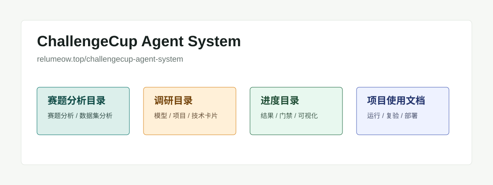

# ChallengeCup Agent System 总目录

这个文档站挂载在 `/challengecup-agent-system/` 子路由下，用来集中展示 ChallengeCup 多模态模型协同自主智能体系统的赛题理解、技术调研、进度结果和使用方式。

## 子目录

| 目录 | 内容边界 |
|---|---|
| [赛题分析目录](contest-analysis/README.md) | 赛题任务拆解、评分指标、R1/COCO 数据集分析、当前风险和应对 |
| [调研目录](research-catalog/README.md) | 所有模型、项目和技术调研；每个项目/模型单独成文，包含链接、摘要要点、pipeline、接入作用和输出摘录 |
| [进度目录](progress/README.md) | 当前有效实验结果、候选模型、门禁结论、可视化产物和后续优先级 |
| [项目使用文档目录](project-docs/README.md) | 环境、运行命令、主流程脚本、demo、部署和复现实验入口 |

## 当前一句话

本项目不是单个检测器，而是一套端侧约束下的多模型协同系统：场景认知模型负责理解输入条件，任务决策模型生成检测策略，YOLO 检测器完成目标定位，离线数据 agent 负责错例挖掘、teacher/pseudo-label、权重插值和候选门禁。

