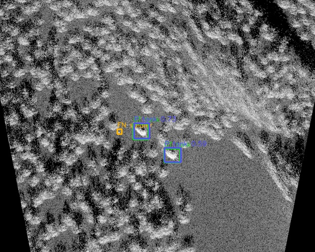

# 当前结果与门禁结论

## 数据版本

当前有效结果均基于修正标签版本：

- 数据集：`datasets/datasets_r1_base_train`
- 图像数：750
- GT 框数：2957
- train / val：599 / 151
- 标签 sha256：`c139f0909fcb1c22b96da1de1df755ad9c9239722a34fc859b154395fd10445c`

## 主候选

| 候选 | precision | recall | mAP50 | mAP50-95 | 结论 |
|---|---:|---:|---:|---:|---|
| `1056 + TTA` | 0.8862 | 0.8658 | 0.8885 | 0.4445 | 默认高精/展示候选 |
| `1056 + TTA + val-iou=0.7432` | 0.8688 | 0.8407 | 0.8787 | 0.4461 | 严格 mAP50-95 候选 |

逐类 mAP50-95：

| 类别 | `1056 + TTA` | `1056 + TTA + iou=0.7432` |
|---|---:|---:|
| soldier | 0.1845 | 0.1794 |
| small_aircraft | 0.5327 | 0.5363 |
| warship | 0.5634 | 0.5691 |
| tank | 0.4973 | 0.4997 |

## 结果可视化

本地已生成全量 GT/预测可视化：

- `agent_system/outputs/r1_all_gt_pred_visualizations/index.html`
- 绿色框：官方 GT
- 红色框：模型预测
- 展示口径：`imgsz=1056`、`TTA=true`、`conf=0.25`、`iou=0.70`、启用通过 gate 的场景先验

## 错例审计

`1056 + TTA + scene-prior` 审计输出：

| 分组 | TP | FP | FN | 结论 |
|---|---:|---:|---:|---|
| all | 538 | 135 | 60 | 召回较高但 FP 偏多 |
| soldier | 82 | 53 | 43 | 仍是主要漏检类 |
| tank | 176 | 54 | 11 | FN 少，FP 需要控制 |
| `soldier|urban` | 44 | 28 | 31 | 当前最困难组合 |
| tiny | 105 | 60 | 47 | tiny 目标仍是短板 |

precision policy 结果：

| 口径 | TP | FP | FN | pred | 说明 |
|---|---:|---:|---:|---:|---|
| `1056 + TTA + scene-prior` | 538 | 135 | 60 | 673 | 召回高，FP 偏多 |
| `1056 + TTA + scene-prior + precision policy` | 530 | 41 | 68 | 571 | FP 大幅下降，适合演示 |

## 已尝试但暂不默认的路线

| 路线 | 结果 |
|---|---|
| SAHI / naive slicing | 小目标可能受益，但整体 FP 和边界问题导致未过 gate |
| scene-hard 直接微调 | 局部有帮助，整体 mAP50-95 没有稳定超过 baseline |
| 弱 teacher 伪标签 | teacher gap 不足，pseudo-label gate 拒绝 |
| 多尺度 WBF | 可作为探针，但当前不如单权重高精路线稳定 |

## 下一步

1. 保留 `interp_cp_a252 + 1056 + TTA` 作为默认高精评估。
2. 如果提交按 mAP50-95，保留 `val-iou=0.7432` 严格候选。
3. 继续围绕 `soldier|urban`、`soldier|forest`、`SAR` 做错例闭环。
4. 引入更强 teacher 或 Grounding DINO 候选，只允许通过 gate 的伪标签写入训练集。

