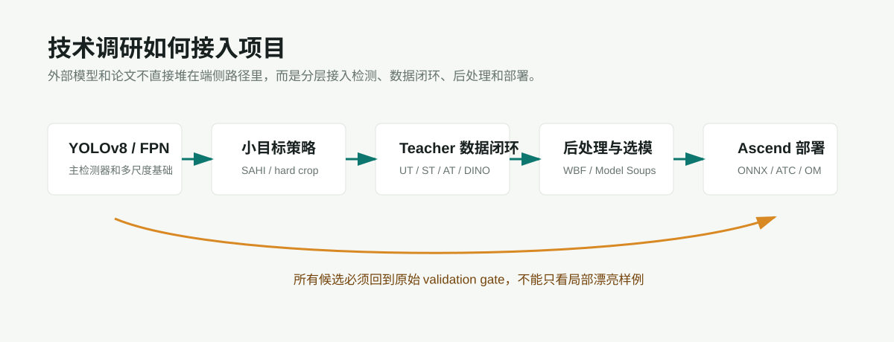

# ChallengeCup 技术调研目录

这个目录只放外部模型、项目、论文和工程技术的调研。每个模型或项目单独成文，统一回答：

- 项目/模型链接在哪里。
- 如果是论文/会议/期刊，论文要点和摘要转述是什么。
- 原论文或项目的 pipeline 是什么。
- 它能接入 ChallengeCup Agent System 的哪个位置。
- 本项目是否已经尝试接入，输出结果是什么。
- 是否有图、流程图或结果可视化。

## 环节子目录

| 环节 | 子目录 | 内容边界 |
|---|---|---|
| 目标检测 | [target-detection](target-detection/overview.md) | YOLOv8、FPN、多尺度、小目标和切片推理 |
| 场景认知 | [scene-cognition](scene-cognition/overview.md) | Places365、EfficientNet、MobileCLIP 等场景理解模型 |
| 任务决策与后处理 | [task-decision-postprocess](task-decision-postprocess/overview.md) | 场景先验、WBF、Model Soups、策略搜索和门禁 |
| 数据闭环与半监督 | [data-engine-semisupervised](data-engine-semisupervised/overview.md) | Teacher-Student、Grounding DINO、Copy-Paste、错例平台 |
| 端侧部署 | [deployment](deployment/overview.md) | ONNX、CANN/ATC、Ascend 310B benchmark 准备 |

## 阅读方式

先读每个环节的 Overview，确认它在项目 pipeline 里的位置；再进入对应模型/项目文档，看链接、摘要要点、pipeline、接入状态和本项目输出。
