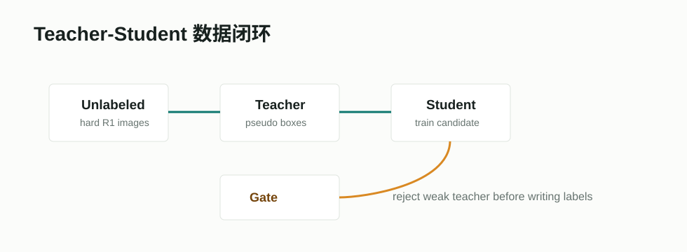

# Soft Teacher



## 项目/论文链接

- 论文：[End-to-End Semi-Supervised Object Detection with Soft Teacher](https://arxiv.org/abs/2106.09018)
- 官方实现：[microsoft/SoftTeacher](https://github.com/microsoft/SoftTeacher)
- 会议：ICCV 2021

## 摘要要点

Soft Teacher 把半监督检测做成端到端训练流程。teacher 对未标注图像产生伪框，student 同时学习有标注数据和伪标签数据。方法中的两个关键点是：用 teacher 分类分数给未标注框加权，避免硬伪标签过度影响；用 box jitter 筛选更可靠的回归框。论文在 COCO 多种标注比例下报告了明显提升。

## Pipeline

```text
labeled batch + unlabeled batch
  -> weak augmentation for teacher
  -> pseudo boxes after NMS
  -> score-weighted classification loss
  -> box jitter reliability filter
  -> student update
  -> teacher EMA update
```

论文原图可参考 OpenAccess 版本中的 framework overview。

## 在本项目中的作用

Soft Teacher 对 R1 的价值是给 teacher 伪标签提供更细的可信度设计。本项目后续如果要做强 teacher，可以吸收：

- 对不同类别采用不同 pseudo-label 权重。
- 对 `soldier` 小框做 box jitter 稳定性筛选。
- 只把能减少 `urban/forest/SAR` 漏检且不过度增 FP 的伪标签写入训练集。

## 接入状态

尚未完整接入 Soft Teacher 框架，但已有 teacher/student 评估骨架和门禁。当前不应直接启用，因为本地 teacher 还不够强。

## 输出结果摘录

当前项目结论是：在弱 teacher 条件下，agent-mixed 训练会回退 mAP50-95。因此 Soft Teacher 不是“立刻涨分按钮”，而是下一步强 teacher 和伪标签质量控制方案。
