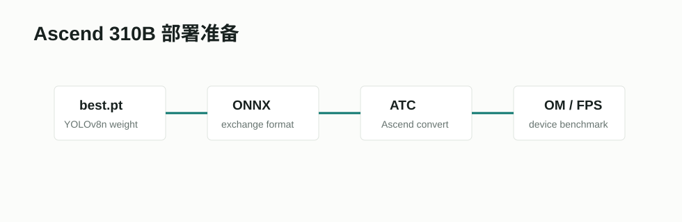

# Ascend CANN / ATC 部署链路



## 项目/文档链接

- 华为 CANN 文档：[ONNX Model Exporting / Ascend workflow](https://www.hiascend.com/document/detail/en/canncommercial/800/quickstart/quickstart/quickstart_18_0009.html)
- ONNX Runtime CANN EP：[Huawei CANN Execution Provider](https://onnxruntime.ai/docs/execution-providers/community-maintained/CANN-ExecutionProvider.html)
- Ultralytics 导出相关文档：[YOLO predict / export tooling](https://docs.ultralytics.com/modes/predict/)

## 摘要要点

Ascend 部署通常需要把训练框架中的模型先导出为 ONNX，再用 Ascend CANN/ATC 工具链转换为适配硬件的 OM 模型。ONNX 是中间交换格式，ATC/OM 是真机部署前的关键转换步骤。实际性能和精度仍需要在目标 Ascend 设备上验证。

## Pipeline

```text
PyTorch / YOLO weights
  -> ONNX export
  -> ATC conversion
  -> OM model
  -> Ascend 310B inference benchmark
```

## 在本项目中的作用

赛题明确要求端侧运行，因此部署链路必须保留。但当前本地 Mac 不能跑 ATC 和 310B benchmark，所以本项目先保证：

- 模型选型偏轻量。
- 导出 ONNX 的入口存在。
- `deploy_ascend310b.sh` 保留 ATC 转换命令结构。
- 真机 FPS 等待后续补测。

## 接入状态

接口已保留，真机未完成。相关文件：

- `agent_system/deploy_ascend310b.sh`
- `agent_system/pipelines/export_r1_detector.py`
- `agent_system/outputs/deploy/r1_detector_export.json`

## 输出结果摘录

当前报告口径：本地只声明 ONNX/ATC 准备就绪，不把 Mac 端速度伪装成 310B FPS。310B FPS 是后续风险项。
