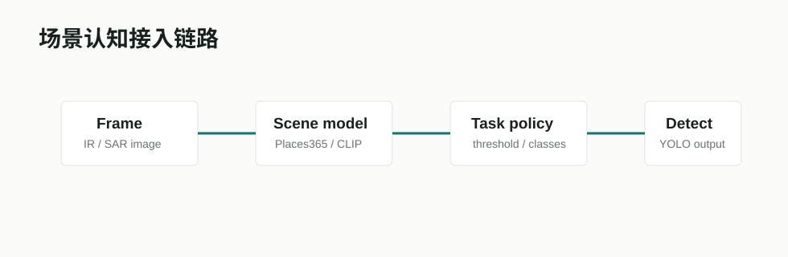

# Places365 / ResNet50 场景模型



## 项目/模型链接

- 项目主页：[Places: Scene Recognition Database](http://places2.csail.mit.edu/)
- 模型仓库：[CSAILVision/places365](https://github.com/CSAILVision/places365)
- 论文：[Places: A 10 million Image Database for Scene Recognition](https://ieeexplore.ieee.org/document/7968387)

## 摘要要点

Places365 面向场景识别而不是物体分类，覆盖室内、自然、城市、道路、水域等大量场景类别。它的价值在于让模型学习“场景上下文”，而不仅仅识别图中某个物体。对 ChallengeCup 来说，场景认知可以帮助推断当前是 air、sea、urban 还是 forest，再限制不合理类别或调整阈值。

## Pipeline

```text
input image
  -> ResNet50 Places365 backbone
  -> scene feature
  -> mapped labels: air / sea / urban / forest / ...
  -> task decision policy
```

## 在本项目中的作用

当前 `config.py` 已把 `SCENE_BACKBONE` 设为 `resnet50_places365`，并设置 `SCENE_FEATURE_DIM=2048`。本项目会把 Places365 类别映射到比赛可用的场景标签上，再交给任务决策模型。

## 接入状态

已作为推荐配置接入。相关文件：

- `agent_system/config.py`
- `agent_system/models/scene_cognition.py`
- `agent_system/pipelines/train_r1_scene_classifier.py`

## 输出结果摘录

场景模型主要服务于后处理和分析，不直接报告为最终 mAP 主指标。当前更重要的验证是：场景先验能减少明显不合场景的预测，但过强策略会伤害 recall，因此必须通过 policy gate。

