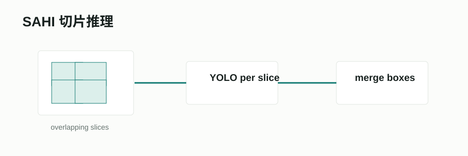

# SAHI / Slicing Aided Hyper Inference



## 项目/论文链接

- 论文：[Slicing Aided Hyper Inference and Fine-tuning for Small Object Detection](https://arxiv.org/abs/2202.06934)
- GitHub：[obss/sahi](https://github.com/obss/sahi)
- Ultralytics 指南：[SAHI Tiled Inference](https://docs.ultralytics.com/guides/sahi-tiled-inference/)

## 摘要要点

SAHI 针对监控、航拍、遥感中小目标像素占比低的问题，把大图切成重叠小块后分别推理，再把局部预测合并回全图。论文报告在 VisDrone、xView 等数据上可以显著提升小目标 AP，并且框架可以叠加在多种检测器上。

## Pipeline

```text
large image
  -> overlapping slices
  -> detector inference per slice
  -> shift boxes back to global coordinates
  -> NMS / fusion
  -> full-image predictions
```

## 在本项目中的作用

SAHI 理论上适合 R1 的 `soldier` 小目标，尤其是 `urban/forest` 场景。它在本项目中的合理位置不是默认全量推理，而是：

- 对低置信或高风险场景进行二次 ROI 推理。
- 给错例审计生成 hard crop。
- 作为离线 teacher 发现漏检候选，而不是直接替换主模型输出。

## 接入状态

已尝试，当前不默认。相关入口：

- `agent_system/evaluation/evaluate_r1_sliced.py`
- `agent_system/evaluation/evaluate_r1_sliced_grid.py`
- `agent_system/evaluation/evaluate_r1_roi_refine.py`

## 输出结果摘录

当前 naive slicing 在 R1 上没有稳定过门禁，原因是：

- tiny soldier 召回可能增加，但 FP 也明显增加。
- 切片边界和重复框会伤害整体 mAP。
- R1 图像本身是 640x512，和超大遥感图不同，全图推理已经不算极端低分辨率。

结论：SAHI 保留为 P2/P3 二次推理候选，不作为默认检测路线。
