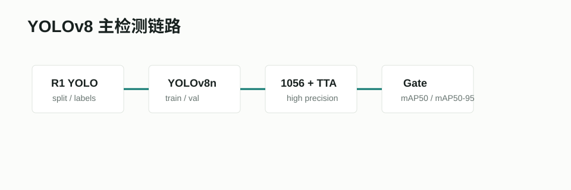

# Ultralytics YOLOv8



## 项目/模型链接

- 官方文档：[Ultralytics YOLOv8 Models](https://docs.ultralytics.com/models/yolov8/)
- 检测任务文档：[Ultralytics Object Detection](https://docs.ultralytics.com/tasks/detect/)
- GitHub：[ultralytics/ultralytics](https://github.com/ultralytics/ultralytics)
- 本项目入口：`agent_system/pipelines/train_r1_detector.py`

## 摘要要点

YOLOv8 是 Ultralytics 工具链中的检测/分割/分类/姿态等多任务模型族。对本项目最重要的是它的工程成熟度：训练、验证、预测、导出 ONNX 和调整推理参数都可以用同一套接口完成。YOLO 系列把检测建模成单阶段预测问题，适合端侧低延迟需求。

## Pipeline

```text
R1 YOLO split
  -> YOLOv8n train / validate
  -> imgsz sweep + TTA validation
  -> scene prior / precision policy
  -> candidate gate
  -> ONNX export / Ascend deployment
```

## 在本项目中的作用

YOLOv8n 是当前端侧主检测器。我们没有把更大的 YOLOv8s/m 作为默认方案，原因是赛题有 Ascend 310B FPS 约束，且当前主要瓶颈不是类别语义识别，而是 tiny soldier 的定位和召回。

## 接入状态

已接入。相关入口：

- `agent_system/data_tools/prepare_r1_yolo.py`
- `agent_system/pipelines/train_r1_detector.py`
- `agent_system/evaluation/evaluate_r1_detector.py`
- `agent_system/evaluation/select_r1_detector.py`

## 输出结果摘录

当前修正标签版本最佳默认高精口径：

| 方案 | precision | recall | mAP50 | mAP50-95 |
|---|---:|---:|---:|---:|
| `1056 + TTA` | 0.8862 | 0.8658 | 0.8885 | 0.4445 |
| `1056 + TTA + val-iou=0.7432` | 0.8688 | 0.8407 | 0.8787 | 0.4461 |

结论：默认展示和综合口径保留 `1056 + TTA`；如果严格按 mAP50-95 冲分，保留 `val-iou=0.7432` 候选，但它会牺牲 mAP50 和 recall。
