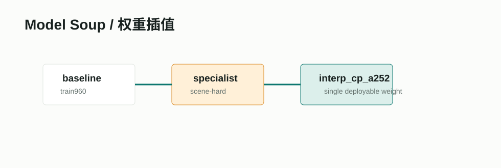

# Model Soups / 权重平均



## 项目/论文链接

- 论文：[Model soups: averaging weights of multiple fine-tuned models improves accuracy without increasing inference time](https://arxiv.org/abs/2203.05482)
- PMLR：[ICML 2022 paper page](https://proceedings.mlr.press/v162/wortsman22a.html)
- GitHub：[mlfoundations/model-soups](https://github.com/mlfoundations/model-soups)

## 摘要要点

Model Soups 观察到多个 fine-tuned 模型可能落在相近低误差区域，直接平均权重可以提高准确率和鲁棒性，而且不像传统 ensemble 那样增加推理内存和延迟。论文在大规模预训练模型 fine-tuning 场景中验证了这种方法。

## Pipeline

```text
baseline weights + specialist weights
  -> alpha interpolation / weight averaging
  -> validate each candidate
  -> gate by mAP50 and mAP50-95
  -> keep best deployable single weight
```

## 在本项目中的作用

这是当前最重要的已落地调研成果之一。scene-hard 专家直接替换 baseline 会伤害整体指标，但它包含部分 soldier/urban/forest 信号。通过小比例权重插值，可以把局部收益注入 baseline，同时保持单模型推理成本。

## 接入状态

已接入。相关入口：

- `pipelines/interpolate_r1_checkpoints.py`
- `evaluation/gate_r1_detector_candidate.py`
- `evaluation/select_r1_detector.py`

## 输出结果摘录

当前主力普通权重：

| 候选 | mAP50 | mAP50-95 | 状态 |
|---|---:|---:|---|
| `interp_cp_a252` plain | 0.8759 | 0.4383 | 普通推理候选 |
| `interp_cp_a252 + 1056 + TTA` | 0.8885 | 0.4445 | 默认高精口径 |
| `interp_cp_a252 + 1056 + TTA + val-iou=0.7432` | 0.8787 | 0.4461 | 严格 mAP50-95 候选 |

结论：Model Soup/权重插值比直接启用 scene-hard 专家更稳定，也不增加端侧推理成本。
