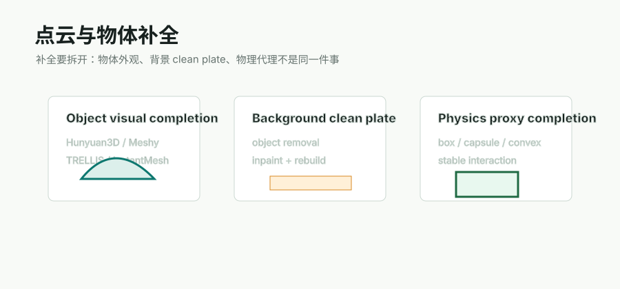

# 点云清理与背景补全阶段

补全不是一个单独按钮。对 Video2Mesh 来说，至少要拆成三件事：点云/高斯清理、背景 clean plate、场景结构补全。



## 主要方向

| 方向 | 简介 | 项目中的作用 | 风险 |
|---|---|---|---|
| 3DGS floater cleaning | 根据 opacity、scale、elongation、空间离群过滤高斯 | 让 3DGS 视觉层更干净，也避免后续点云建面被远端漂浮点拉坏 | 过度清理会删掉真实薄结构 |
| Point cloud outlier removal | quantile bbox、statistical/radius outlier、voxel downsample | 给 Poisson、Delaunay preview、semantic projection 提供更稳输入 | 参数依赖场景 |
| Background clean plate | 移除前景物体后补全地板/墙面/背景图像，再更新背景 3D 表征 | 当物体可移动时，恢复被遮挡的地面/墙面 | 需要真实 2D masks 和多视角一致性 |
| 2D image/video inpainting | 对视频帧局部缺失区域补图 | clean plate 的前置工具 | 单帧好看不代表多视角一致 |
| Scene layout / plane fitting | floor/wall/ceiling/door/window/cabinet 等结构化估计 | 给 collider、navmesh、support plane 提供稳定结构 | 自动识别门窗柜等细类仍需 VLM/scene graph 增强 |

## 和物体补全的边界

```text
object completion:
  补全被遮挡物体本身

background clean plate:
  补全物体移开后露出的地板/墙面

physics proxy completion:
  补全交互需要的保守碰撞形状
```

这三件事不能混在一起。一个完整椅子 mesh 不能自动恢复椅子背后的地板；一个好看的 inpainted 背景也不能直接提供椅子的碰撞体。
