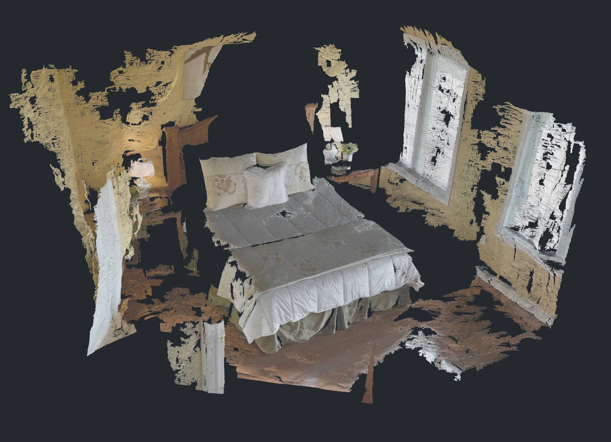

# GS2Mesh 实验

## 实验目的

本项目使用 GS2Mesh 路线测试从 3DGS 到 visual mesh 的可行性。目标不是立刻替代 collider，而是验证：如果把 3DGS 渲染和 depth fusion 接起来，是否能得到比 Gaussian center Poisson 更像真实表面的 mesh。

## 输入与输出

| 项目 | 数值/说明 |
|---|---|
| 输入 | GraphDECO 3DGS 30k iteration 训练结果 |
| 路线 | `gs2mesh_cli30k_voxel10_baseline0p5` |
| raw mesh | 约 4.48M vertices / 8.09M triangles |
| raw 文件 | 约 333MB |
| formal decim mesh | `gs2mesh_decim100000.ply`，43,734 vertices / 120,144 faces |
| semantic transfer | local transfer 覆盖 55.49%，13 个 object split |

## 在 Video2Mesh 中的位置

效果能保留床、窗帘和大结构，但仍有墙面破碎、漂浮片和局部缺失。它比 Open3D Poisson 更像 visual mesh，但当前仍不如 COLMAP Delaunay 稳定适合作为 P0 collider。

formal semantic run 里，GS2Mesh decim100k 的语义 transfer 覆盖率为 55.49%，主要标签包括 window、bed、floor、wall、door、lamp、nightstand 等。它可以用于检查“高质量 visual mesh 路线能否承载语义 sidecar”，但还不能作为最终交互资产的唯一来源。

## 接入判断

- P0：不进入主 collider。
- P1：保留为 visual mesh 对照和 object-level mesh 实验候选。
- 下一步：尝试只对 foreground object 或 crop 区域运行，降低场景级噪声。
