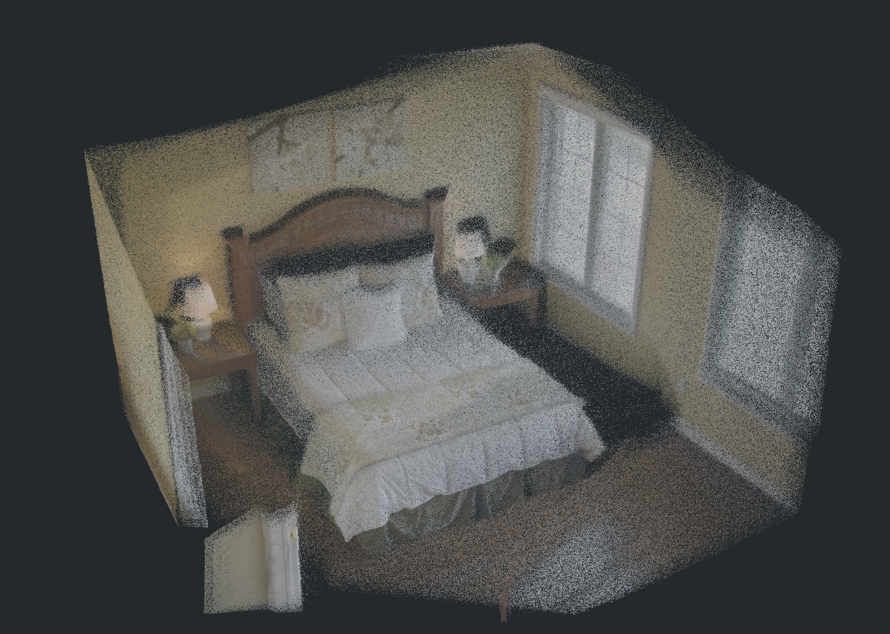
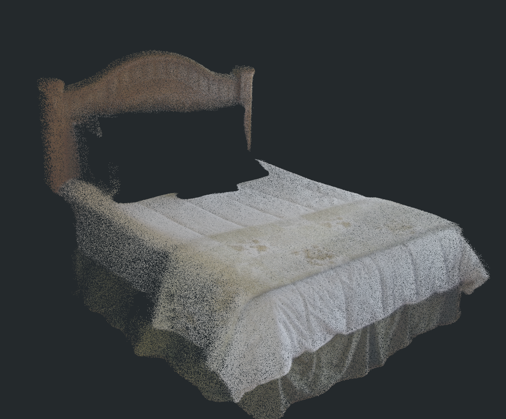
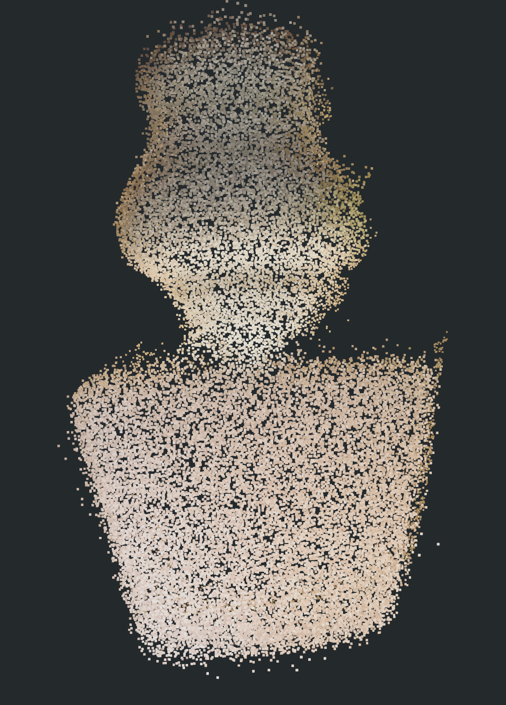
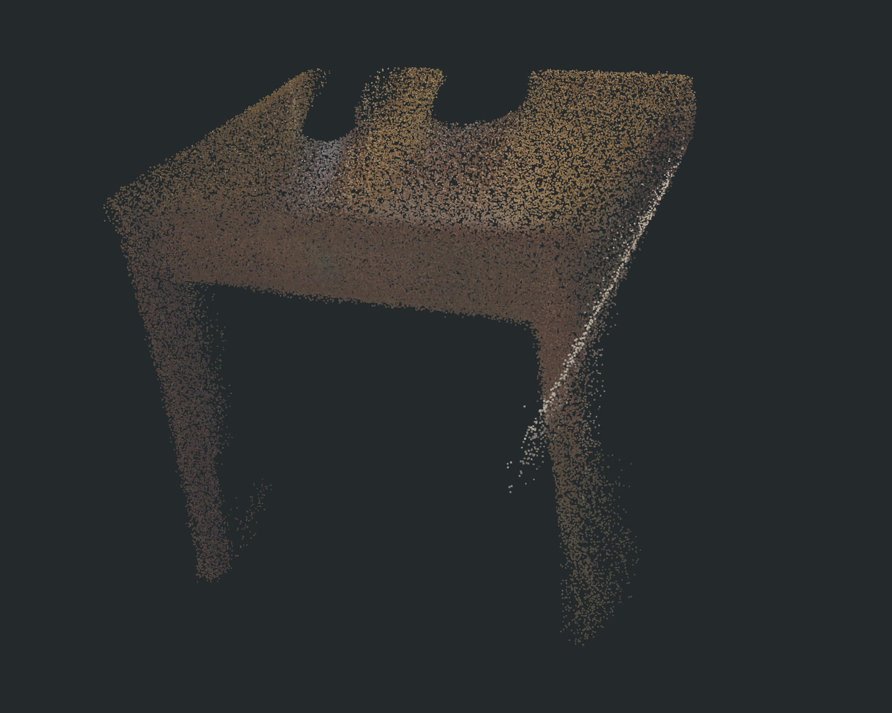
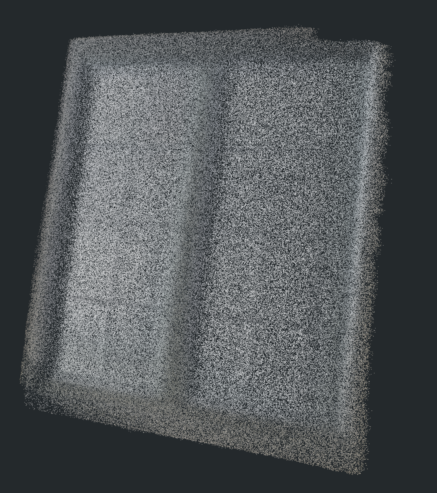
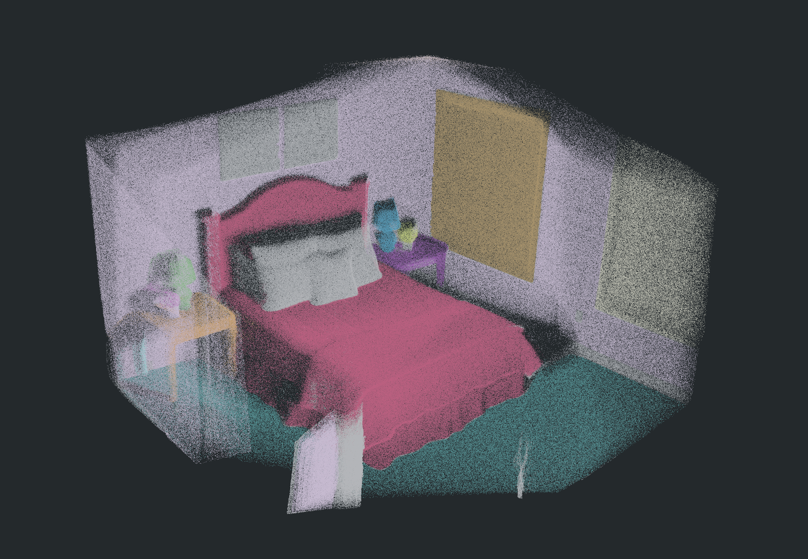
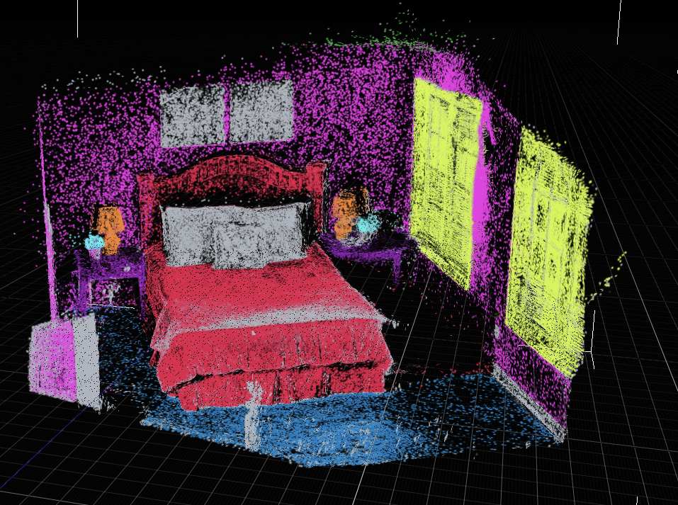

# Holi-Spatial bedroom_4 全链路重跑

本页只记录 `2026-07-14 18:42` 的 fresh 全链路 run。历史 Holi-Spatial schema smoke、代理分割和早期 PGSR 输出均已从归档中清理；本页中的 DA3、SAM3、PGSR 30k、TSDF mesh、Video2Mesh 2D-to-3D lifting 和 bbox 后处理都在本次 run 中重新执行。

相关方法、论文组件分工、硬件边界和论文级未复现部分见：[Holi-Spatial 调研与 bedroom_4 实验报告](../research-catalog/semantic-scene-graph/holi-spatial.md)。

## 实验范围与可复现性

| 项目 | 本次实际内容 |
|---|---|
| 场景输入 | `bedroom_4` 的 80 帧与校正后的相机参数 |
| 重跑目录 | `mil8:/data/design/zyx/workspace/holi_spatial_runs/bedroom_4_fresh_da3_sam3_pgsr_20260714_184217` |
| 本地归档 | `tmp_remote_results/holi_spatial_bedroom4_fresh_da3_sam3_pgsr_20260714_184217/` |
| DA3 | 官方 `DA3NESTED-GIANT-LARGE`，80 张深度，4,000,000 点初始场景点云 |
| SAM3 | 真实 checkpoint 的文本提示推理，957 个源实例 mask 合并为 616 个 class-frame 概率 mask |
| PGSR | 官方单场景优化至 iteration 30,000，871,317 个 Gaussians |
| 几何表面 | 官方 PGSR render/TSDF 后处理，694,773 vertices / 1,351,454 faces |
| 语义 3DGS | SAM3 2D 概率 mask 直接回投到 PGSR Gaussian centers，带 z-buffer 可见性过滤和逐 Gaussian 概率聚合 |

相机 `world-to-camera` round-trip 最大误差为 `1.33e-15`；PGSR 日志中没有 `depth not found` warning。PGSR iteration 30,000 的 train evaluation 是 L1 `0.0118202`、PSNR `33.1155 dB`。这些是单场景训练日志指标，不是论文的 ScanNet/ScanNet++ benchmark。

## 组件与数据流

```text
80 frames + calibrated cameras
  -> official DA3 depth and 4M RGB points
  -> GroundingDINO category filtering only
  -> SAM3 text prompt -> SAM3-owned boxes, scores and masks
  -> class probability masks + depth/occlusion-aware 2D-to-3D lifting
  -> voxel DBSCAN + robust AABB/PCA OBB
  -> official PGSR 30k -> raw Gaussian PLY + TSDF mesh
  -> SAM3 masks projected directly onto PGSR Gaussians -> semantic 3DGS
```

| 组件 | 输入 | 输出 | 本次职责 | 不应误解为 |
|---|---|---|---|---|
| DA3 | 图像、相机上下文 | depth maps、`pointcloud_da3.ply` | 稠密几何先验和初始 RGB 点云 | 无伪影的最终表面或语义模型 |
| GroundingDINO | query bank、关键帧 | 类别候选 | 仅筛选类别词表 | 给 SAM3 提供检测框；本次没有传框 |
| SAM3 | 图像、类别文本 | 自己预测的 bbox、score、mask | 2D open-vocabulary 分割 | 3D bbox 或跨帧实例 ID 生成器 |
| 2D-to-3D lifting | mask 概率、深度、相机 | DA3 point labels | 多帧概率融合、遮挡过滤、最少 2 次投票 | 论文官方 lifting 脚本的等价复现 |
| bbox 后处理 | 已标注点 | 3D AABB/PCA OBB | voxel `0.04`、DBSCAN `eps=0.12`、0.5% robust quantile | 公制尺寸真值 |
| PGSR | 图像、相机、DA3 prior | 30k Gaussian PLY、TSDF mesh | 场景级多视图几何优化 | 物体检测或语义分割模型 |
| semantic 3DGS 投影 | SAM3 2D masks、PGSR Gaussian centers | `object_id`、`object_probability` | 直接把二维证据投到 Gaussian 上 | 最近邻 DA3 标签拷贝 |

GroundingDINO 从 68 个候选中得到 20 个 prompts 和 9 个类别候选；SAM3 最终对 `bed`、`ceiling`、`floor`、`lamp`、`nightstand`、`plant`、`wall`、`window` 产生有效 mask，`wall art` 没有被伪造为有效语义。后处理得到 13 个 3D records：10 个前景物体和 3 个结构类别。

## 几何结果人工 QA

### PGSR TSDF mesh


`tsdf_fusion_post.ply` 的床、墙面、窗和地面结构连续，人工检查结论为“重建很好”。它是本次最适合表面检查的输出，仍未经过 watertightness、真实尺度、碰撞体或物理仿真 QA。

### PGSR 30k 原始 Gaussian 点云


30k `point_cloud.ply` 的空洞问题相比此前基线已基本修复，床和房间主体质量较好；但在场景边缘、窗侧和可见范围外仍能观察到拉长 splat、漂浮点和少量放射状伪影。它应保留为真实 PGSR 原始输出，不能被展示用过滤版本替代。

### DA3 初始场景点云



`pointcloud_da3.ply` 的场景整体形状与主要家具可辨认，人工检查为“不错”。它提供后续 lifting 的稠密几何先验，点云颗粒、边缘多视角残影和无语义颜色均属于该阶段的预期边界。

## 物体级 3D 点云人工 QA

物体 PLY 均从同一份 DA3 4M 点云按 SAM3 融合标签抽取，保留 RGB 和原始坐标。它们不是补全后的 watertight object mesh。

| 对象 | 对应实例 | 人工检查 |
|---|---|---|
| 床 | `sam3_bed_01.ply` | 结构完整，床头、被褥与床沿可辨认，结果良好 |
| 台灯 | `sam3_lamp_01.ply` | 灯罩、灯杆和底座形状可辨认，结果良好 |
| 床头柜 | `sam3_nightstand_01.ply` | 台面、立柱和主体轮廓清楚，结果良好 |
| 窗 | `sam3_window_01.ply` | 玻璃/窗框区域连续，新增截图后确认结果良好 |









## 语义点云与 semantic 3DGS

### DA3 调色板语义点云



`semantic_da3_points_palette.ply` 是 `semantic_da3_points.ply` 的展示 companion：两者都保留 `x/y/z/object_id/object_probability`，前者只把 RGB 改成稳定的语义调色板。因此原始 RGB 审计文件没有被覆盖，而普通 viewer 可以直接看到类别边界。人工检查结论为“不错”。

### semantic 3DGS



语义 3DGS 的视觉检查结果良好。主产物 `semantic_pgsr_30k_projected.ply` 保留原始 Gaussian 字段，并追加 `object_id/object_probability`；这次标签来自 SAM3 2D mask 到 PGSR Gaussian 的直接投影，而非把 DA3 最近邻结果当作唯一方法。10 帧投影 QA 均有效，8 个有效类别都选中了 Gaussian，共 701,608 个选中 Gaussian。

展示用 `semantic_gaussian_probability_supersplat.ply` 是 binary、SuperSplat 友好的派生物，用于语义视觉审阅；它不能替代原始 PGSR Gaussian。`semantic_supersplat.ply` 约 946 MiB，两个语义 PGSR PLY 各约 213 MiB；当前 MacBook 上直接加载大型 Gaussian PLY 可能触发显存耗尽，因此未打开的大文件只做了字段、大小、顶点数和投影 QA，不把“未打开”误报成视觉质量结论。

## 自动 QA 与产物清单

| 检查 | 结果 | 说明 |
|---|---|---|
| 相机坐标 | Passed | 80 个相机；round-trip 最大绝对误差 `1.33e-15` |
| DA3 | Passed | 80 depth maps；4,000,000 点 |
| SAM3 | Passed | 957 源实例 mask；8 个有效类别；616 个 class-frame 概率 mask |
| 2D-to-3D / bbox | Passed | 概率融合、遮挡过滤、至少 2 次投票；13 个 3D records |
| PGSR 30k | Passed | iteration 30,000；871,317 Gaussians；缺失 depth warning 为 0 |
| TSDF mesh | Passed | 694,773 vertices / 1,351,454 faces |
| PGSR 语义投影 | Passed | 10/10 preview frames 有效；8/8 类有选中 Gaussian |

| 文件 | 规模 | 用途与状态 |
|---|---:|---|
| `pointcloud_da3.ply` | 57.2 MiB，4,000,000 points | DA3 RGB 初始点云，已人工检查 |
| `semantic_da3_points.ply` | 87.7 MiB，4,000,000 points | binary 原始 RGB + `object_id/object_probability` 审计文件 |
| `semantic_da3_points_palette.ply` | 87.7 MiB，4,000,000 points | 语义调色板显示文件，已人工检查 |
| `object_masks_3d/sam3_*.ply` | 对象级 | bed、lamp、nightstand、window 等拆分点云，已抽查 |
| `point_cloud/iteration_30000/point_cloud.ply` | 206.1 MiB，871,317 Gaussians | 官方 PGSR 30k 原始 Gaussian，已人工检查 |
| `mesh/tsdf_fusion_post.ply` | 34.6 MiB | 官方 PGSR TSDF 表面，已人工检查 |
| `semantic_gaussian_probability_supersplat.ply` | 206.1 MiB，871,317 Gaussians | SuperSplat 友好语义展示派生物，已人工检查 |
| `semantic_pgsr_30k_nearest_da3.ply` | 212.7 MiB，871,317 Gaussians | DA3 最近邻语义对照输出，仅做结构和 QA 核验 |
| `semantic_pgsr_30k_projected.ply` | 212.7 MiB，871,317 Gaussians | 主语义 3DGS，SAM3 直接投影结果，仅做结构和 QA 核验 |
| `semantic_supersplat.ply` | 946.0 MiB | 大型展示导出，因本地显存风险未直接打开 |

## 本次代码固化

这次归档同步固化三项和结果直接相关的实现：

- `backproject-gaussian-probabilities` 支持显式 `--objects-dir`，解决 2D class masks 与 3D instance records 目录不同导致的对象映射歧义。
- 语义 Gaussian 写回改为 binary PLY，保留完整的 source Gaussian vertex layout 和原有 `f_dc_*` 等字段，避免调试子集丢失 3DGS 属性。
- PGSR finalization 将 DA3 最近邻迁移保留为 `semantic_pgsr_30k_nearest_da3.ply` 对照，同时把 SAM3 直接投影的 `semantic_pgsr_30k_projected.ply` 作为主语义输出；总结报告读取同一主输出。

## 结论与边界

- 几何层面，TSDF mesh 是本次最强的表面输出；PGSR 30k 的主体空洞已明显改善，但原始 Gaussian 仍需 floater/elongation 过滤。
- 语义层面，DA3 调色板 PLY、bed/lamp/nightstand/window 对象云和 semantic 3DGS 的人工 QA 均达到“可归档、可审阅”的质量；它们可以继续服务 3D bbox、对象检索和后续 semantic sidecar。
- 本次确实跑通 DA3、SAM3、PGSR、lifting、bbox 和直接 semantic 3DGS 投影，但仍不是论文完整数据工厂复现：论文中的 VLM/vLLM 类别发现、instance caption、VLM-agent verification、官方 spatial QA、LLaMA-Factory 转换与 benchmark 没有在本 run 中执行。
- bbox 使用 Video2Mesh/COLMAP scene units，尚无公制标定；mesh 也尚未完成 collider、watertightness 或物理可用性验证。

下一步优先处理原始 PGSR 的边缘长条和漂浮 Gaussian，并为大体积语义 Gaussian PLY 提供下采样/分块预览，避免本地查看器占满显存。
