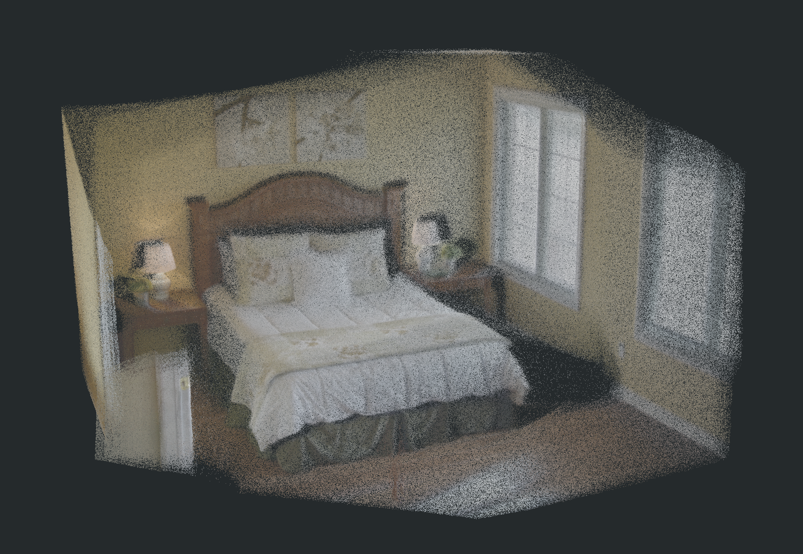
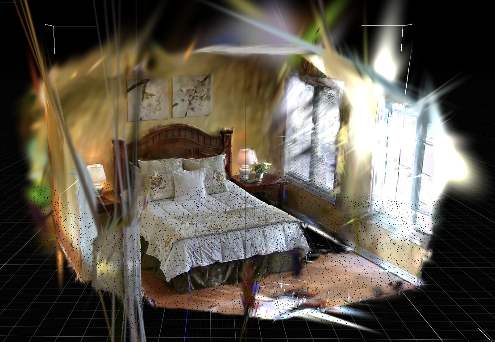
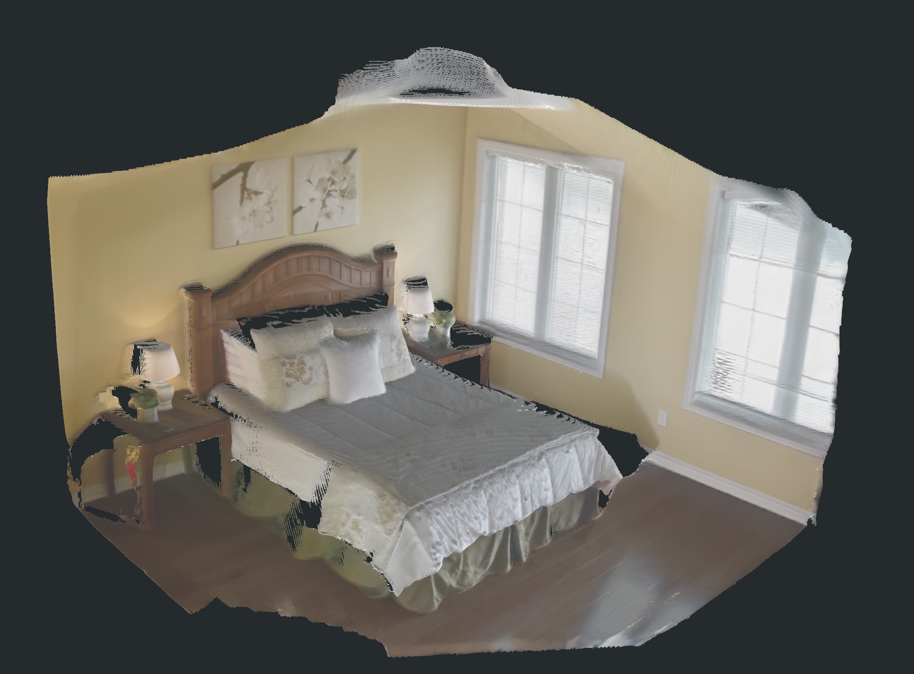
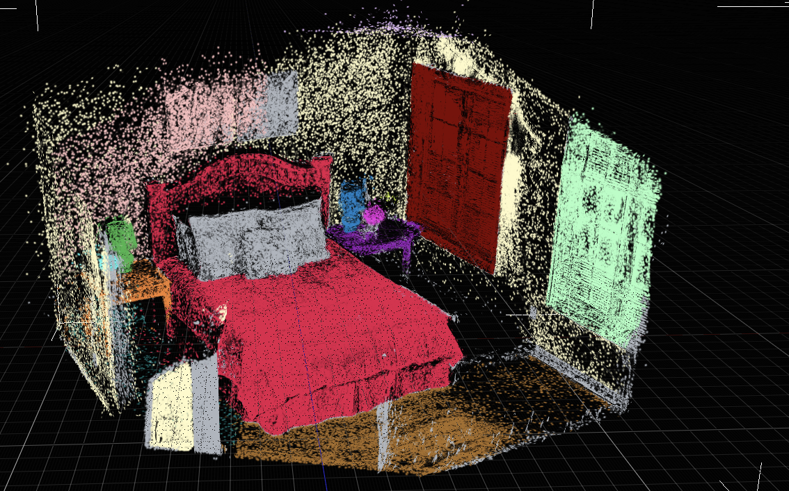

# Holi-Spatial bedroom_4 全链路结果

本页归档 `bedroom_4` 的一次真实组件运行，不是把旧的 schema smoke run 重新命名为完整复现。DA3、SAM3、官方 PGSR 30k、TSDF mesh 与 Video2Mesh 的概率融合/instance bbox 后处理均实际执行；类别发现仍复用了 Video2Mesh baseline 已有的 GroundingDINO query-bank filtering，而非论文中的 VLM/vLLM。

关联调研与组件边界见：[Holi-Spatial 调研与 bedroom_4 实验报告](../research-catalog/semantic-scene-graph/holi-spatial.md)。

## 实际链路

```text
80 frames + corrected cameras
  -> official DA3NESTED-GIANT-LARGE depth + 4M DA3 points
  -> GroundingDINO category filtering (not the paper VLM stage)
  -> SAM3 text prompt -> boxes, scores, 977 instance masks
  -> probability masks + visibility filter + multi-view lifting
  -> voxel DBSCAN + robust AABB/PCA OBB
  -> official PGSR 30k optimization + TSDF mesh
  -> DA3 semantic points -> nearest transfer to PGSR Gaussians
```

| 阶段 | 本次结果 | 边界 |
|---|---|---|
| 相机/数据包 | 80 相机，world-to-camera round-trip 最大误差 `1.33e-15` | 已校验坐标约定，不代表 metric scale |
| DA3 | 80 depth maps，4,000,000 点 | DA3 是初始稠密几何，不是最终无伪影表面 |
| 类别发现 | 66 candidates -> 24 prompts -> 11 categories | GroundingDINO 只筛类别，没有给 SAM3 提供 bbox |
| SAM3 | 977 instance masks；9 类有有效结果 | `table`、`wall art` 无有效 mask；door/ceiling 较弱 |
| 2D-to-3D/bbox | 630 class-frame masks，15 个 3D records | 使用 Video2Mesh lifting，不是论文原生 lifting 脚本 |
| PGSR | 877,848 Gaussians；最终 L1 `0.0117173`、PSNR `33.3479 dB` | 单场景训练结果，不等于仿真可用资产 |
| TSDF mesh | 703,028 vertices / 1,362,793 faces | 适合几何检查，尚未验证为 collider/physics mesh |

## 查看器 QA

### DA3 原始 RGB 点云



DA3 点云在该视角下的场景结构完整度较好，床、窗、墙面和床头柜都可辨认。它是原始 RGB 重建点云，不能因为画面中物体可见就称为 semantic PLY。

### PGSR 原始 Gaussian PLY



原始 PGSR Gaussian 在床及其周围主体区域的视觉重建很强，但窗边、墙边和场景外缘可见长条/放射状 Gaussian 伪影。这是原始训练产物的视觉 QA，不应被 viewer-safe 导出掩盖。

### PGSR TSDF Mesh



TSDF mesh 的床、墙和窗区域整体连续，视觉上是本轮最稳的表面化输出之一；顶部和边缘仍有局部缺口、毛刺和裁切。它可作为 mesh reconstruction 对照，但还没有完成 watertightness、尺度、碰撞或物理 QA。

### PGSR Viewer-safe 语义显示



这张图是语义展示派生物：床、门、窗、地板、墙、灯和床头柜等区域颜色可区分。它使用 viewer-safe Gaussian 参数，`object_id/object_probability` 在 JSON sidecar 中按顶点顺序保存；因此它适合语义审阅，不是原始 PGSR Gaussian 的无损替代。

## 已修复：DA3 语义 PLY 在普通查看器中不可见

问题不在 3D lifting 的标签缺失，而在展示层：`semantic_da3_points.ply` 已经包含 `object_id` 和 `object_probability`，但同时保留了 DA3 原始 RGB。普通 PLY viewer 通常只读取 RGB，不会自动按自定义 `object_id` 上色，所以它会看起来和原始 DA3 点云几乎一致。

修复后新增以下 companion 文件，原始文件不覆盖：

| 文件 | 作用 | 大小/字段 |
|---|---|---|
| `pointcloud_da3.ply` | 原始 DA3 RGB 场景点云 | 4M points，`x/y/z/rgb` |
| `semantic_da3_points.ply` | 原始 RGB + 语义数据审计文件 | 4M points，`x/y/z/rgb/object_id/object_probability` |
| `semantic_da3_points_palette.ply` | 面向普通 viewer 的可见语义调色板 | 4M points，binary，保留 `x/y/z/object_id/object_probability`，仅替换 RGB |
| `semantic_pgsr_30k_supersplat.ply` + labels JSON | PGSR 的 viewer-safe semantic Gaussian | 显示参数派生；语义字段在 sidecar |

对真实 4M 点文件的逐字段检查已通过：`x/y/z/object_id/object_probability` 逐点不变，16 个 semantic ID 映射为 16 个稳定颜色，`3,999,995` 个点的 RGB 被替换为语义调色板。`semantic_da3_points_palette.ply` 与原始语义 PLY 均为约 87.7 MiB 的 binary PLY；这解决了“查看器看不出语义”的问题，不会消除 DA3 的几何伪影或提高分割正确率。

可复用命令：

```bash
python -m video2mesh.cli export-semantic-palette-ply \
  --project-root <video2mesh_project> \
  --semantic-ply simulator_assets/semantic_da3_points.ply
```

`export-viewer-plys --include-labels` 同时已修正为直接读取 binary PLY 的 `object_id/object_probability`，不再只在 ASCII PLY 中发现标签。

## 产物与复核

本地交付目录：

```text
/Users/zhangyuxiang/Desktop/worksplace/Video2Mesh/tmp_remote_results/holi_spatial_bedroom4_full_20260713
```

远端原始 run：

```text
mil8:/data/zyx/workspace/holi_spatial_runs/bedroom_4_full_da3_sam3_pgsr_20260713_155751
```

关键文件：

| 文件 | 本地状态 | 说明 |
|---|---|---|
| `semantic_da3_points.ply` | 已回传 | 原始 RGB + semantic fields，约 88MB |
| `semantic_da3_points_palette.ply` | 已回传，SHA-256 与远端一致 | 调色板显示 companion，约 88MB |
| `semantic_da3_points_palette_manifest.json` | 已回传 | source/output、16 类分布、调色板与字段说明 |
| `pgsr_30k_raw.ply` | 已回传 | 原始 PGSR Gaussian，约 208MB |
| `tsdf_fusion_post.ply` | 已回传 | 官方 PGSR TSDF mesh |
| `viewer_plys_pgsr_30k/` | 已回传 | semantic point-cloud、viewer-safe SuperSplat 和 labels sidecar |

## 结论与限制

- DA3 RGB 点云和 PGSR TSDF mesh 的可视化表现都值得保留为场景重建/几何对照。
- PGSR 原始 Gaussian 边缘仍有明显长条伪影；viewer-safe 版本改善的是展示稳定性，不是原始训练质量。
- DA3/PGSR semantic outputs 可用于 mask、bbox 与 3D 语义审阅；当前不能直接作为干净的 simulator visual layer、碰撞体或物理尺度真值。
- 该 run 缺少论文中的 VLM class discovery、instance caption、VLM-agent verification、官方 spatial QA、LLaMA-Factory conversion 与 benchmark，不应写成论文完整复现。
