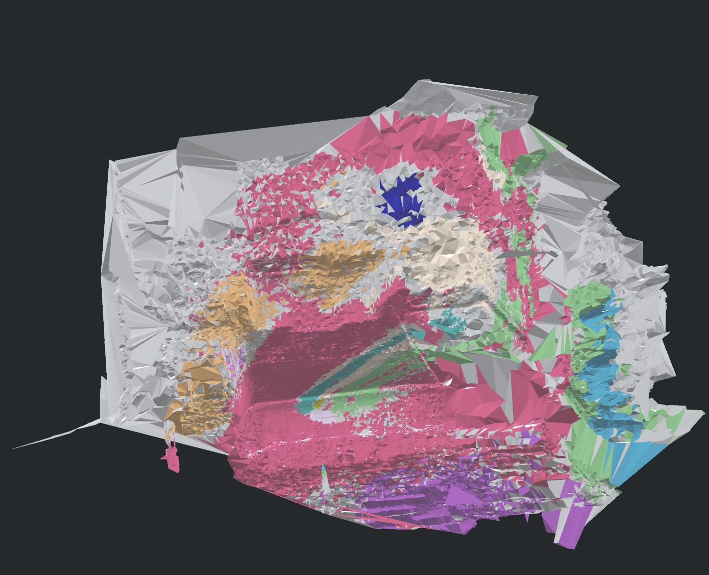
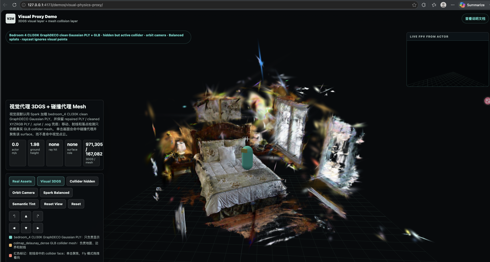
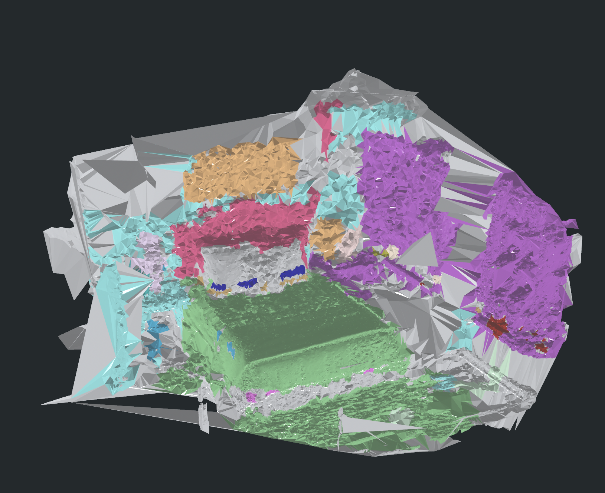
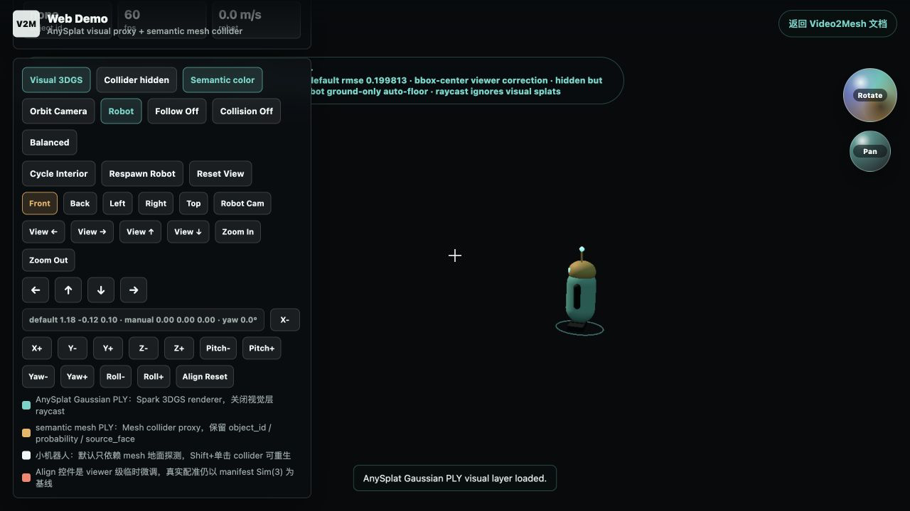

# 本项目实验目录

本目录汇总本周在 Video2Mesh bedroom 场景上的真实实验结果。它和前面的调研目录对应：不是只看论文效果，而是看这些方法接到我们自己的 pipeline 后能不能形成可用资产。

## 实验一：GS2Mesh

GS2Mesh 路线从训练好的 3DGS 出发，通过渲染多视角/双目深度再做 TSDF 融合。实测 raw mesh 约 4.48M vertices / 8.09M triangles，原始文件约 333MB；减面后可以得到几 MB 级别 GLB。结构比直接 Gaussian center Poisson 更合理，但墙面破碎和漂浮片仍明显。

结论：适合作为 P1/P2 object visual mesh 或 benchmark，不适合作为 P0 lightweight collider。

## 实验二：Open3D Poisson / 3DGS 点云

Open3D Poisson 使用过滤后的 3DGS center point cloud。`alpha005_sample500k` 路线输入 50 万点，输出约 100,965 vertices / 200,000 triangles，GLB 约 5.23MB。

结论：适合快速 baseline 或 fallback；不应把 3DGS center 当作最终真实表面。

## 实验三：COLMAP Delaunay Dense

COLMAP dense + Delaunay mesher 输出约 82,920 vertices / 167,082 triangles，GLB 约 3.0MB。视觉细节不如 3DGS，但作为 static collider 更稳定。

结论：当前最适合作为 P0 场景级碰撞代理。

## 实验四：语义投影融合

本周尝试 P0 KDTree 语义回灌和 P1 ray projection 多视角投票。P1 当前使用 projected semantic point label masks 做 debug，缺少真实 SAM/GDINO 2D masks，因此串色明显、置信度偏低。

结论：P1 路线保留，但需要真实 2D mask、深度可见性过滤和 face graph smoothing。

## 实验五：视觉代理 + 碰撞代理 Web Demo

本周实现了 `visual-physics-proxy` demo：3DGS 只负责视觉显示，COLMAP Delaunay GLB 作为隐藏 collider 承担 raycast、ground probe 和移动阻挡。

结论：该 demo 已验证最小架构闭环，后续应拆成 object-level collider，并接入 face/object semantics 和物理材质。

## 实验六：SceneVerse++ / PQ3D bedroom_4 原始 Mesh

[SceneVerse++ / PQ3D bedroom_4 原始 Mesh 结果归档](sceneversepp-pq3d-bedroom4.md) 记录了从 `mil8` 传回本地的原始 PQ3D / SpatialLM PLY。这里的重点是区分 mesh 和点云：semantic mesh 建模效果很好，床、墙面、柜体和大结构都能清楚辨认；但 SpatialLM 的 `bedroom_4.ply` 只是普通 XYZ 点云，只有 91,412 vertices，没有颜色、normal、语义或 Gaussian 字段。

结论：mesh 值得作为 semantic scene understanding 结果保存；点云暂时只作为基础几何输入/检查，不应写成高质量 3DGS 或最终 visual layer。

## 实验七：Web Demo Blender-like 视口与机器人交互

[Web Demo: Blender-like 视口与机器人交互](web-demo-blender-gizmo-20260711.md) 记录了 `relumeow.top/video2mesh/web-demo/` 的交互升级：右侧 `Rotate / Pan` 球用于旋转和平移观察目标，画布滚轮缩放，`W/A/S/D` 控制机器人在 semantic mesh collider 上移动。

结论：这次更新没有改变 3DGS / mesh 的真实配准，只增强浏览器端探索能力；本地验证已确认 `1,313,391` visual splats、`142,219` collider faces、gizmo 拖动、滚轮缩放和 WASD 机器人控制均可用。
