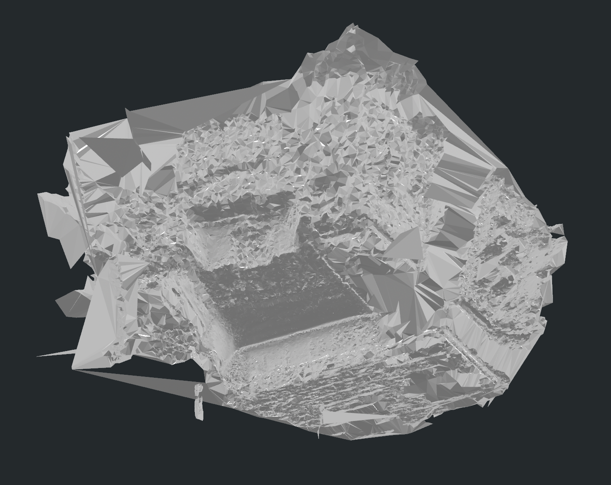
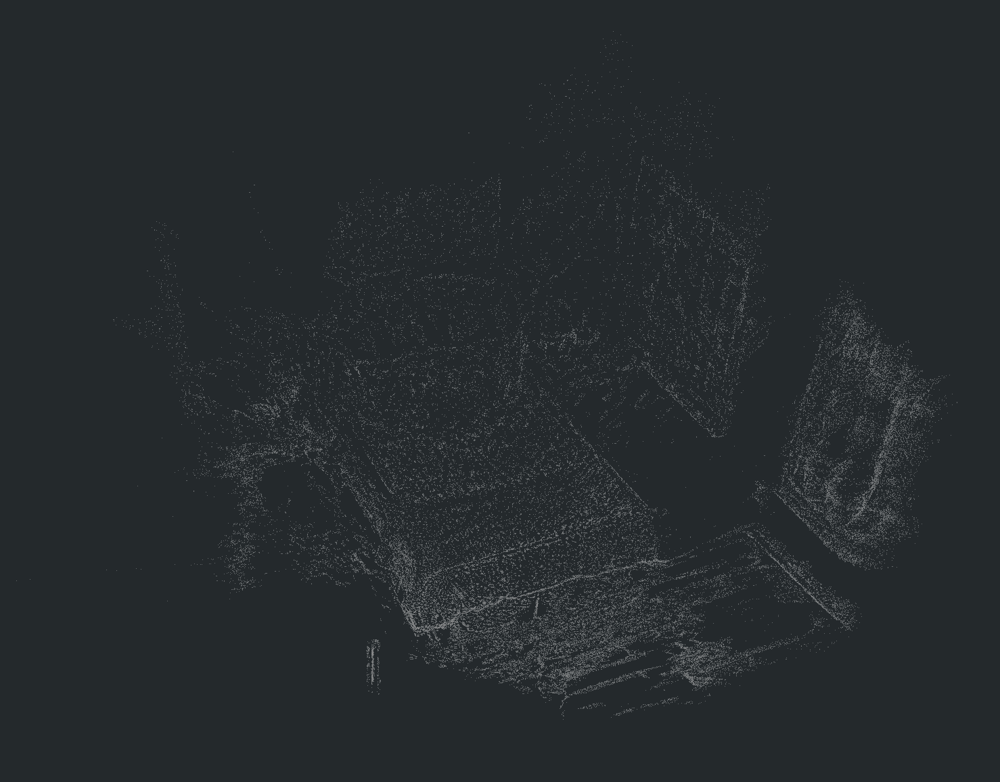

# SceneVerse++ / PQ3D bedroom_4 原始 Mesh 结果归档

这份记录归档 `mil8` 上 SceneVerse++ / PQ3D `bedroom_4` paper-like 运行传回本地的 **原始 PLY 输出**。这里说的原始输出不是后面转换出来的 3DGS seed PLY，也不是 Video2Mesh 的 GraphDECO 3DGS；它更接近 SceneVerse++ / PQ3D 数据准备、mesh 分割和 SpatialLM 点云侧的真实中间产物。


## 结论

这次最值得保留的是 mesh：从截图和 PLY header 看，`instance_seg_mesh.ply` 把房间主体、床、柜体、窗边软物体和墙面结构都建出来了，语义着色也比较清楚。虽然边界仍有大三角面片、局部碎片和房间外壳薄片，但作为 **语义 mesh / scene understanding 可视化结果**，建模质量已经明显好于普通点云。

点云部分则要实事求是：`spatiallm_data/pcd/bedroom_4.ply` 目前只是普通 XYZ 点云，PLY header 里只有 `x/y/z` 三个 double 字段，没有 RGB、normal、semantic probability 或 Gaussian 属性。它适合作为 SpatialLM / SceneVerse++ 的基础几何输入或 sanity check，但还不能当作高质量 3DGS visual layer，也不能直接替代 GraphDECO / PGSR / dense reconstruction 输出。

## 原始产物路径

本地同步目录：

```text
/Users/zhangyuxiang/Desktop/worksplace/Video2Mesh/tmp_remote_results/sceneversepp_bedroom_4_paperlike_20260711_022103/original_pq3d_ply
```

远端原始 run root：

```text
mil8:/data/zyx/workspace/Video2MeshWorkspace/sceneversepp_runs/bedroom_4_paperlike_20260711_022103
```

| 文件 | 大小 | PLY 结构 | 作用 |
|---|---:|---|---|
| `instance_seg_mesh.ply` | 41,262,623 bytes | ASCII, 570,255 vertices / 190,085 faces, `x/y/z/rgb/object_id/object_probability/source_face` | 带 object id / probability 的语义 mesh，适合归档和展示 |
| `mesh_pq3d_float_rgb_uintface.ply` | 3,885,105 bytes | binary little endian, 94,249 vertices / 190,085 faces, `float xyz + uchar rgb + uint face indices` | PQ3D segmentator 兼容的场景 mesh |
| `bedroom_4.ply` | 2,194,036 bytes | binary little endian, 91,412 vertices, only `double x/y/z` | SpatialLM 普通点云输入/输出，缺少颜色和语义字段 |

这里特意和 `converted_3dgs/` 分开保存。`converted_3dgs/pq3d_bedroom_4_3dgs.ply` 与 `pq3d_bedroom_4_semantic_3dgs.ply` 是为了后续 3DGS 风格消费做的派生转换，不应被写成原始 PQ3D PLY。

## Mesh 结果



语义 mesh 的价值在两处：

| 观察项 | 判断 |
|---|---|
| 主体结构 | 床、墙面、右侧大型软物体/窗帘区域、柜体和房间外壳都能辨认 |
| 语义可读性 | 彩色 object 区域边界足够清楚，适合做结果展示和人工审阅 |
| 几何连续性 | 主要表面连续，但边界区域有 Delaunay/三角化类大面片和碎片 |
| 工程定位 | 适合作为 semantic mesh / scene graph / bbox 审阅输入；进入 collider 前仍要做裁剪、连通域清理和面片过滤 |

对 Video2Mesh 来说，这个结果说明 SceneVerse++ / PQ3D 的价值更偏 **结构化 3D scene understanding**：它能把普通几何整理成可读的语义 mesh 和 object-level 结果。短期不应该把它说成“替代 Video2Mesh 的全部几何主链路”，而应该把它接到 semantic sidecar、object bbox、scene graph 和空间 QA 评估层。

## 点云结果



点云的当前质量要单独标出来，避免把它和 mesh 的效果混在一起：

| 项 | 当前状态 |
|---|---|
| 顶点数 | 91,412 |
| 字段 | `double x`, `double y`, `double z` |
| 颜色 | 无 |
| normal | 无 |
| 语义 | 无 |
| Gaussian 属性 | 无 opacity / scale / rotation / SH |
| 质量判断 | 普通点云，能看出房间轮廓，但稀疏、无纹理、无语义，有待提高 |

后续如果要把点云提升到可展示或可训练级别，优先方向不是简单改 PLY 格式，而是补几何证据和属性：用 COLMAP dense / DA3 / VGGT / DepthSplat 类 depth prior 增密，用 outlier filtering 和 normal estimation 做清理，再把语义概率、颜色或 Gaussian 属性作为 sidecar / enriched PLY 输出。

## 接入判断

| 层 | 是否适合接入 | 说明 |
|---|---|---|
| 展示级 semantic mesh | 适合 | `instance_seg_mesh.ply` 可作为本次结果归档和定性展示 |
| Video2Mesh 主 visual layer | 暂不适合 | 点云不是 3DGS；mesh 可看但不具备 GraphDECO 级新视角视觉质量 |
| Collider / physics proxy | 需要清理后再评估 | mesh 有外壳薄片、大三角和碎片，不能直接当最终碰撞体 |
| Scene graph / spatial QA | 适合继续推进 | object id / probability 字段可以接语义 sidecar、bbox 审阅和 QA verifier |
| 点云提升路线 | 需要继续做 | 当前 SpatialLM 点云只是普通点云，后续应走 dense/depth prior/denoise/semantic enrichment |

当前最合理的归档口径是：**SceneVerse++ / PQ3D 的 bedroom_4 mesh 建模很好，语义 mesh 值得保存；点云是普通点云，有待提高。**
