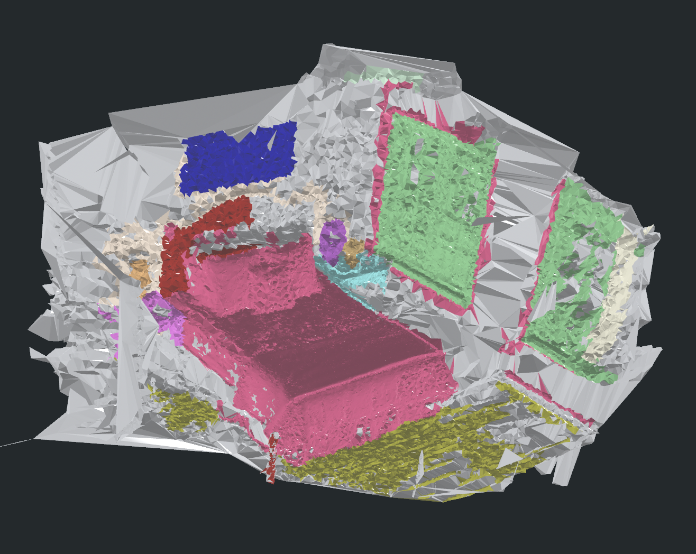

# Video2Mesh 进度目录 Overview

这个目录记录当前项目推进状态，包括优先级、阶段完成度、实验结论和周报材料。

## 文档

| 文档 | 内容 |
|---|---|
| [P0/P1 模块优先级](p0-p1-priority.md) | 当前路线、下一步、风险和验收标准 |
| [2026-07-03 周报](weekly-2026-07-03.md) | 本周调研、mesh 实验、语义 mesh 新结果和下周计划 |
