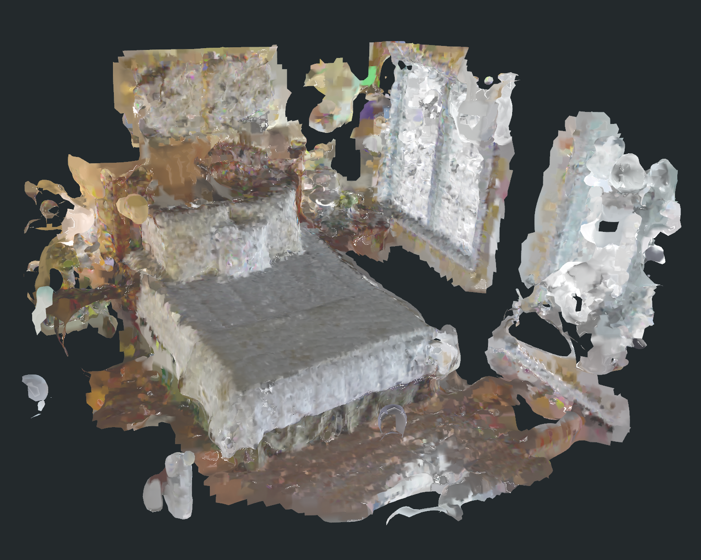
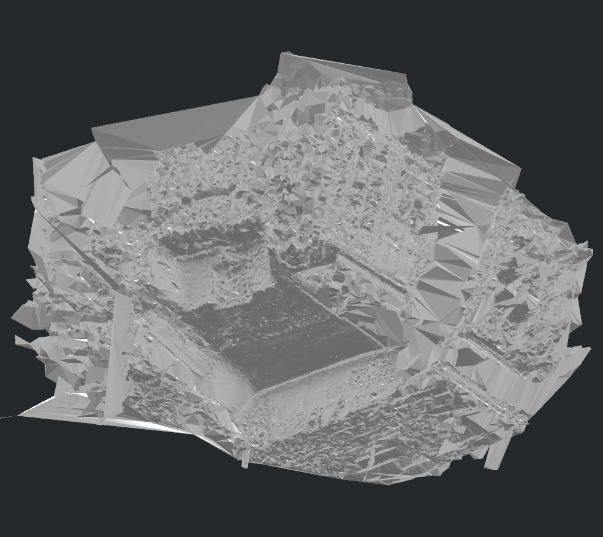

# 周报 2026-07-03：场景扫描调研与 Mesh 重建实验

## 本周总体进展

本周主要围绕“扫描场景如何进入可交互仿真/游戏环境”推进两条线：一是调研学术界和工业界的场景扫描、3DGS、Mesh 和交互资产方案；二是在 Video2Mesh 项目中实际测试多种 mesh 重建路线，并基于“视觉代理、碰撞代理、物体语义分层”的思路实现初步 demo。

当前判断是：项目不应追求从视频直接生成一个完美统一 mesh，而应输出分层资产包。3DGS 负责高质量视觉层，mesh/collider 负责碰撞和交互，语义和物理属性通过 sidecar 或 scene graph 单独管理。

## 调研进展

- 学术路线：COLMAP/MVS、3DGS、SuGaR、GS2Mesh、2DGS/GOF、TSDF/Poisson 等从图像或 3DGS 到 mesh 的方法。结论是传统 COLMAP dense + Delaunay/Poisson 更适合作为场景级静态碰撞代理；GS2Mesh 和 SuGaR 更适合做高质量 visual mesh 对照或后续升级，不适合作为 P0 主链路直接替代 collider。
- 工业路线：学长文档、World Labs / Icare、image-blaster 等方案都倾向于把 3DGS/Spark/Splat 作为视觉代理，把 GLB mesh 或简化 collider 作为交互代理。World Labs 更偏 static world/background 生成，image-blaster 更偏 object mesh generation 和浏览器查看约定，最终 simulator asset bundle、物理属性和引擎适配仍需要 Video2Mesh 自己承接。

## Mesh 重建实验

### GS2Mesh

GS2Mesh raw mesh 约 4.48M vertices / 8.09M triangles，原始文件约 333MB；减面后可以得到几 MB 级 GLB。结构比直接 Gaussian center Poisson 更合理，但墙面破碎和漂浮片仍明显。

### Open3D Poisson / 3DGS 点云

`alpha005_sample500k` 路线输入 50 万点，输出约 100,965 vertices / 200,000 triangles，GLB 约 5.23MB。适合快速 baseline 或 fallback，不应把 3DGS center 当成最终真实表面。

### COLMAP Delaunay Dense

输出约 82,920 vertices / 167,082 triangles，GLB 约 3.0MB。视觉细节不如 3DGS，但作为 static collider 更稳定，是当前 P0 场景级碰撞代理推荐路线。

### 语义投影融合 Debug

早期 P1 ray projection 使用 projected semantic point label masks 做 debug，缺少真实 SAM/GDINO 2D masks，因此串色明显、置信度偏低。

### 正式 Semantic Mesh 新结果

新训练输出结果位于 `bedroom4_formal_semantic_mesh_results_20260703`。相比前一版 debug 投影，这版 semantic mesh 的主要物体区域明显更清楚，床、窗帘/绿色大面、蓝色物体、地毯和小物件能够被颜色区分，已经可以作为周报正向结果展示。

## Demo 进展

基于视觉代理、碰撞代理、物体语义分层的思想，实现了 `visual-physics-proxy` demo。3DGS 只负责视觉显示，COLMAP Delaunay GLB 作为隐藏 collider 承担 raycast、ground probe 和移动阻挡。

## 下一步

- 进一步探索 per-object mesh 重建，优先床、窗帘、桌椅等主要物体。
- 研究残缺物体补全，重点比较 image-blaster、Hunyuan3D、Meshy、TRELLIS、InstantMesh。
- 把 semantic mesh 的 face/object sidecar 接到 collider 和 Web 交互上。
- 做物体交互 demo，先从刚体和 primitive/convex proxy 开始。
- 跟踪 Sim Anything / PhysSplat 为 3DGS 注入物理仿真信息的方向，但短期不替代 mesh/collider 主链路。
