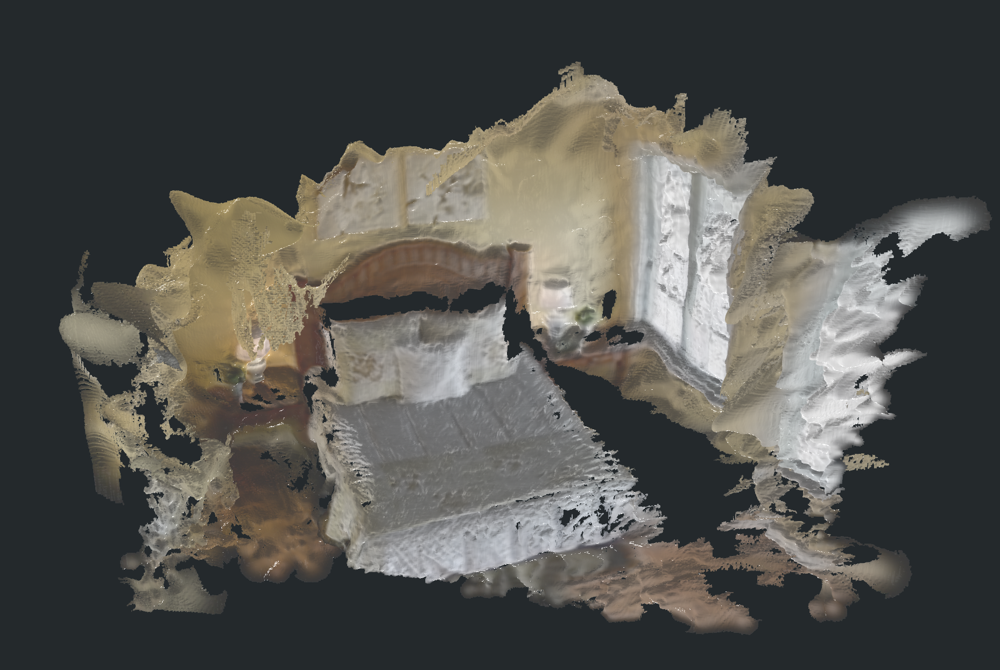
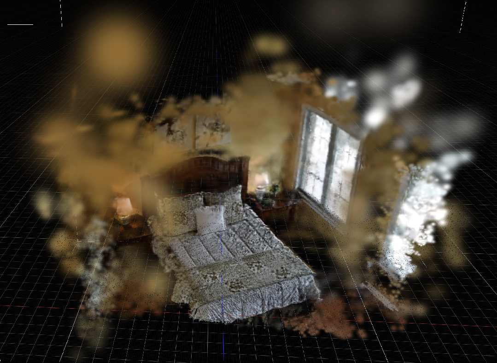
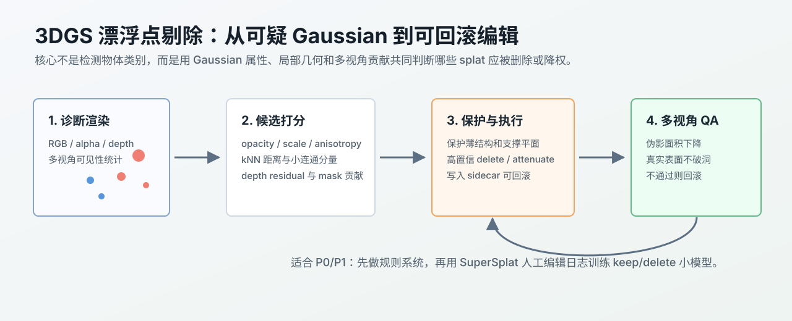
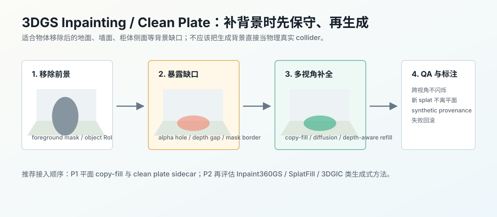

# 周报 2026-07-11：高质量重建、SimFoundry 资产合同与空间 QA

## 覆盖范围与证据

本周覆盖窗口是 **2026-07-04 至 2026-07-11**，从上一份 [2026-07-03 周报](#/doc/video2mesh-weekly-2026-07-03) 之后开始统计。写作证据来自三类材料：本周站内调研文档、实际实验产物路径、以及 Codex 会话/rollout 摘要。这里不会把 smoke run、proxy adapter、训练视角指标或生成式结果写成完整复现成果。

一句话结论：本周主线从“只把 bedroom_4 跑通”转向“判断哪些重建结果可以进入分层资产合同”。[GraphDECO 3DGS](#/doc/video2mesh-visual-3dgs-graphdeco-3dgs) 仍是当前最好看的视觉层；[SuGaR](#/doc/video2mesh-mesh-reconstruction-sugar)、[AnySplat](#/doc/video2mesh-visual-3dgs-anysplat)、[DepthSplat](#/doc/video2mesh-visual-3dgs-depthsplat)、[PGSR](#/doc/video2mesh-visual-3dgs-pgsr) 都给出了有价值的候选方向，但没有任何一条可以直接替代当前 P0 的 visual/collider 主链路。[SimFoundry](#/doc/video2mesh-industrial-pipelines-simfoundry) 方向本周真正落地的是资产六件套，而不是完整 NVIDIA 系统或动态仿真。[Holi-Spatial](#/doc/video2mesh-semantic-scene-graph-holi-spatial) 方向跑通的是 schema + AABB + spatial QA smoke，不是完整 DA3/SAM3/PGSR/VLM 复现。

## 相关文档入口

| 本周事项 | 站内文档 |
|---|---|
| 视觉 3DGS 主线 | [GraphDECO 3DGS](#/doc/video2mesh-visual-3dgs-graphdeco-3dgs)，[视觉重建与 3DGS 阶段](#/doc/visual-3dgs) |
| Surface-aware / mesh 路线 | [SuGaR](#/doc/video2mesh-mesh-reconstruction-sugar)，[PGSR](#/doc/video2mesh-visual-3dgs-pgsr)，[COLMAP Delaunay](#/doc/video2mesh-mesh-reconstruction-colmap-delaunay)，[Open3D Poisson](#/doc/video2mesh-mesh-reconstruction-open3d-poisson) |
| 前馈 3DGS / depth prior | [AnySplat](#/doc/video2mesh-visual-3dgs-anysplat)，[DepthSplat](#/doc/video2mesh-visual-3dgs-depthsplat)，[VGGT-Omega](#/doc/video2mesh-input-pose-pointcloud-vggt-omega)，[DA3](#/doc/video2mesh-input-pose-pointcloud-da3) |
| SimFoundry 资产合同 | [SimFoundry 调研与吸收方案](#/doc/video2mesh-industrial-pipelines-simfoundry)，[SimFoundry 复刻分支运行说明](#/doc/video2mesh-simfoundry-replica) |
| 生成式场景重建 | [GenRecon](#/doc/video2mesh-mesh-reconstruction-gen-recon) |
| 语义空间数据与 QA | [Holi-Spatial](#/doc/video2mesh-semantic-scene-graph-holi-spatial)，[SAM3 / SAM3.1](#/doc/video2mesh-semantic-scene-graph-sam3) |
| 语义 mesh / 点云归档 | [SceneVerse++ / PQ3D bedroom_4 原始 Mesh 结果归档](#/doc/video2mesh-experiments-sceneversepp-pq3d-bedroom4) |
| 点云清理与补全 | [点云清理与背景补全阶段](#/doc/pointcloud-completion)，[Auto-SuperSplat 修复](#/doc/auto-supersplat-repair)，[3DGS 漂浮点剔除](#/doc/video2mesh-pointcloud-completion-gs-floater-pruning)，[Gaussian RoI 编辑](#/doc/video2mesh-pointcloud-completion-gaussian-roi-editing)，[3DGS Inpainting / Clean Plate](#/doc/video2mesh-pointcloud-completion-gs-inpainting-clean-plate)，[学习式点云去噪与上采样](#/doc/video2mesh-pointcloud-completion-learning-pointcloud-denoise-upsample) |
| 动态 4D 研究线 | [D4RT](#/doc/video2mesh-dynamic-4d-reconstruction-d4rt) |
| Web demo | [Web Demo: Blender-like 视口与机器人交互](#/doc/video2mesh-experiments-web-demo-blender-gizmo-20260711)，[Static Mesh Collider](#/doc/video2mesh-collider-physics-proxy-static-mesh-collider)，[Scene Graph / VLM](#/doc/video2mesh-semantic-scene-graph-scene-graph-vlm)，[Semantic Splats](#/doc/video2mesh-semantic-scene-graph-semantic-splats) |

## 1. 高质量 3DGS / Mesh 路线对比

本周围绕 bedroom_4 重点比较了几类“更干净、更贴近表面、更适合后续 mesh/仿真”的候选路线。结论不是某一个方法胜出，而是进一步明确了每条路线应当服务的层。

| 路线 | 本周证据 | 当前判断 |
|---|---|---|
| [GraphDECO 3DGS](#/doc/video2mesh-visual-3dgs-graphdeco-3dgs) | 原版视觉质量最好，床、窗、墙面和灯光外观最完整 | 继续作为 P0 visual layer；但 novel view floaters、拉丝和异常远 bbox 会影响 viewer framing、mesh 清理和 simulator export |
| [SuGaR](#/doc/video2mesh-mesh-reconstruction-sugar) | refined PLY 约 2,399,946 Gaussians；coarse mesh 216,384 vertices / 399,991 faces；double-sided mesh 约 432,768 vertices / 799,982 faces | surface-bound Gaussian 和 visual mesh 质量不错；关闭 backface culling 后主体观感明显变好，但新视角空洞仍是 3DGS-to-mesh 通病 |
| [AnySplat](#/doc/video2mesh-visual-3dgs-anysplat) | 19 张 2fps 输入，原生 PLY 2,079,470 Gaussians，推理约 4.16s，峰值显存约 9.18GiB；GraphDECO 7k train PSNR 20.633 | 快速 baseline / pose-depth-Gaussian prior 有价值；但原生 video export 失败，带状伪影明显，7k refinement 不一定比原生更干净 |
| [DepthSplat](#/doc/video2mesh-visual-3dgs-depthsplat) | native80 + COLMAP camera 输出 622,080 vertices，刚好是 6 个 context views 各 103,680 Gaussians；ICP、COLMAP tracks、depth affine scale 都未稳定融合 | 单组局部结果伪影少，但目前不是全局 3DGS；更适合作为 depth prior，而不是在 PLY 层硬拼 |
| [PGSR](#/doc/video2mesh-visual-3dgs-pgsr) | `mil8` 跑通 120 iter smoke；iter 120 train PSNR 17.70；Gaussian PLY 97,381 vertices；TSDF post mesh 903,694 vertices / 1,703,876 faces | 环境、训练、render、depth/normal、TSDF export 跑通；质量未达可用线，不能替代 GraphDECO 或 collider |

### SuGaR：mesh 其实不错，但新视角空洞仍明显

SuGaR 这周的判断被修正了：最初从单面材质/外侧视角看，mesh 像是大片缺失；关闭 backface culling 或使用 double-sided mesh 后，床、窗、墙面和地板主体其实能看出来，说明 mesh 重建质量不是“完全不可用”。真正的问题是它相比默认 [COLMAP Delaunay](#/doc/video2mesh-mesh-reconstruction-colmap-delaunay) / TSDF / [Poisson](#/doc/video2mesh-mesh-reconstruction-open3d-poisson) 更继承 3DGS-to-mesh 的新视角空洞：未扫描到的位置会出现孔洞、薄片和碎片。

因此 SuGaR 当前适合做 P1/P2 high-quality visual mesh benchmark，短期不直接进入 P0 collider。后续如果要接 simulator，需要先做 normal/winding、hole filling、连通域清理和 density/visibility 筛选。

### AnySplat / DepthSplat：前馈路线有价值，但不能直接当最终场景

[AnySplat](#/doc/video2mesh-visual-3dgs-anysplat) 比较像“没有完整 per-scene 训练时先猜一个可看的 3DGS 场景”。它的正面视角能看到床、窗、墙面和床头柜，点云也比原版 GraphDECO 少一些远处随机漂浮片。但斜侧视角下出现条带、白色漂浮片和局部拉伸，这类伪影更像前馈深度/相机/局部几何一致性问题。

[DepthSplat](#/doc/video2mesh-visual-3dgs-depthsplat) 的局部点云更干净，但导出的全局 PLY 实际像 6 组 context-view Gaussian 拼接。已经尝试 translate / rigid ICP / similarity ICP / COLMAP track anchor / depth affine scale，但都只是在局部数值上更好，viewer 里仍然重影。下一步不应继续在 PLY 层硬拼，而应把 depth/Gaussian prior 接入 GraphDECO 短训或稠密几何正则。

### PGSR：部署通过，质量未达可用线

[PGSR](#/doc/video2mesh-visual-3dgs-pgsr) 这周跑通了 CUDA extension、训练、render、depth/normal 输出和 TSDF mesh export。它的价值在于把 vanilla 3DGS 推向 surface-aware reconstruction，可作为 Holi-Spatial-style 2D-to-3D lifting、bbox 和 QA 的几何后端候选。

但本次只是 120 iter smoke，不能写成正式 PGSR 30k 训练质量。`17.70 dB` 只是 train-view smoke 指标，Gaussian PLY 仍有雾状 splats 和外侧噪声，TSDF mesh 虽然能看到床和窗，但薄片、粘连、破洞明显。因此它的当前状态是 **部署通过、质量未达可用线**。

## 2. SimFoundry 风格资产六件套

本周 [SimFoundry](#/doc/video2mesh-industrial-pipelines-simfoundry) 方向的重点不是完整复刻 NVIDIA real-to-sim-to-real 系统，而是吸收它的资产组织方式：把 Video2Mesh 的输出拆成 visual、semantic、object、collider 和 GLB 等可消费层。当前分支 [SimFoundry 复刻分支运行说明](#/doc/video2mesh-simfoundry-replica) 把验收范围明确收口到六类资产。

| 资产 | 当前证据 |
|---|---|
| 高质量 3DGS 点云 | `tmp_remote_results/cli_dense_graphdeco30k_mesh_routes_20260702/3dgs_point_cloud_clean_iteration30000.ply`，GraphDECO 30k clean，971,305 vertices，约 230MB |
| 语义分割 3DGS 点云 | `exports/simfoundry_bedroom4_static_object_scene_p1_20260708_161534/simulator_assets/semantic_3dgs_from_semantic_mesh_transfer.ply`，971,305 vertices，含 `object_id` / `object_probability` |
| 高质量 mesh 重建 | COLMAP Delaunay dense mesh，82,920 vertices / 167,082 faces |
| 语义分割 mesh | 16 objects，73,970 vertices / 141,993 faces |
| 整个场景 GLB | `scene.glb`，16 objects，约 2.8MB |
| 单个物体 GLB | 16/16 objects 导出，`error_count=0` |

这一步的主要产出是资产合同，而不是动态仿真。当前语义 3DGS 是从已有 semantic mesh debug PLY 最近邻转移到 clean GraphDECO 30k 3DGS 的工程 baseline，不是完整 SVLGaussian，也不是 SimFoundry 官方 2D probability back-projection。历史 MuJoCo、dynamic-readiness、support-pose sidecar 都只作为后续探索证据，不混入本阶段完成口径。

## 3. GenRecon：能生成完整风格资产，但真实性不足

[GenRecon](#/doc/video2mesh-mesh-reconstruction-gen-recon) 的定位和 Video2Mesh 很接近：输入 posed RGB images 和 SfM sparse point cloud，输出 scene-level PBR mesh。但本周实际跑下来，它更像 P2/P3 的生成式 visual mesh / PBR asset 对照，不适合进 P0/P1 主链路。

bedroom_4 final run 使用 24 个 bed-heavy frames，把 iPhone two-crop 扩成 48 张 scene images；输入点云 300,000 points，其中 bed semantic points 约 204,000，context points 约 96,000。

| 产物 | 大小 / 数量 | 观察 |
|---|---:|---|
| `mesh.ply` | 53,947,019 bytes，1,179,479 vertices / 2,516,622 faces | 结构和真实 bedroom_4 差距大 |
| `clean_points.ply` | 3,559,014 bytes，296,571 points | 点云存在，但没有解决核心目标缺失 |
| `scene.glb` | 183,726,232 bytes | 可生成整场景 GLB，但几何不可信 |
| `chunk_000.glb` / `chunk_001.glb` | 97,788,468 / 85,938,044 bytes | chunk 级输出正常 |

定性结果比较差：最关键的床没有正常重建出来，只剩墙片、柜体、窗、地板和漂浮/破碎结构。官方 SAGE-10k 小场景 `aec38adc` 可以按默认设置跑通，但另一个较大官方场景 `e9121011` 在 31.47GiB GPU 上 `joint_decode_shape` OOM。结论是：GenRecon 可以继续作为生成式完整性/PBR 方向的对照，但不能替代 GraphDECO 3DGS、COLMAP Delaunay collider 或真实场景重建结果。

## 4. Holi-Spatial：schema smoke run 和 spatial QA 跑通

[Holi-Spatial](#/doc/video2mesh-semantic-scene-graph-holi-spatial) 本周重点是拆解官方组件，并把 Video2Mesh `bedroom_4` 现有输出整理成 Holi-Spatial-compatible package。完整官方 pipeline 应包含 DA3、PGSR/3DGS、VLM class discovery、SAM3、2D-to-3D lifting、bbox postprocess、caption 和 QA；本次只跑了 schema adapter、官方 AABB postprocess 和 object-only two-view QA。

| 官方组件 | 完整 Holi-Spatial 应做 | 本次 bedroom_4 状态 |
|---|---|---|
| [DA3](#/doc/video2mesh-input-pose-pointcloud-da3) | 生成 `depth_da3/*.npy` 和 `pointcloud_da3.ply` | Not tested |
| [PGSR](#/doc/video2mesh-visual-3dgs-pgsr) / 3DGS | per-scene optimized 3DGS 和 refined depth | Reused Video2Mesh GraphDECO PLY |
| VLM class discovery | 逐帧发现类别并维护 label memory | Reused Video2Mesh object labels |
| [SAM3](#/doc/video2mesh-semantic-scene-graph-sam3) | text-prompted 2D instance masks | Reused GroundingDINO/SAM2 masks |
| 2D-to-3D lifting | 用 refined depth 回投 masks 并估计 OBB | Proxy：用 Video2Mesh `object_masks.json` 转 schema |
| AABB/OBB postprocess | floor/up-axis 对齐 bbox | Passed |
| QA generation | bbox + camera + covisibility 生成 spatial QA | Passed |

| 产物 | 结果 |
|---|---:|
| run package | 约 192MB，1025 files |
| frames | 50 |
| categories | 13 |
| `mask_index.json` | 1000 items |
| bbox instances | 21，包含 proxy floor |
| AABB postprocess | 官方 `postprocess_3d_bbox_aabb.py` 跑通 |
| spatial QA | 官方 `generate_two_view_qa.py` 生成 24 条 object-only two-view QA |
| QA 类型 | `cam_translation` 8，`cam_rotation` 4，`object_distance` 4，`object_height_or_length` 4，`object_cross_direction` 4 |

这批 QA 的用途不是聊天问答，而是空间推理数据/评测样本：它用相机位姿、bbox、共视关系和几何规则生成问题与答案，后续可以用来测 VLM 是否理解空间关系。由于本次包含 proxy floor、proxy covisibility 和复用的 Video2Mesh masks/3DGS/mesh，它适合做 pipeline validation，不适合写成正式 benchmark 或训练数据。

## 5. SceneVerse++ / PQ3D 原始结果归档

本周把 `mil8` 上 [SceneVerse++ / PQ3D bedroom_4 原始 Mesh 结果](#/doc/video2mesh-experiments-sceneversepp-pq3d-bedroom4) 同步回本地并归档。这里的关键是区分 mesh 和点云，不把普通点云误写成 3DGS 或高质量 visual layer。

| 文件 | 规模 | 当前判断 |
|---|---:|---|
| `instance_seg_mesh.ply` | 41,262,623 bytes；570,255 vertices / 190,085 faces；含 `object_id` / `object_probability` / `source_face` | mesh 建模效果很好，语义着色可读，适合归档和人工审阅 |
| `mesh_pq3d_float_rgb_uintface.ply` | 3,885,105 bytes；94,249 vertices / 190,085 faces | PQ3D segmentator 兼容 mesh，较轻量 |
| `spatiallm_data/pcd/bedroom_4.ply` | 2,194,036 bytes；91,412 vertices；只有 `x/y/z` | 只是普通 XYZ 点云，缺少 RGB、normal、semantic probability 和 Gaussian 属性 |

结论：SceneVerse++ / PQ3D 在 semantic mesh / scene understanding 上值得继续接，尤其适合 object id、bbox、scene graph 和 spatial QA；但当前点云还需要用 dense/depth prior、denoise、normal estimation 和 semantic enrichment 提升，不能直接替代 GraphDECO visual layer。

## 6. 点云清理、补全与新调研扩展

本周把点云/3DGS 修复方向从一个概念报告拆成多个可导航文档，并保留 [Auto-SuperSplat 式 3DGS 剔除与修补](#/doc/auto-supersplat-repair) 作为总入口。这个方向服务于 GraphDECO / SuGaR / AnySplat 等 visual layer 的后处理，不服务于物理真值。

| 子方向 | 作用 | 当前判断 |
|---|---|---|
| [3DGS 漂浮点剔除与剪枝](#/doc/video2mesh-pointcloud-completion-gs-floater-pruning) | 用 opacity、scale、anisotropy、kNN、多视角贡献和语义保护判断 delete/attenuate | P0/P1 可先做规则版，所有删除必须可回滚 |
| [Gaussian RoI 分割与局部编辑](#/doc/video2mesh-pointcloud-completion-gaussian-roi-editing) | 把 2D mask、点击或 prompt 提升到 Gaussian id 集合 | 是模拟 SuperSplat 框选编辑的关键中间层 |
| [3DGS Inpainting 与背景 Clean Plate](#/doc/video2mesh-pointcloud-completion-gs-inpainting-clean-plate) | 对地面/墙面等背景洞做 copy-fill 或生成式 inpainting | 第一版只做平面 patch，不自由生成整场景 |
| [学习式点云去噪与上采样](#/doc/video2mesh-pointcloud-completion-learning-pointcloud-denoise-upsample) | 借鉴 PointCleanNet / PU-Net / score-based denoise 的局部特征 | 作为小模型特征来源，不直接覆盖 Gaussian PLY |

同时新增了几条 learned geometry / dynamic 研究线：[DA3](#/doc/video2mesh-input-pose-pointcloud-da3) 和 [VGGT-Omega](#/doc/video2mesh-input-pose-pointcloud-vggt-omega) 更适合作为 camera/depth/point-cloud prior；[D4RT](#/doc/video2mesh-dynamic-4d-reconstruction-d4rt) 更适合作为动态 tracks sidecar 研究对象。它们都不能直接写成 mesh/collider 或 simulator asset 输出。

## 7. Web demo：从可看推进到可探索

本周也更新了 [Web demo](#/doc/video2mesh-experiments-web-demo-blender-gizmo-20260711)。这部分的目标不是改变重建资产本身，而是把 browser viewer 从“能看到”推进到“能探索和调试”。

真实资产和验证结果：

| 项 | 结果 |
|---|---|
| 视觉 3DGS | AnySplat Gaussian PLY，`visualCount=1,313,391` |
| 碰撞 mesh | semantic mesh PLY，426,657 vertices / 142,219 faces |
| manifest version | `local-bedroom4-anysplat-semanticmesh-gizmo-20260711` |
| 视觉到碰撞配准 | `anysplat_to_video2mesh_camera_umeyama_20260711 + viewer_default`，RMSE `0.199813` scene units |
| 右侧 `Rotate` / `Pan` | 拖动后相机位置/target 改变，控件回到 idle |
| 滚轮缩放 | `cameraDistance` 从 `9.8043` 变为 `8.6278` |
| WASD 机器人 | `W` 后机器人从 `(-0.947493, -9.157697, 18.919588)` 移动到 `(-0.750465, -8.98, 19.283698)` |
| Console | 无 `error` / `warn` |

这个 demo 继续强调分层：3DGS / splat 只负责视觉，mesh collider / primitive proxy 负责 raycast、ground probe 和移动阻挡，scene graph 与 semantic sidecar 负责 object id、label、material、relation 和 affordance。不要把可视层 raycast 和碰撞层混在一起。

## 风险与下周计划

本周最大的收获是边界更清楚，但风险也更清楚：

| 风险 | 当前处理 |
|---|---|
| 视觉质量好不等于可仿真 | GraphDECO、SuGaR、AnySplat、PGSR 都不能直接替代 collider |
| 前馈 3DGS 输出看似是场景，实则可能是局部拼接 | AnySplat/DepthSplat 只作为 baseline / prior，必须做相机、scale、viewer QA |
| 生成式重建会 hallucinate | GenRecon 保留为 P2/P3 visual mesh/PBR 对照，不进 P0/P1 |
| smoke run 容易被误写成复现 | Holi-Spatial、PGSR 都明确标注 Passed / Not tested / Proxy / Reused |
| 点云/高斯修补可能污染真实证据 | 所有 delete/fill/inpaint 都要有 sidecar、provenance、before/after QA |

下周建议收口到四件事：

1. 建立固定视角的 GraphDECO / SuGaR / AnySplat / DepthSplat / PGSR 对比基准，保存 PLY header、顶点数、bbox、截图和失败类型。
2. 把 SimFoundry 六件套接入可复验 viewer / asset QA，不提前把 dynamic release 或 MuJoCo 历史探索写成当前验收。
3. 给 Holi-Spatial 的 24 条 QA 写 verifier，并接一个 VLM evaluation script，把 spatial QA 从静态产物变成可比较指标。
4. 推进 Auto-SuperSplat 第一版：高置信 floater 删除、Gaussian RoI sidecar、平面 copy-fill 三件事分开做，所有修改可回滚。
