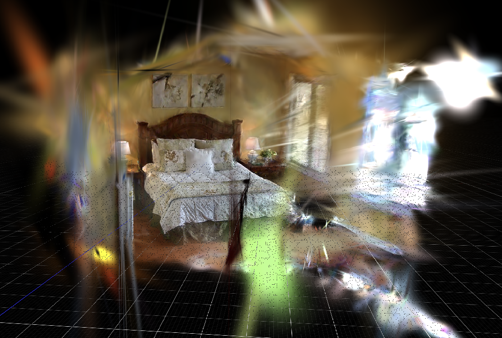
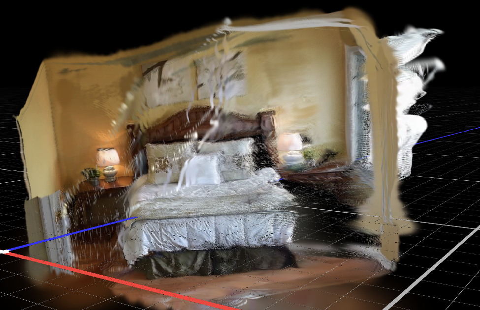
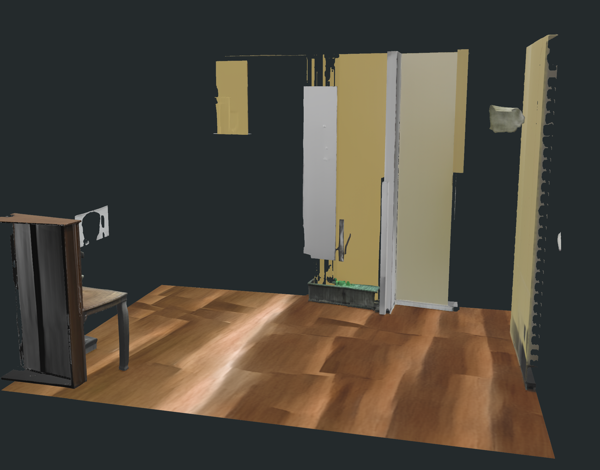
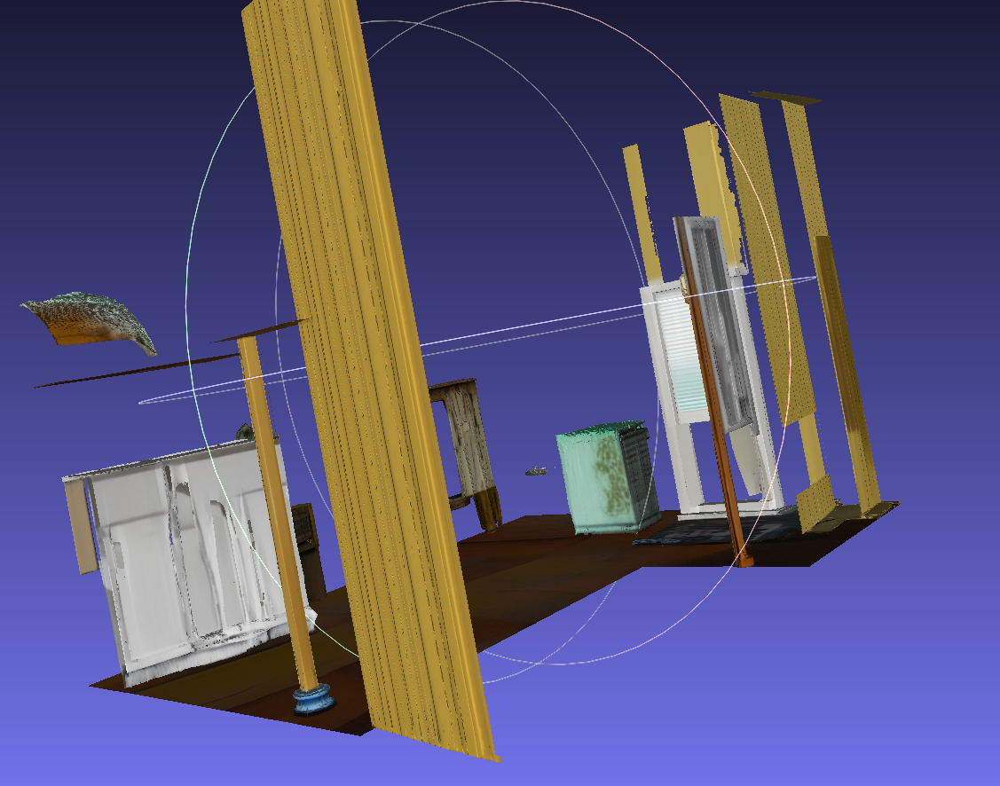

# 周报 2026-07-11：高质量重建路线、SimFoundry 资产拼装与 GenRecon/Holi-Spatial 实验

## 本周总体进展

本周主要围绕一个核心问题推进：**Video2Mesh 如何从“能跑通的扫描重建”升级到“更干净、更贴近真实表面、能进入仿真/交互系统的分层资产”**。

上周已经明确了 3DGS visual layer、mesh/collider layer、semantic sidecar 和 simulator bundle 应该分开。本周重点转到质量提升和路线筛选：一方面比较原版 [GraphDECO 3DGS](#/doc/video2mesh-visual-3dgs-graphdeco-3dgs)、[SuGaR](#/doc/video2mesh-mesh-reconstruction-sugar)、[AnySplat](#/doc/video2mesh-visual-3dgs-anysplat)、[DepthSplat](#/doc/video2mesh-visual-3dgs-depthsplat) 等视觉/点云路线，试图修复新视角下伪影、漂浮物、空洞和异常远包围盒；另一方面按 [SimFoundry](#/doc/video2mesh-industrial-pipelines-simfoundry) 的结构，把当前 Video2Mesh 输出整理成高质量 3DGS、语义 3DGS、高质量 mesh、语义 mesh、整场景 GLB 和单物体 GLB 六件套。

目前判断是：GraphDECO 3DGS 仍然是渲染质量最好的 visual layer，但它的新视角 floaters、墙体外漂浮片和异常包围盒会影响后续 mesh/scene bundle；SuGaR 点云和 mesh 重建质量都还可以，去掉 backface culling 后主体观感不错，但相比默认 [COLMAP Delaunay](#/doc/video2mesh-mesh-reconstruction-colmap-delaunay) / TSDF / [Poisson](#/doc/video2mesh-mesh-reconstruction-open3d-poisson) 路线更容易暴露 3DGS-to-mesh 的新视角空洞；AnySplat 作为前馈 3DGS 效果不错，主体和背景渲染清楚，点云也更贴合表面，但存在前馈方法常见的带状伪影；DepthSplat 当前更像单视角/多视角局部点云输出，伪影最少，但 6 个视角点云还没有稳定融合成完整房间。

## 本周涉及的调研文档

| 项目 / 方法 | 站内文档 |
|---|---|
| GraphDECO 3DGS | [GraphDECO 3D Gaussian Splatting](#/doc/video2mesh-visual-3dgs-graphdeco-3dgs) |
| SuGaR | [SuGaR mesh 重建调研](#/doc/video2mesh-mesh-reconstruction-sugar) |
| AnySplat | [AnySplat 前馈 3DGS 调研](#/doc/video2mesh-visual-3dgs-anysplat) |
| DepthSplat | [DepthSplat 前馈深度/3DGS 调研](#/doc/video2mesh-visual-3dgs-depthsplat) |
| SimFoundry | [SimFoundry 调研与 Video2Mesh 吸收方案](#/doc/video2mesh-industrial-pipelines-simfoundry)，[复刻分支运行说明](#/doc/video2mesh-simfoundry-replica) |
| GenRecon | [GenRecon 场景生成式重建调研](#/doc/video2mesh-mesh-reconstruction-gen-recon) |
| Holi-Spatial | [Holi-Spatial 调研与 bedroom_4 实验报告](#/doc/video2mesh-semantic-scene-graph-holi-spatial) |
| SceneVerse++ / PQ3D | [bedroom_4 原始 Mesh 结果归档](#/doc/video2mesh-experiments-sceneversepp-pq3d-bedroom4) |
| Demo 分层思路 | [Static Mesh Collider](#/doc/video2mesh-collider-physics-proxy-static-mesh-collider)，[Scene Graph / VLM](#/doc/video2mesh-semantic-scene-graph-scene-graph-vlm)，[Semantic Splats](#/doc/video2mesh-semantic-scene-graph-semantic-splats) |

## 高质量 3DGS / Mesh 路线探索

### 原版 GraphDECO 3DGS



[GraphDECO 3DGS](#/doc/video2mesh-visual-3dgs-graphdeco-3dgs) 的优点仍然很明确：从训练视角和常规展示视角看，它保留的纹理、床、窗、灯光和墙面外观最好，适合作为 Video2Mesh 当前主 visual layer。

但这周重点看的是它的问题：新视角下会有大量 floaters、拉丝状高斯、墙外碎片和空中悬浮物。更麻烦的是这些远处碎点会把 scene bounding box 拉得很大，导致 viewer framing、mesh 清理、object bbox 和后续 simulator export 都更难稳定。

### SuGaR


[SuGaR](#/doc/video2mesh-mesh-reconstruction-sugar) 的价值在于让 Gaussians 更贴近表面，并能从 aligned Gaussian field 抽 mesh。bedroom_4 实测里，SuGaR 的点云/高斯视觉层质量还可以；mesh 在关闭 backface culling 或改成 double-sided 后，床、窗、墙面和地板主体都比较清楚，比最初单面查看时的判断要好。

主要问题不是 mesh 完全不可用，而是相比 Video2Mesh 默认的 COLMAP dense / TSDF / Poisson 路线，SuGaR 更继承 3DGS-to-mesh 的通病：新视角、未扫描到的位置会出现大量空洞、薄片和碎片。它适合作为 high-quality visual mesh benchmark，短期仍不直接替代 P0 collider。

### AnySplat


[AnySplat](#/doc/video2mesh-visual-3dgs-anysplat) 这周的观察比较正向：作为前馈 3DGS，它不需要完整 per-scene GraphDECO 训练就能给出可看的房间结果。床、墙、窗和背景结构整体清楚，3DGS 点云也比原版 GraphDECO 的漂浮片更贴近物体表面。



它的问题是带状点云伪影很明显，尤其在墙面、床上方和窗边薄结构附近。这个现象更像前馈模型的深度/相机/局部几何一致性没有完全收敛，而不是普通 3DGS 训练的随机 floaters。当前结论是：AnySplat 值得继续作为快速 baseline 和 GraphDECO 初始化候选，但还不能直接作为最终 visual layer 或 mesh source。

### DepthSplat


[DepthSplat](#/doc/video2mesh-visual-3dgs-depthsplat) 的结果和 AnySplat 不一样：它导出的伪影最少，但目前看到的是 6 个视角各自对应的局部点云/高斯。单个视角局部结构比较干净，但它们分布在不同位置，没有形成一套完整连续的 bedroom_4 全局房间。

这周尝试了按相机、ICP、COLMAP tracks、深度尺度等方式做融合，但没有得到稳定全局结果。当前判断是 DepthSplat 更适合作为 depth prior 或前馈 baseline，而不是直接把 6 个 PLY 拼成 Video2Mesh 主 visual layer。下一步更合理的做法是把它的 depth/Gaussian prior 接到 GraphDECO 短训 refinement，而不是在 PLY 层硬融合。

## SimFoundry 风格资产拼装

本周继续探索 [SimFoundry](#/doc/video2mesh-industrial-pipelines-simfoundry) 的模型和系统结构，目标不是完整复现 NVIDIA 的 real-to-sim-to-real 系统，而是吸收它的资产组织方式：不要把扫描结果当作一个全能 mesh，而是拆成 visual、semantic、object、collider 和 simulator adapter 能消费的分层资产。当前复刻分支的运行记录见 [SimFoundry 复刻分支运行说明](#/doc/video2mesh-simfoundry-replica)。

当前在 `codex/simfoundry-replica` 分支已经把阶段目标收口为六类资产：

| 资产 | 当前状态 |
|---|---|
| 高质量 3DGS 点云 | GraphDECO 30k clean PLY，约 971,305 vertices |
| 语义分割 3DGS 点云 | 最近邻语义 mesh -> clean 3DGS transfer baseline，含 `object_id` / `object_probability` |
| 高质量 mesh 重建 | COLMAP Delaunay dense mesh，约 82,920 vertices / 167,082 faces |
| 语义分割 mesh | 16 objects，约 73,970 vertices / 141,993 faces |
| 整个场景 GLB | `scene.glb`，16 objects，约 2.8 MB |
| 单个物体 GLB | 16/16 objects 导出，`error_count=0` |

这一步的意义是把 Video2Mesh 的已有 pipeline 组织成后续仿真器、编辑器和 Web viewer 能消费的资产合同。需要强调的是：当前语义 3DGS 是工程 baseline，不是完整 SVLGaussian 或 SimFoundry 官方 2D probability back-projection 链路；动态物理、digital cousins、policy learning 暂时不纳入本阶段完成口径。

## GenRecon 部署与复现实验



[GenRecon](#/doc/video2mesh-mesh-reconstruction-gen-recon) 这周部署并跑了两类实验：一类是把我们的 bedroom_4 片段整理成 bed-focused 输入去跑；另一类是用论文/官方数据集做小场景复现，排除“是不是我们参数或者视角太少导致失败”的问题。

bedroom_4 final run 使用 24 个 bed-heavy frames，并把 iPhone two-crop 扩成 48 张 scene images；输入点云选择了 300,000 points，其中 bed semantic points 约 204,000，context points 约 96,000。输出包包含 `mesh.ply`、`clean_points.ply`、`scene.glb`、两个 chunk GLB、chunk layout、cond2d 图和日志。主要文件体量是：

| 产物 | 大小 / 数量 |
|---|---:|
| `mesh.ply` | 53,947,019 bytes，1,179,479 vertices / 2,516,622 faces |
| `clean_points.ply` | 3,559,014 bytes，296,571 points |
| `scene.glb` | 183,726,232 bytes |
| `chunk_000.glb` / `chunk_001.glb` | 97,788,468 / 85,938,044 bytes |



定性结果比较差：生成出的场景和原始 bedroom_4 差别很大，最关键的床目标没有正常重建出来，只剩一些墙片、柜体、窗、地板和漂浮/破碎物体。起初怀疑是我们给的视角太少、输入点云尺度或参数不合适，但官方小场景复现也显示这条路线更偏“生成式场景资产”，会产生合理但不真实的几何。

官方数据集复现中，SAGE-10k 小场景 `aec38adc` 用默认 `num_imgs_per_scene=32`、`seed=42`、`pipeline=512` 跑通，输出 `mesh.ply` 约 169MB、`scene.glb` 约 311MB、4 个 chunk GLB。另一个较大官方场景 `e9121011` 渲染了 160 images，但 full-scene inference 产生 80 chunks，在 31.47 GiB GPU 上 `joint_decode_shape` OOM。

因此，GenRecon 目前不适合作为 Video2Mesh 的 P0/P1 主链路。它可以继续作为 P2/P3 的生成式 visual mesh / PBR asset 对照，但不能拿它替换 GraphDECO 3DGS、COLMAP Delaunay collider 或真实场景重建结果。

## Holi-Spatial 部署进展

[Holi-Spatial](#/doc/video2mesh-semantic-scene-graph-holi-spatial) 这周还在部署和拆解中，目前已经完成 bedroom_4 的 Holi-Spatial-compatible smoke run，但不是完整官方 DA3/SAM3/PGSR/VLM 重跑。

当前跑通的是 schema 和后处理层：

| 项 | 结果 |
|---|---:|
| run package | 约 192MB，1025 files |
| frames | 50 |
| categories | 13 |
| `mask_index.json` | 1000 items |
| bbox instances | 21，包含 proxy floor |
| AABB postprocess | 官方 `postprocess_3d_bbox_aabb.py` 跑通 |
| spatial QA | 官方 `generate_two_view_qa.py` 生成 24 条 object-only two-view QA |

这说明 Video2Mesh 的 frames、cameras、object masks、3D bbox 可以整理成 Holi-Spatial 风格的数据包，用于后续 spatial QA / VLM evaluation。但当前没有跑 DA3 depth、PGSR official retraining、SAM3 mask inference 和 Qwen/VLM caption，所以不能写成完整复现。短期最适合吸收的是 Holi-Spatial 的 bbox schema、spatial QA schema 和 LLaMA-Factory 数据转换思路。

## SceneVerse++ / PQ3D 原始 Mesh 归档


这周还把 `mil8` 上 SceneVerse++ / PQ3D `bedroom_4` paper-like 运行的原始 PLY 传回本地并归档到 [SceneVerse++ / PQ3D bedroom_4 原始 Mesh 结果归档](#/doc/video2mesh-experiments-sceneversepp-pq3d-bedroom4)。这里要把两个结论分开写：

| 产物 | 当前判断 |
|---|---|
| `instance_seg_mesh.ply` | mesh 建模很好，570,255 vertices / 190,085 faces，带 `object_id`、`object_probability` 和 `source_face`，床、墙、柜体、右侧大结构和房间主体都能清楚辨认 |
| `mesh_pq3d_float_rgb_uintface.ply` | PQ3D segmentator 兼容 mesh，94,249 vertices / 190,085 faces，是更接近原始几何输入的轻量版本 |
| `bedroom_4.ply` | SpatialLM 普通点云，91,412 vertices，只有 `x/y/z`，没有颜色、normal、语义或 Gaussian 字段，有待提高 |

因此这批结果适合写成“SceneVerse++ / PQ3D 的语义 mesh 归档成功，建模质量不错”，但不能把普通点云写成高质量 3DGS 或最终 visual layer。后续如果继续沿这条线走，优先方向是提升点云：补 RGB/normal/semantic probability，接 dense depth prior 或 learned point cloud denoise / upsample，再考虑和 Video2Mesh 的 semantic sidecar、scene graph、QA verifier 对齐。

## Demo 网站更新

本周也更新了之前的小 demo 网站思路：前端交给视觉代理，碰撞交互逻辑交给 [collider/physics proxy](#/doc/video2mesh-collider-physics-proxy-static-mesh-collider)，[scene graph](#/doc/video2mesh-semantic-scene-graph-scene-graph-vlm)、物体语义和 [点云语义](#/doc/video2mesh-semantic-scene-graph-semantic-splats) 作为场景元信息层。

这个 demo 的重点不是炫技，而是确认 Video2Mesh 的工程边界：

```text
visual agent:
  3DGS / splat / visual mesh display

collision agent:
  mesh collider / primitive proxy
  raycast / ground probe / movement blocking

semantic scene graph:
  object id / label / material / relation / affordance
  semantic splats / mesh face sidecar / object sidecar
```

也就是说，用户看到的可以是高质量 3DGS 或 visual mesh，但真正负责点击、角色移动、碰撞和后续物理交互的是独立 collider layer；语义信息则通过 scene graph 和 sidecar 查询，而不是强行塞进一个 mesh 或一个 PLY 里。

## 当前风险与下周计划

当前最大的风险仍然是“视觉看起来像房间”和“可用的仿真资产”之间差距很大。原版 3DGS 渲染漂亮但 floaters 多；SuGaR mesh 质量不错，但新视角空洞和碎片仍明显；AnySplat/DepthSplat 各自修了一部分问题，又引入带状伪影或多视角未融合；GenRecon 能生成完整风格资产，但真实性不足；Holi-Spatial 更像空间监督数据层，不是几何替代方案。

下周建议收口到三件事：

1. 建立固定视角的 3DGS / SuGaR / AnySplat / DepthSplat 对比基准，保存 PLY header、顶点数、截图和失败类型。
2. 继续把 SimFoundry 六件套资产接到可验证 viewer / simulator bundle，不把动态仿真提前混进验收。
3. Holi-Spatial 先做 QA verifier 和 VLM evaluation，确认它能作为 Video2Mesh 的空间语义评测层。
