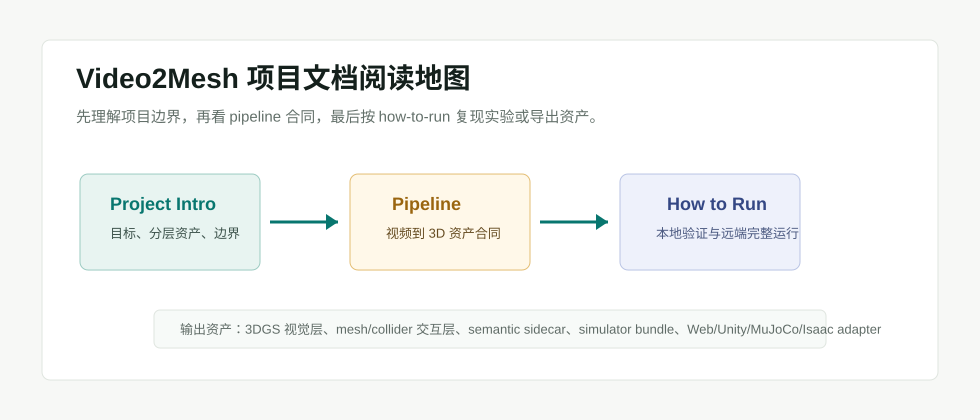

# Video2Mesh 项目文档 Overview

这个目录只放项目当前对外可读的稳定说明，不混入旧调研长文和实验草稿。

## 阅读路径

| 文档 | 解决的问题 |
|---|---|
| [项目简介](project-intro.md) | Video2Mesh 要做什么、产物分几层、和外部项目的边界在哪里 |
| [Pipeline](pipeline.md) | 从扫描视频到 3DGS、mesh、语义、collider、simulator bundle 的流程合同 |
| [如何运行](how-to-run.md) | 本地/远端常用命令、输出目录、验证方式和注意事项 |

## 当前一句话

Video2Mesh 的目标不是输出单一 mesh，而是从真实扫描视频生成一组可被浏览器、Unity、MuJoCo、Isaac 等 runtime 消费的分层 3D 场景资产。
