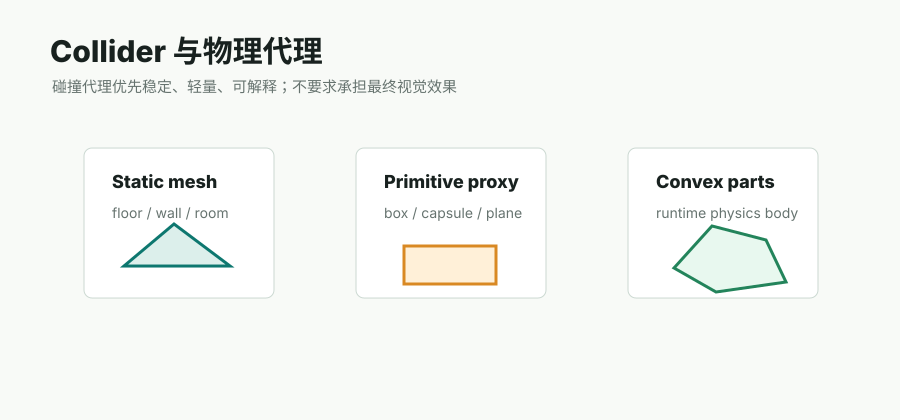

# MuJoCo / Isaac

## 链接

- MuJoCo modeling docs: https://mujoco.readthedocs.io/en/stable/modeling.html
- MuJoCo XML reference: https://mujoco.readthedocs.io/en/stable/XMLreference.html
- Isaac Sim physics docs: https://docs.isaacsim.omniverse.nvidia.com/latest/physics/index.html
- Isaac Sim physics fundamentals: https://docs.isaacsim.omniverse.nvidia.com/4.5.0/physics/simulation_fundamentals.html

## 简介

MuJoCo 和 Isaac 更偏机器人、物理仿真和可控实验环境，比 Web viewer 更严格。它们需要明确的 body tree、joint、geom/collider、mass、inertia、friction、contact 参数、scale 和坐标约定。视觉 mesh 可以作为展示资产，但仿真是否稳定主要看 collider 和物理参数。

这条线提醒 Video2Mesh：最终 simulator asset bundle 必须是结构化资产包，而不是简单的 mesh 文件集合。

## Pipeline

| 阶段 | MuJoCo | Isaac / USD |
|---|---|---|
| scene asset | MJCF worldbody / mesh assets | USD stage / prim hierarchy |
| collision | geom / mesh / primitive | CollisionAPI / PhysX collision shapes |
| dynamics | body mass, inertia, joint, contact | RigidBodyAPI, joints, material, solver params |
| export adapter | XML / MJCF | USD / Python config |

## 输入与输出

输入：Video2Mesh simulator asset bundle、visual mesh、collider、body type、material、mass/friction metadata。输出：MJCF/XML、USD/Isaac adapter、仿真可加载的 body/collider/physics 配置。

## 在 Video2Mesh 中的位置

P1/P2 仿真适配。当前阶段先把 `simulator_asset_bundle.json` 的结构做扎实：每个 object 必须知道 visual、collider、pose、scale、body type、material 和来源置信度。MuJoCo/Isaac adapter 之后再消费这份 bundle。

## 接入判断

- P0：不阻塞，P0 先保证 collider/semantic sidecar。
- P1：生成基础 adapter，验证可加载。
- P2：做机器人/物理任务级 QA。
- 风险：VLM 自动推断物理参数只能做初稿，仿真稳定性必须实测。
