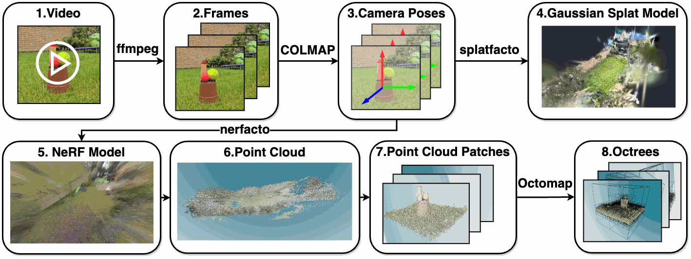
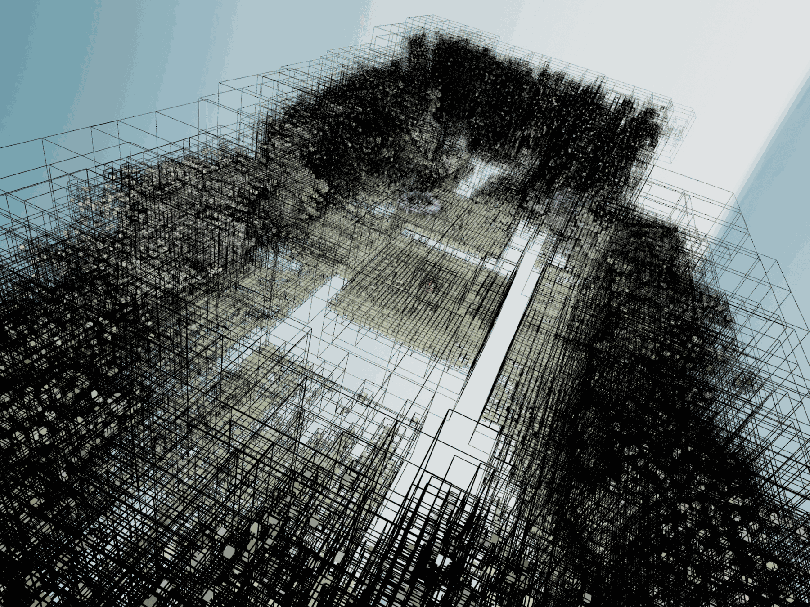
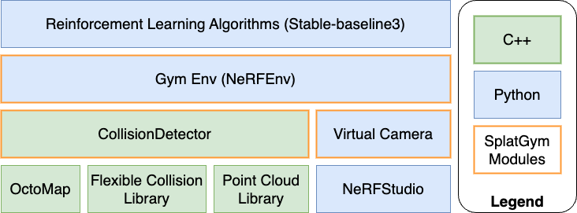

# SplatGym：3DGS + OctoMap 体素碰撞



## 先纠正名称

用户描述的“SuperSplat 3DGS 体素碰撞检测论文”最吻合的实际对象是 **SplatGym**，对应论文：

**Robotic Learning in your Backyard: A Neural Simulator from Open Source Components**

SuperSplat 是 PlayCanvas 的浏览器端 3DGS 检查、编辑、优化和发布工具，不是这篇论文的方法名，也不负责生成物理碰撞体。SplatGym 才是把 3DGS 视觉环境与体素/八叉树碰撞检测组合起来的开源机器人学习模拟器。

## 论文与代码

| 项目 | 信息 |
|---|---|
| 论文 | [arXiv 2410.19564](https://arxiv.org/abs/2410.19564) |
| 正式发表 | IEEE International Conference on Robotic Computing 2024, pp. 131-138 |
| DOI | [10.1109/IRC63610.2024.00031](https://doi.org/10.1109/IRC63610.2024.00031) |
| 作者 | Liyou Zhou, Oleg Sinavski, Athanasios Polydoros |
| 主代码 | [SplatLearn/SplatGym](https://github.com/SplatLearn/SplatGym) |
| 碰撞模块 | [SplatLearn/collision_detector](https://github.com/SplatLearn/collision_detector) |
| 许可证 | 两个仓库均为 Apache-2.0 |
| 论文状态 | 已在 IEEE IRC 2024 发表；不是只有 arXiv 预印本 |
| 本地状态 | 本轮完成论文与代码审计，尚未在 Video2Mesh 数据上复现 |

## 核心结论

这篇论文的关键不是“直接让 Gaussian 参加物理碰撞”，而是一个清晰的双代理设计：

```text
同一段视频
  -> COLMAP 相机位姿
  -> Splatfacto 3DGS
       -> 视觉渲染代理

  -> Nerfacto NeRF
       -> 导出点云
       -> 手工裁剪噪声
       -> 粗空间分块
       -> 每块构建 OctoMap
       -> FCL 检测 robot/camera box 与 occupied voxels 是否相交
       -> 碰撞代理
```

因此它和 Video2Mesh 当前“visual layer + collision proxy + simulator adapter”的架构方向一致。它证明了不必先得到闭合 mesh，也可以从点云快速建立一个可查询的静态占据碰撞层。

但要准确理解：**论文并没有把 SuperSplat PLY 或 3D Gaussian 本身直接体素化。** 由于当时 Nerfstudio 不能从 Splatfacto 导出点云，作者额外训练了一套 Nerfacto，从 NeRF 中导出点云供碰撞分支使用。

## 方法详解

### 1. 视觉分支

输入是手机拍摄的单段视频。作者先用 FFmpeg 抽帧，再用 COLMAP 恢复相机位姿，随后在 Nerfstudio 1.1.3 中训练 Splatfacto。

论文把 Splatfacto 与 Nerfacto 做了同场景速度比较：

| 方法 | 训练迭代时间 | 单帧推理时间 |
|---|---:|---:|
| Nerfacto | 31 ms/iteration | 2270 ms/frame |
| Splatfacto | 17 ms/iteration | 7.80 ms/frame |

据此，论文报告 Splatfacto 单次训练迭代约快 45%，单帧推理约快 291 倍。作者另称，从一段 1080p 视频训练该场景模型约需 20 分钟。这里衡量的是论文花园场景和当时软件版本，不应直接外推到 Video2Mesh 当前 GraphDECO、PGSR 或其他 3DGS 路线。

### 2. 几何来源

碰撞几何不是 Gaussian 的中心点，而是额外 Nerfacto 模型导出的点云：

```text
same frames + same COLMAP poses
  -> train Nerfacto with predicted normals
  -> ns-export pointcloud
  -> crop x/y/z bounds manually
  -> convert PLY to PCD
```

这一步的优点是能绕开 mesh 闭合、凸化和修洞；缺点是需要重复训练，而且点云边缘伪影需要人工裁剪。对 Video2Mesh 来说无需照搬额外 NeRF：已有 COLMAP dense fused point cloud、DA3/VGGT 点云或经过筛选的 3DGS-derived point samples 都可以成为候选输入，但必须单独验证它们的表面可靠性。

### 3. 粗分块与局部 OctoMap

SplatGym 先用 Open3D 的 `voxel_down_sample(voxel_size=bbox_sides)` 为场景生成粗分块中心，然后围绕每个中心裁出一块点云。每一块分别建立一个 OctoMap/FCL collision object。

官方流程如下：



碰撞仓库中的实际分辨率计算是：

```text
resolution = max(x_range, y_range, z_range) / 64 * 1.01
```

其中 `1.01` 用来略微放大覆盖范围。点云被平移到局部中心，再通过 `octomap::OcTree::insertPointCloud` 写入占据树，最后包装成 `fcl::OcTree<double>`。

论文称该八叉树“8 层深”，同时又称整个局部体积沿尺度形成 64 个基础体素。代码没有显式设置固定深度 8，而是通过 `max_range / 64` 设置叶节点分辨率。因此工程复现应以代码和实际 `.bt` 树统计为准，不能只把论文中的“8 层”当成固定合同。

### 4. 碰撞查询

运行时将机器人简化为一个 FCL box：

```text
scene: fcl::OcTree<double>
agent: fcl::Box<double>
query: fcl::collide(agent_box, scene_octree)
output: bool collision
```

SplatGym 的 Python 环境遍历所有局部 collision detector，只要任意一个返回碰撞就提前结束。碰撞后 Gym episode 终止并给予负奖励。

这只是**布尔碰撞检测**：没有向上层输出接触法线、穿透深度、摩擦、恢复系数、质量、力或约束，也没有完整刚体动力学。它适合自由空间导航、相机移动阻挡和 RL reward，不等于 MuJoCo/Isaac/Unity 中完整的物理仿真。

## 论文报告的结果

| 指标/现象 | 论文报告 |
|---|---|
| 原始裁剪点云 | 287,069 points |
| OctoMap 后占据单元 | 10,196 occupied voxels |
| 场景局部树数量 | 75 octrees |
| 单棵树碰撞查询 | `< 5 us` |
| Splatfacto 单帧渲染 | 7.80 ms |
| 模拟器 + RL | RTX 2070 Super 上超过 100 Hz |
| 简单导航训练 | PPO, 30,000 steps，论文称多数起点成功到达目标 |
| 更复杂 FPS 动作空间 | 约 10,000 steps 才完成 curriculum，训练到 1M steps 仍未完全收敛 |
| sim-to-real | 同一真实场景的 6 段视频上，正则化策略与人工动作标签的一致率为 78.3%，未正则化为 61.2% |

`< 5 us` 是**单棵局部树**的查询时间，不是包含 75 棵树 Python 循环、图像渲染和 Gym step 的整帧延迟。论文没有报告全场景 collision query 的 p50/p95，也没有报告相对真实 mesh 的误检率和漏检率。`78.3%` 衡量的是逐帧预测动作与人工标签的一致率，不是机器人到达目标的成功率，而且 6 段测试视频仍来自同一场景。

## 代码审计发现

### 1. 旋转参数实际上没有参与碰撞

Pybind 层会根据 roll/yaw/pitch 构造旋转矩阵，但 C++ `CollisionDetector::detectCollision` 随后重新创建 identity transform，只复制平移分量，没有把输入旋转写入 `box_transform.linear()`。

结果是当前 agent box 始终轴对齐。对于接近立方体的小相机盒影响有限，但对长条机器人、机械臂 link、无人机或非对称 footprint 会造成错误碰撞结果。复用时必须先修复并增加旋转回归测试。

### 2. 全场景 broad phase 仍是线性遍历

局部 OctoMap 降低了单棵树的查询复杂度，但 Python 代码仍逐棵遍历所有 detector。场景扩大后，最坏情况成本接近：

```text
number_of_local_trees * FCL_octree_query_cost
```

更合理的实现是先用 uniform grid、R-tree 或 coarse OctoMap 找到与 agent AABB 相交的少量局部块，再调用 FCL narrow phase。

### 3. 尺度与坐标合同偏弱

论文与示例依赖手工设置裁剪范围、场景边界、粗分块尺寸和 camera box 尺寸。示例中甚至有 `0.01 x 0.01 x 0.01` 的 camera box，这更像视点防穿模探针，不是实际机器人外形。

它没有建立 Video2Mesh 当前要求的 scale calibration、up axis、单位、原点、visual/collider transform 对齐报告。直接套用参数容易得到“查询很快但几何尺度错误”的假成功。

### 4. 点云占据并不等于可靠实体表面

单目/NeRF 点云可能包含 floaters、薄墙漏点、透明/反光区域缺失和远端噪声。OctoMap 会把这些误差离散成真实 occupied cells：

- floaters 会变成空气墙；
- 稀疏墙面会产生可穿越孔洞；
- 体素过大时窄通道消失；
- 体素过小时内存和查询成本升高；
- 仅有表面采样时，不能自然表达“物体内部应占据”。

因此必须对照 mesh、深度或人工标注做碰撞精度 QA，不能只看 OctoMap 可视化。

### 5. 它不是动态物理方案

场景占据树是静态的，SplatGym 没有给 Gaussian 或点云对象维护动态 SE(3)、速度、质量、接触材料和关节。动态物体需要独立 rigid body/mesh/primitive collider，或者对局部树做增量更新。

## 软件与硬件要求



| 类型 | 官方代码合同 |
|---|---|
| 基础镜像 | `ghcr.io/nerfstudio-project/nerfstudio:1.1.3` |
| Python | 仓库带有 CPython 3.10 Linux 二进制扩展；原生安装必须按本机重编译 |
| C++ | C++14, CMake 3.15-3.29 |
| 几何依赖 | PCL, OctoMap, FCL, libccd, Eigen, pybind11 |
| 学习/渲染 | Nerfstudio 1.1.3, gsplat 1.0.0, Open3D 0.18, Gymnasium, Stable-Baselines3 |
| GPU | 论文使用 RTX 2070 Super；3DGS/NeRF 训练和渲染需要 CUDA GPU |
| CPU | OctoMap 构建和 FCL collision query 主要在 CPU |
| Docker | 需要 NVIDIA Container Toolkit 和 GPU passthrough |

SplatGym 主仓库虽带一个预编译 `.so`，但官方 README 明确说明该文件与 Python 版本、架构和操作系统强绑定。可靠部署应从 `collision_detector` 源码本机编译，不能依赖仓库中的二进制扩展。

## 与相邻论文的区别

| 方法 | 几何/碰撞表示 | 是否直接用 Gaussian | 更适合什么 |
|---|---|---:|---|
| SplatGym | NeRF 点云 -> 局部 OctoMap -> FCL box collision | 否 | 快速搭一个静态导航/RL 碰撞基线 |
| ActiveGS | 3DGS + 粗 voxel map | 否，混合表示 | 在线主动重建、探索和无碰路径规划 |
| Splat-Nav | Gaussian ellipsoid 与 robot ellipsoid 的解析安全约束 | 是 | 有安全保证的轨迹规划，论文报告 5 Hz replanning |
| SAGE-3D | 3DGS visual + 原始 mesh 经 CoACD 得到 collision bodies | 否，双表示 | 有源 mesh 的 Isaac/VLN 物理执行环境 |
| Video2Mesh 当前路线 | 3DGS visual + COLMAP/Poisson/primitive/convex collider | 否，双表示 | 从真实视频输出跨 Web/Unity/MuJoCo/Isaac 的资产包 |

SplatGym 最接近“体素碰撞检测”；Splat-Nav 才接近“直接对 3DGS 做碰撞安全推理”；SAGE-3D 则最接近 Video2Mesh 当前 simulator asset bundle 的分层合同。

## 对 Video2Mesh 的接入判断

### 可以直接借用

1. **视觉与碰撞解耦。** SuperSplat/GraphDECO PLY 继续只做 visual proxy，OctoMap/mesh/primitive 单独做 collision proxy。
2. **无需闭合 mesh 的快速 fallback。** 当 mesh 重建破碎或太重时，从可靠点云直接建立 occupancy collider，可先支持 ground probe、movement blocking 和导航采样。
3. **C++ 查询 + Python API。** FCL/OctoMap 的 CPU 查询可以通过 pybind 暴露给当前 pipeline 和离线 QA。
4. **多分辨率实验。** 体素分辨率可以成为显式资产参数，便于在碰撞精度、内存和速度之间做可测量权衡。

### 不应照搬

1. 不应为导出点云额外训练 Nerfacto；优先复用 Video2Mesh 已有的 COLMAP dense、DA3/VGGT 或经过验证的深度融合点云。
2. 不应继续手工设置所有场景裁剪和尺度；必须读取统一坐标/尺度 sidecar。
3. 不应逐棵线性扫描所有局部 OctoMap；先做 coarse spatial index。
4. 不应把 boolean camera-box collision 当成 simulator-ready physics。
5. 不应从未经清理的 Gaussian center 直接生成占据树。Gaussian 的大尺度、低 opacity、floater 和各向异性都需要过滤或表面采样。

## 推荐的本地验证方案

建议把它做成**独立实验路线**，先和现有 static mesh collider 对照，不替换主 bundle：

```text
COLMAP dense fused point cloud
  -> coordinate/scale normalization
  -> statistical + radius outlier removal
  -> optional floor/wall/object semantic filtering
  -> build OctoMap at 0.02 / 0.05 / 0.10 m
  -> export collision_octree.bt + metadata.json
  -> compare against scene_static_collider.obj
```

建议输出：

| 产物 | 用途 |
|---|---|
| `collision_octree.bt` | OctoMap 二进制占据树 |
| `collision_octree_metadata.json` | resolution、origin、bounds、unit、axis、source SHA256 |
| `collision_octree_preview.ply` | 占据体素中心或 box 预览 |
| `collision_benchmark.json` | build time、memory、p50/p95 query、false positive/negative |
| `collision_disagreement_samples.json` | octree 与 mesh collider 不一致的采样 pose |

验证指标至少包括：

| Gate | 说明 |
|---|---|
| visual/collider alignment | 随机投影体素边界，检查是否与 3DGS/mesh 同坐标 |
| free-space false positive | 可通行位置被体素误判为碰撞的比例 |
| obstacle false negative | mesh/人工确认障碍被体素漏掉的比例 |
| query latency | 单查询及批查询 p50/p95，不只测单棵树 |
| memory and load time | `.bt` 大小、进程 RSS、初始化耗时 |
| robot-shape coverage | box、capsule、footprint extrusion，而非只测一个点 |
| scale gate | 必须是实测米制或明确标记 heuristic-only |

## 最终判断

**值得借鉴，但应作为点云到 occupancy collider 的快速基线，而不是替换 Video2Mesh 当前 static mesh/primitive collider 主线。**

它最有价值的部分是证明“3DGS 视觉 + 独立稀疏占据碰撞”能以很低的查询成本支撑视觉导航和 RL。它最薄弱的部分是几何来源仍依赖额外 NeRF 点云、手工裁剪和尺度参数，代码还忽略了 agent box 旋转，并且没有整场景碰撞精度基准。

对于当前项目，优先级建议为 P1：先从已有 COLMAP dense point cloud 建立一个可审计的 OctoMap sidecar，与现有 `scene_static_collider.obj` 做一致性和速度对照；只有在误检/漏检和尺度 gate 通过后，才把它接入 Web/机器人导航 runtime。
