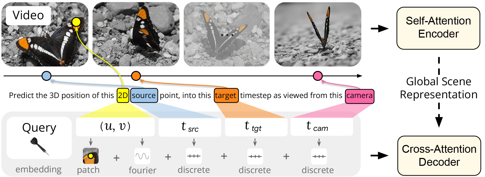
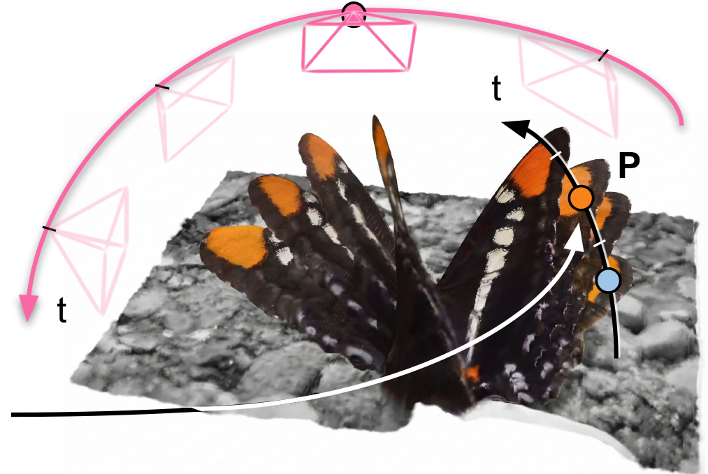

# D4RT



## 链接

- Project page: https://d4rt-paper.github.io/
- Paper PDF: https://storage.googleapis.com/d4rt_assets/D4RT_paper.pdf
- arXiv: https://arxiv.org/abs/2512.08924
- Google DeepMind blog: https://deepmind.google/blog/d4rt-teaching-ai-to-see-the-world-in-four-dimensions/
- 本地 PDF: `/Users/zhangyuxiang/Desktop/worksplace/PaperReading/D4RT/D4RT_paper.pdf`

## 基本信息

| 项 | 内容 |
|---|---|
| 论文标题 | Efficiently Reconstructing Dynamic Scenes One D4RT at a Time |
| arXiv | 2025-12-09 提交，2025-12-10 v2 |
| 作者 | Chuhan Zhang, Guillaume Le Moing, Skanda Koppula, Ignacio Rocco, Liliane Momeni, Junyu Xie, Shuyang Sun, Rahul Sukthankar, Joelle K. Barral, Raia Hadsell, Zoubin Ghahramani, Andrew Zisserman, Junlin Zhang, Mehdi S. M. Sajjadi |
| 机构 | Google DeepMind, University College London, University of Oxford |
| 代码/权重 | 本次检查的项目页只提供 PDF、arXiv 和 blog 链接，未看到官方代码、权重或可直接安装的推理仓库 |

## 一句话结论

D4RT 不是 mesh extraction，也不是物理仿真方法。它更像一个 **动态几何查询模型**：把单段视频编码成 global scene representation，然后用 query decoder 查询任意源帧点在任意目标时间和相机坐标下的 3D 位置。对 Video2Mesh 来说，它最有价值的接入点是动态场景的 camera/depth/tracks prior，而不是直接生成最终 GLB、collider 或 simulator asset bundle。

## 摘要要点

D4RT 针对的是动态场景 4D reconstruction and tracking。论文指出，MegaSaM 这类路线需要把单目深度、metric depth、motion segmentation 等模块组合起来，再通过 test-time optimization 强行对齐；VGGT 等 feed-forward 3D 重建模型也常使用多任务专用 decoder，并且对动态区域 correspondence 支持有限。D4RT 的设计目标是用一个统一模型同时处理 depth、spatio-temporal correspondence 和 full camera parameters。

核心创新是 query-based decoding。模型不是为每一帧密集解码完整几何，而是允许 decoder 独立查询某个 2D 点 `(u, v)` 在源时间 `t_src`、目标时间 `t_tgt`、相机坐标 `t_cam` 下的 3D 位置 `P`。如果只需要相机，可以查询较粗网格；如果要 all-pixels tracking，则对所有像素和时间组合发起查询。

## Pipeline



| 阶段 | 作用 | 输出 |
|---|---|---|
| Video input | 输入单段视频，包含静态背景、相机运动和动态物体 | frames over time |
| Self-attention encoder | 将整段视频编码成 global scene representation | latent scene representation |
| Query construction | 查询包含 2D 点 `(u, v)`、source timestep、target timestep、camera timestep，以及局部 frame patch embedding | spatio-temporal query |
| Cross-attention decoder | decoder 从全局表示中读取查询对应的 3D 位置 | 3D point `P` |
| Task-specific querying | 通过不同 query 组合恢复不同任务 | depth、camera、point map、3D tracks、all-pixels tracking |

## 几何生成路径

D4RT 的点云不是传统 COLMAP 那样先做特征匹配、三角化、bundle adjustment，再输出稀疏/稠密点云。它的路径是：

```text
video
  -> global scene representation
  -> query any (u, v, t_src, t_tgt, t_cam)
  -> predicted 3D position P
  -> repeated queries over pixels / time
  -> depth map, point cloud, camera parameters, 3D tracks
```

如果要把它用于 Video2Mesh，需要额外做转换：

- depth/point map 可以转成 per-frame point cloud，并按预测相机投到统一世界坐标。
- all-pixels tracking 可以形成动态 3D tracks，用于识别移动物体、动态遮挡和物体轨迹。
- 静态背景点可作为 COLMAP dense 或 GraphDECO 初始化的候选 prior，但仍要审计尺度、坐标轴和漂浮点。
- 动态物体不能直接融合成一个静态 mesh；更合理的是先分离 object ID，再做 canonical mesh 或 per-frame collider proxy。

## Mesh / Collider 接入方式

D4RT 不直接输出 triangle mesh。若要从它的输出得到 mesh，可以考虑三条后处理路线：

| 路线 | 做法 | 适用性 |
|---|---|---|
| 静态背景 mesh | 过滤低运动量 tracks，把背景点按相机坐标融合，做 TSDF / Poisson / Delaunay / Marching Cubes | 可作为 COLMAP 失败时的备选，但要处理 learned depth 的尺度和噪声 |
| 动态物体 canonical mesh | 根据 tracks 和 masks 聚合某个物体在多个时间的可见表面，估计 canonical shape | 适合可移动刚体或近似刚体，不适合复杂非刚体 |
| Per-frame collider proxy | 每个时间片生成局部凸包、primitive proxy 或简化 surface mesh | 适合做可视化和轨迹调试，不适合直接上物理引擎长期仿真 |

对 Video2Mesh 当前目标来说，D4RT 输出更适合作为 **动态 sidecar**：保存 `object_id`、`track_id`、`time_index`、`position_3d`、`confidence`、`visibility`、`camera_id` 等，而不是替换 `simulator_asset_bundle.json` 中的 mesh/collider 合同。

## 论文结果摘录

以下是论文/项目页公开 claim，本项目尚未复现：

| 结果 | 公开 claim | 解读 |
|---|---|---|
| Pose speed | A100 上 pose estimation 达到 200+ FPS，论文写为比 VGGT 快 9x、比 MegaSaM 快 100x，同时精度更高 | 说明 query decoder 对相机/pose 任务很轻，但硬件和实现未公开时不能直接换算到本地 Mac 或 RTX 3090 |
| 3D tracking throughput | 表 3 描述 D4RT 在单张 A100 上比其他 3D tracking 方法快 18-300x；在 60/24/10/1 FPS 目标下分别可维持 550 / 1,570 / 3,890 / 40,180 条 full-video tracks | 适合密集 tracks 和 all-pixels tracking 设想 |
| 4D reconstruction and tracking | 表 4 声称在动态视频 3D tracking 上优于此前 SOTA | 对移动物体、遮挡和动态 correspondence 有直接价值 |
| Video depth / point map | 表 5 声称 depth task 在 scale-only 和 scale-and-shift 对齐下达到 top-tier performance | 可作为 depth prior，但不是尺度绝对可信的工程资产 |
| Camera pose estimation | 表 6 对 Sintel、ScanNet、Re10K 等 static/dynamic 场景评估相机 pose | 可作为 COLMAP fallback 候选，但必须和本项目真实帧集做重投影/尺度审计 |

## 模型规模与训练配置

PDF 论文正文给出的训练配置如下，本项目未复现：

| 项 | 论文配置 |
|---|---|
| Encoder | ViT-g，40 layers，spatio-temporal patch size 为 `2 x 16 x 16` |
| Decoder | 8-layer cross-attention decoder，约 144M 参数 |
| 总体规模 | encoder 约 1B 参数，decoder 约 144M 参数 |
| 训练输入 | 48-frame clips，`256 x 256` resolution |
| 每步监督 | decoding 2048 random queries，并对特定区域 oversample |
| 数据混合 | BlendedMVS、Co3Dv2、Dynamic Replica、Kubric、MVS-Synth、PointOdyssey、ScanNet++、ScanNet、Tartanair、VirtualKitti、Waymo Open 以及内部数据 |
| 训练资源 | 64 TPU chips，local batch size 1，AdamW，500k steps，约 2 天 |

## 工程和部署判断

| 项 | 当前判断 |
|---|---|
| 代码可用性 | 本次检查未发现官方代码/权重；短期不能按 Video2Mesh pipeline 直接复现 |
| 硬件参考 | 论文 throughput 使用单张 A100 报告；训练使用 TPU 资源；实际部署到 RTX 3090/4090 需要等代码和权重后实测 |
| 输入成本 | 单段视频输入，比 COLMAP 更像端到端几何模型；但 all-pixels tracking 的 query 数量可能很大 |
| 输出成本 | 输出不是标准 COLMAP workspace，不会天然给 GraphDECO / Delaunay / Unity/MuJoCo 直接消费 |
| 集成难点 | scale、camera convention、time index、track confidence、dynamic/static segmentation、object ID 都需要显式 sidecar |

## 在 Video2Mesh 中的位置

短期不替代 P0 静态链路：

```text
P0: video -> COLMAP -> GraphDECO -> mesh/collider -> semantic/physics sidecar
```

更适合新增一个动态旁路：

```text
video
  -> D4RT-style depth/camera/tracks
  -> dynamic/static split
  -> per-object trajectory sidecar
  -> optional canonical mesh / per-frame collider proxy
  -> simulator timeline metadata
```

## 接入判断

- P0：不进入主链路，因为当前没有官方可运行代码/权重，也不直接输出 mesh/collider。
- P1：作为动态场景调研对象，设计 Video2Mesh 的 `dynamic_tracks_sidecar.json` 合同。
- P2：代码公开后，在 bedroom 类视频中抽取有移动物体的片段，比较 D4RT camera/depth/tracks 与 COLMAP/GraphDECO 的静态假设差异。
- P2：尝试把 all-pixels tracks 转成 object-level trajectory，并和 Grounded-SAM / SAM2 的 mask ID 融合。
- 风险：不要把 D4RT 的动态点云当成已经物理可用的 mesh；它需要额外的过滤、表面重建、物体分解和 runtime adapter。
