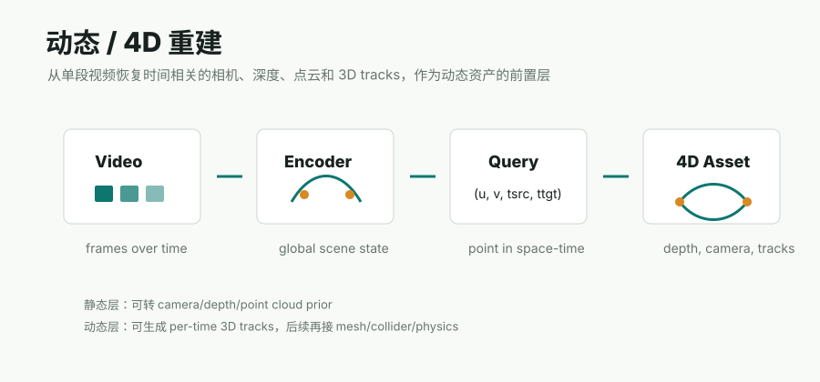

# 动态 / 4D 重建阶段

这一阶段关注的是 **video -> time-aware 3D geometry**：从单段视频中同时恢复相机、深度、点云、动态 correspondence 和 per-time 3D tracks。它和 Video2Mesh 当前 P0 的静态场景资产链路不同，但很适合作为后续动态物体、可变形对象和交互轨迹的前置研究层。



## 主要路线

| 路线 | 简介 | 输出 | 对 Video2Mesh 的意义 |
|---|---|---|---|
| [D4RT](d4rt.md) | Google DeepMind 等提出的 feed-forward dynamic 4D reconstruction and tracking 方法，用统一 transformer 和 query decoder 从视频恢复时空 3D 点 | depth、camera、point cloud、3D tracks、all-pixels tracking | 适合作为动态视频的 pose/depth/tracking prior，尤其适合处理移动物体和非刚体运动 |
| MegaSaM / test-time optimization | 组合单目深度、metric depth、motion segmentation 等模块，并通过优化约束几何一致性 | camera、depth、dynamic reconstruction | 精度强但工程复杂、耗时大，不适合先做 P0 快速资产闭环 |
| SpatialTracker / 3D tracking 系列 | 从视频中追踪点在 3D 中的运动 | sparse 或 dense 3D tracks | 可作为动态物体分割、物体运动估计和 per-object collider 更新的辅助 |
| Dynamic Gaussian / PhysSplat | 将动态表达放进 Gaussian / particle 表示中 | dynamic splats、particle states、rendered motion | 更接近视觉动态和仿真研究，不直接替代标准 collider / physics sidecar |

## 和静态 Video2Mesh 主链路的边界

```text
static Video2Mesh P0
  video frames
  -> COLMAP sparse/dense
  -> GraphDECO 3DGS visual layer
  -> scene mesh / collider
  -> semantic and physics sidecars

dynamic / 4D research layer
  video frames
  -> time-aware depth / camera / 3D tracks
  -> dynamic point cloud or per-object motion prior
  -> optional canonical mesh, per-frame collider, or simulator trajectory
```

当前不应该把 4D 重建直接当作最终 simulator asset bundle。它更像是给 Video2Mesh 增加一个动态几何证据源：哪些点在动、某个物体跨时间如何移动、相机如何在动态场景中估计、遮挡区域如何补齐。

## 当前建议

- P0：仍然使用 COLMAP + GraphDECO + mesh/collider 的静态资产链路。
- P1：如果输入视频中存在显著移动物体，尝试用 D4RT 这类方法产出 tracks/depth/camera prior，再服务物体分割和运动 sidecar。
- P2：把动态 tracks 转成 per-object trajectory、canonical object mesh 或 per-frame collider proxy。
- 风险：4D 输出不是标准 mesh，也不是物理引擎可直接消费的刚体状态；必须额外定义坐标系、尺度、时间采样和物体 ID 合同。
