# bedroom_4 语义 3DGS、SuperSplat 与双面 Mesh 修复

## 结论

`bedroom_4` 当前应该始终保持分层资产，而不是把所有用途塞进一个 PLY：

```text
GraphDECO / AnySplat scene 3DGS
  -> visual base layer
2D GroundingDINO + SAM2 masks
  -> SVLGaussian-style probability backprojection
binary semantic core PLY
  -> mesh semantic transfer / object split / sidecar
light semantic overlay PLY
  -> load together with the visual base in SuperSplat
COLMAP / AnySplat / SuGaR mesh
  -> collider or geometry proxy
double-sided display PLY
  -> human inspection only, never replaces collider topology
```

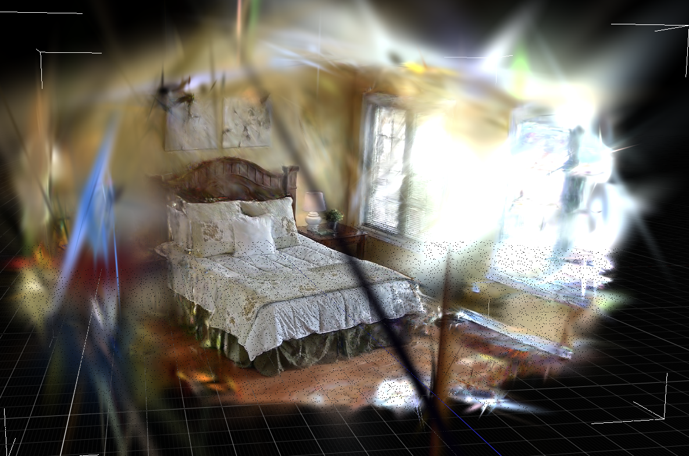

GraphDECO clean 3DGS 的视觉底图仍是当前 P0 visual layer：墙面和地板没有被 aggressive clean 删除。语义不应重新生成另一份几何，也不应把 dense semantic point cloud 或 3D mask 最近邻贴回它；正确做法是用 2D mask probability 投影到这个已经训练完成并 clean 的 Gaussian 序列上。

## 2026-07-13 审计状态

这次针对用户实际查看到的 PLY 和 mesh 做了回溯，而不是把“文件能生成”当作“语义正确”。下表区分已经有的历史产物与本次代码修复后的待复跑产物。

| 项目 | 历史证据 | 本次结论 / V4-V3 合同 |
|---|---|---|
| GraphDECO visual PLY | `point_cloud_clean_strict.ply`，954,394 Gaussian；墙面、地板在 visual view 中完整 | 继续保留为默认 visual base；2D probability 必须直接写到这同一份 clean Gaussian geometry |
| 旧 GraphDECO semantic viewer | `semantic_3dgs_graphdeco_2d_probability_supersplat.ply`，954,394 Gaussian，226MB | 它是完整场景的旧副本，不能作为默认 SuperSplat 输入；不把它改名为新结果或重新传回本地 |
| 旧 GraphDECO semantic manifest | `source_ply` 已指向 `point_cloud_clean_strict.ply`，但旧 manifest 没有 geometry SHA | V4 强制写 `source_contract` 和 `means/opacities/scales/quats` SHA；源路径和输出几何不一致时命令失败 |
| AnySplat V2 semantic | 使用了 19-frame crop 输入，但 adapter 把 `predicted_cameras.extrinsic` 原样标为 world-to-camera | **无效结果**：AnySplat 原始外参是 camera-to-world，未反转会把 2D mask 射线投到错误位置，墙面标签不能用来评价方法 |
| AnySplat V3 semantic | 2,079,470 Gaussian、151MB binary core；19-frame/448 crop 已真实重跑 | adapter 显式 inverse camera-to-world；6 帧 preview 不再将整面墙误染色，但左侧遮挡区/床边仍偏稀疏 |
| mesh 可见性 | COLMAP semantic mesh 质量相对最好；AnySplat Poisson 正反面显示差异明显 | 默认保留 collider/source 原始 topology，同时输出 `*_double_sided.ply` display companion；这只修 viewer culling，不把 mesh 自身孔洞伪装成已修好 |

因此，GraphDECO “投影到哪份点云”的问题不是 sparse/dense 点云混用了：旧 manifest 已经引用 clean 3DGS。真正缺少的是可验证的几何同源指纹，以及不会复制完整场景的 viewer asset 合同。本次 V4 同时补上两项，重新生成后以 SHA 作为交付验收条件。

## 发现的问题

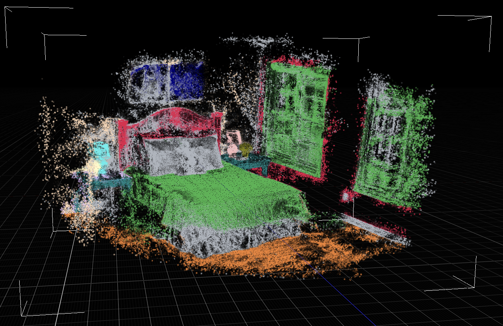

旧版有三类相互叠加的问题：

| 问题 | 根因 | 修复 |
|---|---|---|
| `semantic_splats.ply` 约 1GB，打开会卡死 | binary GraphDECO PLY 被 ASCII 重写并追加属性 | 改为 binary little-endian vertex rewrite，原有 Gaussian 属性原样复制 |
| semantic SuperSplat 文件异常大 | DC-only 预览仍被补了 45 个全零 `f_rest` | DC-only PLY 不再写全零 SH；大标签数组移到 compressed NPZ sidecar |
| semantic 3DGS 看起来不像 visual 3DGS | viewer preview、viewer-safe 变体和 full semantic core 容易混用 | manifest 明确区分 `semantic_splats_ply`、`semantic_supersplat_full_ply`、`semantic_supersplat_overlay_ply`；几何指纹强制一致 |

每次 `backproject-gaussian-probabilities` 都会对 `means/opacities/scales/quats` 计算 SHA-256。若 semantic core 的几何指纹与指定 scene 3DGS 不同，命令直接失败，不会交付一个标签正确但空间已经变形的文件。

### 推荐的 SuperSplat 打开方式

不要把 `semantic_splats.ply` 直接拖进 SuperSplat。它是 full-resolution pipeline core，含 semantic property，服务 mesh transfer。

1. 打开 `scene_3dgs...ply` 作为原始视觉底图。
2. 再打开 `semantic_*_overlay_supersplat.ply` 作为分类颜色 overlay。
3. 需要人工检查完整标签时读取 overlay 的 `*_labels.npz` / `*_labels.json`，不要用超大 JSON 数组当渲染输入。

这种方式保留原始 SH visual appearance，同时让语义层只承载标签色，不重复存整份场景。

### V4 内存保护规则

在卧室场景中，完整 semantic core 和完整 semantic SuperSplat 都会重复近百万 Gaussian，浏览器会把二进制 PLY 解包成更大的 CPU/GPU 缓冲，足以让 SuperSplat 卡死。现在默认不再导出完整 semantic SuperSplat 副本：只写 overlay，并限定为 `object_probability >= 0.55`、最多 180,000 个 Gaussian。选择过程先给每个 semantic id 保留最多 2,048 个候选配额，再按置信度划分剩余预算，因此墙和地板不会挤掉床、灯、植物。

`semantic_splats.ply` 仍是完整 binary pipeline core，保留给 mesh semantic transfer 和 object split；它不是 SuperSplat 的输入。需要完整 viewer 副本时必须显式加 `--full-semantic-supersplat`，以免误把高内存调试资产当作默认结果。

## GraphDECO 历史结果与 V4 重跑

远端 run：`/data/zyx/workspace/Video2MeshWorkspace/video2mesh_runs/bedroom_4_fresh_full_cpu_seq30_8gpu_dense_20260711_0600`。

| 产物 | 实测状态 | 用途 |
|---|---:|---|
| `point_cloud_clean_strict.ply` | 954,394 Gaussians | GraphDECO visual base |
| 旧 full semantic SuperSplat | 226MB / 954,394 Gaussian | 历史错误 viewer asset；不能再让 SuperSplat 默认加载 |
| V4 `semantic_splats.ply` | 954,394 Gaussian，234MB binary core；SHA `02084e...3334bfa` | full-resolution core，仅用于 mesh semantic transfer / audit；active scene source 与 output geometry SHA 完全一致 |
| V4 `*_semantic_overlay_supersplat.ply` | 180,000 Gaussian，12MB | 唯一推荐的语义 viewer asset；危险 scale/rotation/opacity 使用 viewer-safe display arrays，health=Safe |

### V4 真实输出与投影检查

真实运行目录：

```text
mil8:/data/zyx/workspace/Video2MeshWorkspace/video2mesh_runs/bedroom_4_fresh_full_cpu_seq30_8gpu_dense_20260711_0600
```

V4 `source_contract` 同时满足 `source_path_matches_active_scene_3dgs=true` 和 `source_geometry_matches_active_scene_3dgs=true`；semantic core 写出前后的 `means/opacities/scales/quats` SHA 都是 `02084ef6ec0f10f48abeab2ad5577a87df7d94ccff025866a8d0203723334bfa`。这直接证明本次语义标签写在用户查看的 clean GraphDECO visual PLY 上，而不是 sparse/dense baseline 或另一份重建几何上。

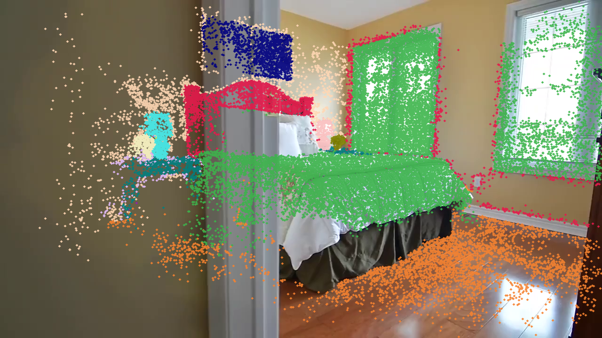

6 帧 GraphDECO preview 全部有效，foreground projected ratio 为 `0.9984`，visible ratio 为 `0.5565`。图像检查中床、地板、门/窗结构与原图位置一致；这证明坐标与 2D masks 的投影链路成立，不等价于类别 IoU 或物体实例精度已经足够高。

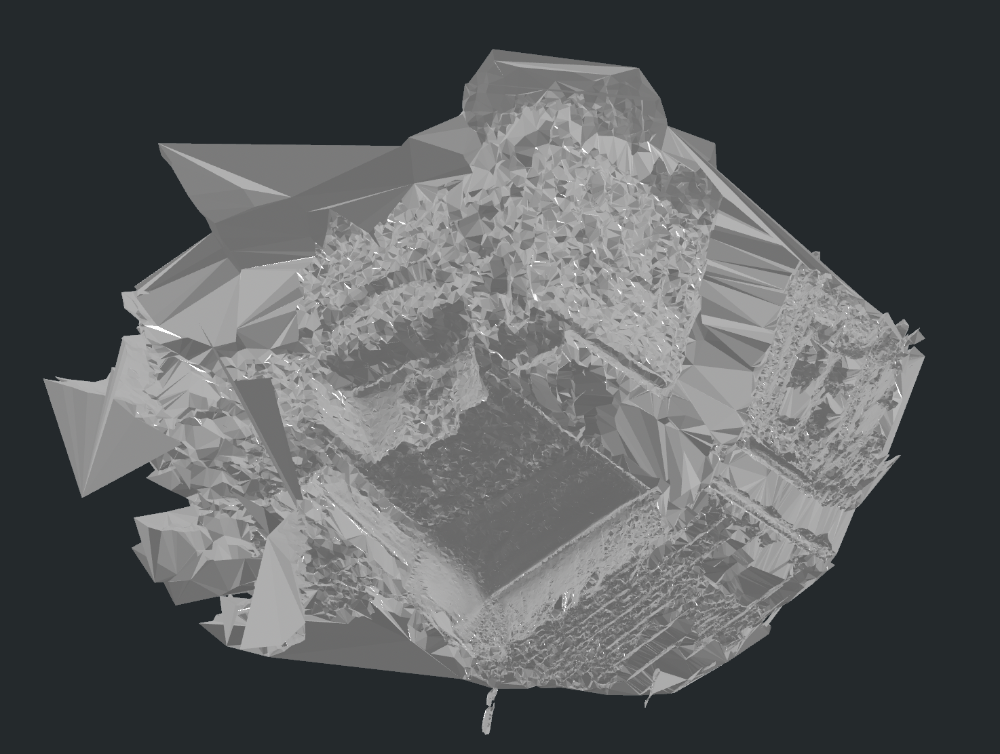

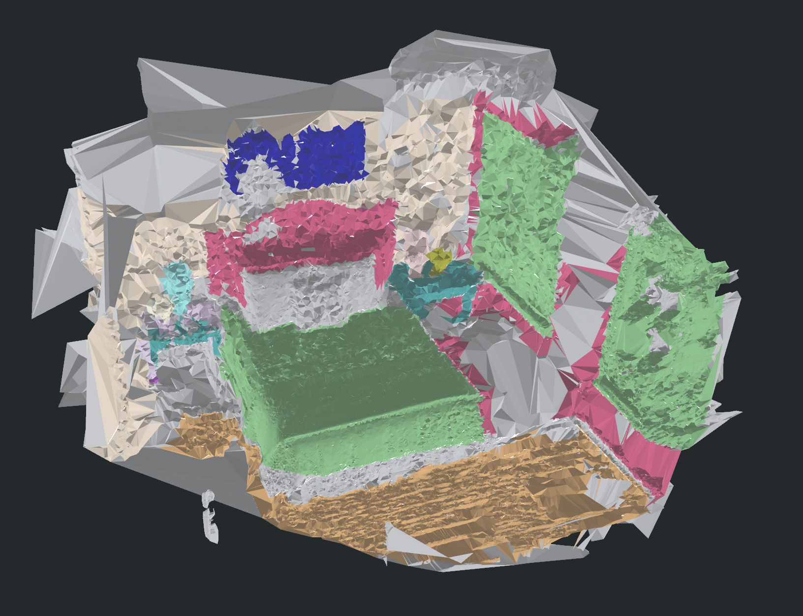

COLMAP Delaunay scene mesh 与 local multi-sample semantic mesh 是当前最可用的一组 geometry/semantic 代理，保留在 quick pipeline。新的 binary semantic reader 已接入 local mesh transfer，避免格式修复后断开 semantic mesh 路线。

## AnySplat 坐标合同修复

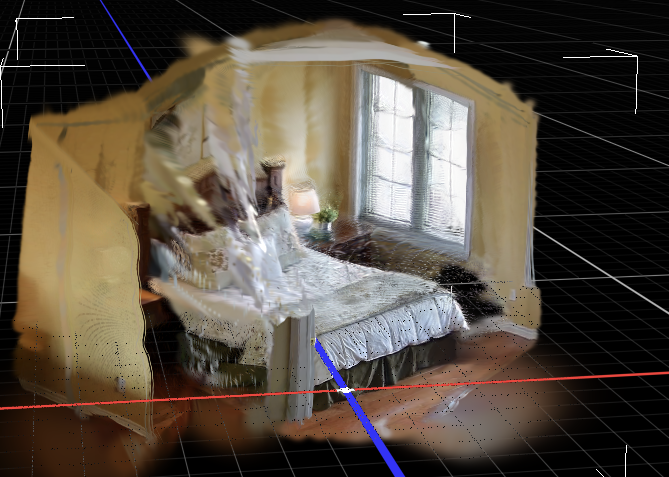

AnySplat 的 visual 结果整体完整干净，但新视角仍有空中丝状带。它是前馈 Gaussian/depth/pose 的一致性问题，后续可以研究 opacity/scale-aware trimming、multi-view reprojection consistency 和墙/地板平面保护；本轮没有把它伪装成已经解决。

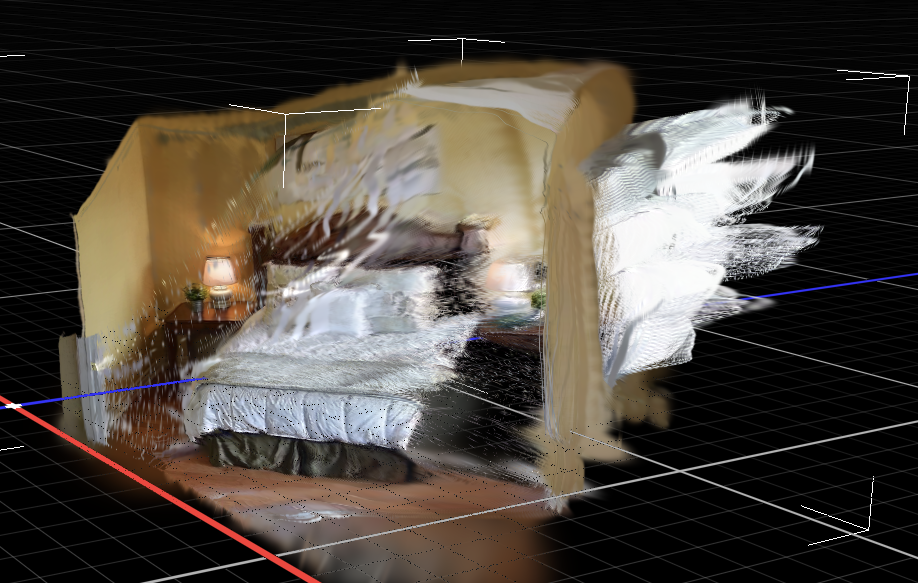

旧 AnySplat semantic run 的问题不只是“墙体遮挡算法不够强”。第一版把 AnySplat **19 张输入图、预测 camera、预测坐标尺度**，拿去配 Video2Mesh COLMAP 的 **80 帧 camera_info 和原始画幅 mask**。后续 V2 已改成 19-frame/448 crop 输入，但代码审计又发现一个更基础的错误：`predicted_cameras.extrinsic` 是 **camera-to-world**，adapter 曾直接把它写成 **world-to-camera**。这会把 mask 投到错误射线，表现为语义落在墙面。

V3 工具 `tools/prepare_anysplat_semantic_projection.py` 的正确合同是：

- 19/19 AnySplat input image 与 project frame 匹配；最大 thumbnail MSE 为 `0.00421`。
- 380 张 mask 按 AnySplat `process_image` 的 448x448 center crop 规则重采样。
- `predicted_cameras.npz` 先作为 AnySplat camera-to-world 读取，再逐帧 inverse 成 `camera_info_anysplat.json` 的 world-to-camera。
- V3 backprojection 只用该 19-frame camera/mask contract，并用 `--no-register-artifacts` 保持 GraphDECO 主 manifest 不被外部路线覆盖。
- V3 同样只交付 bounded semantic overlay 给 viewer；full semantic core 留给 AnySplat mesh semantic transfer，不向 SuperSplat 作为默认资产暴露。

V2 的 2,079,470 Gaussian、151MB binary core 和 11MB overlay 是历史中间数据，不再作为有效语义结果宣传。V3 已在 mil8 真正跑完：source/output geometry SHA 均为 `824d2b7951d9116ff74e62e0738f81097c8027c274febd3411fe82454340d134`，19/19 images 和 380 张 crop mask 匹配，`camera_info_anysplat.json` 明确记录 `camera_to_world -> inverse -> world_to_camera`。V3 overlay 仍严格限额到 180,000 Gaussian/12MB，完整 151MB binary core 不作为 SuperSplat 默认输入。


6 帧 AnySplat preview 全部有效，foreground projected ratio 为 `0.8689`、visible ratio 为 `0.4143`。和旧 V2 的“整面墙被语义覆盖”相比，V3 的标签主要落在左侧真实可见结构和床边附近，说明外参方向修复生效；但该 route 的正面床/右墙覆盖仍不完整，不能替代 GraphDECO semantic layer，也不应拿来作为 collider 语义真值。

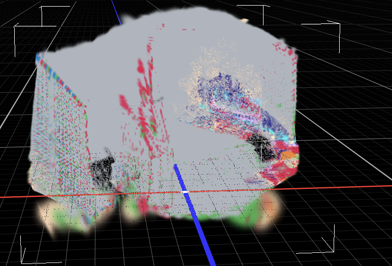

## Mesh 的 backface culling 修复

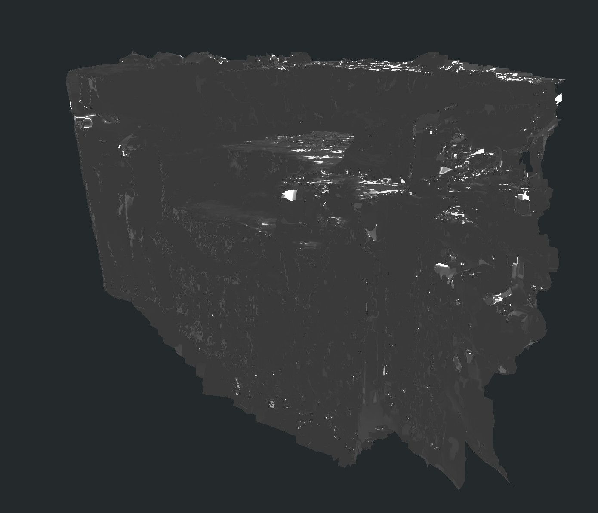

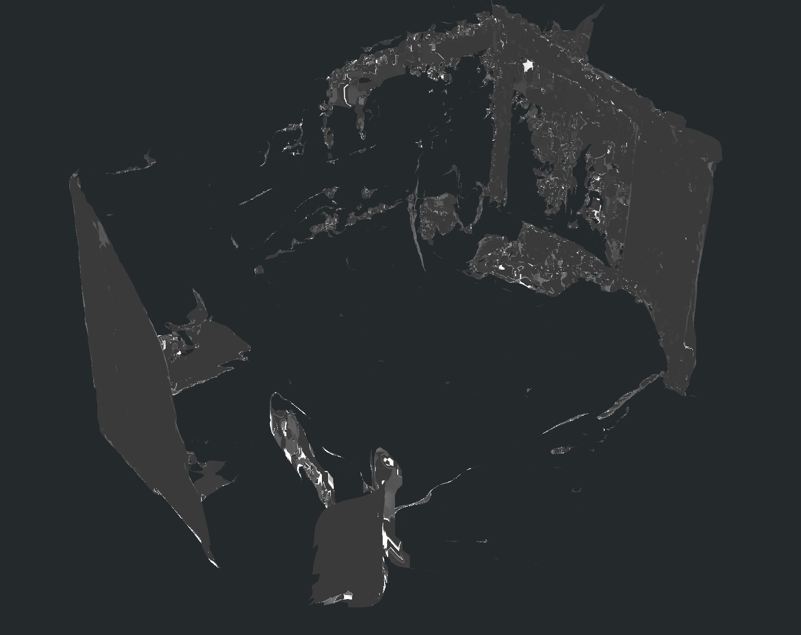

PLY 本身没有 `doubleSided` material 开关。为避免查看器默认 backface culling 导致“房间正反面质量不同”的误判，pipeline 现在：

- collider/source mesh 仍保留原始单面三角拓扑；
- 输出 `*_double_sided.ply` display companion，包含反向 winding；
- semantic debug PLY 和 object semantic PLY 默认写正反两套 face；
- GLB/exporter 应使用 `doubleSided: true`，不以单面 viewer 判断 mesh 是否存在。

AnySplat、SuGaR 这类独立路线重做 semantic mesh 时使用 `transfer-mesh-semantics-local --no-register-artifacts`。它仍输出双面 semantic debug PLY，但不会把主 GraphDECO run 的 `mesh_semantics_local` manifest 指针错误改成外部路线的结果。

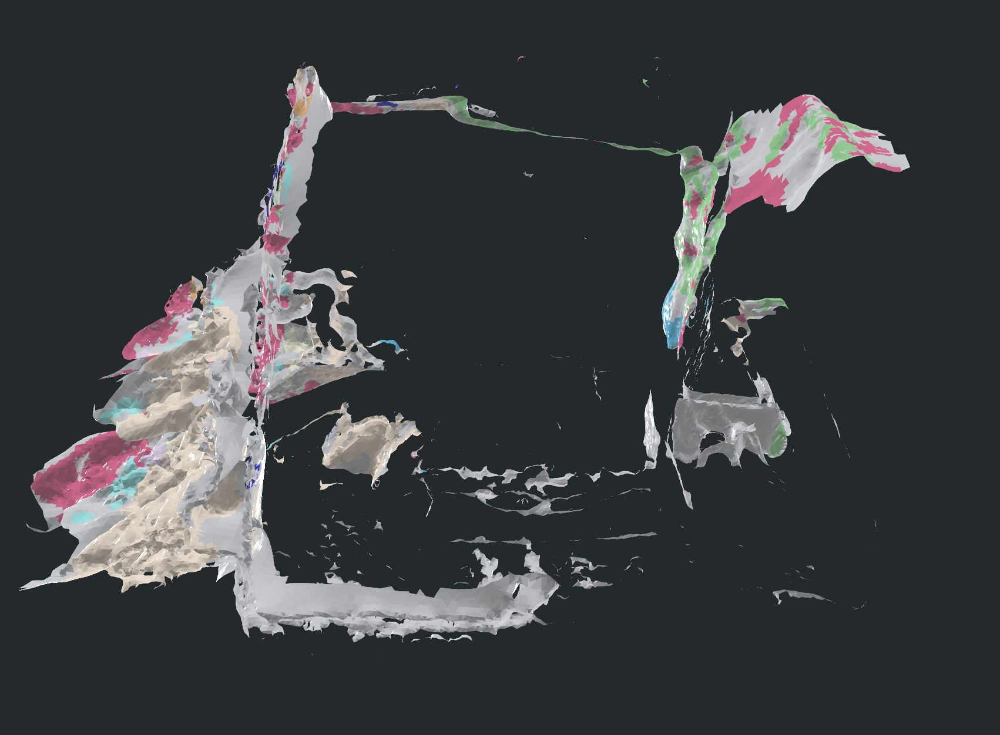

这不会把 double faces 当作新的 collider 真值，也不会解决 AnySplat mesh 自身的孔洞、条带或尺度不一致；它只解决查看器的面剔除误判。实测 GraphDECO/COLMAP mesh 从 `189,760` faces 输出 `379,520` display faces；AnySplat Poisson mesh 从 `297,172` faces 输出 `594,344` display faces。两者原始 collider/source PLY 都保留不变。

## SuGaR 边界

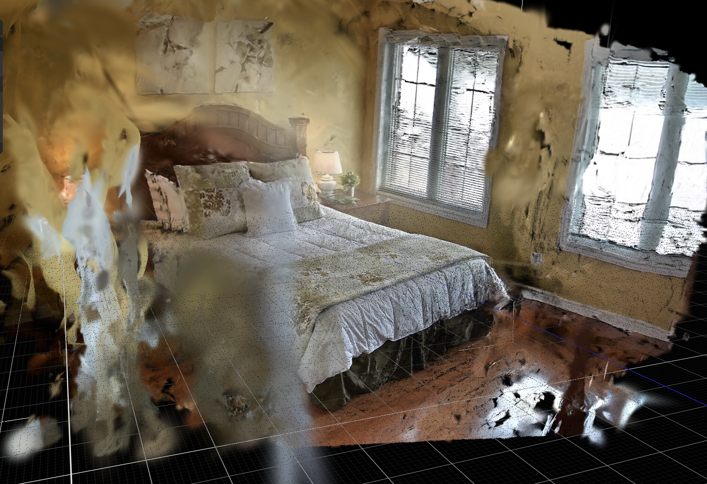

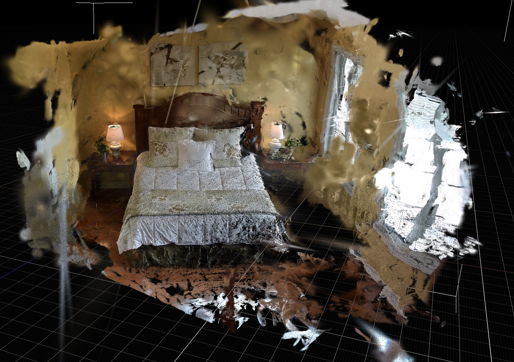

SuGaR 的背景在已观测视角里比 GraphDECO 更贴合墙、窗和地板，但换到新视角会暴露墙面未被约束到平面的碎裂。当前结论是保留它作为 visual mesh / surface-aligned Gaussian 对照，不把它升级为 P0 collider truth。SuGaR refined mesh 同样输出双面 display PLY；其 semantic full core 也将沿用 binary core + overlay contract，不再输出 ASCII 大文件供 viewer 直接打开。

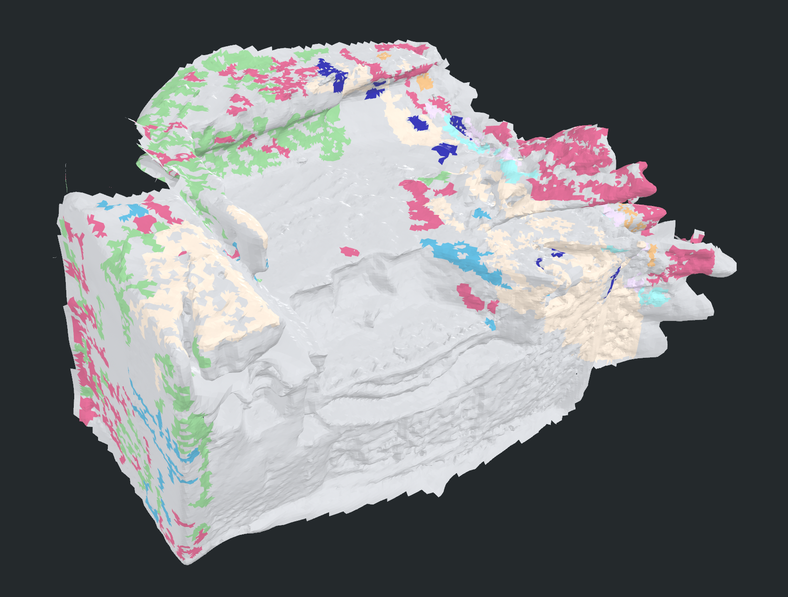

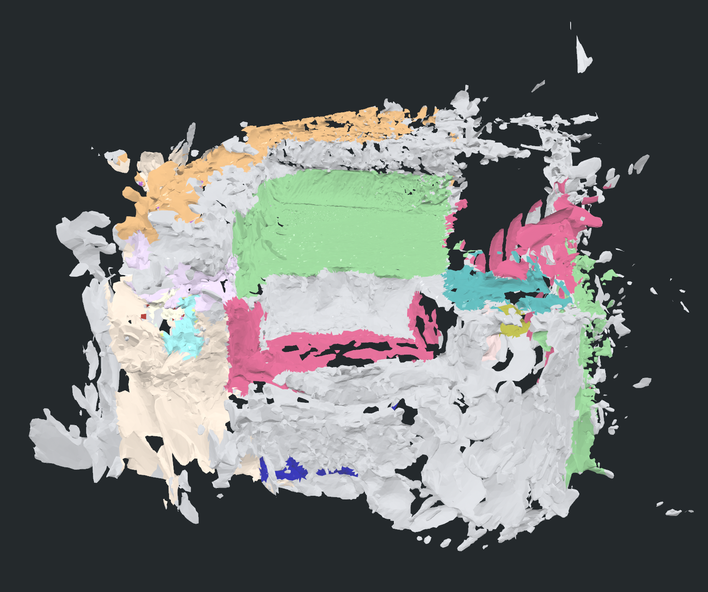

## 默认路线

`tools/run_video2mesh_quick.sh` 现在默认开启 `GAUSSIAN_BACKPROJECT=1`：

```text
clean GraphDECO 3DGS
  -> 2D mask probability backprojection (binary semantic core)
  -> local multi-sample semantic mesh transfer
  -> double-sided display mesh companion
```

默认仍关闭 adapter 和 OBJ object reconstruction。3DGS 负责视觉，COLMAP Delaunay / mesh 负责 collider，语义点云与 semantic mesh 是 sidecar/inspection 资产，不替代物理几何。

已完成 GraphDECO 30k 与 AnySplat inference 的 bedroom_4 run，用下面的脚本只重跑这次修复相关的语义和双面 mesh 输出：

```bash
bash tools/rerun_bedroom4_semantic_assets.sh \
  /data/zyx/workspace/Video2MeshWorkspace/video2mesh_runs/bedroom_4_fresh_full_cpu_seq30_8gpu_dense_20260711_0600 \
  /data/zyx/workspace/Video2MeshWorkspace/video2mesh_runs/bedroom_4_fresh_full_cpu_seq30_8gpu_dense_20260711_0600/extra_routes/anysplat_fresh_2fps_20260711_0600
```

脚本已真实生成 GraphDECO V4 primary semantic core / overlay / semantic mesh，及 AnySplat V3 isolated semantic core / overlay / semantic mesh；两条 raw mesh 都补有 `*_double_sided.ply` display companion。GraphDECO semantic mesh 为 94,021 vertices / 189,760 faces，其中 113,948 faces 获得语义；AnySplat semantic mesh 为 148,660 vertices / 297,172 faces，其中 46,039 faces 获得语义。AnySplat 的语义 mesh 因原始几何与可见性不足仍有较大 unknown 区域，当前仅保留作对照。

## 未解决项

1. AnySplat 新视角丝状条带仍需单独的 geometry-aware trimming/regularization 实验。
2. AnySplat 和 GraphDECO 的 absolute scale 仍不应混用；它们各自使用自己的 camera contract。
3. 语义的 object-level accuracy 还依赖 GroundingDINO prompt、SAM2 track 质量和多视角覆盖；本次修复保证投影坐标与几何不再错配，不把当前类别识别误差写成已经解决。
