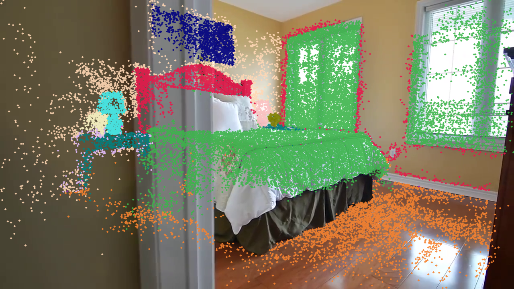
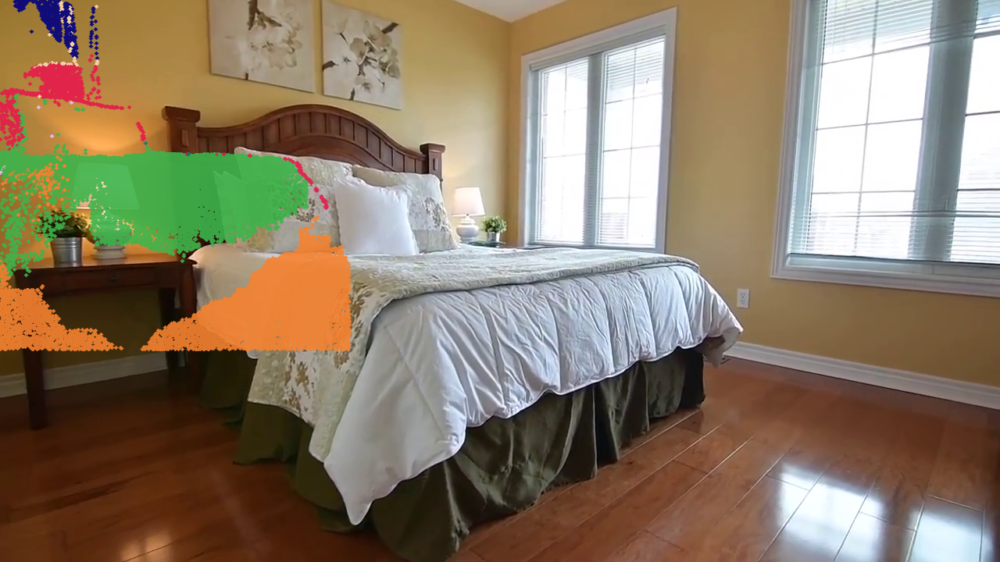

# bedroom_4：GraphDECO、AnySplat 与 SuGaR 视觉、语义和 Mesh 对照实验

## 结论

这不是同一输入、同一训练预算下的 benchmark，而是对 `bedroom_4` 已实际生成的资产做一次带版本审计的视觉复盘。三条路线的分工现在应当是：

| 路线 | 可以保留的资产 | 不能误用的资产 | 当前判断 |
|---|---|---|---|
| GraphDECO 30k | clean visual 3DGS、COLMAP Delaunay scene mesh、local multi-sample semantic mesh | 历史 full semantic SuperSplat PLY | **P0 visual layer + P0 scene collider/semantic mesh** |
| AnySplat | 19-frame visual Gaussian、双面 depth8 inspection mesh、V3/V5 2D probability overlay | V2 full semantic viewer、单面 raw mesh 作为质量结论 | 快速 visual/pose-depth prior，不进入 collider 真值 |
| SuGaR | refined Gaussian、refined OBJ visual benchmark、双面 inspection PLY | raw coarse mesh 当作已做背景剔除的 collider、1.6GB semantic ASCII PLY | P1/P2 surface-aware visual mesh 对照 |

默认资产合同保持分层：**GraphDECO 负责视觉，COLMAP dense Delaunay 负责碰撞，semantic mesh 负责语义查询，AnySplat 和 SuGaR 负责对照与后续升级。** 不能把语义颜色 PLY 当成视觉质量 PLY，也不能把 viewer 的 backface culling 现象当成 mesh 几何已经消失。

## 证据与文件版本

本页已收录本轮用户上传的图一至图十。每张图都被固定到仓库资产目录 `semantic-viewer-20260713/`，而不是只保留会话临时附件。图十一至图十六是同一批 `bedroom_4` 运行的 SuGaR 与回投 QA 补充证据。

| 资产 | 已核验的实测状态 | 打开/使用规则 |
|---|---:|---|
| GraphDECO clean visual PLY | 954,394 Gaussian，约 226MB | 可作为视觉底图打开 |
| GraphDECO V4 semantic core | 954,394 Gaussian，约 233MB binary | 给 mesh transfer 和程序读 `object_id/object_probability`，不要单独拖入 SuperSplat |
| GraphDECO semantic overlay | 180,000 Gaussian，约 12MB | 与 visual PLY 一起打开，作为颜色叠层 |
| AnySplat visual PLY | 2,079,470 Gaussian，约 135MB | 仅在 AnySplat 自己的坐标系中使用 |
| AnySplat V3 semantic core | 2,079,470 Gaussian，约 151MB binary | 不作为默认 SuperSplat 文件；V5 会以独立版本目录重新导出 |
| SuGaR refined visual PLY | 2,399,856 Gaussian，约 568MB | 太大，只用于离线 visual benchmark |
| SuGaR 历史 semantic core | 约 1.6GB ASCII | 已知不适合 viewer，不能当作默认交付 |

全量 semantic core 比 visual PLY 更容易卡死，不是因为它多了几条标签字段，而是 SuperSplat 会把近百万至两百万个 Gaussian 解包成多个 CPU/GPU 缓冲。正确的查看方式是：原始 visual 3DGS 作为底图，再加载受预算限制的语义 overlay。core 仍然保留，因为 scene mesh semantic transfer、object split 和质量审计需要它。

## GraphDECO：视觉可用，语义必须绑定到同一份 Gaussian 几何


图一是当前应当作为视觉底图的 GraphDECO clean 3DGS。它仍有右侧、窗边和未充分观测区域的 floaters，但墙面和地板没有被 aggressive clean 误删，照片感也是三条路线中最稳定的一条。


图二对应历史文件 `semantic_3dgs_graphdeco_2d_probability_supersplat.ply`。它的问题有两层：第一，整场景改用 semantic palette 后，照片颜色消失，看起来必然不像图一；第二，早期 2D mask/实例质量存在串色、重复类别和低置信度扩张，颜色本身也不应被当作“分类已经正确”。

这里需要区分一个容易混淆的事实：V4 的 manifest 对 `means/opacities/scales/quats` 做了 SHA-256 校验，source 和 semantic core 的 SHA 均为 `02084ef6...3334bfa`，因此 V4 标签确实写回了图一同一份 clean GraphDECO geometry，而不是 dense 点云或另一份训练结果。图二的失败是历史 full viewer 资产和语义质量问题，不是这份 SHA 能证明类别准确。V5 增加主资产 geometry guard：如果回投 source 与 `artifacts.scene_3dgs_ply` 不一致，主语义资产注册会直接失败。


图十五验证的是 2D mask 到 Gaussian 位置的投影合同。它不能替代人工类别审阅，因此当前的 semantic 结果仍应描述为“可用的 sidecar baseline”，而不是高精度实例分割。

### GraphDECO Mesh


图三和图四的质量目前优于其它 scene mesh 路线，保留在默认 pipeline。source collider 仍保留单面原始三角拓扑，额外导出 `mesh_double_sided.ply` 仅供查看，不能把 doubled faces 当作物理 mesh 的真实面数。

## AnySplat：正面干净，异视角条带和历史语义资产都要隔离


AnySplat 用 19 张 `448 x 448` 输入在约 4.16 秒前向得到 2,079,470 Gaussian。图五说明它可以很快得到完整、干净的房间视觉先验；图六同时说明它的 depth/pose/geometry 在新视角并没有收敛到可靠的表面。条带不是简单单点离群，不能直接做 Poisson collider，也不能用 KNN 清理后就当作稳健 mesh。

AnySplat 的绝对坐标尺度和 GraphDECO 不一致，二者不能在一个 scene transform 下混放。它的 semantic 2D 回投必须使用自己的 19 帧、中心裁切后的 mask 和自己的 predicted camera；不能拿 COLMAP 80 帧 camera/mask 混用。

### AnySplat depth8 Mesh 与 backface culling


图七和图八是同一份 raw mesh，不能把“反面消失”误判为算法仅重建了一面。PLY 不带 material 的 `doubleSided` 标志，因此当前做法是：保留原始 depth8 mesh 作为 geometry source，再导出 `anysplat_poisson_voxel01_depth8_mesh_double_sided.ply` 作为默认 inspection companion。remote 已有该 companion，早前同步到本地的 key-assets 漏传了它。V5 输出会把它和 semantic debug mesh 一起列入交付清单。

double-sided 只能解决查看器剔除问题，不填补 AnySplat 本身的洞，也不消除图六条带。collider 仍不能改用这份 mesh。

### AnySplat semantic：图九和图十是历史无效输出


图九和图十来自 V2 时代的 full viewer/debug mesh。该版本把 AnySplat 的 `camera-to-world` 外参、19-frame crop 和 Video2Mesh 原始 COLMAP camera/mask 合同混在一起，墙上大面积标签不是可用证据。V3 已改为 `inverse(camera_to_world) -> world_to_camera`，并且只用 19 张匹配图与 448 crop mask；下图是 V3 的投回原图 QA，能看到标签主要落在床、床头和地板的可见部分。


V3 证明相机方向修复生效，不证明 AnySplat 语义已经达标。2026-07-14 的 V5 已以全新版本目录重新导出 core、overlay、semantic mesh 和双面 mesh；旧的 `semantic_3dgs_anysplat_2d_probability_supersplat.ply` 不再同步为可打开资产。

## SuGaR：观测视角贴表面，新视角与 raw mesh 仍不够稳


SuGaR 的 surface alignment 在已观测视角确实带来更贴背景的效果，图十一的墙、窗和地板比 raw GraphDECO 更接近平面。图十二说明当前可见的平整并不代表全部 surface 已规范到平面：未充分观测区域仍会出现稀疏碎片、孔洞与外壳浮片。

### SuGaR Mesh 和背景处理


实测文件中 `scene_mesh_sugar_coarse.ply` 约 15MB，仍保留外部背景/外壳组件；`scene_mesh_sugar_refined.obj` 约 47MB，视觉上比 coarse 更干净，但这只能说明 refined export 走了不同的 visibility/surface 筛选，不能说明 raw mesh 已做 background removal。后续应把 refined 的可见性筛选拆成可复现的后处理，再叠加连通域与场景 ROI 清理；在此之前不把 SuGaR mesh 放进 P0 collider。

SuGaR 的 semantic core 历史上被 ASCII 重写到约 1.6GB，无法作为 viewer 资产。新版 binary core + bounded overlay 合同可以避免不必要的文本膨胀，但 240 万 Gaussian 本身仍很重，默认只保留离线 mesh transfer/audit，不能承诺 SuperSplat 可直接打开。

## V5 修复合同

本页对应的代码修复已经写入项目开发分支，并在 `mil8` 对同一个 `bedroom_4` run 完成 V5 重跑：

```text
active GraphDECO visual 3DGS
  -> 2D mask probability backprojection
  -> binary semantic core (保留原始 RGB 和 Gaussian 几何)
  -> bounded semantic overlay (语义色，仅 inspection)
  -> COLMAP mesh local multi-sample semantic transfer
  -> raw collider + double-sided inspection companion

AnySplat own Gaussian + own 19-frame camera/mask contract
  -> isolated semantic core + overlay + semantic mesh
  -> raw depth8 mesh + double-sided inspection companion
```

实现上的约束如下：

1. 主 GraphDECO semantic output 注册前必须与 `artifacts.scene_3dgs_ply` 的 Gaussian geometry SHA 相同，否则命令失败。
2. semantic core 不再被默认当作 SuperSplat 场景文件。推荐输入写入 manifest：`visual_base_ply + semantic_overlay_ply`。
3. AnySplat/SuGaR 是独立坐标系，使用 `--no-register-artifacts`，不会覆盖 GraphDECO 主 manifest。
4. 所有 scene mesh 路线保留 raw source，同时默认导出 `*_double_sided.ply` inspection companion；语义 debug PLY 也写双面 faces。
5. SuGaR raw mesh background removal 仍未完成。V5 不会把它伪装为已修复，而是保留为后续 P1/P2 工作项。

### V5 真实输出与 QA

| 路线 | V5 输出 | 量化审计 | 结论 |
|---|---|---|---|
| GraphDECO | `semantic_splats.ply` binary core，244,326,452 bytes；overlay 12,240,416 bytes | source 直接取 active `scene_3dgs_ply`，source/output geometry SHA 均为 `02084ef6...3334bfa`；954,394 Gaussian；6/6 QA 帧有效 | 几何与 visual 3DGS 同源已验证；标签质量仍是 2D mask/instance 问题，不以 full semantic viewer 评价视觉质量 |
| GraphDECO semantic mesh | `mesh_semantics_local_2d_probability_v5_20260714` | 94,021 vertices / 189,760 faces，151,008 faces 已分配语义；raw -> double-sided display 为 189,760 -> 379,520 faces | 继续保留在默认 pipeline |
| AnySplat | binary core 158,040,194 bytes；overlay 12,240,416 bytes | 2,079,470 Gaussian，19 predicted cameras，380 张 matched/cropped masks，6/6 QA 帧有效 | 坐标合同正确，但 foreground coverage 和类别完整度不足 |
| AnySplat semantic mesh | `mesh_semantics_local_2d_probability_v5_20260714` | 148,660 vertices / 297,172 faces，47,572 faces 已分配，249,600 faces unknown；raw -> double-sided display 为 297,172 -> 594,344 faces | 只作为对照，不能替代 GraphDECO/COLMAP semantic mesh |





GraphDECO V5 的 `mean_projected_foreground_ratio=0.9984`、`mean_visible_foreground_ratio=0.5565`；AnySplat V5 分别为 `0.8689` 和 `0.4143`。这些比率只表示投影/可见点的覆盖，不是类别 IoU。视觉检查仍应以图十七、图十八和全局 semantic mesh 一起进行。

## 当前接入判断

| 层 | 默认输入 | 默认输出 | 是否进入主 pipeline |
|---|---|---|---|
| visual | GraphDECO clean 30k PLY | 原始照片色 visual 3DGS | 是 |
| semantic 3DGS | GroundingDINO/SAM2 2D masks + GraphDECO active PLY | binary core + bounded overlay + manifest | 是，作为 sidecar |
| scene collider | COLMAP dense workspace | Delaunay raw mesh + double-sided inspection PLY | 是 |
| semantic mesh | semantic core + COLMAP mesh | local multi-sample semantic mesh | 是 |
| fast prior | AnySplat | visual Gaussian、V5 isolated semantic QA | 否，只保留对照 |
| surface-aware visual mesh | SuGaR | refined Gaussian/OBJ、双面 inspection PLY | 否，只保留对照 |

## 相关记录

- [语义 3DGS、SuperSplat 与双面 Mesh 合同](#/doc/video2mesh-experiments-semantic-3dgs-viewer-contract-20260713)
- [AnySplat 研究与 bedroom_4 实测](#/doc/video2mesh-visual-3dgs-anysplat)
- [SuGaR 研究与 bedroom_4 mesh 观察](#/doc/video2mesh-mesh-reconstruction-sugar)
- [COLMAP Delaunay 场景 collider 实验](#/doc/video2mesh-experiments-colmap-delaunay-experiment)
