# EmbodiedGen V2 调研

EmbodiedGen V2 是 Horizon Robotics / WuwenAI 在 2026-07 发布的 sim-ready 3D world engine。微信文章《地平线把 "VibeCoding" 搬进 3D 物理世界：说一句话，拍一张照片就能生成可训练机器人的 3D 场景，让机器人训练快 8 倍，仿真成功率飙到 79.8%》指向的核心项目就是这篇论文和官方项目页。

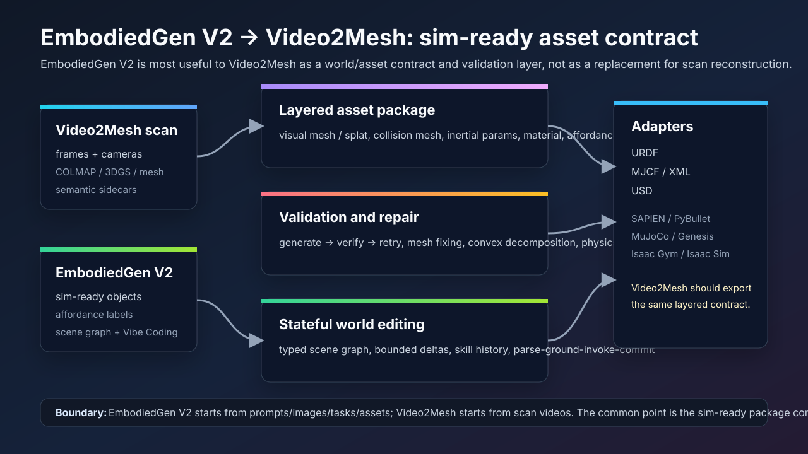

## 链接

- 微信入口: [微信文章](https://mp.weixin.qq.com/s/ss2zoYr2hVpJfGlwufiMwQ?scene=1)
- Project page: [EmbodiedGen V2](https://horizonrobotics.github.io/EmbodiedGen/)
- Code: [HorizonRobotics/EmbodiedGen](https://github.com/HorizonRobotics/EmbodiedGen)
- Paper: [arXiv 2607.07459](https://arxiv.org/abs/2607.07459)
- arXiv HTML: [2607.07459v1](https://arxiv.org/html/2607.07459v1)
- TRELLIS official code: [microsoft/TRELLIS](https://github.com/microsoft/TRELLIS)
- Hunyuan3D-2 official code: [Tencent-Hunyuan/Hunyuan3D-2](https://github.com/Tencent-Hunyuan/Hunyuan3D-2)
- RoboVerse real asset example: [Real-asset quick start](https://roboverse.wiki/metasim/get_started/quick_start/14_real_asset)
- RoboVerse embodied layout example: [EmbodiedGen layout quick start](https://roboverse.wiki/metasim/get_started/quick_start/16_embodiedgen_layout)

## 基本信息

| 项 | 内容 |
|---|---|
| 论文标题 | EmbodiedGen V2: An Agentic, Simulation-Ready 3D World Engine for Embodied AI |
| arXiv | 2607.07459v1, submitted on 2026-07-08 |
| 机构 | Horizon Robotics, WuwenAI |
| 作者 | Xinjie Wang, Liu Liu, Taojun Ding, Andrew Choi, Chaodong Huang, Mengao Zhao, Ziang Li, Jackson Jiang, Chunlei Yu, Shengxiang Liu, Wei Xu, Zhizhong Su |
| 项目目标 | 生成可执行、可编辑、可复用、可跨仿真器部署的 sim-ready 3D 环境 |
| 输入形态 | 自然语言任务、图片条件、3D asset seed、场景图、multi-room layout、对话式编辑指令 |
| 输出形态 | sim-ready object asset、affordance、task-driven world、multi-room scene、URDF/MJCF/USD 等仿真器包 |
| 对 Video2Mesh 的定位 | 可借鉴的 simulator asset contract、验证闭环和世界编辑接口；不是视频扫描到 3DGS/mesh 的替代链路 |

## 一句话结论

EmbodiedGen V2 不是传统意义的 video-to-mesh 或 3DGS 重建模型，而是一个 **从生成资产到可训练仿真世界的工程系统**。它最有价值的地方在于把“视觉看起来像”推进到“机器人策略能在物理仿真里训练和迁移”：资产必须有 visual mesh、collision mesh、惯性参数、材质、affordance、稳定抓取点、坐标和跨仿真器格式。

对 Video2Mesh 来说，它不应替换当前的 `视频帧 -> COLMAP -> GraphDECO 3DGS -> scene mesh/collider -> semantic sidecar -> simulator bundle` 主链路。更实际的接入方式是借鉴 EmbodiedGen V2 的 **sim-ready 资产合同、generate-verify-retry 质量门、URDF/MJCF/USD 导出和 Vibe Coding 状态编辑**，把我们已有的扫描资产包装成更像机器人训练数据的可执行世界。

## 摘要要点

论文把 sim-ready 定义为：一个环境可以直接被物理仿真消费，不需要人工补物理属性、修 collision、调整坐标、重写导出脚本或手动验证交互。EmbodiedGen V2 因此不是单一模型，而是一套分层 pipeline：

```text
prompt / image / task
  -> sim-ready object asset generation
  -> mesh fixing / convex decomposition / physical recovery
  -> affordance autolabeling and grasp validation
  -> scene graph and task-driven interactive world composition
  -> large-scale multi-room / whole-house scene generation
  -> stateful Vibe Coding edits
  -> URDF / MJCF / USD / simulator-specific packages
  -> policy training, evaluation, and sim-to-real deployment
```

论文报告的关键结果包括：

| 评估项 | 结果 |
|---|---:|
| sim-ready asset human acceptance | 96.5% |
| collision success | 98.6% |
| full asset pipeline runtime | 2.6 ± 0.4 min / asset |
| task-driven interactive worlds 可直接用于下游仿真 | 83.3% |
| fully online world generation runtime | 47.7 ± 5.4 min / world |
| online RL simulation success | 9.7% -> 79.8% |
| real robot task success | 21.7% -> 75.0% |
| OOD success, N=1 -> N=50 generated scenes | 53.2% -> 77.9% |
| ID-OOD gap | 41.1 -> 2.6 percentage points |
| cube stacking real-world success | 43.1% -> 88.9% across 144 trials |

微信文章里“机器人训练快 8 倍”更准确地说，对应论文消融中 **去掉 mesh fixing 后资产处理耗时从 2.6 ± 0.4 min 增加到 21.3 ± 22.8 min，约 8 倍**；这不是“所有训练时间直接缩短 8 倍”，而是 sim-ready asset pipeline 的一个工程效率结果。

## 方法拆解

### 1. Sim-ready 3D asset generation

EmbodiedGen V2 的第一层是把生成式 3D 输出修成仿真能用的 object asset。论文强调 simulation compatibility 不是最后随手 export 一下，而是在 candidate screening、3D generation、physical recovery 里反复执行质量约束。

| 子环节 | 作用 | 产物 |
|---|---|---|
| 条件生成 | 从 text / image / seed 生成初始 3D object | raw mesh / visual asset |
| mesh fixing | 修复洞、非流形、异常面、尺度和坐标问题 | cleaner visual mesh |
| convex decomposition | 为物理引擎准备 collision proxy | collision mesh / convex parts |
| physical recovery | 写入 mass、friction、inertia、material 等物理属性 | physics metadata |
| hierarchical quality checker | 检查感知质量、几何可用性、仿真接触稳定性 | accept / retry / reject |
| URDF canonical package | 把 visual/collision/inertial/metadata 放进统一中间表示 | URDF asset package |

论文在 200 个 held-out assets 上做消融，full pipeline 达到 96.5% human acceptance、98.6% collision success。Human Acceptance 关注输入一致性、几何合理性、不可见面补全和作为仿真资产的可用性；Collision Success 用 SAPIEN 中 Franka Panda top-down grasp-and-lift trials 评估，4 个 yaw angle trial 中能稳定抬起才算成功。

### 2. Affordance autolabeling

第二层是把物体从“可碰撞”推进到“可交互”。论文的 affordance pipeline 会做 part segmentation、part semantic annotation、grasp coverage 和 SAPIEN grasp validation。每个 retained grasp 都要经过仿真验证，如果物体相对 gripper 滑移超过 5 cm 或 30 degrees 就丢弃。

| 组件 | 输入 | 输出 | 角色 |
|---|---|---|---|
| part segmentation | object mesh / visual evidence | part masks / segments | 找出把手、门板、容器等可交互部件 |
| VLM semantic annotation | part candidates + prompt | part label / affordance | 给部件语义和功能 |
| VLM-guided merging | fragmented part labels | merged functional part | 减少过分割和重复部件 |
| grasp planner | object/part geometry | grasp candidates | 为机器人操作生成候选抓取点 |
| SAPIEN validation | grasp candidates + physics asset | stable grasps | 筛掉接触不稳定的候选 |

对 Video2Mesh 来说，这层可以对应 `semantic_object_meshes.json`、`semantic_object_glbs.json` 之后的 physics sidecar：除了 label/object_id，还要逐步补 `affordance`、`grasp_pose`、`joint_type`、`mass`、`friction`、`confidence` 和 `source`。

### 3. Task-driven interactive worlds

第三层把任务描述变成可以加载的交互场景。论文采用“背景 + 任务相关 interactive assets”的分解，类似电影绿幕：背景不一定每次重生成，关键是任务相关物体必须能被物理引擎接触、抓取和移动。

```text
natural-language task
  -> LLM parses task into Scene Graph
  -> background synthesis / retrieval
  -> required object asset generation or reuse
  -> BFS-based spatial placement
  -> SAPIEN gravity settling
  -> direct-load interactive world layout
```

论文的 150 个 interactive worlds 覆盖了 778 个 sim-ready object asset instances、128 个 object categories，平均每个世界 5.19 个 interactive assets。最终 83.3% 的世界被人工检查为可直接用于下游仿真，不需要手工修改。失败主要来自 object-scale mismatch、local geometry defects 和 imperfect initial spatial placement。

### 4. Large-scale multi-room scenes

EmbodiedGen V2 相比 V1 的另一个升级是 large-scale world generation。论文指出 V1 更像 panorama-back-projected single-mesh background，有限 camera translation 会限制导航和移动操作；V2 则生成 structured multi-room / whole-house scenes，显式保留 room topology、traversable openings 和 individually addressable furniture。

多房间场景不是把所有房间糊成一个单 mesh，而是分三步：

| 阶段 | 说明 |
|---|---|
| semantic planning | 生成房间类型、连接关系、家具类别、复杂度等级 |
| geometric solving | 根据房间拓扑、门洞、可通行区域和物体碰撞关系求布局 |
| simulator-agnostic canonicalization | 分解 instance、生成 collision proxy、坐标归一化、导出 URDF/USD |

复杂度等级包含 Minimalist、Simple、Medium、Detail，用来控制家具和 clutter 密度。这个设计对 Video2Mesh 有启发：房间扫描资产也应该按 room / floor / object / traversable opening 分层，而不是只输出一个整房间 GLB。

### 5. Vibe Coding for 3D world editing

论文使用 Vibe Coding 指代“通过自然语言对话迭代生成和编辑 sim-ready 3D 世界”，但它不是纯聊天式改场景。关键是 agent 只负责解析意图，真正的约束检查和执行由 deterministic, physics-aware skill backends 完成。

论文中的世界状态可以概括为：

```text
S_t = (G_t, A_t, P_t, H_t)

G_t: typed Scene Graph
A_t: sim-ready assets
P_t: asset 6-DoF poses
H_t: dialogue and skill-invocation history
```

每条编辑指令走 `Parse -> Ground -> Invoke -> Commit`。成功时只提交 bounded state delta，失败时返回结构化诊断，不污染当前世界状态。技能抽象分为四类：

| 抽象 | 责任 | 对 Video2Mesh 的可迁移设计 |
|---|---|---|
| Asset grounding | 把用户说的 object / room / asset 解析到 instance_key、room_id、asset_id | 文档/网页 viewer 中选中物体后写回 object_id 和 mesh/glb 路径 |
| World composition | 生成/放置/替换物体，维护空间关系 | 支持 `ON` / `BESIDE` / `IN` / free-floor placement |
| Stateful editing | 每次编辑是 bounded delta，可撤销、可审计 | simulator bundle 的 patch log 和 version history |
| Execution validation | 检查碰撞、支撑、稳定性、可导出性 | 生成后跑 collision preflight、raycast、ground probe、physics smoke |

这个部分和本地 Codex 工作流最接近：Video2Mesh 后续也可以把编辑器里的“把床头柜换成带抽屉的可交互模型”“给椅子加质量和摩擦”“把这个物体导出 MuJoCo”等操作做成可审计 skill，而不是让大模型直接改 JSON。

## 跨仿真器资产格式

EmbodiedGen V2 采用 URDF 作为统一中间表示，再转换到 XML/MJCF 和 USD。论文明确提到的部署目标包括 SAPIEN、PyBullet/Bullet、Isaac Gym、MuJoCo、Genesis、Isaac Sim。格式转换要处理：

| 资产层 | 需要保持的合同 |
|---|---|
| visual geometry | 给人看、给相机渲染，不一定适合作 collision |
| collision geometry | 简化、凸分解、稳定接触、可快速物理求解 |
| local transforms | visual/collision/inertial frame 对齐 |
| inertial parameters | mass、center of mass、inertia tensor |
| material mapping | friction、restitution、density 或引擎等价参数 |
| auxiliary metadata | affordance、grasp candidates、joint、semantic labels、source confidence |

这正好贴合 Video2Mesh 的长期目标：3DGS 或高质量 mesh 负责视觉，mesh collider / primitive proxy 负责碰撞，semantic/physics sidecar 负责 object-level 语义和物理，引擎 adapter 负责 Web / Unity / MuJoCo / Isaac。

## 与 Video2Mesh 的关系

### 官方 EmbodiedGen V2 与本地 Video2Mesh 的边界

| 维度 | EmbodiedGen V2 | Video2Mesh 当前路线 |
|---|---|---|
| 起点 | prompt、image、task、生成式 object asset、scene graph | 扫描视频帧、相机、COLMAP/GraphDECO 资产 |
| 核心目标 | 生成可执行、可编辑、可训练的 sim-ready world | 从真实视频生成分层可交互资产包 |
| 视觉层 | object mesh / background / generated world | 3DGS visual proxy、scene GLB、object GLB |
| 几何层 | mesh fixing、convex decomposition、physics settling | COLMAP dense/Delaunay、Poisson/Open3D、semantic mesh transfer |
| 语义层 | affordance、part label、grasp、task scene graph | mask fusion、semantic object mesh、sidecar |
| 导出层 | URDF、MJCF/XML、USD、多仿真器 | 目前以 GLB/JSON/Web demo 为主，MuJoCo/Isaac/Unity adapter 待加强 |
| 验证层 | human acceptance、collision success、world acceptance、policy validation | 文件 manifest、PLY/GLB 可读、mesh counts、viewer/raycast，需要补 physics preflight |

### 可接入的工程路线

短期最值得借鉴的是 asset contract，而不是重跑 EmbodiedGen V2。建议把 Video2Mesh 的 simulator bundle 逐步改成：

```text
scene_bundle/
  visual/
    scene.splat or scene_3dgs.ply
    scene.glb
    object_visuals/*.glb
  collision/
    scene_collider.glb
    object_colliders/*.glb
    convex_parts/*.glb
  semantics/
    semantic_object_meshes.json
    semantic_object_glbs.json
    face_semantics.json
  physics/
    materials.json
    rigid_bodies.json
    joints.json
    grasps.json
  adapters/
    scene.urdf
    scene.mjcf.xml
    scene.usd
  validation/
    collision_preflight.json
    raycast_ground_probe.json
    simulator_smoke_report.json
```

然后用 EmbodiedGen V2 的思路给每层加质量门：

| Video2Mesh 阶段 | EmbodiedGen V2 启发 | 推荐动作 |
|---|---|---|
| object split | object asset canonicalization | 给每个 object GLB 记录尺度、坐标原点、bbox、mesh stats |
| collider | convex decomposition / collision success | 为 object collider 跑简单抓取/推挤/落地 smoke test |
| semantic sidecar | affordance autolabeling | 从 label 扩展到 affordance、material、joint、grasp candidates |
| scene layout | scene graph + physics settling | 对物体位姿跑 support/contact 检查，过滤悬空/穿模 |
| export | URDF -> MJCF/USD | 新增 MuJoCo/Isaac adapter，而不是只停在 GLB |
| edit UI | Vibe Coding state deltas | 让自然语言编辑走 typed operation 和 validation log |

### 不建议的接入方式

- 不建议把 EmbodiedGen V2 当成 Video2Mesh 的 3D 重建替代品。它不负责从任意扫描视频恢复真实相机、3DGS 和整房间几何。
- 不建议只拿它的自然语言 demo 概念做 UI，而不做 deterministic backend 和 validation。没有质量门的 Vibe Coding 只是聊天式场景编辑，不能保证 sim-ready。
- 不建议把 visual mesh 直接拿来做 collision。论文的关键恰恰是 visual/collision/inertial/metadata 分层。
- 不建议把 79.8% / 75.0% 当成本地 Video2Mesh 指标。这是论文 protocol 下的 downstream policy validation，不是我们本地 bedroom_4 或 SimFoundry baseline 的结果。

## 环境与成本判断

官方仓库公开了项目入口，但完整复现不是轻量任务。论文 pipeline 涉及生成式 3D、mesh processing、VLM/LLM、SAPIEN physics validation、URDF/MJCF/USD conversion、task world generation 和 RL/policy validation。论文实验中的 asset / world generation 主要报告在单张 NVIDIA RTX 4090 上测得。

| 层 | 可能需求 |
|---|---|
| 3D generation | image/text-to-3D model weights，GPU 推理，mesh post-processing |
| mesh processing | mesh repair、convex decomposition、坐标/尺度规范化 |
| physics validation | SAPIEN / PyBullet / MuJoCo / Genesis / Isaac 之一或多个 |
| VLM/LLM | task-to-graph、part semantic annotation、quality checking、agentic editing |
| policy validation | RL/VLA 训练环境、机器人任务定义、sim-to-real protocol |
| 存储 | generated object assets、collision meshes、multi-world layouts、logs、validation reports |

本地 Mac 适合调研、写 adapter、检查小 GLB/JSON、构建网站；不适合完整复现实验。`mil8` 这类多 GPU 服务器可以跑单场景或小规模 smoke，但若要下载多个大模型和跑 policy training，需要先确认磁盘、CUDA、SAPIEN/MuJoCo/Isaac 环境和具体任务 protocol。

## mil8 bedroom_4 实测（2026-07-13）

这次实际跑的是 **EmbodiedGen V2 所接 TRELLIS image-to-3D 后端的 Gaussian-only smoke**，不是完整 `img3d-cli` 成功复现，更不是全屋重建或 sim-ready asset 的验证。目标是检验 `mil8` 能否从真实 Video2Mesh `bedroom_4` 帧中的一个 SAM3 实例 mask，生成结构正确、可读的 3D Gaussian PLY。

运行使用 `mil8` 的物理 GPU 1（RTX 3090 24GB）、Python 3.11、PyTorch 2.5.1 + CUDA 12.1、xFormers 和 spconv。模型权重与 DINOv2 都是机器上已有的本地缓存；远端当前无法直连 Docker Hub / GitHub / Hugging Face，因而没有下载新权重。TRELLIS 使用现有 PhysX-Anything checkout 的 backend 源码，但只读导入，不修改该工作区。

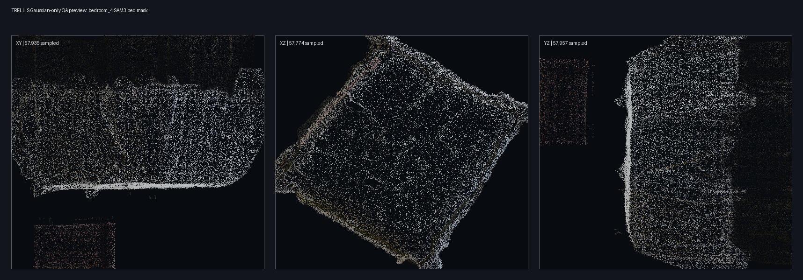

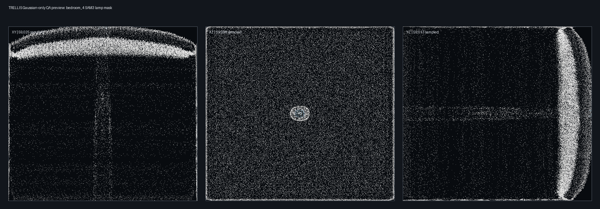

### 输入、产物与数值 QA

两个输入都来自真实 `bedroom_4` 的同一张 resized-undistorted frame `000000.png`，并复用已有 SAM3 mask，不把 mask 写成 EmbodiedGen 自己的分割结果：

| 实例 | 输入 mask bbox（1280 x 720） | TRELLIS Gaussian | 用时 / 峰值显存 | PLY SHA-256 | 结论 |
|---|---:|---:|---:|---|---|
| `bed` | `(592, 203, 1004, 624)`，SAM3 score `0.936` | `278,304` vertices，`18,925,088` bytes | `37.163 s` / `3.836 GB` | `dafc309bd434182ed2c565a45a48017184620d749c72b7d77d6b8d005a0cb411` | **Passed（Gaussian generation）**；床的主体轮廓可辨，但仍有底部/background residue |
| `lamp` | `(671, 257, 709, 320)`，SAM3 score `0.883` | `152,224` vertices，`10,351,648` bytes | `39.734 s` / `3.748 GB` | `4e07269586a439d67374e1d90ed05f6e53a76bf7568efd1ca0def928b55ea7f6` | **Passed（文件与数值合同）但质量不通过**；小 mask 输出为扁平条带，不能作为灯资产 |

两份 PLY 都具有 `x/y/z`、`f_dc_*`、`opacity`、`scale_*`、`rot_*` 的 GraphDECO/SuperSplat 风格 Gaussian 字段。二进制 QA 检查到所有 vertex position 和属性均为 finite，四元数范数的中位数均为 `1.0`；bed 的坐标 bbox 为约 `[-0.480, -0.258, -0.473] -> [0.499, 0.265, 0.474]`。页面中图片是按 `f_dc` 色彩和 opacity 绘制的三视图点投影，用于结构 QA，不是 photorealistic Gaussian renderer 的结果。

本地完整审计包（原始 PLY 不进 Git）在：

```text
tmp_remote_results/embodiedgen_v2_bedroom4_trellis_smoke_20260713/
  input/      # RGBA frame + SAM3 mask provenance
  output/     # two Gaussian PLYs + run manifests
  qa/         # PLY finite/scale/quaternion report + orthographic previews
  logs/       # deployment, loader fallback, and successful local-only run logs
```

远端原始目录为：`mil8:/root/autodl-tmp/embodiedgen_v2_bedroom4_trellis_smoke_20260713/`。本地与远端的两个 PLY 已分别按上表 SHA-256 校验一致。

### 官方 pipeline 对照

| 官方阶段 | 本次实际执行 | 状态 | 边界 |
|---|---|---|---|
| image segmentation / background removal | 复用 Video2Mesh / SAM3 的 `bed`、`lamp` alpha mask | Reused | 不是 EmbodiedGen 内置 rembg 或 part segmentation 的结果 |
| image-to-3D Gaussian generation | TRELLIS 25 + 25 sampling steps，seed `42` | Passed | 仅单帧、单实例、Gaussian 输出 |
| mesh / radiance-field decoding | 未运行 | Not tested | 现有 Kaolin binary 需要 `GLIBC_2.29`，而 `mil8` Debian 10 只有 `GLIBC_2.28`；本轮刻意不把 mesh path 标为成功 |
| quality checking / physical recovery | 未运行 | Not tested | 缺少配置好的 GPT/OpenAI-compatible provider |
| URDF、convex decomposition、mass/friction | 未运行 | Not tested | 没有 sim-ready canonical package |
| SAPIEN grasp、collision、drop/settle | 未运行 | Not tested | 没有 collision proxy 或 physics material |
| layout、Vibe Coding、RL | 未运行 | Not tested | 这不是 world-generation 或 policy experiment |

### 实测判断

- `mil8` 的 24GB RTX 3090 足以跑这条 TRELLIS 核心 Gaussian 路径，实际峰值不到 4GB；因此“单物体 image-to-3D smoke”是可行的。
- 生成质量强依赖实例 mask：大而清晰的 bed mask 能保住可辨主体；仅约 `38 x 63` 像素的 lamp mask 即使命令成功，也无法得到可用物体。这说明接入 Video2Mesh 时需要对 mask 面积、bbox 占比和视觉质量设门槛，而不能将每个实例自动送入生成器。
- bed 输出仍是单图生成先验，不应覆盖真实扫描几何，也不能直接作为 collider、navigation mesh 或 simulator rigid body。它最多可作为 object visual candidate / geometry repair seed，之后仍需 mesh、尺度、碰撞和物理验证闭环。
- 当前 `mil8` 的 `/data` 只有约 `20GB` 可用且默认 Docker pull 超时；完整官方 stack 还需要解决 Docker/HF 网络、Python/CUDA 版本、Kaolin/GLIBC、GPT provider 和 SAPIEN/MuJoCo 环境，不能写成“EmbodiedGen V2 已完整部署”。

### 全目标实例批量（2026-07-13）

在首轮 `bed` 成功后，继续把 `bedroom_4` 已有的 **12 个非结构 SAM3 3D 实例**全部送入同一条 TRELLIS Gaussian-only 路径：`bed`、两扇 `door`、两盏 `lamp`、两个 `nightstand`、三盆 `plant`、两扇 `window`。`wall`、`floor`、`ceiling` 三个结构类没有送进 object generator，因为它们已有真实扫描的场景层，生成式单物体先验会破坏房间尺度和连续性。

准备过程不是把同类 mask 直接混在一起：对每个 3D instance cloud，用 COLMAP `world_to_camera` 位姿投影到全部真实帧，再与对应真实 SAM3 类 mask 求交，按投影支撑、实例 bbox 和 alpha 面积选出独立 RGBA 输入。这样两盏灯和两个床头柜不会共享同一张 category crop。下图是最终选中的 12 个输入；`plant_03` 的输入只有 `43 x 43` 像素，已经在推理前标记为低细节风险。

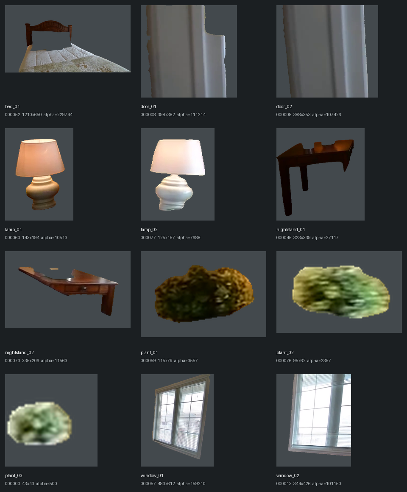

批处理使用空闲 GPU 4-7，每个 worker 只加载一次本地缓存的 Gaussian-only TRELLIS pipeline；模型加载阶段受远端高 CPU 负载影响较慢，但 25 + 25 sampling steps 的单件实际推理约 `8.60-11.35 s`，峰值显存约 `3.75-3.89 GB`。12/12 任务都生成了 PLY，随后字段、有限值和四元数检查也全部通过。

| 实例 | 最佳输入（frame / bbox） | Gaussian 数 / 用时 | 视觉判定 | 资产处理 |
|---|---|---:|---|---|
| `sam3_bed_01` | `000052` / `1210 x 650` | `274,784` / `11.35 s` | 批量输入只保留床的一部分，弱于首轮全床结果 | **沿用首轮 `bed` PLY** 作为首选 visual candidate；批量版本保留审计 |
| `sam3_door_01` | `000008` / `398 x 382` | `242,400` / `9.35 s` | 门板/边框轮廓可辨，但偏平且可能与另一实例重复 | Needs dedup + new view |
| `sam3_door_02` | `000008` / `388 x 353` | `157,024` / `9.01 s` | 门板候选可读，仍缺少厚度与关节信息 | Needs dedup + new view |
| `sam3_lamp_01` | `000060` / `143 x 194` | `82,720` / `10.70 s` | 灯罩、灯杆、底座均可辨 | **Visual candidate** |
| `sam3_lamp_02` | `000077` / `125 x 157` | `65,632` / `10.24 s` | 轮廓可辨，细节较 `lamp_01` 少 | Conditional visual candidate |
| `sam3_nightstand_01` | `000045` / `323 x 339` | `290,176` / `9.83 s` | mask/crop 混入背景，输出不像稳定的床头柜 | Re-select view / mask |
| `sam3_nightstand_02` | `000073` / `335 x 206` | `67,072` / `8.60 s` | 同样受部分可见和背景影响 | Re-select view / mask |
| `sam3_plant_01` | `000059` / `115 x 79` | `27,520` / `10.33 s` | 小而模糊，未形成可靠植株结构 | Reject for asset use |
| `sam3_plant_02` | `000076` / `95 x 62` | `133,120` / `8.83 s` | 低细节输入导致片状/不稳定结构 | Reject for asset use |
| `sam3_plant_03` | `000000` / `43 x 43` | `255,776` / `9.44 s` | 明显超出输入证据的先验 hallucination | Reject for asset use |
| `sam3_window_01` | `000057` / `483 x 612` | `208,576` / `10.87 s` | 窗框、百叶/玻璃平面可读 | Static visual candidate |
| `sam3_window_02` | `000013` / `344 x 426` | `355,776` / `10.98 s` | 平面窗框候选可读 | Static visual candidate |

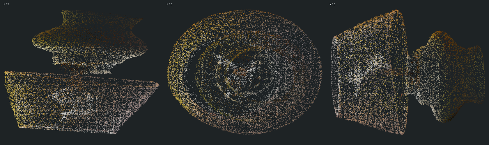

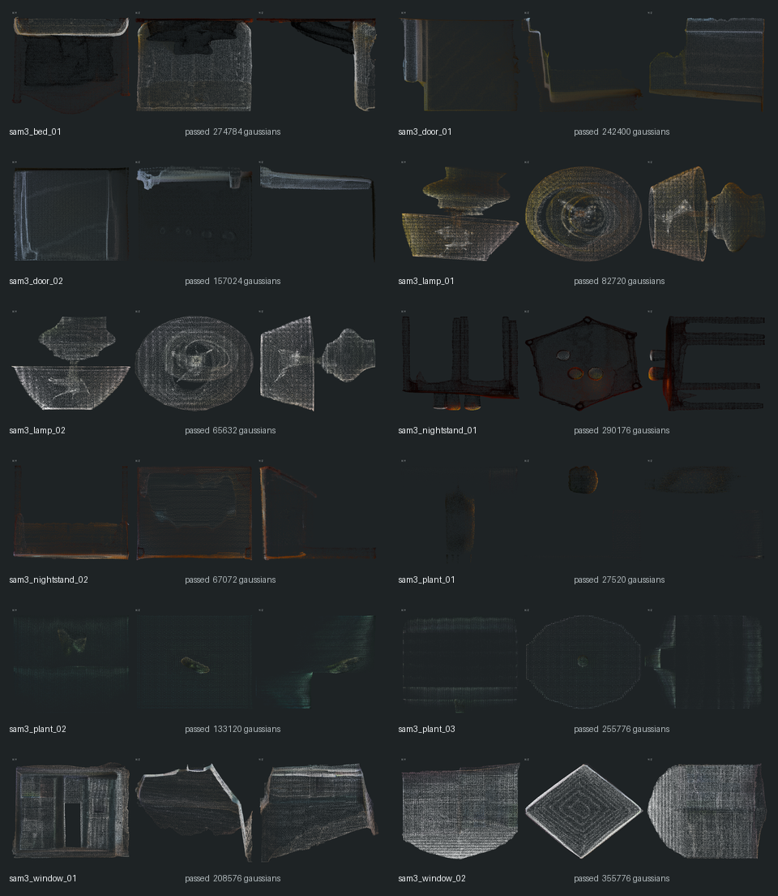

全量本地审计包（约 `158 MB`，原始 PLY 不进 Git）为：

```text
tmp_remote_results/embodiedgen_v2_bedroom4_all_targets_trellis_20260713/
  input/    # 12 个 instance-level RGBA、源帧/mask/bbox/低细节标记
  output/   # 12 个 binary Gaussian PLY + 5 个 GPU worker manifest
  qa/       # 12 个字段/finite/quaternion JSON + 单件三视图 + 总览
  logs/     # batch worker stdout/stderr
```

远端对应目录为：`mil8:/root/autodl-tmp/embodiedgen_v2_bedroom4_all_targets_trellis_20260713/`。本地与远端的 **12/12 PLY SHA-256 全部一致**；每份均含 `x/y/z`、`f_dc_*`、`opacity`、`scale_*`、`rot_*`，全部属性 finite，四元数范数中位数约为 `1.0`。这验证的是全目标的单图 Gaussian 生成和文件合同，不验证真实尺度回对、mesh/collider、URDF、物理属性、碰撞或仿真可用性。

这批结果给 Video2Mesh 的直接工程结论是：对大且清晰的 instance crop，TRELLIS 可以提供 object visual completion candidate；对小物体、遮挡物体或 instance mask 不干净的类别，必须在送入生成器前执行最小像素尺寸、alpha 面积、单实例纯度和多视角一致性门槛。生成器输出不能自动替换扫描层，更不能自动标为 sim-ready asset。

### 人工可用性复核（2026-07-14）

在 2026-07-14 重新从 `bedroom_4` 上游实例数据准备 RGBA 输入并批量跑 TRELLIS Gaussian-only 后，用户对其中几件 viewer 建模结果做了人工复核，结论是：**床、两盏台灯、桌/床头柜台面候选和窗户组这几类视觉建模可以保留为可用候选**。这里的“可以”只表示视觉层 model candidate 通过人工观察，可作为后续 object visual completion / geometry repair seed；它仍然不是 mesh、collider、URDF、尺度回对或物理仿真验收。

本轮 rerun 产物位置：

```text
mil8:/root/autodl-tmp/embodiedgen_v2_bedroom4_rerun_20260714_183519/
tmp_remote_results/embodiedgen_v2_bedroom4_rerun_20260714_183519/
```

数值门禁为 `12/12` Gaussian PLY 生成完成、`12/12` PLY QA passed、`0` failed；本地同步的 `output/*.ply` 已按 `logs/output_ply_sha256.txt` 全部校验通过。人工复核通过的截图如下。

| 人工复核对象 | 对应生成结果 | 复核结论 | 后续边界 |
|---|---:|---|---|
| Bed visual candidate | `sam3_bed_01`，`274,784` Gaussians，`11.580 s` / `3.833 GB` | 床头、床垫、枕头和被面整体结构可读，视觉建模可保留 | 仍需去除局部黑色 speckles；不能直接当 collider |
| Lamp visual candidate A | `sam3_lamp_01`，`69,952` Gaussians，`8.609 s` / `3.747 GB` | 灯罩、灯杆和底座均可辨，适合作台灯 visual candidate | 需后续尺度、支撑面和材质 sidecar |
| Lamp visual candidate B | `sam3_lamp_02`，`59,104` Gaussians，`8.896 s` / `3.747 GB` | 另一盏台灯轮廓可读，质量可接受 | 细节略弱于 A，仍需与场景实例对齐 |
| Table / nightstand surface candidate | `nightstand/tabletop` 人工候选 | 台面和上方小物体形态可读，可作为 bedside surface visual candidate | 类别与真实 instance 需要回查；暂不写成稳定床头柜语义 |
| Window visual candidate | `sam3_window_*` / pane refinement 系列 | 窗框、百叶/玻璃分格可读，窗户组建模可保留 | 仍需拆分单窗扇、回填真实尺度和玻璃/铰链属性 |

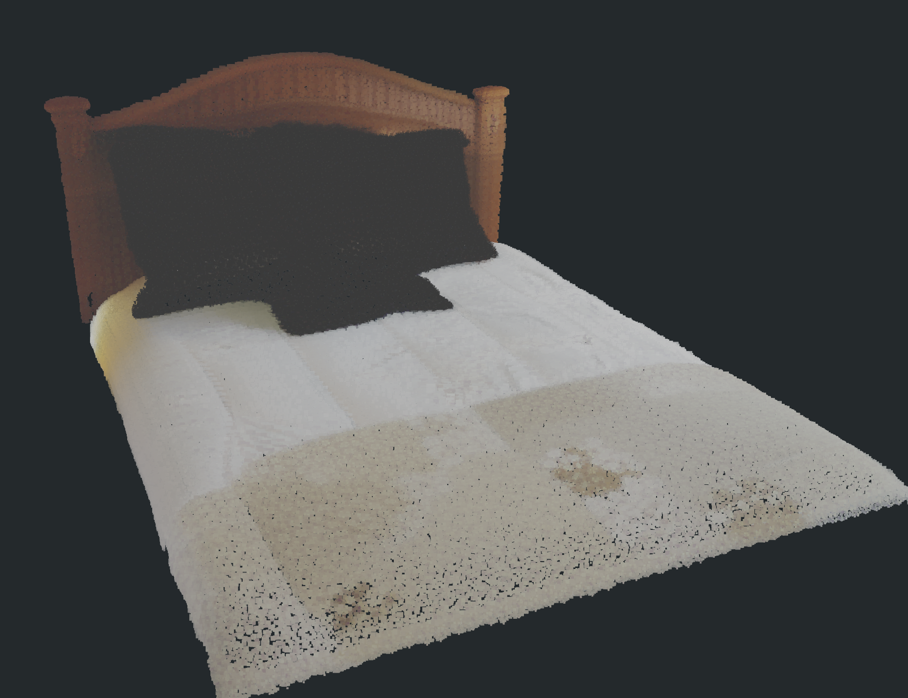

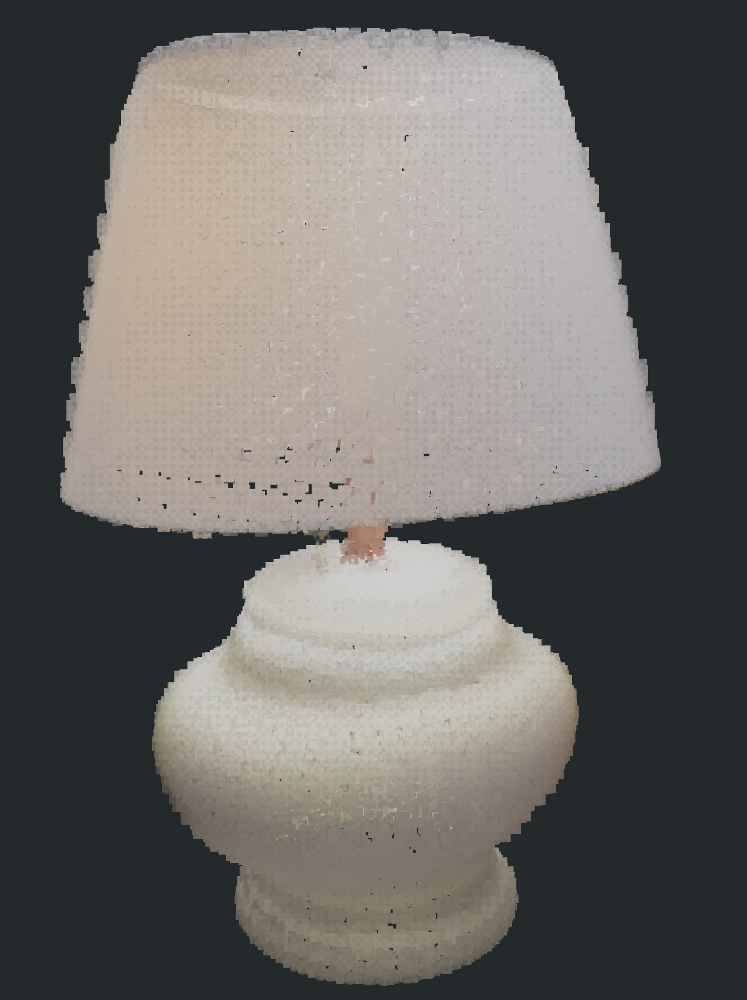

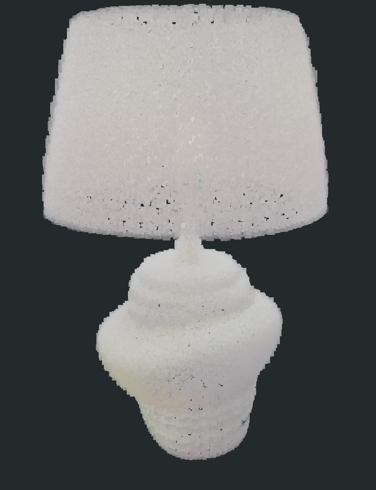

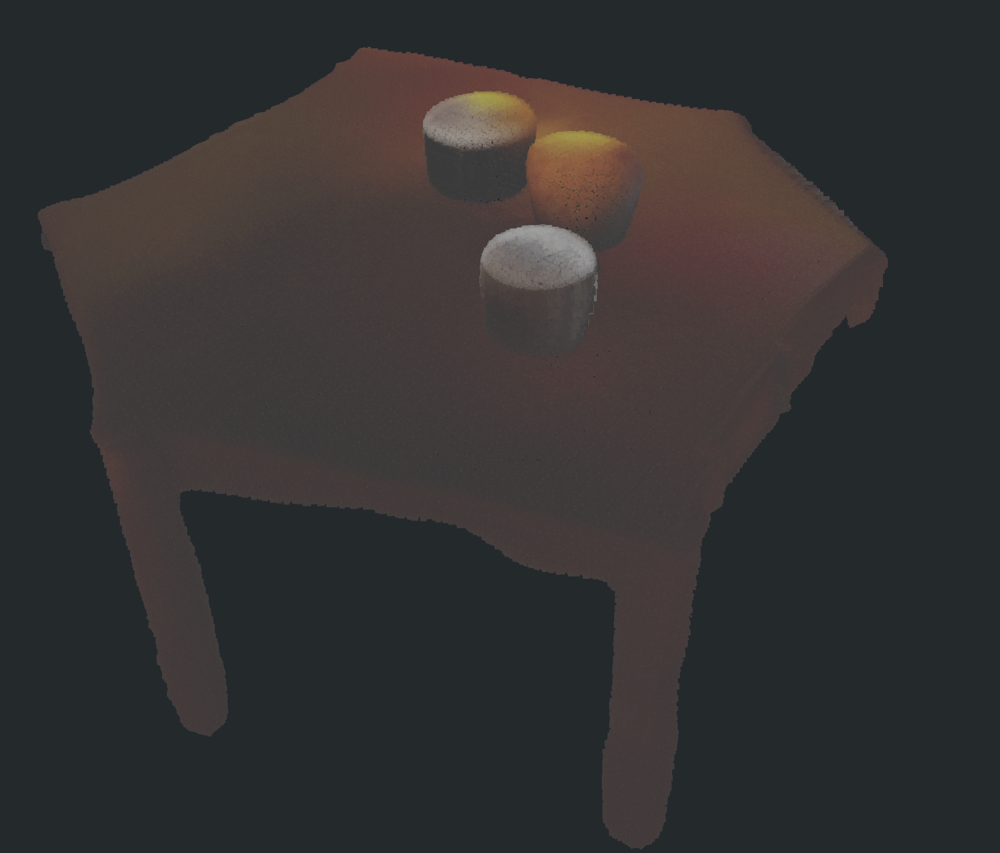

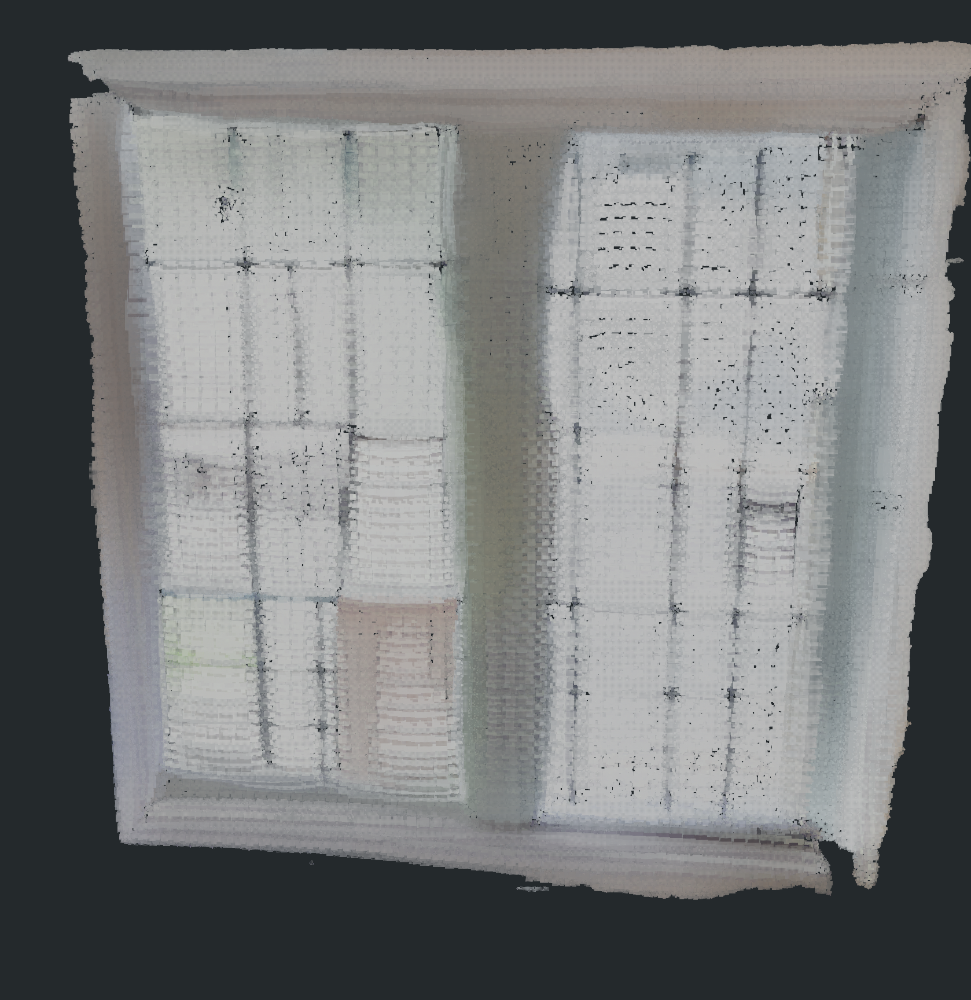

### 窗扇实例修复（2026-07-14）

上一轮 `sam3_window_01` 的 `483 x 612` RGBA 实际包含一整组双联窗，因此 TRELLIS 合理地把两个窗扇补成一个连体资产。问题不在采样 seed，而在上游把 `window` 作为**类别 mask**合并：对应 3D cloud 也已经跨过中间立柱，单靠 3D 连通域或扩大文字描述都无法可靠断开两件物体。

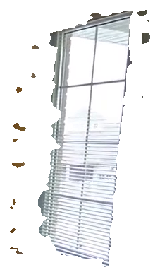
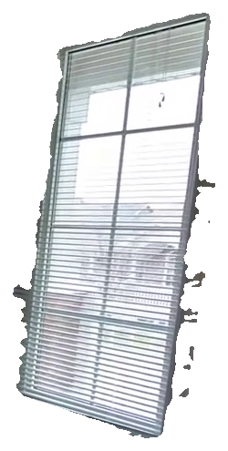

修复链路明确拆开了三个职责：

```text
SAM3 semantic text "window" + positive geometric box
  -> per-pane mask candidates
  -> prompt-box constraint + shared-mullion overlap removal
  -> one RGBA crop and one instance contract per pane
  -> TRELLIS image-only Gaussian generation
  -> PLY field / finite / quaternion QA
```

每个物体合同都要求描述可见材质、框体、玻璃、百叶、朝向、遮挡和边界，同时明确禁止合并 `adjacent window pane`、共享框之外的结构、墙、床、床头柜和植物。TRELLIS `run_old` 接口本身只接收 RGBA，不能把文字直接作为生成条件；首轮修复因此先把文字语义落成 SAM3 的实例级几何约束。后续若要让更详细的描述真正影响 TRELLIS，必须先用支持文本条件的图像编辑器把描述物化为新的 RGBA，再把该图送进 TRELLIS，而不是假装 `run_old` 已经吃到了 prompt。

本机缓存的 PhysX-Anything Qwen2.5-VL 权重也做了真实探测：它是专用 voxel decoder fine-tune，面对通用 JSON 审核提示会输出体素编号序列，而不是实例描述。代码因此将此输出识别为 `unsupported_voxel_sequence` 并 fail-closed，绝不把它误报为 VLM 已完成窗扇识别。后续接入通用 instruction-following VLM 时，可直接复用相同的 JSON instance contract；当前可复现实验则依赖 SAM3 文本加正向框。

| 新实例 | 独立 RGBA | Gaussian 数 / 用时 | PLY QA | SHA-256 前缀 |
|---|---:|---:|---|---|
| `sam3_window_01_left_pane` | `227 x 392`，alpha `33,653` | `538,656` / `14.75 s` | Passed，全部必需字段 finite，四元数中位数 `1.0` | `3332d894a3d3` |
| `sam3_window_01_right_pane` | `250 x 495`，alpha `71,358` | `213,856` / `9.36 s` | Passed，全部必需字段 finite，四元数中位数 `1.0` | `6f7d6dae2bf5` |

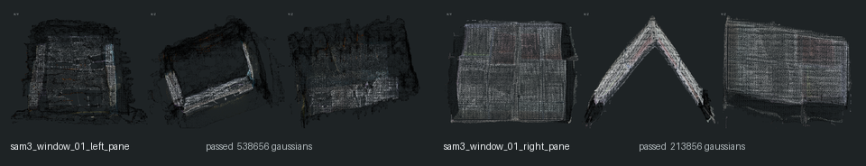

两份原始 PLY 仅保存在本地实验目录：

```text
tmp_remote_results/embodiedgen_v2_bedroom4_instance_refinement_20260714/
  prompted_panes/input/   # 两张互斥 alpha、详细实例合同
  prompted_panes/output/  # 两份 Gaussian PLY，不进 Git、不上传网站
  prompted_panes/qa/      # PLY QA JSON 和预览图
  sam3_probes/            # text / text+box instance-mask probe 证据
```

这证明“每扇窗独立生成”已经完成，但仍只是一对 visual completion candidates：没有回填真实世界坐标、mesh、collider、玻璃物理、铰链、URDF 或仿真验证。

### Prompt 编辑参考图重跑（2026-07-14）

拆开左右窗扇后，首轮 PLY 虽然通过字段、finite 和四元数检查，侧视图却仍像一段房间壳体。原因是文件合同只能证明“Gaussian 文件可读”，不能证明“窗户应当是薄平面”。本轮把详细描述放到 TRELLIS 前面的图像编辑阶段，并新增形状硬门禁：

```text
bedroom_4 single-pane RGBA
  -> prompt-guided image edit (exactly one sash, front orthographic, about 4 cm frame depth)
  -> chroma-key removal to clean RGBA
  -> require_prompted_references=true
  -> TRELLIS image-only Gaussian generation
  -> file QA + robust PCA planar-thickness gate
```

图像编辑使用本地已配置的 OpenAI-compatible 接口和 `gpt-image-2`。左右 prompt 分别要求：只保留一扇 detached left/right sash；保持高宽比、白色 PVC 外框和横竖框布局；限制为约 `4 cm` 浅框深度、正交正视图和浅蓝灰色不透明玻璃；删除百叶、墙、家具、室内、倒影、室外景物、相邻窗扇、阴影以及箱体式后壳。输出先落在纯色背景，再做 chroma key 得到透明 RGBA。TRELLIS 仍然只看图，文本条件通过参考图间接生效。

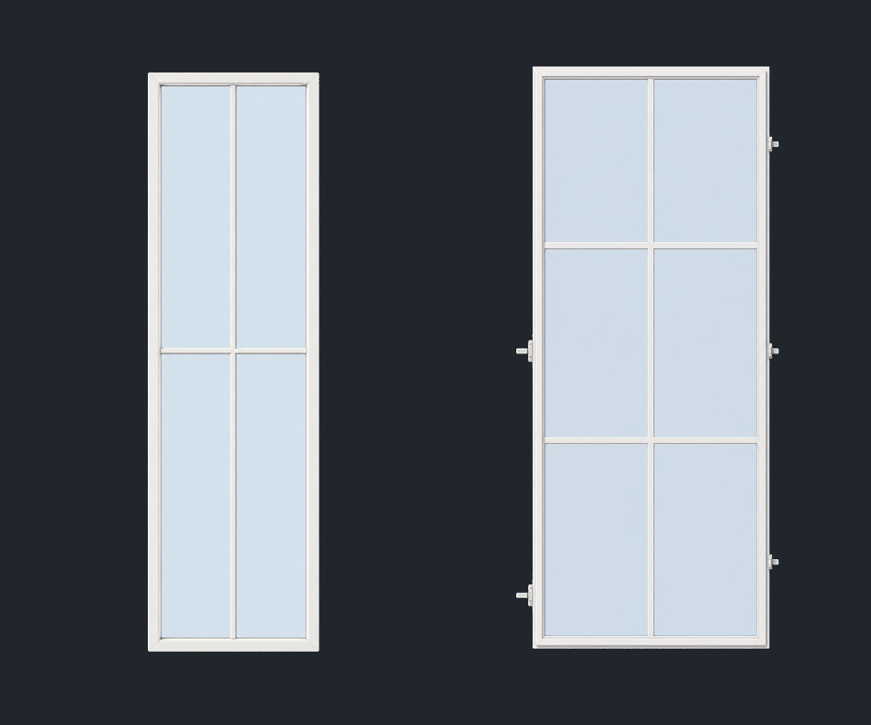

几何门禁只统计 opacity `>= 0.5` 的 Gaussian，用 PCA 求主轴后，在每个轴上取 `1%-99%` 分位跨度。对 `planar` 合同，最短轴厚度除以次短轴边长必须 `<= 0.10`。旧结果即使文件 QA Passed，也会被该门禁拒绝；本轮两份新结果均通过。

| 窗扇 | 旧 Gaussian / 厚度比 | Prompt 参考图新 Gaussian / 用时 | 新 PCA 跨度 / 厚度比 | 结果 / PLY SHA-256 |
|---|---:|---:|---:|---|
| left | `538,656` / `0.52983` | `85,632` / `10.97 s` | `[0.99312, 0.42646, 0.02681]` / `0.06287` | **Passed** / `ecbd3bbf87c8d28940583c9ac4e0d4c1021d5e3f70929b5578849cc7695ccdb0` |
| right | `213,856` / `0.36216` | `88,896` / `9.19 s` | `[0.99356, 0.42782, 0.02657]` / `0.06210` | **Passed** / `bae4bde006702a6c6e77716ed347173debfca86a7671645f6056e4e79df817ad` |

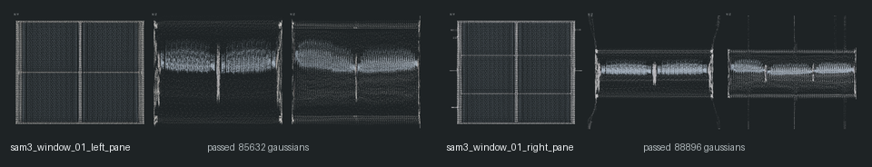

本轮在 `mil8` 的 RTX 3090 GPU 7 上运行，峰值显存约 `3.827 GB`；两份 PLY 的必需字段均存在、全部数值 finite、四元数范数中位数为 `1.0`。远端与回传本地的 SHA-256 完全一致，原始产物仅保存在：

```text
tmp_remote_results/embodiedgen_v2_bedroom4_prompted_reference_rerun_20260714/
  reference_raw/          # 图像编辑原图
  reference_rgba/         # chroma key 后的透明输入
  baseline_geometry_qa/   # 旧 PLY 通过文件 QA、未通过平面门禁的证据
  run/input/              # 强制 prompt-reference 的选择清单和实际输入
  run/output/             # 两份新 Gaussian PLY，不进 Git、不上传网站
  run/qa/                 # 字段 QA、几何合同 JSON 和三视图
  logs/                   # 远端运行日志
```

这次改动解决的是“窗扇被补成厚盒子”的形状先验问题，不等于恢复了真实扫描几何。图像编辑器会把遮挡、玻璃纹理和五金细节补成一个合理但可能不真实的同类窗；因此新结果适合作为薄窗 visual candidate，不能直接覆盖扫描层，也不能在没有尺度回对、mesh/collider 和仿真测试时标成 sim-ready asset。

### 全目标自动补全与独立资产装配（2026-07-14）

窗扇实验说明详细 prompt 可以改善输入先验，但它还不是一个可批量运行的资产策略。本轮继续把同一方法扩展到 `bedroom_4` 的全部 12 个非结构实例，并把目标改成：**每个源实例必须自动得到一个可复用的独立资产，双联窗必须展开为两个子资产，低证据结果必须显式降级，任何 QA 失败都不能进入最终目录。**

自动化不是让同一个 prompt 处理所有类别，而是先审计可见证据，再按类别选择动作和几何合同：

```text
instance RGBA + mask statistics
  -> evidence tier: high / medium / low
  -> policy: reuse / prompt-complete / prompt-split / external-split / reject
  -> category-specific detailed completion prompt
  -> prompt materialized as a clean single-object RGBA
  -> TRELLIS image-conditioned Gaussian generation
  -> finite-field sanitation in a new PLY copy
  -> category geometry contract
  -> optional deterministic planar center + covariance correction
  -> fail-closed final asset assembly
```

这里的 prompt 不会直接传给当前 `run_old`。本地 TRELLIS 调用只消费 RGBA，因此文字中的“完整物体、只保留一个实例、补哪一部分、禁止出现什么、视角和厚度”先由图像编辑模型物化为参考图，TRELLIS 再从参考图生成 3D。官方 TRELLIS 代码还提供 text-to-image 后接 image-to-3D，以及 tuning-free multi-image conditioning；本轮没有把单帧扫描伪装成多视角，仍使用已经在 `mil8` 验证过的本地 image-conditioned 权重。Hunyuan3D-2 也公开了 multiview shape generation 和分离的 shape / texture pipeline，可作为后续真正多视角后端；本轮没有下载其另一套权重，因此不把它混写成本次结果。

| 可复跑阶段 | 仓库入口 | 失败语义 |
|---|---|---|
| evidence / strategy / prompt planning | `tools/plan_trellis_auto_completion.py` + `configs/trellis_bedroom4_auto_completion.json` | 类别无策略、拆分无子任务或缺几何合同时停止 |
| reference edit + alpha QA | `tools/run_trellis_reference_edit_jobs.py` | 前景过小、无透明背景、目标占满画布或 provider 失败时停止 |
| prompted RGBA materialization | `tools/materialize_trellis_prompted_references.py` | 缺 provider provenance、prompt、hash 或 alpha 时停止 |
| Gaussian generation | `tools/run_trellis_gaussian_batch.py` | 每个 object 独立记录 completed / blocked / failed |
| non-finite sanitation | `tools/sanitize_trellis_gaussians.py` | 删除比例超过 `1%` 时拒绝，不修改 raw PLY |
| file + category geometry QA | `tools/qa_trellis_gaussians.py` | 缺字段、非有限数、四元数异常或类别几何失败时拒绝 |
| planar deterministic correction | `tools/enforce_trellis_planar_contracts.py` | 仅允许修正厚度比 `(0, 0.5]` 的平面类；更离谱的结果直接拒绝 |
| final assembly | `tools/assemble_trellis_auto_completion_bundle.py` | 缺 QA、QA failed 或缺 PLY 时 non-zero exit |

#### 证据分级与资产策略

高/中/低证据由源 crop 的短边、alpha 像素数、3D 投影支撑率和原有 `low_detail_input` 标记共同决定。它不是“质量分高就一定生成”，而是控制允许宣称的 fidelity：低分辨率植物可以生成完整类别代理，但不能声称恢复了原植物的真实叶片和花盆。

| 源实例 | 数量 | 自动策略 | 最终资产 | fidelity 解释 |
|---|---:|---|---:|---|
| bed | 1 | `reuse_baseline` | 1 | 复用已通过 QA 的扫描条件候选 |
| lamp | 2 | `reuse_baseline` | 2 | 清晰输入已经得到可辨灯罩、灯杆和底座 |
| door | 2 | `prompt_complete` | 2 | 从部分门板证据补成完整独立门扇；之后强制平面合同 |
| nightstand | 2 | `prompt_complete` | 2 | 补齐被裁切的桌面、柜体或桌腿，要求三维体积不能坍成薄片 |
| plant | 3 | `prompt_complete` | 3 | 补齐花盆、根部和植株；三件均标为低证据 category proxy |
| window 01 | 1 | `external_split` | 2 | 复用上一轮已通过薄平面 QA 的左右独立窗扇 |
| window 02 | 1 | `prompt_split` | 2 | 从一个双联窗观察分别生成左、右独立窗扇 |
| **合计** | **12** | 3 reuse + 7 completion + 2 split policies | **14** | 每份 PLY 对应一个可单独寻址的资产 |

详细 prompt 使用统一合同骨架，但类别段落不同。例如门要求 `exactly one complete shallow interior door leaf`，保留可见颜色、比例和 molding，禁止墙、门洞、相邻门和深柜体；床头柜要求完整桌面、四侧和落地支撑，禁止床、灯、墙和被截断边缘；植物要求一个完整花盆、连贯茎叶和从顶到底全物体，同时明确低证据时只能使用最不特定的素色圆柱花盆；双联窗则为左右子任务分别写 `exclude the right/left sash`，并限制约 `4 cm` 浅框深度。

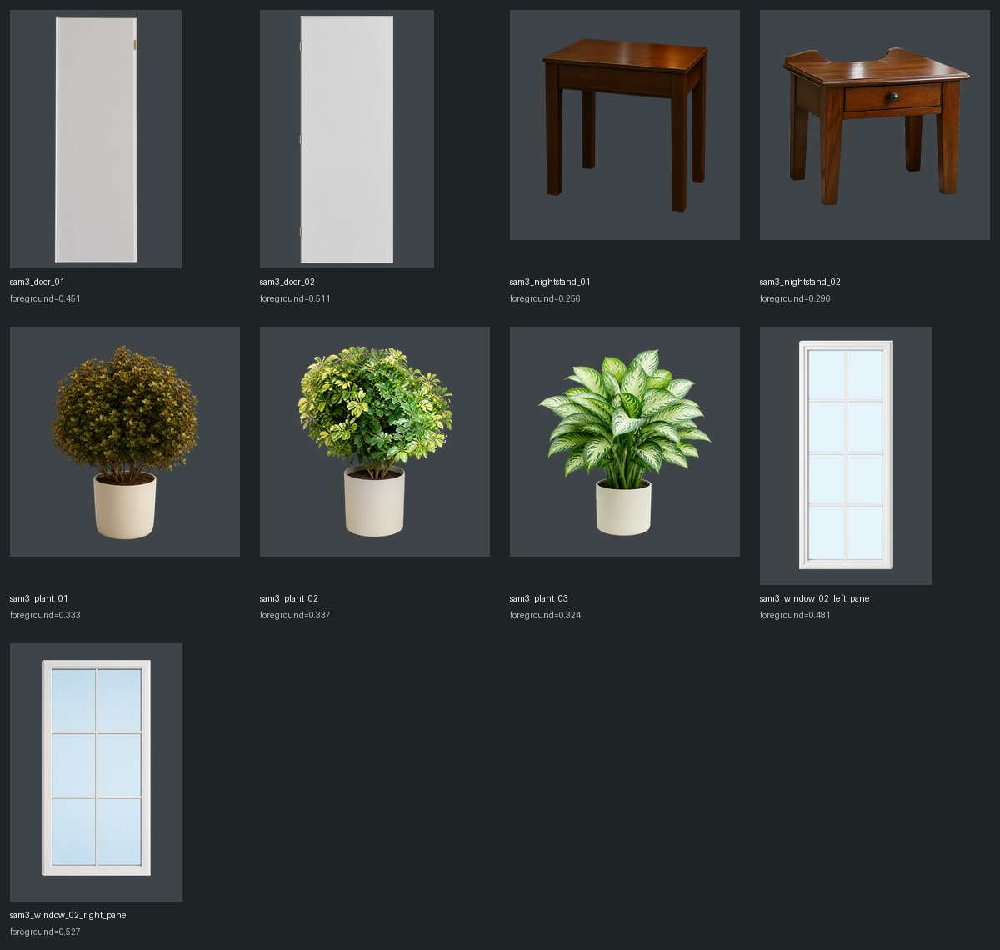

#### 原始证据与完整生成对比

下面这张对比板只使用真实 `bedroom_4` 视频帧中投影选出的实例 RGBA，不是生成图。两件床头柜都被视角和遮挡截断；三盆植物的有效输入分别只有 `115 x 79`、`95 x 62` 和 `43 x 43` 像素，原图里基本只剩模糊叶团，花盆、完整枝干和背面结构都不可见。

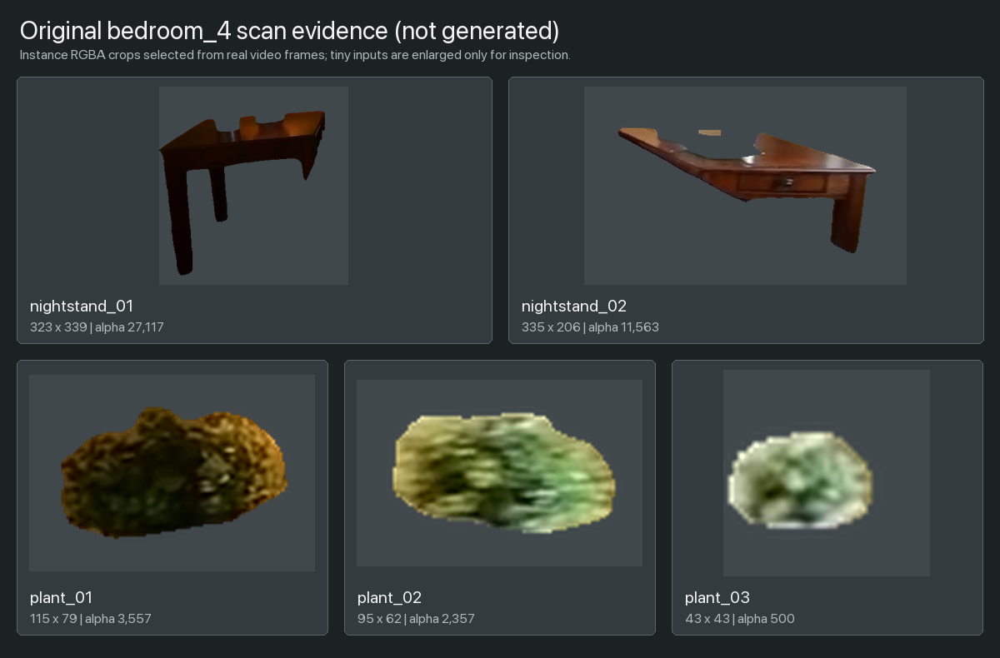

从原始证据到下面五个完整 viewer 结果，VLM 驱动的视觉生成/编辑阶段表现出很强的**类别理解、单实例约束和不可见部分补全能力**：它能把残缺台面继续成结构完整的床头柜，把低分辨率叶团补成带花盆、枝干和三维冠幅的独立植物，并给 TRELLIS 提供远比原 crop 更稳定的单物体参考。这里具体指本轮使用的 `gpt-image-2` 提示编辑能力，不是前文那个只能输出 voxel token 的本地 Qwen2.5-VL fine-tune。随后 TRELLIS 将参考图解码为可转动观察的 3D Gaussian。

严格来说，这是一条两阶段生成链，而不是“VLM 直接输出 PLY”：视觉生成模型负责理解 prompt 和补全参考图，TRELLIS 负责 3D Gaussian。它证明了强语义补全能力，但不证明看不见的叶片、花盆、抽屉和背面细节与真实房间完全一致；三盆植物因此继续保留 `category_proxy_from_low_detail_evidence` 标记。

| 对象 | 原始证据 | 最终 Gaussian | 对比观察 |
|---|---:|---:|---|
| `sam3_plant_01` | `115 x 79`，alpha `3,557` | `1,281,643` | 从模糊叶团补成圆冠、多枝干、完整花盆的独立植株 |
| `sam3_plant_02` | `95 x 62`，alpha `2,357` | `710,528` | 形成更疏松的混合叶簇、土面和圆柱花盆，三维冠幅可辨 |
| `sam3_plant_03` | `43 x 43`，alpha `500` | `542,432` | 极低证据下仍生成完整阔叶植株；类别合理，但身份真实性最低 |
| `sam3_nightstand_01` | `323 x 339`，台面与支腿残缺 | `733,856` | 补出完整矩形台面、围边、抽屉/把手和四腿支撑 |
| `sam3_nightstand_02` | `335 x 206`，只见部分台面与单侧结构 | `726,289` | 保留弧形后挡板和木色，补成完整抽屉式床头柜 |

以下五张均为本次从 Gaussian viewer 截取的最终资产视图，与上面的原始扫描证据一一对应。

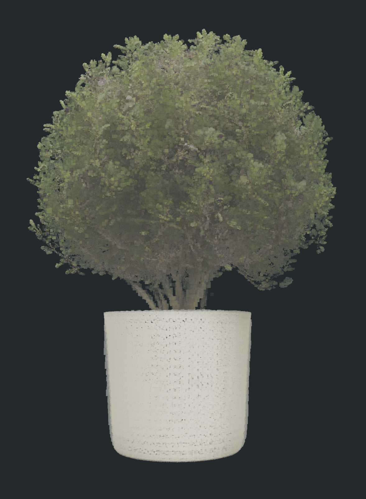

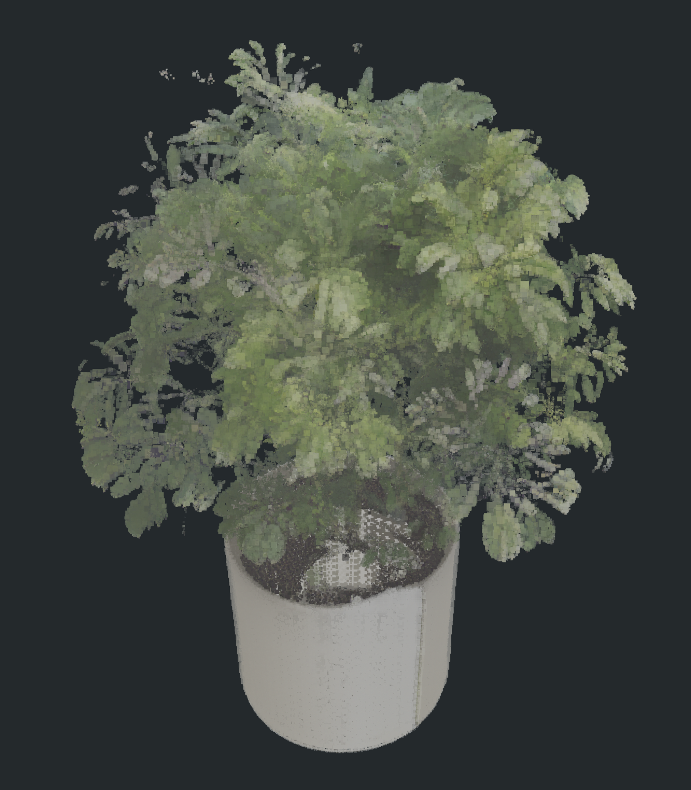

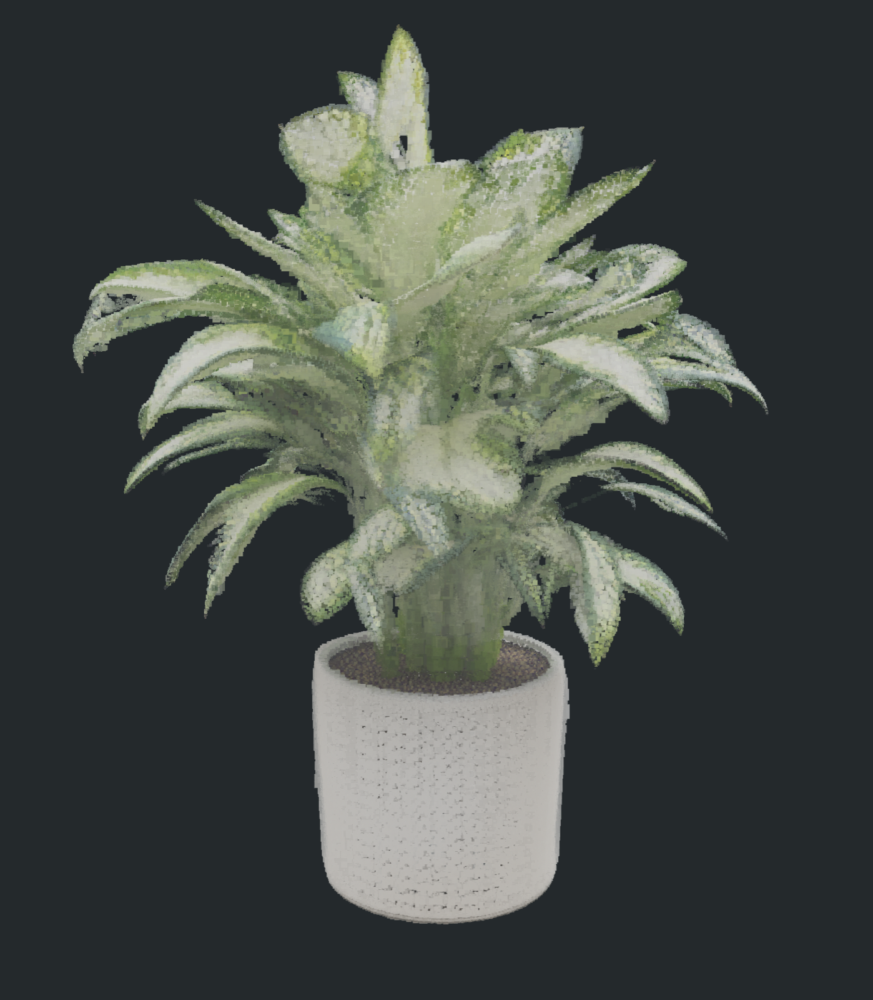

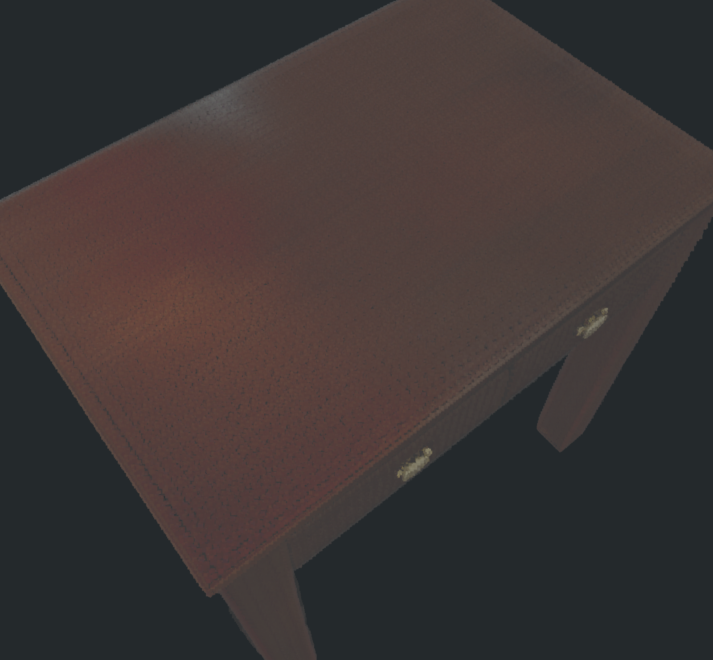

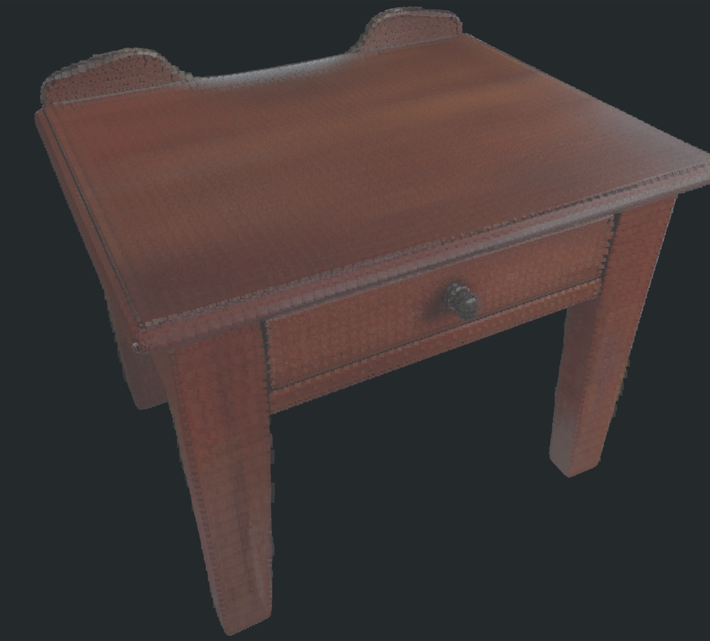

#### mil8 生成、清洗与类别合同

9 个新参考图在 `mil8` 的 RTX 3090 GPU 7 上串行生成，TRELLIS 采样总耗时 `133.83 s`，单件 `9.34-21.72 s`，峰值显存 `4.526 GB`。原始 9/9 PLY 都成功写出；其中四份在 raw opacity logit 中出现少量非有限点，因此没有直接放宽 QA，而是生成独立 sanitized copy：门 1 删除 `1,553 / 684,672`（`0.2268%`），门 2 删除 `6,368 / 958,304`（`0.6645%`），床头柜 2 删除 `15`，植物 1 删除 `21`。所有删除比例都低于 fail-closed 上限 `1%`，原始 PLY 保持不动。

| 新资产 | TRELLIS 原始 Gaussian / 用时 | 最终 Gaussian | 类别几何合同与结果 |
|---|---:|---:|---|
| `sam3_door_01` | `684,672` / `15.15 s` | `683,119` | planar，厚度比 `0.36577 -> 0.11201`，Passed |
| `sam3_door_02` | `958,304` / `16.67 s` | `951,936` | planar，厚度比 `0.36005 -> 0.11200`，Passed |
| `sam3_nightstand_01` | `733,856` / `15.55 s` | `733,856` | bounded volume，厚/次短轴 `0.9561`，长/最短轴 `1.1294`，Passed |
| `sam3_nightstand_02` | `726,304` / `16.82 s` | `726,289` | bounded volume，厚/次短轴 `0.9748`，长/最短轴 `1.2162`，Passed |
| `sam3_plant_01` | `1,281,664` / `21.72 s` | `1,281,643` | upright volume，高/最大水平轴 `1.5171`，水平深度比 `0.9746`，lower support Passed |
| `sam3_plant_02` | `710,528` / `15.47 s` | `710,528` | upright volume，高/最大水平轴 `1.4751`，水平深度比 `0.8156`，lower support Passed |
| `sam3_plant_03` | `542,432` / `13.73 s` | `542,432` | upright volume，高/最大水平轴 `1.4276`，水平深度比 `0.9790`，lower support Passed |
| `sam3_window_02_left_pane` | `102,400` / `9.34 s` | `102,400` | planar，厚度比 `0.07690 <= 0.10`，Passed |
| `sam3_window_02_right_pane` | `121,856` / `9.37 s` | `121,856` | planar，厚度比 `0.05693 <= 0.10`，Passed |

门的详细 prompt 已要求浅门板，但两份未经修正的 3D 仍被 TRELLIS 补成厚度比约 `0.36` 的箱体，说明**语义约束不能替代输出几何约束**。平面修正器以高 opacity 点做 robust PCA，只在源厚度比不超过 `0.5` 时允许修正；它把 Gaussian 中心沿最薄轴压到合同上限 `0.14` 的 `80%`，并对每个 Gaussian 的完整协方差执行 `A * covariance * A^T`，再分解回 log-scale 和归一化四元数。门 1/2 的轴缩放分别为 `0.30620` 和 `0.31107`，最终厚度比为 `0.11201` 和 `0.11200`；窗口已合格，不做二次变形。

不同类别不能共用“越薄越好”的门禁：

- door / window 使用 `planar`，拒绝异常厚盒子；
- nightstand 使用 `bounded_volume`，同时拒绝薄片和极端长条；
- plant 使用 `upright_volume`，检查高度、两个水平轴深度，以及**下端**是否有足够点和跨度支撑，避免把蓬松树冠误当成落地支撑；
- bed / lamp 本轮只复用已有通过视觉审计的结果，不因自动化而无意义地重生成。

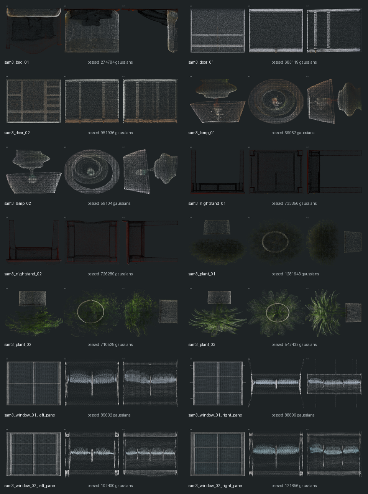

最终装配器读取 completion plan 和三组 QA（baseline、新生成、上一轮 window 01 split），只有 `status=passed` 且 PLY 存在的资产才复制到 `final_assets/`。本次实际装配为 **14/14 accepted、0 blocked、417 MB**，其中三盆植物使用 `accepted_with_fidelity_caveat`；manifest 逐件记录 source kind、fidelity、vertex count、bytes、geometry report 和 SHA-256。9 份 mil8 最终 PLY 回传后也逐文件完成远端/本地 SHA-256 对照，无差异。任何一件缺 QA、几何失败或文件缺失都会让命令非零退出，而不是把它写成 accepted。

完整本地产物只保存在实验目录，不上传网站、不进入 Git：

```text
tmp_remote_results/embodiedgen_v2_bedroom4_auto_completion_20260714/
  plan/                 # evidence tier、策略、详细 prompt、拆分子任务
  reference_raw/        # prompt 编辑原图
  reference_rgba/       # chroma key 后实际送入 TRELLIS 的透明 RGBA
  run/output/           # raw 运行清单和 QA；raw PLY 只保留在 mil8
  run/sanitized_output/ # 清洗清单；中间 PLY 只保留在 mil8
  run/final_output/     # 平面合同修正后的 9 份最终新资产
  run/final_qa/         # 9/9 文件、finite、quaternion、类别几何 QA
  bundle/final_assets/  # baseline + 两组拆窗 + 新补全组成的 14 件独立资产
  bundle/qa/            # 最终 14 件本地复读 QA 和三视图总览
  bundle/auto_completion_asset_manifest.json
```

这批结果证明“其他物品也能按同一框架自动优化”，但不是证明它们已经是精确扫描模型或 sim-ready mesh。当前产物仍是 canonical-space Gaussian visual candidates，没有回填各自在房间中的真实尺度和位姿，也没有 mesh、背面真实性、collider、质量/摩擦、铰链或物理仿真验证。尤其植物 3 的源观察只有 `43 x 43` 像素，完整外形主要来自生成先验；清单中的 fidelity caveat 是资产合同的一部分，不能在下游被丢掉。

## 风险

| 风险 | 说明 | Video2Mesh 处理方式 |
|---|---|---|
| 论文系统很大 | 它是世界引擎，不是单模型 pip install 后可复现全部结果 | 先复刻资产合同和验证器，不急于复现 RL |
| 指标不可直接迁移 | 79.8% / 75.0% 来自论文下游 study | 本地文档只引用为官方结果，不写成本地结果 |
| 生成资产可能偏离真实扫描 | EmbodiedGen 从 prompt/image 生成，Video2Mesh 追求真实场景还原 | 用它补 object/physics sidecar，不覆盖真实扫描几何 |
| Vibe Coding 容易被误解 | 没有 typed skill 和 physics validation 就不是 sim-ready 编辑 | 所有编辑都必须输出 delta、manifest 和 preflight report |
| collision proxy 质量难 | 凸分解过粗会影响交互，过细会拖慢物理 | 每个 object 记录 visual/collider stats，并做 smoke test |
| 多仿真器参数不一致 | friction、mass、joint 在各引擎里的语义不同 | 保留 canonical 参数和 per-engine mapping，不只保留导出文件 |

## 接入判断

- P0：不改 Video2Mesh 主重建链路。继续保持 COLMAP、GraphDECO 3DGS、scene mesh、object split、semantic transfer 的分层资产路线。
- P1：把 EmbodiedGen V2 的 asset contract 落到 `simulator_asset_bundle` manifest：按 visual、collision、physics、semantic、adapters、validation 分目录。
- P1：新增 collision preflight：mesh stats、non-manifold 检查、bbox/scale 检查、ground probe、简单 rigid-body drop/settle。
- P1/P2：给 object sidecar 扩展 material、mass、friction、affordance、grasp pose 和 source/confidence 字段。
- P2：实现 URDF/MJCF/USD adapter。优先 MuJoCo/Genesis，再看 Isaac Sim/Unity。
- P2：做一个 Video2Mesh-style Vibe Coding 编辑器：自然语言只产生 typed operation，后端负责碰撞、支撑、坐标、导出和回滚。

## 下一步建议

1. 先基于当前 `semantic_object_glbs.json` 设计一个 `simulator_asset_bundle.schema.json`，字段向 EmbodiedGen V2 的 visual/collision/inertial/affordance 合同靠齐。
2. 给已有 bedroom_4 / SimFoundry asset-only 输出加一个 `validation/` 目录，记录 GLB 可读性、mesh counts、bbox、scale、raycast、ground probe 和 object collision proxy。
3. 选择 1-2 个 object 做刚体 smoke：生成 collider、写 mass/friction、导出 MuJoCo MJCF，并跑一个加载 + 落地 + 碰撞检查。
4. 把自然语言编辑先限制在可验证命令：move / replace / scale / set material / set collider / export，而不是开放式改世界。
5. 若后续要复现 EmbodiedGen V2 官方 demo，应单独建隔离分支和远端环境，先跑 asset generation + SAPIEN validation 的最小闭环，不直接进入 RL 训练。
