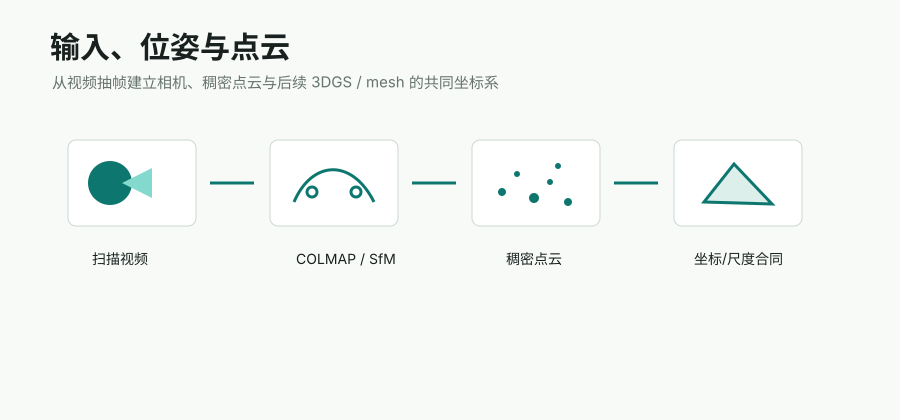

# COLMAP

## 链接

- Official docs: https://colmap.github.io/
- GitHub: https://github.com/colmap/colmap
- Tutorial: https://colmap.github.io/tutorial.html

## 摘要要点

COLMAP 是通用 Structure-from-Motion 和 Multi-View Stereo 工具链，提供图形界面和命令行接口。对 Video2Mesh 来说，它不是一个可替代的小工具，而是 P0 坐标合同的来源：相机内外参、稀疏点云、dense workspace、fused point cloud 和 Delaunay/Poisson mesher 都从这里出发。

它的优点是输出格式成熟、和 GraphDECO 3DGS 生态天然兼容，也能直接作为传统 mesh/collider 的输入。缺点是弱纹理、反光、重复纹理和扫描覆盖不足时容易断链，因此后续可以引入 MASt3R/DUSt3R/VGGT 做 fallback，但当前主链路仍建议保留 COLMAP。

## Pipeline

| 阶段 | 作用 | Video2Mesh 消费方式 |
|---|---|---|
| feature extraction / matching | 从抽帧图像中建立跨视角匹配 | 产生 SfM 的观测基础 |
| sparse reconstruction | 估计 cameras/images/points3D | 生成 `camera_info.json` 和 GraphDECO 输入 |
| image undistortion | 生成 dense workspace | 接 PatchMatch stereo / Delaunay mesher |
| patch-match stereo + fusion | 生成 dense depth / fused point cloud | 输入 Open3D、Poisson、Delaunay、语义投影 |
| Delaunay / Poisson meshing | 传统 MVS mesh 输出 | P0 static collider baseline |

## 输入与输出

输入：扫描视频抽帧、多视角图片、可选相机先验。输出：COLMAP sparse model、dense workspace、`fused.ply`、Delaunay/Poisson mesh、相机位姿和尺度基准。

## 在 Video2Mesh 中的位置

P0 主链路。当前项目中的 GraphDECO 训练、COLMAP Delaunay dense mesh、semantic transfer 和 simulator asset bundle 都依赖这个坐标基准。它比 learned pose 方法更可控，也方便 debug 每一步产物。

## 输出结果摘录

本周 `colmap_delaunay_dense` 路线的结果视觉细节不如 3DGS，但几何更轻、更稳定，适合作为隐藏 static collision proxy。正式 semantic mesh run 中，COLMAP Delaunay local semantic transfer 得到 82,920 vertices / 167,082 faces，语义覆盖率 84.98%，优于 Open3D Poisson 和 GS2Mesh 的语义覆盖。

## 接入判断

- P0：保留为主链路，负责相机、dense geometry 和 static collider。
- P1：接入 learned fallback、尺度检查和失败场景自动诊断。
- 风险：扫描覆盖不足时要及时提示重拍，而不是让后续 3DGS/mesh 阶段背锅。
