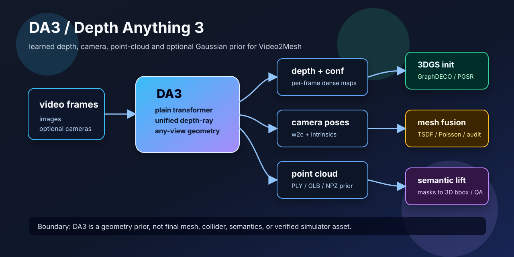

# DA3 / Depth Anything 3



## 链接

- Project page: https://depth-anything-3.github.io/
- GitHub: https://github.com/ByteDance-Seed/Depth-Anything-3
- arXiv: https://arxiv.org/abs/2511.10647
- Hugging Face collection: https://huggingface.co/collections/depth-anything/depth-anything-3
- 推荐全能力模型: https://huggingface.co/depth-anything/DA3NESTED-GIANT-LARGE-1.1
- Holi-Spatial DA3 入口：`/tmp/Holi-Spatial-official/run_da3.sh`
- Holi-Spatial DA3 脚本：`/tmp/Holi-Spatial-official/inference_da3_scannetppv2.py`

## 基本信息

| 项 | 内容 |
|---|---|
| 论文标题 | Depth Anything 3: Recovering the Visual Space from Any Views |
| 简称 | DA3 / Depth Anything 3 |
| 日期与 venue | arXiv 2025-11-13；项目页标注 ICLR 2026 Oral |
| 作者 | Haotong Lin, Sili Chen, Junhao Liew, Donny Y. Chen, Zhenyu Li, Guang Shi, Jiashi Feng, Bingyi Kang |
| 机构 | ByteDance Seed |
| 官方定位 | 从任意数量视觉输入恢复空间一致的视觉几何，可有或没有已知相机 pose |
| 对 Video2Mesh 的定位 | learned depth / camera / point-cloud prior，不是最终 mesh、collider 或语义真值 |

## 一句话结论

DA3 是一个 **any-view visual geometry foundation model**。它可以从单张图、多张图、视频帧，甚至带 pose 条件的多视角输入里预测深度、置信度、相机内外参、点云和可选 3D Gaussian 表示。对 Video2Mesh 来说，它最适合放在 **输入、位姿与点云阶段**：补充 COLMAP 的弱点、给 GraphDECO/PGSR 初始化、给 mask 2D-to-3D lifting 提供 depth evidence。

但它不能被直接等同于最终资产。DA3 直接回投的点云仍可能有 scale drift、边界薄片、遮挡重影、floaters 和 domain mismatch；真正进入 Video2Mesh 的 visual layer、mesh/collider、semantic sidecar 或 simulator bundle 之前，仍然要经过相机/尺度审计、点云清理、mesh fusion、3DGS optimization 和 QA。

## 核心思想

官方把 DA3 的设计强调为两个简化：

| 设计点 | 含义 | 工程影响 |
|---|---|---|
| Plain transformer backbone | 不为深度、pose、3DGS 等任务堆专门架构，而用统一 transformer 主干 | 代码和模型结构相对统一，适合作为通用几何 prior |
| Unified depth-ray representation | 用统一的 depth-ray 预测目标覆盖多个几何任务 | 单模型可以在不同输入模式下输出 depth、pose、camera-conditioned depth 和 3DGS |

它和 Depth Anything 2 的区别不只是“更大”。DA2 主要是强 monocular depth；DA3 进一步把问题扩展到 arbitrary visual inputs：单图、多图、视频、已知 pose、多相机输入都可以进入同一套几何模型。官方项目页还强调 DA3 在 camera pose、any-view geometry、visual rendering benchmark 上相对 VGGT 有明显提升。

## 模型谱系和许可证

| 系列 | 代表模型 | 参数量 | 能力 | 许可证 | Video2Mesh 建议 |
|---|---|---:|---|---|---|
| Nested | `DA3NESTED-GIANT-LARGE-1.1` | 1.40B | relative depth、pose、pose conditioning、3D Gaussians、metric depth、sky segmentation | CC BY-NC 4.0 | 研究复现和质量上限测试；非商用 |
| Main Giant | `DA3-GIANT-1.1` | 1.15B | any-view depth / pose / 3DGS | CC BY-NC 4.0 | 质量优先，但工程成本高 |
| Main Large | `DA3-LARGE-1.1` | 0.35B | any-view depth / pose / pose-conditioned depth | CC BY-NC 4.0 | 单场景实验候选 |
| Main Base | `DA3-BASE` | 0.12B | any-view depth / pose | Apache 2.0 | smoke test 和轻量集成 |
| Main Small | `DA3-SMALL` | 0.08B | any-view depth / pose | Apache 2.0 | 快速验证环境和输入格式 |
| Metric | `DA3METRIC-LARGE` | 0.35B | monocular metric depth | Apache 2.0 | 如果只需要 metric depth，可单独测试 |
| Mono | `DA3MONO-LARGE` | 0.35B | monocular relative depth | Apache 2.0 | 单图深度 baseline |

注意：Holi-Spatial 当前官方脚本里仍写着旧模型名 `depth-anything/DA3NESTED-GIANT-LARGE`，而 DA3 官方 GitHub/Hugging Face 已推荐 `-1.1` 系列。后续复现实验应优先确认模型名、checkpoint 版本和许可证，不要把旧脚本默认值当成最新推荐。

## 输入与输出

官方 API 的基本输入可以是图像路径、PIL image 或 numpy array 列表。核心输出包括：

| 输出 | 形状/格式 | 含义 | Video2Mesh 消费方式 |
|---|---|---|---|
| `processed_images` | `[N, H, W, 3]` | 预处理后的输入图像 | 记录 resize/裁剪策略，方便复现实验 |
| `depth` | `[N, H, W] float32` | 每帧深度 | depth fusion、mask 2D-to-3D lifting、TSDF / point cloud |
| `conf` | `[N, H, W] float32` | 深度/几何置信度 | 过滤低置信区域、点云采样权重 |
| `extrinsics` | `[N, 3, 4]` | OpenCV / COLMAP convention 的 world-to-camera pose | 作为 COLMAP fallback 或对照，但必须审计 convention |
| `intrinsics` | `[N, 3, 3]` | 相机内参 | depth unprojection、reprojection QA |
| export `ply` / `glb` / `npz` | 文件 | 点云或可视化资产 | 只作为 intermediate prior 或 preview |
| export `gs_ply` / `gs_video` | 文件 | DA3 head 预测的 Gaussian 表示/渲染预览 | visual prior，不等于 GraphDECO per-scene optimization |

基本 Python 形态：

```python
import torch
from depth_anything_3.api import DepthAnything3

device = torch.device("cuda")
model = DepthAnything3.from_pretrained("depth-anything/DA3NESTED-GIANT-LARGE-1.1")
model = model.to(device=device)

prediction = model.inference(
    images,
    export_dir="output",
    export_format="npz-ply-glb",
)
```

## Pipeline

```text
video frames / selected images
  -> optional camera poses
  -> DA3 any-view geometry inference
  -> depth + confidence + intrinsics/extrinsics
  -> route A: depth-unprojected dense point cloud
  -> route B: DA3 predicted camera/pose prior
  -> route C: optional DA3 Gaussian / GLB preview
  -> QA: scale, camera convention, reprojection, bbox, floater audit
  -> downstream: GraphDECO / PGSR / TSDF / Poisson / semantic lifting
```

| 阶段 | 做什么 | 输出 | 不能省略的 QA |
|---|---|---|---|
| Frame selection | 从视频中选关键帧，避免重复和运动模糊 | input image list | 记录帧号、分辨率、裁剪策略 |
| DA3 inference | 预测 depth、conf、camera、可选 3DGS | NPZ / depth maps / PLY / GLB | 检查显存、模型版本、export format |
| Camera convention conversion | 将 DA3 w2c/intrinsics 转为 Video2Mesh 约定 | `camera_info.json` 或 COLMAP-like export | 检查 OpenCV/COLMAP 坐标轴、scale、image size |
| Point-cloud generation | 用 depth + camera 反投影，或读取 DA3 PLY | dense RGB point cloud | bbox、离群点、重影、置信度统计 |
| Downstream optimization | 接 GraphDECO、PGSR、TSDF、Poisson 或 Holi-Spatial | refined 3DGS / mesh / bbox | 不把 DA3 preview 当最终资产 |

## 在 Holi-Spatial 里的具体用法

Holi-Spatial 把 DA3 放在第一阶段：先生成 dense depth 和 point cloud，再交给 PGSR/3DGS 做 per-scene optimization。官方入口是：

```bash
SCENE_ROOT=scannetppv2/data bash run_da3.sh
SCENE_DIR=scannetppv2/data/0a5c013435 bash run_da3.sh
SPLIT_DIR=scannetv2/splits NUM_GPUS=8 bash run_da3.sh
```

每个 scene 的输出是：

```text
<scene>/depth_da3/<image_stem>.npy
<scene>/pointcloud_da3.ply
```

Holi-Spatial 后续 `3d_bounding_instance_gs_rerun_da3.py` 会加载 `depth_da3`，把 SAM3 masks 和相机参数回投到 3D，生成 object-local points 和 bbox proposal。也就是说，DA3 在这里不是语义分割器，也不是 bbox 生成器；它提供的是 depth / point-cloud 几何证据。

完整关系更像：

```text
scene images
  -> DA3 depth_da3 + pointcloud_da3
  -> PGSR / 3DGS optimization
  -> refined depth / mesh-guided masks
  -> SAM3 2D masks
  -> 2D-to-3D lifting
  -> bbox / caption / spatial QA
```

本项目此前 `bedroom_4` Holi-Spatial-compatible smoke run 没有跑 DA3：源包里没有 `depth_da3/*.npy`，且当时服务器磁盘不适合再下载完整 DA3/SAM3/PGSR/VLM 依赖。因此那次只应写成 schema / QA adapter，不是 DA3 复现。

## 和 Video2Mesh 现有方法的关系

| 方法 | 核心输出 | Video2Mesh 当前角色 | 与 DA3 的关系 |
|---|---|---|---|
| COLMAP | 相机、稀疏点云、dense MVS | P0 主位姿和几何来源 | DA3 是 fallback / prior，不应无审计替代 |
| VGGT | camera、depth、point maps、tracks | learned geometry fallback，已有 bedroom_4 实测 | DA3 更偏 Depth Anything 系列 any-view geometry，可并排评测 |
| VGGT-Omega | camera、depth、register features | P1 learned geometry fallback | 与 DA3 都是 feed-forward prior，但 VGGT-Omega 更强调 registers / dynamic |
| DepthSplat | depth + feed-forward Gaussian | visual-3dgs/depth prior baseline | DA3 的 depth/camera 可能比直接拼 DepthSplat PLY 更适合接 GraphDECO |
| PGSR | surface-aware 3DGS optimization | P1/P2 high-quality visual mesh candidate | DA3 可作为 PGSR 的 depth/point-cloud 初始化 |
| Holi-Spatial | bbox / QA / grounding 数据生成系统 | 语义空间评测层 | DA3 是其中的几何前端之一 |

## 对 Video2Mesh 的接入方式

### P0 不替代 COLMAP

当前 Video2Mesh 主链路仍应以 COLMAP 为主，因为 GraphDECO、COLMAP Delaunay、dense fusion、mesh/collider 都已经围绕 COLMAP 输出组织。DA3 的 predicted camera/point cloud 不能不经审计直接覆盖 COLMAP workspace。

### P1 作为 learned geometry prior

最合理的短期实验：

```text
bedroom_4 selected frames
  -> DA3-LARGE / DA3NESTED inference
  -> depth + camera + PLY / NPZ
  -> compare with COLMAP cameras and dense fused.ply
  -> export Video2Mesh geometry_prior.json
  -> optional GraphDECO / PGSR short refinement
```

应保存的中间产物：

| 文件 | 目的 |
|---|---|
| `da3_prediction.npz` | 保存 depth/conf/intrinsics/extrinsics，便于复查 |
| `da3_point_cloud.ply` | viewer 和点云统计 |
| `da3_camera_info.json` | frame id、w2c/c2w、intrinsics、convention、scale |
| `da3_quality_report.json` | bbox、置信度、重投影、与 COLMAP 差异 |
| `da3_fixed_view_*.png` | 固定视角截图，避免只凭主观记忆 |

### P1/P2 接 Holi-Spatial 或 PGSR

如果目标是 Holi-Spatial-style bbox/QA，DA3 最值得提供的是 `depth_da3/*.npy`，后面用 SAM3 masks 做 2D-to-3D lifting。如果目标是更干净的 visual/mesh，DA3 更适合作为 PGSR / GraphDECO 初始化和 depth regularizer。

### 禁止直接当最终 collider

DA3 的点云和 GLB preview 不能直接当 simulator collider。它们缺少 watertight topology、稳定法线、可控面数、物理属性和 semantic sidecar。必须经过点云清理、mesh reconstruction、简化、碰撞代理生成和 QA 后才能进入 simulator bundle。

## 硬件和部署判断

官方没有给固定 VRAM 表，因为输入帧数、分辨率、模型大小和 export 格式都会影响显存。可确定的是：

| 项 | 结论 |
|---|---|
| 本地 Mac | 适合读代码、准备输入、查看小结果；不适合正式 DA3/Holi-Spatial 推理 |
| `mil8` 8 x RTX 3090 24GB | 适合单场景 DA3 smoke test 和分 GPU 跑场景列表 |
| 模型下载 | Nested/Giant 系列较大，且部分是 CC BY-NC；要提前规划缓存目录和磁盘 |
| 长视频 | 官方提供 DA3-Streaming，宣称滑窗方式可低于 12GB GPU memory 处理超长序列；需要单独测试 |
| 生产集成 | 先用 Base/Small/Large 做格式和 pipeline 验证，再切 Nested/Giant 做质量对照 |

如果在 `mil8` 做第一版实验，建议先不要跑完整 Holi-Spatial，而是只跑 DA3：

```bash
cd /data/zyx/workspace/Holi-Spatial
SCENE_DIR=/data/zyx/workspace/holi_spatial_runs/bedroom_4_smoke_20260709/scannetppv2/data/bedroom_4 \
  CUDA_VISIBLE_DEVICES=0 bash run_da3.sh
```

这条命令只是方向示例，正式执行前还要检查 DA3 包是否安装、模型是否缓存、scene layout 是否完全符合脚本 loader 预期，以及 `/data` 是否有足够空间。

## 评估清单

| 检查项 | 为什么重要 |
|---|---|
| 输入帧列表 | 抽帧差异会直接改变 depth/pose 和点云密度 |
| 模型版本 | `DA3NESTED-GIANT-LARGE` 与 `DA3NESTED-GIANT-LARGE-1.1` 不是同一个推荐状态 |
| 输出格式 | `npz` 更适合复查，`ply/glb` 更适合查看，`gs_ply` 不能等同 GraphDECO |
| camera convention | OpenCV w2c / COLMAP / Video2Mesh c2w 需要显式转换 |
| scale | metric model 和 relative model 混用会导致 bbox / collider 尺度错 |
| bbox / outlier | 检查远处 floaters 是否把 scene bbox 拉大 |
| confidence mask | 低置信区域应降低权重或剔除 |
| 与 COLMAP 对比 | 不能只看 DA3 自己的 viewer，必须和已有主链路对齐 |
| downstream render/mesh | 真正价值要看能否改善 GraphDECO/PGSR/TSDF/Poisson，而不是单独 PLY 好看 |

## 当前接入判断

- P0：不替代 COLMAP 主链路。
- P1：作为 learned depth / pose / point-cloud prior 加入实验队列，优先做 `bedroom_4` 小样本对照。
- P1：给 Holi-Spatial adapter 补官方 `depth_da3/*.npy`，验证 bbox lifting 是否比当前 proxy/schema smoke run 更稳。
- P1：把 DA3 depth 作为 PGSR / GraphDECO short refinement 的初始化或正则候选。
- P2：跟踪 DA3-Streaming 和 DA3 3DGS head，评估长视频和快速 visual preview 价值。
- 禁止：把 DA3 PLY / GLB / Gaussian preview 直接标成 final mesh、collider、semantic scene graph 或 simulator asset。

## 风险

- Nested/Giant 模型为 CC BY-NC 4.0，不能直接进入商业闭源产品链路。
- DA3 输出可以包含 camera pose，但不等于经过 bundle adjustment 的稳定 SfM 结果。
- 多视角深度回投容易在遮挡边界、反光、窗户、薄结构上产生重影和 floaters。
- `gs_ply` / `gs_video` 是 feed-forward Gaussian preview，不是 per-scene optimized 3DGS。
- Holi-Spatial 使用 DA3 只是第一步，后面还有 PGSR/3DGS、SAM3、VLM、bbox postprocess 和 QA；不能把 DA3 跑通写成完整 Holi-Spatial 复现。
