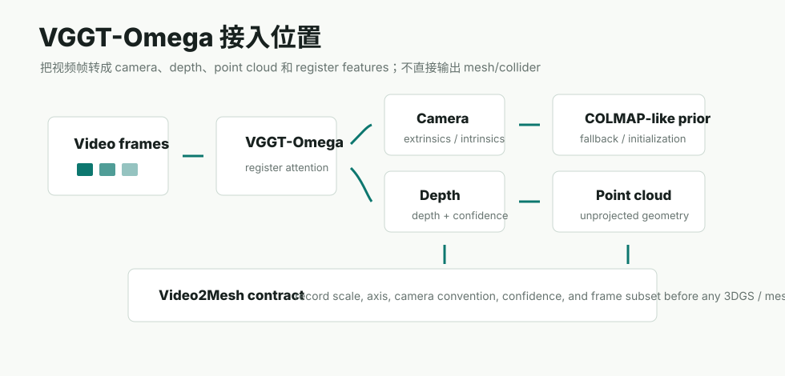

# VGGT-Omega



## 链接

- Project page: https://vggt-omega.github.io/
- arXiv: https://arxiv.org/abs/2605.15195
- GitHub: https://github.com/facebookresearch/vggt-omega
- Hugging Face model: https://huggingface.co/facebook/VGGT-Omega
- Hugging Face demo: https://huggingface.co/spaces/facebook/vggt-omega
- 原 VGGT project: https://vgg-t.github.io/

## 基本信息

| 项 | 内容 |
|---|---|
| 论文标题 | VGGT-Omega / VGGT-Ω |
| 日期与 venue | arXiv 2026-05-14；官方项目页标注 CVPR 2026 Best Paper Finalist，arXiv comments 标注 CVPR 2026 Oral |
| 作者 | Jianyuan Wang, Minghao Chen, Shangzhan Zhang, Nikita Karaev, Johannes Schoenberger, Patrick Labatut, Piotr Bojanowski, David Novotny, Andrea Vedaldi, Christian Rupprecht |
| 机构 | Visual Geometry Group, University of Oxford；Meta AI |
| 模型 | `VGGT-Omega-1B-512`、`VGGT-Omega-1B-256-Text-Alignment` |
| 权重状态 | Hugging Face 权重需要申请访问；官方 demo 对所有人开放 |

## 一句话结论

VGGT-Omega 是 VGGT 的大规模扩展版，重点不是输出 3DGS 或 mesh，而是更高效地从多帧图像/视频中恢复 camera、depth、point map / point cloud 和可用于空间理解的 register features。它适合放在 Video2Mesh 的 **输入、位姿与点云阶段**：作为 COLMAP 失败时的 fallback、GraphDECO 初始化 prior、动态视频的 camera/depth 估计和后续语义/语言对齐特征来源。

## 摘要要点

官方摘要把 VGGT-Omega 定位为 scaled-up feed-forward 3D reconstruction model，覆盖静态和动态场景。相比原 VGGT，它做了几处关键变化：

- 用单个 dense prediction head 做多任务监督，减少多个任务头的复杂度。
- 移除昂贵的 high-resolution convolutional layers。
- 使用 registers 聚合全局场景信息，并通过 register attention 限制帧间信息交换，部分替代全局 attention。
- 训练阶段 GPU memory 约为前代的 30%，因此能使用 15x 更多 supervised data，并利用大量 unlabeled video data。
- 官方摘要称其在 Sintel camera estimation 上比此前最好结果提升 77%，并展示 learned registers 对 VLA model 和 language alignment 的价值。

这意味着 VGGT-Omega 不只是“更准的 VGGT”。它把重建任务当作空间理解的 scalable proxy task：相机和深度是紧凑的几何目标，registers 则可能成为后续机器人、语言对齐、场景理解的共享 latent。

## Pipeline

| 阶段 | 作用 | 输出 |
|---|---|---|
| Image/video preprocessing | 将图片集合或视频抽帧 resize/normalize，官方 quick start 使用 `image_resolution=512` | tensor images |
| VGGT-Omega forward | 1B 模型对多帧做 feed-forward geometry inference | `pose_enc`、`depth`、`depth_conf`、`camera_and_register_tokens` |
| Camera decoding | 用 `encoding_to_camera` 将 `pose_enc` 转成外参和内参 | extrinsics、intrinsics |
| Depth unprojection | 使用相机和深度把像素反投影成 3D 点 | point cloud / point map |
| Register features | 从 `camera_and_register_tokens` 中分离 camera tokens 和 scene registers | scene-level geometry/spatial features |
| Optional text alignment | 256 text-aligned checkpoint 输出 `text_alignment_embedding` | 可与语言/语义任务对齐的 embedding |

## 几何生成路径

VGGT-Omega 的几何路径是 learned feed-forward，而不是 COLMAP 的 SfM/MVS：

```text
image sequence
  -> VGGT-Omega transformer + registers
  -> pose encoding + depth + confidence
  -> camera intrinsics/extrinsics
  -> depth-unprojected point cloud
  -> optional GLB visualization or COLMAP-like prior
```

如果要接入 Video2Mesh，必须把输出转成我们自己的坐标合同：

- `camera_info.json`：保存 frame id、intrinsics、extrinsics、camera convention、source resolution、confidence。
- `point_cloud.ply` 或 intermediate point maps：由 depth + camera 反投影生成，带深度置信度或 mask。
- `geometry_prior.json`：记录模型版本、checkpoint、输入帧、resize 策略、scale normalization、是否 text-aligned。
- `quality_report.json`：检查重投影误差、深度空洞、漂浮点、尺度漂移和与 COLMAP 的姿态差异。

## Mesh / 3DGS 接入方式

VGGT-Omega 不直接输出 triangle mesh，也不直接输出 Gaussian PLY。后接路线应分清：

| 后接模块 | 可用方式 | 不应做的事 |
|---|---|---|
| GraphDECO 3DGS | 用 predicted cameras + point cloud 作为 COLMAP-like 初始化，做短训或 fallback | 直接把 VGGT-Omega 输出当作已经优化过的 3DGS visual layer |
| Mesh reconstruction | 把 depth/point cloud 融合后做 TSDF、Poisson、Delaunay 或 Marching Cubes | 直接把单帧 depth 点云当最终 collider |
| Semantic sidecar | text-aligned registers 可作为未来语义/语言对齐线索 | 把 register embedding 直接当 object ID 或物理属性 |
| Dynamic scene | 用动态场景 camera/depth 估计作为 D4RT 类 4D tracks 的辅助 | 把动态物体强行融合进静态 mesh |

## 工程和部署要求

官方 README 给出的直接依赖很轻：`torch>=2.3`、`torchvision>=0.18`、`numpy<2`、`Pillow`、`einops`、`safetensors`、`opencv-python`。demo 另有 `requirements_demo.txt`。

官方 quick start 的核心输出如下：

```python
predictions = model(images)
extrinsics, intrinsics = encoding_to_camera(
    predictions["pose_enc"],
    predictions["images"].shape[-2:],
)
depth = predictions["depth"]
depth_conf = predictions["depth_conf"]
camera_and_register_tokens = predictions["camera_and_register_tokens"]
```

官方 A100 推理显存表：

| 输入帧数 | 1 | 10 | 25 | 50 | 100 | 200 | 300 | 400 | 500 |
|---:|---:|---:|---:|---:|---:|---:|---:|---:|---:|
| Peak memory GB | 6.02 | 6.67 | 7.80 | 9.66 | 13.37 | 20.82 | 28.26 | 35.71 | 43.15 |

该表使用 `VGGT-Omega-1B-512`、单张 A100、624x416 输入，并覆盖从加载权重到 forward pass 的端到端 peak memory。对 Video2Mesh 的 bedroom 级视频来说，RTX 3090/4090 理论上能跑几十到上百帧级别的测试，但真实吞吐、CUDA memory fragmentation、长视频分块和输出转换都要等本地/远端实测。

## 和已有 VGGT / AnySplat 的关系

已有 [MASt3R / DUSt3R / VGGT](mast3r-dust3r-vggt.md) 页把 VGGT 归为 learned pose/depth fallback。VGGT-Omega 应作为这个方向的升级版单独跟踪，因为它加入了动态场景、register attention、text alignment checkpoint 和更明确的 runtime memory 数据。

AnySplat 页面里提到使用 pretrained VGGT 作为 pseudo-geometry prior。VGGT-Omega 未来也可能扮演类似角色：先给 video frames 估相机和深度，再把这些几何线索交给前馈 3DGS 或 GraphDECO refinement。但这仍然属于 prior / initialization，不是最终 visual/collider asset。

## 在 Video2Mesh 中的位置

```text
video frames
  -> VGGT-Omega camera/depth/point cloud prior
  -> quality and scale audit
  -> COLMAP-compatible export or fallback camera_info
  -> GraphDECO / Delaunay / semantic fusion
```

推荐先做三类小实验：

1. **COLMAP fallback audit**：选 COLMAP 不稳或弱纹理片段，比较 VGGT-Omega predicted cameras 与 COLMAP sparse cameras 的相对姿态、尺度和重投影质量。
2. **GraphDECO initialization**：把 VGGT-Omega point cloud + cameras 转成 COLMAP-like source，跑 3k/7k GraphDECO 短训，和 AnySplat->GraphDECO 路线并排比较。
3. **Dynamic/static split**：对有移动物体的视频，用 VGGT-Omega 的 depth/camera 作为基础，再接 D4RT / tracking 方法估计动态 object trajectory。

## 接入判断

- P0：暂不替代 COLMAP 主链路，因为我们还没有对 Video2Mesh 数据做真实 scale/camera/mesh QA。
- P1：作为 learned geometry fallback 和 GraphDECO 初始化候选，尤其适合 COLMAP 失败、输入视角少或纹理弱的片段。
- P1：作为动态视频 camera/depth prior，和 D4RT 这类 4D tracking 方法配合。
- P2：探索 text-aligned registers 是否能辅助 semantic sidecar 或自然语言场景查询。
- 风险：权重访问需要申请；输出不是标准 COLMAP workspace；点云/mesh/collider 的坐标、尺度、confidence 必须额外记录。
