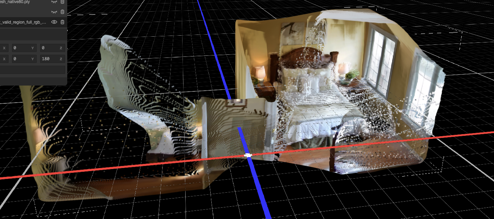
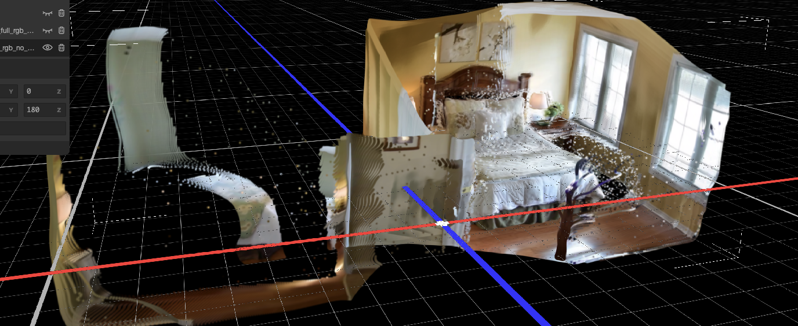
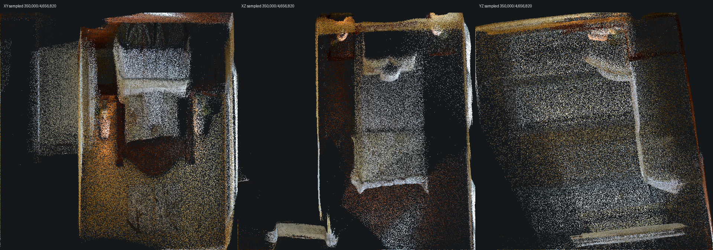
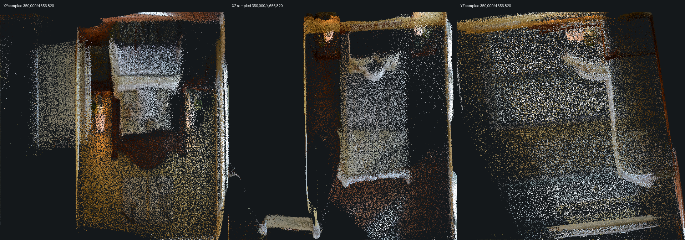

# VGGT



## 链接

- Project: https://vgg-t.github.io/
- GitHub: https://github.com/facebookresearch/vggt
- Paper: https://arxiv.org/abs/2503.11651
- 扩展模型页：[VGGT-Omega](vggt-omega.md)
- 同阶段方法：[MASt3R](mast3r.md)、[DUSt3R](dust3r.md)
- 本地 bedroom_4 no-cap run：`/Users/zhangyuxiang/Desktop/worksplace/Video2Mesh/tmp_remote_results/bedroom_4_clean31_vggt_no_point_cap_20260711_012753`
- 远端 bedroom_4 no-cap run：`/data/zyx/workspace/vggt_runs/bedroom_4_clean31_vggt_no_point_cap_20260711_012753`

## 一句话结论

VGGT 是 feed-forward 几何模型，目标是从单张、少量或大量视图中一次性预测 camera、depth、point maps 和 3D point tracks。它很适合放在 Video2Mesh 的 **输入、位姿与点云阶段**：作为 COLMAP 失败时的 camera/depth/point cloud fallback，也可以给 GraphDECO 初始化、mesh depth fusion 和弱纹理片段 QA 提供先验。

本项目 bedroom_4 clean31 实测说明：取消旧导出里的 30 万点上限、只保留 valid image-region 后，VGGT `world_points` 和 `depth_unproject` 两份 4,656,820 点 RGB PLY 都能恢复出比较完整的卧室主体结构。它们质量都不错，但仍然只是点云，不是训练后的 3DGS，也不是可直接碰撞的 mesh。

## 摘要要点

VGGT 和 MASt3R / DUSt3R 都属于 learned geometry，但工作重心不同：

| 方法 | 更偏向 | 对 Video2Mesh 的主要价值 |
|---|---|---|
| [DUSt3R](dust3r.md) | 从图像对预测 3D point maps | COLMAP 失败时的 point-map / pose prior |
| [MASt3R](mast3r.md) | 3D grounded matching | 更稳的 matching、SfM/SLAM helper |
| VGGT | 多视图 feed-forward camera/depth/points/tracks | 快速预测相机、深度和稠密点云候选 |

VGGT 的工程价值是降低对传统特征匹配和 bundle adjustment 的依赖。它的工程风险也来自这里：输出坐标系、尺度、置信度、相机 convention 和 COLMAP/GraphDECO 生态并不天然等价，必须通过项目自己的转换和 QA 层接回主链路。

## Pipeline

```text
video frames / selected images
  -> VGGT feed-forward inference
  -> predicted cameras / depth / world point maps / point tracks / confidence
  -> route A: direct world-points point cloud
  -> route B: depth + camera unprojection point cloud
  -> QA: scale, reprojection, bbox, confidence, viewer inspection
  -> optional: COLMAP-like export / GraphDECO initialization / mesh fusion input
```

| 阶段 | 作用 | Video2Mesh 消费方式 |
|---|---|---|
| Multi-view inference | 一次性预测相机、深度、点图和 tracks | 生成 learned geometry prior |
| World point map export | 直接读取模型预测的世界点图 | 诊断模型认为每个像素对应哪里 |
| Depth unprojection | 用模型深度和相机把像素反投影 | 更贴近 camera/depth 合同，便于 mesh fusion |
| Point cloud QA | 统计点数、bbox、confidence、漂浮点和重影 | 决定是否接后续优化/融合 |
| Downstream conversion | 转成 GraphDECO、TSDF、Poisson、Delaunay 候选输入 | 不能跳过坐标和尺度审计 |

## 输入与输出

输入是图像集合或视频抽帧。输出应分层保存，避免把不同用途的 PLY 混成一个“最终资产”：

| 输出 | 含义 | 是否最终资产 |
|---|---|---|
| predicted cameras | 模型估计的相机参数 | 否，需要 scale/convention QA |
| depth / depth confidence | 每帧 learned depth 和置信度 | 否，可作为 fusion prior |
| world point maps | 模型直接预测的全局点图 | 否，可导出 RGB point cloud |
| depth-unprojected point cloud | camera + depth 反投影点云 | 否，可作为 mesh 输入候选 |
| viewer Gaussian wrapper | 为 SuperSplat/3DGS viewer 包装的字段 | 否，不是训练 3DGS |

## bedroom_4 no-cap 实测背景

本次实验针对 `bedroom_4` clean31 片段重新跑 VGGT inference，核心修复是取消旧导出的 `top300k` 点数上限，并只导出有效图像区域。旧 `top300k` 文件按 confidence 截取，容易过度选择局部高置信表面，而且没有 valid image-region mask，可能混入方形 padding 区域几何。

本次 run 的真实记录如下：

| 项 | 内容 |
|---|---|
| 模型 | VGGT-1B checkpoint：`facebook_VGGT-1B/model.safetensors` |
| 设备 | NVIDIA GeForce RTX 3090，CUDA，`torch.bfloat16` |
| 输入帧数 | 31 |
| 推理耗时 | 59.878 s |
| full pixels | 8,318,044 |
| valid-region pixels | 4,656,820 |
| point cap | `0`，即无最大点数上限 |
| 导出点数 | 两个 PLY 均为 4,656,820 点 |

## 两种点云怎么生成

```text
bedroom_4 clean31 frames
  -> VGGT-1B feed-forward inference
  -> predicted cameras / depth / world point maps / confidence
  -> valid image-region mask
  -> route A: world_points full RGB PLY
  -> route B: depth + camera unprojection full RGB PLY
  -> optional: viewer-compatible Gaussian PLY wrapper for SuperSplat inspection
```

| 输出 | 生成路径 | 坐标含义 | 优点 | 风险 |
|---|---|---|---|---|
| `vggt_world_points_valid_region_full_rgb_no_point_cap.ply` | 直接读取 VGGT 预测的 world point map，并按 valid-region 导出 | 模型内部对每个像素预测的 3D world point | 保留 VGGT 自己的全局点图结构；对少纹理区域有时更连贯 | 与相机/深度反投影不完全一致；边界、遮挡和视角外推处可能有更明显局部偏差 |
| `vggt_depth_unproject_valid_region_full_rgb_no_point_cap.ply` | 使用 VGGT depth + intrinsics/extrinsics，将每个有效像素反投影到 3D | 相机模型约束下的 depth-unprojected point cloud | 更容易审计相机/深度几何合同；本次 confidence 中位数更高 | 依赖深度和相机解码质量；深度边界会形成薄片/层状结构 |
| `*_gaussian_splat.ply` | 将上述点云包装为 SuperSplat 可读的 Gaussian PLY 字段 | 中心点仍是 VGGT 点云坐标，scale/opacity/rotation 为 viewer wrapper | 可在 3DGS viewer 中打开叠加观察 | 不是 GraphDECO 训练出的 3DGS；不能作为 splat 优化质量结论 |

## 实测产物

| 产物 | 本地路径 | 格式 | 点数 | 大小 |
|---|---|---:|---:|---:|
| world-points 点云 | `tmp_remote_results/bedroom_4_clean31_vggt_no_point_cap_20260711_012753/full_plys/vggt_world_points_valid_region_full_rgb_no_point_cap.ply` | ASCII PLY point cloud | 4,656,820 | 233.41 MiB |
| depth-unproject 点云 | `tmp_remote_results/bedroom_4_clean31_vggt_no_point_cap_20260711_012753/full_plys/vggt_depth_unproject_valid_region_full_rgb_no_point_cap.ply` | ASCII PLY point cloud | 4,656,820 | 233.36 MiB |
| world-points viewer wrapper | `tmp_remote_results/bedroom_4_clean31_vggt_no_point_cap_20260711_012753/full_plys_gaussian/vggt_world_points_valid_region_full_rgb_no_point_cap_gaussian_splat.ply` | Binary little-endian Gaussian PLY | 4,656,820 | 302.00 MiB |
| depth-unproject viewer wrapper | `tmp_remote_results/bedroom_4_clean31_vggt_no_point_cap_20260711_012753/full_plys_gaussian/vggt_depth_unproject_valid_region_full_rgb_no_point_cap_gaussian_splat.ply` | Binary little-endian Gaussian PLY | 4,656,820 | 302.00 MiB |

原始点云字段相同，都是：

```text
x y z red green blue confidence frame
```

因此它们本质是 dense RGB point cloud，不含 GraphDECO / SuperSplat 需要的 `scale_0..2`、`rot_0..3`、`f_dc_0..2`、`opacity` 字段。后来生成的 `*_gaussian_splat.ply` 只是为了在 SuperSplat 中打开，写入了固定 scale、固定 opacity 和 identity rotation，颜色则从 RGB 转成 SH DC。

## 数值对比

| 指标 | world-points | depth-unproject | 解读 |
|---|---:|---:|---|
| vertex count | 4,656,820 | 4,656,820 | 完全一致，均为 31 帧 valid-region 全量像素点 |
| frame count | 31 | 31 | 完全一致 |
| points / frame | 150,220 | 150,220 | 每帧有效区域一致 |
| bbox X size | 2.2382 | 2.2407 | X 方向几乎一致 |
| bbox Y size | 0.8537 | 0.8521 | Y 方向几乎一致 |
| bbox Z size | 1.1004 | 1.0390 | world-points 的 Z 方向范围更大，包含更远/更近的边界偏移 |
| centroid | `(0.5361, -0.0317, 0.7643)` | `(0.5312, -0.0304, 0.7611)` | 主体坐标中心接近 |
| confidence sampled p50 | 6.7545 | 10.4790 | depth-unproject 路线保留的点在本次采样中中位置信度更高 |
| confidence sampled p95 | 13.2685 | 14.9867 | depth-unproject 高分位也略高 |

对每 1000 个点抽样做同序点差异，不是 Chamfer/最近邻，只表示两个导出在同一像素位置上的坐标差：

| 同序点欧氏差 | 数值 |
|---|---:|
| sample count | 4,657 |
| mean | 0.00956 |
| p50 | 0.00835 |
| p90 | 0.01439 |
| p95 | 0.01637 |
| p99 | 0.02454 |
| max | 0.67450 |

这个结果解释了截图里的直观感受：大多数主体表面非常接近，所以两者叠起来看都能形成完整卧室；但少量边界点、遮挡点、窗口/床沿/前景薄结构会明显分叉，最大同序偏移达到 0.67 左右。

## 可视化检查



SuperSplat 叠加查看时，两份点云在床、墙、窗户、地板和床头柜区域能形成一致的 room shell。它们比旧 `top300k` 导出好很多，主要原因是没有再只截取局部高置信点，而是把 valid-region 全量点保留下来。对人眼来说，密度足够高时，原本点云也能呈现接近 splat 的连续表面。





需要注意，截图里的 `*_gaussian_splat.ply` 不是为了改善几何，而是让点云能进入 3DGS/SuperSplat viewer。它没有经过 photometric optimization、densification、opacity pruning 或 shape regularization，所以不能和 GraphDECO 30k 训练结果直接等价。

## 为什么两者质量都不错

第一，输入帧来自同一段 bedroom_4 clean31，视角覆盖了床、窗、墙面、地板和床头区域；VGGT 对这类静态室内片段能一次性给出相机、深度和点图。

第二，这次导出使用 valid-region mask，避开了方形 padding 区域，减少了非真实图像区域生成的几何。

第三，取消 30 万点上限后，每帧 150,220 个点全部保留，总点数达到 4,656,820。对 SuperSplat/点云 viewer 来说，高密度点云本身就能把墙、床、窗的纹理和轮廓铺出来。

第四，两条路线使用同源 RGB，因此视觉颜色差异很小。主要差异体现在几何坐标，而不是纹理颜色。

## 对 Video2Mesh 的接入判断

| 用途 | 推荐选择 | 原因 |
|---|---|---|
| 快速视觉检查 | 两者都可，优先叠加看 | 能快速判断 VGGT 是否恢复了房间主体结构 |
| COLMAP fallback / 相机深度审计 | `depth_unproject` | 更贴近 camera + depth 合同，便于重投影、TSDF 和后续 mesh 融合 |
| VGGT 自身 point-map 质量分析 | `world_points` | 直接观察模型预测的 world point map，适合分析 learned geometry 表达 |
| SuperSplat 展示 | `*_gaussian_splat.ply` wrapper | 解决 viewer 字段要求，但必须标注不是训练 3DGS |
| collider / physics / navigation | 暂不直接使用 | 点云仍有漂浮点、薄片、遮挡边界，缺少 watertight surface 和物理语义 |
| mesh reconstruction | 作为候选输入，需先清理/法线/融合 | 可尝试 TSDF、Poisson、Delaunay 或 depth fusion，但不能直接当最终 mesh |

我的判断是：`depth_unproject` 更适合作为 Video2Mesh 的工程 fallback 输入，后接 TSDF / Poisson / Delaunay / depth fusion；`world_points` 更适合作为 VGGT 模型输出质量的诊断基线。两者都值得保留，因为它们分别回答了两个问题：模型认为世界点在哪里，以及相机深度合同把像素投到哪里。

## 下一步

1. 对两份点云做体素下采样和统计离群点清理，分别导出 1M / 500k / 200k 三档 viewer-safe 点云。
2. 用 Open3D 或 CloudCompare 估计法线，再尝试 Poisson / BPA / TSDF mesh，记录孔洞、薄片和面数。
3. 将 `depth_unproject` 与 COLMAP dense `fused.ply` 做粗配准和 Chamfer 采样比较，确认尺度和主体偏移。
4. 如果要作为 3DGS visual layer，仍应进入 GraphDECO / gsplat optimization，而不是仅做 Gaussian PLY wrapper。
5. 如果要作为 simulator geometry，先转成 mesh/collider proxy，再加 semantic sidecar 和物理属性，避免直接让视觉点云承担碰撞。

## 风险

- VGGT 点云没有 COLMAP 那种显式 feature track / bundle adjustment 证据，尺度和相机 convention 必须单独记录。
- valid-region 全量点密度高，但包含多帧重复表面和遮挡边界，直接重建 mesh 可能产生重影或薄壳。
- viewer-compatible Gaussian PLY 会让点云看起来像 3DGS，但它不是训练出的 Gaussian scene representation。
- 本次只有 bedroom_4 clean31 一个片段，不能直接推广到所有室内视频、动态场景或反光/弱纹理场景。
