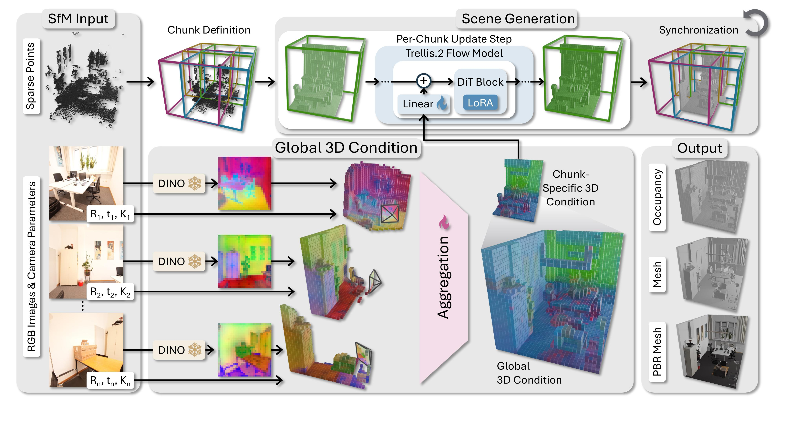

# GenRecon



## 链接

- Project page: https://kasothaphie.github.io/GenRecon/
- Code: https://github.com/kasothaphie/GenRecon
- Paper: https://arxiv.org/abs/2605.23888
- PDF: https://arxiv.org/pdf/2605.23888
- arXiv 日期: 2026-05-22
- 作者与单位: Katharina Schmid, Nicolas von Luetzow, Angela Dai, Matthias Niessner 等，Technical University of Munich；Jozef Hladky，Computing Systems Lab, Huawei Technologies, Switzerland

## 摘要要点

GenRecon 的问题设定和 Video2Mesh 很接近：输入不是单个物体图，而是一组室内场景的 posed RGB images，并希望输出可以进入渲染、编辑和内容生产流程的完整 mesh。它和传统 MVS/Poisson/GS2Mesh 最大的区别是引入强 3D 生成先验：把 Trellis.2 这样的 object-level 生成能力，通过空间化的多视角条件机制扩展到 scene-level。

论文把场景重建表述为一组空间定位、彼此重叠的 scene chunks 的条件 3D 生成。每个 chunk 不是独立凭空生成，而是由输入图像、相机位姿、SfM sparse point cloud 共同约束；方法会把 DINOv3 图像特征 lift 到 per-view volumes，再聚合成全局 3D conditioning grid，最后在一个联合 flow-matching 轨迹中生成 pose-aligned、multi-view consistent 的 PBR mesh。

它的价值不只是“补洞”，而是把生成式完整性、材质和可编辑性带入多视角场景重建。论文报告在 ScanNet++ 和 3D-FRONT 上相对 2DGS、MonoSDF、DA3、FineRecon、Murre 等 baseline 有更好的 3D 重建指标；真实 ScanNet++ 评测中 Chamfer 为 0.0688m，F-score@10cm 为 0.7771，合成 3D-FRONT 中 Chamfer 为 0.0638m，F-score@10cm 为 0.8655。

## Pipeline

| 阶段 | 作用 |
|---|---|
| posed RGB images + SfM sparse points | 输入多视角图像、相机内外参和稀疏点云，保证生成结果与真实场景坐标对齐 |
| overlapping scene chunks | 将大室内空间切成有重叠的局部 3D chunks，避免一次性生成整场景导致尺度过大 |
| DINOv3 feature lifting | 把每个视角的图像特征 lift 到 per-view 3D volumes，再聚合为全局 3D conditioning grid |
| spatially-grounded multi-view conditioning | 给 3D 生成先验加入空间锚定的多视角条件路径，减少 chunk 漂移和视角不一致 |
| Trellis.2 generative prior | 继承 object-level 3D 生成模型的几何完整性、材质和编辑友好性 |
| joint flow-matching generation | 联合生成所有 chunks，恢复 scene-level PBR mesh |

## 和 Video2Mesh 的关系

GenRecon 更像 Video2Mesh 的 P2/P3 “高质量场景 visual mesh / PBR asset”方向，而不是短期替代 P0 collider 的方法。Video2Mesh 当前主链路是：

```text
scan video
  -> COLMAP / pose / dense geometry
  -> 3DGS visual proxy
  -> Delaunay / Poisson / GS2Mesh candidates
  -> semantic sidecar
  -> simulator bundle / adapters
```

GenRecon 可以补上当前链路里最弱的一块：**场景级完整、可编辑、带材质的 visual mesh**。如果未来要从“可碰撞场景”进一步升级到“可编辑 PBR 场景资产”，它是值得重点跟踪的路线。它的输入已经假设有相机位姿和 sparse point cloud，这与 Video2Mesh 的 COLMAP/MASt3R-SLAM 前端比较匹配。

## 接入位置

```text
Video2Mesh selected frames / posed images
  -> COLMAP or MASt3R-SLAM camera poses
  -> sparse / dense scene anchor points
  -> GenRecon scene chunks
  -> PBR scene mesh
  -> import as visual mesh candidate
  -> keep Video2Mesh semantic sidecar + collider proxy + simulator adapters
```

GenRecon 输出即使是 PBR mesh，也不应直接承担全部仿真职责。Video2Mesh 仍需要保留物理层拆分：

- visual mesh：承接 GenRecon 的 PBR scene mesh。
- collider mesh：由 Delaunay、primitive proxy、convex decomposition 或简化后的 GenRecon mesh 单独生成。
- semantic sidecar：继续由 SAM/Grounded-SAM/mesh-face projection 维护，避免生成 mesh 改拓扑后丢语义。
- object-local assets：对床、椅子、柜子等可交互物体仍需要单独拆分与 bbox/pose 校准。

## 接入判断

- P0：不进入。当前 P0 目标是稳定 Web/Unity 可碰撞闭环，GenRecon 的训练/推理依赖、模型规模和 PBR mesh 后处理成本都偏高。
- P1：作为场景级 visual mesh benchmark 跟踪，和 GS2Mesh、SuGaR、2DGS/GOF 放到同一评估组。
- P2：如果代码和权重可用，可以选 bedroom/demo small scene 做离线对照，看完整性、材质、三角面规模、坐标对齐和碰撞简化难度。
- P3：作为“生成式场景资产重建”路线储备，适合未来和 Trellis.2 / Hunyuan3D object assets 形成统一生成式资产层。

## 风险

- 它依赖强生成先验，结果可能出现“合理但不真实”的 hallucinated geometry，需要与原始点云、mask 和场景尺度做审计。
- 论文限制里提到玻璃、镜面等非 Lambertian 表面仍不可靠，chunk partitioning 主要面向室内、垂直尺度约 5m 以内的场景。
- PBR mesh 对视觉资产有吸引力，但物理碰撞和机器人导航仍需要简化、封闭性检查和 material/rigid body metadata。
- 目前不要把它当作 COLMAP Delaunay 的替代品；更合适的定位是高质量 visual layer。
