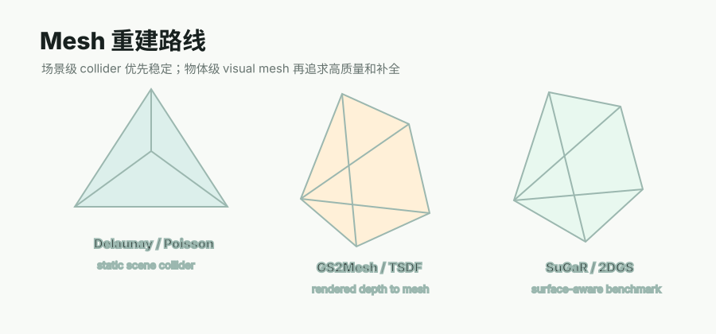

# NeuS / VolSDF

## 链接

- NeuS project: https://lingjie0206.github.io/papers/NeuS/
- NeuS paper: https://arxiv.org/abs/2106.10689
- NeuS code: https://github.com/Totoro97/NeuS
- VolSDF project: https://lioryariv.github.io/volsdf/
- VolSDF paper: https://arxiv.org/abs/2106.12052

## 摘要要点

NeuS 和 VolSDF 都属于 neural implicit surface reconstruction。它们不是直接从点云做 Poisson，而是学习一个连续 SDF 或 density/SDF 相关场，再通过体渲染约束多视角图像一致性，最后从隐式表面中抽取 mesh。

这类方法通常能得到比传统点云建面更干净的表面，尤其适合离线高质量重建；但训练时间、环境依赖、尺度对齐、texture/material 和大场景效率都比 COLMAP Delaunay 或 Poisson 更重。

## Pipeline

| 阶段 | 作用 |
|---|---|
| posed images | 输入多视角图像和相机 |
| implicit field training | 学习 SDF / density / radiance field |
| surface extraction | 通过 marching cubes 等方式抽 mesh |
| texture/material | 可选再做颜色、贴图或外观优化 |
| cleanup/export | 减面、坐标对齐、导出 GLB/OBJ |

## 输入与输出

输入：多视角图像、相机位姿、mask 或 bbox。输出：SDF、surface mesh、可选 appearance/texture。

## 在 Video2Mesh 中的位置

离线高质量资产候选，不适合当前主链路快速闭环。它更像 P2/P3 的对照路线：当我们需要单个物体或局部区域的高质量 visual mesh，可以用 neural SDF 做实验；但 P0 static collider 仍优先使用 COLMAP Delaunay。

## 接入作用

如果尝试接入，最合理方式是 object/local reconstruction：

- 对 bed、nightstand、lamp 等 object split 或 selected crop 单独训练，减少场景级复杂度。
- 将输出 mesh 回填 Video2Mesh object coordinate，再生成独立 collider。
- 用它和 GS2Mesh、SuGaR、Hunyuan3D 做 visual mesh 质量对照。

## 接入判断

- P0：不进入，训练成本和工程复杂度不适合当前闭环。
- P1：可作为少量 object/local visual mesh 对照实验。
- P2/P3：跟踪高质量 neural surface reconstruction 和 editable asset 方向。
