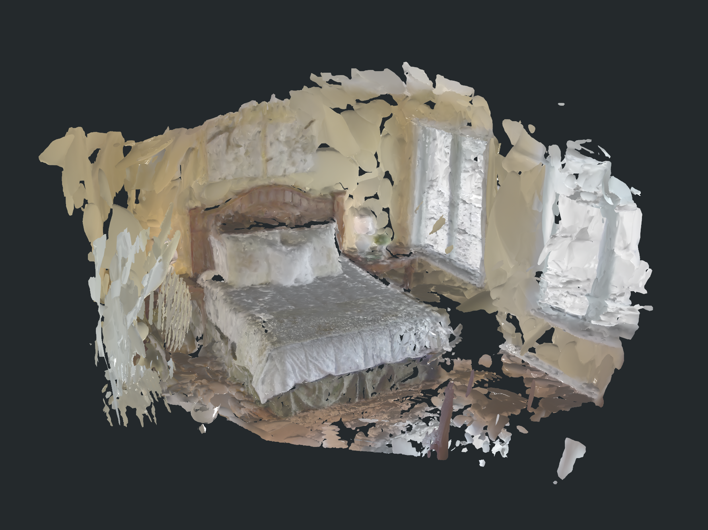
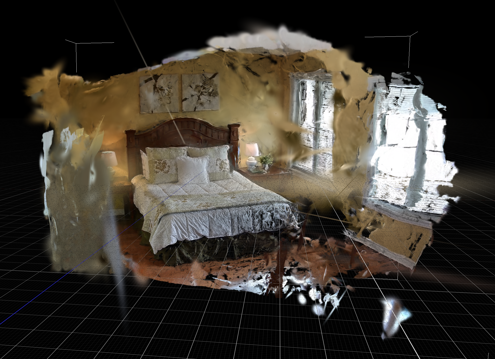
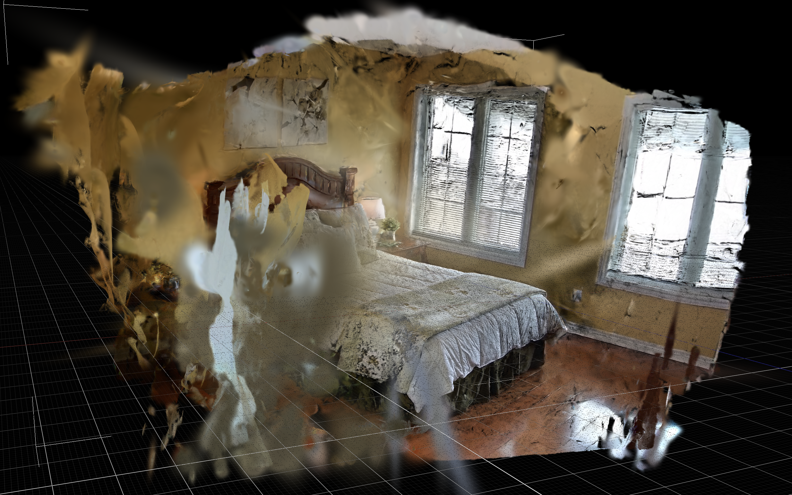
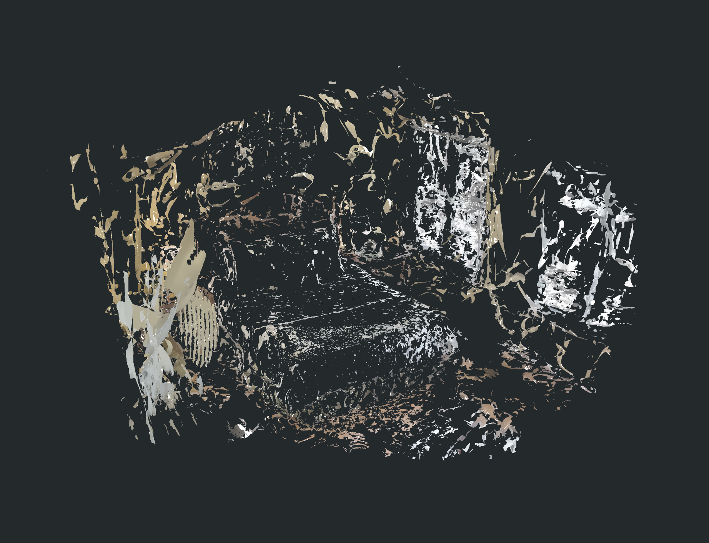
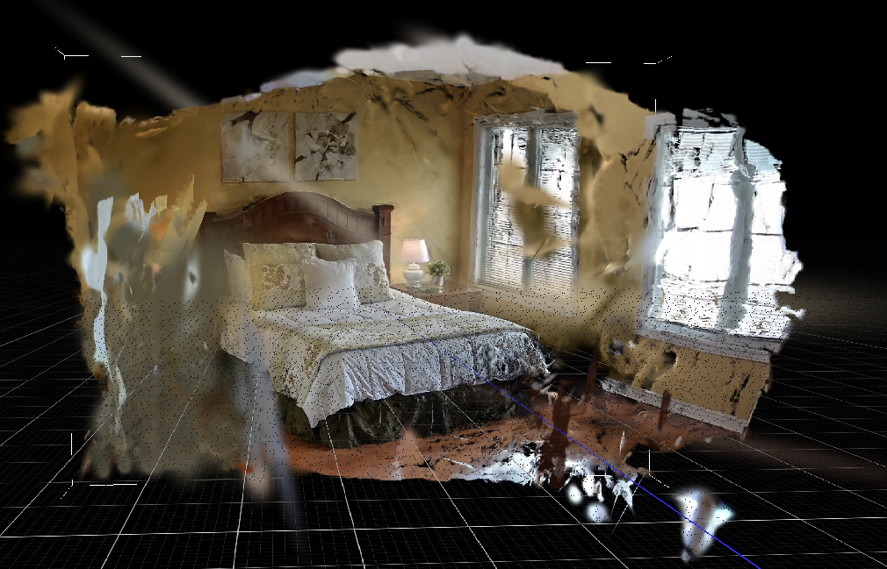

# SuGaR

## 链接

- Project / Code: https://github.com/Anttwo/SuGaR
- Project page: https://anttwo.github.io/sugar/
- Paper: https://arxiv.org/abs/2311.12775
- Venue: CVPR 2024

## 摘要要点

SuGaR 的目标是从 3D Gaussian Splatting 中快速抽取可编辑 mesh，并把 mesh 与 surface-aligned Gaussians 绑定成 hybrid representation。它先让 Gaussians 更好贴合真实表面，再从贴合后的 Gaussians 采样 surface points 并用 Poisson reconstruction 得到 mesh；后续还可以联合优化 mesh 和 Gaussians，让传统 mesh 编辑、rigging、animation、relighting 可以间接作用到 Gaussian 场景。

这条路线的意义不是“给 P0 碰撞一个更快替代品”，而是把 3DGS 从纯视觉表示推进到可编辑资产表示。它对后续 Unity/Blender/Unreal 工作流更友好，但训练、环境和后处理成本比 Delaunay collider 更高。

## Pipeline

## 输入与输出

| 阶段 | 作用 |
|---|---|
| vanilla 3DGS warm-up | 先训练短程 3DGS，让 Gaussians 粗略覆盖场景 |
| SuGaR optimization | 加 surface alignment regularization，使 Gaussians 更贴近 scene surface |
| mesh extraction | 从 aligned Gaussians 采样 surface points，并通过 Poisson 抽 mesh |
| SuGaR refinement | 联合优化 mesh 和 Gaussians，形成 Mesh + Gaussians hybrid 表示 |
| optional textured mesh | 导出传统 textured mesh，便于 Blender/Unity/Unreal 检查和编辑 |

输入：COLMAP 格式数据或已有 3DGS 训练结果。输出：coarse/refined mesh、surface-bound Gaussians、可选 textured mesh。

## 点云 / Gaussian PLY 是怎么生成的

这里说的“点云”要分两层理解：它不是传统 LiDAR 那种只有 `xyz/rgb/normal` 的稠密点云，而是 GraphDECO / SuGaR 风格的 Gaussian PLY。PLY 里每个 `vertex` 表示一个可渲染的 3D Gaussian primitive，除了位置 `x/y/z`，还带有 SH 颜色系数 `f_dc_*`、`f_rest_*`、不透明度 `opacity`、各向异性尺度 `scale_*` 和四元数旋转 `rot_*`。所以它在查看器里像点云，但本质上是可 splat 渲染的视觉层。

生成过程可以拆成四步：

1. 先由视频抽帧和 COLMAP 相机位姿提供输入坐标系。COLMAP 负责相机、稀疏点和训练视角，后面的 3DGS / SuGaR 都沿用这个坐标系。
2. 训练 vanilla 3DGS warm-up。普通 3DGS 会根据多视角照片优化大量 Gaussians 的位置、尺度、旋转、不透明度和球谐颜色，让它们能从训练相机视角重渲染房间。这一步得到的是视觉质量较好的 splat 场，但 Gaussians 可能是漂浮、拉长或没有贴在真实表面上的。
3. 做 SuGaR coarse optimization。SuGaR 在 3DGS 基础上加 surface alignment regularization，让 Gaussians 的短轴、密度场和局部表面方向更像真实 scene surface。文件名里的 `sdfestim02_sdfnorm02` 对应这类 SDF / normal 估计与约束配置；它的目的不是直接输出点云，而是把原本松散的 Gaussians 整理成更适合抽 surface 的状态。
4. 做 SuGaR refinement。先用 coarse mesh 作为绑定表面，再按每个 mesh face 放置固定数量的 Gaussians，并继续通过 Gaussian splatting rendering 优化它们。当前 refined PLY 文件名里的 `normalconsistency01_gaussperface6` 表示 refinement 时启用了 normal consistency 配置，并且每个三角面绑定 6 个 Gaussians。

这次 `bedroom_4` 的 refined PLY header 也能反推这个过程：coarse mesh 有 399,991 faces，而 refined PLY 有 2,399,946 个 Gaussian vertices，正好是 `399,991 * 6`。因此这个 refined PLY 更准确地说是“mesh surface-bound Gaussian set”，不是从 mesh 顶点简单采样出来的普通 RGB 点云。

## Mesh 是怎么重建的

SuGaR 的 mesh extraction 不是直接把 Gaussian center 连起来，也不是对普通点云做 Delaunay；它走的是“aligned Gaussian field -> surface samples -> oriented point cloud -> Poisson mesh”的路线。

核心步骤如下：

1. 从已优化的 Gaussians 构造一个可查询的密度 / SDF-like field。每个 Gaussian 都有位置、尺度、旋转和 opacity，SuGaR 利用这些参数估计哪里接近真实表面。
2. 选择一个 surface level。本次文件名里的 `level03` 表示用约 0.3 的 surface level 抽取表面。level 过低会更容易吸进漂浮噪声，level 过高又可能漏掉薄结构。
3. 在相机可见区域附近采样 surface points。SuGaR 会利用相机视角和 aligned Gaussian 的局部几何，在密度场的可见 level set 上采样点，而不是在完整 3D 体素网格里跑 Marching Cubes。这样对几百万小 Gaussians 更可扩展，也更贴近被照片观察到的表面。
4. 给采样点估计法线，形成 oriented point cloud。Poisson reconstruction 对法线方向非常敏感：如果室内外面片的 normal/winding 不一致，后面就容易出现一侧看完整、另一侧被 backface culling 剔掉的现象。
5. 用 Open3D / Poisson reconstruction 从 oriented samples 生成三角网格，再做 decimation。当前输出文件名里的 `decim200000` 是简化目标配置；实际导出的 coarse mesh header 为 216,384 vertices / 399,991 faces，并带 `x/y/z + nx/ny/nz + rgb + face indices`。

所以这条 mesh 路线的强项是：可以从 3DGS 视觉层快速得到一个有颜色、有细节的 triangle surface，适合 visual mesh baseline 和 Blender/Unity 检查。弱点也很明确：它依赖采样点法线方向、Poisson 的壳面闭合倾向和后续 decimation；对 `bedroom_4` 这种室内薄墙、窗帘/窗框高亮、床品褶皱很多的场景，mesh 很容易产生薄片、错向面和碎片。

## bedroom_4 实测观察

这次用 `bedroom_4` 片段跑通后，最有价值的结论是：SuGaR 的 refined PLY / Gaussian 视觉层已经有可用质量，mesh 重建在关闭 backface culling 或改成 double-sided 后观感也不错。局部房间结构、床、窗、墙面和地板都能被看出来，整体已经明显比纯稀疏点云更像一个可检查的室内场景。

和原版 GraphDECO 3DGS 对比时，SuGaR 的取舍很明显：原版 3DGS 渲染质量最好，但新视角下有大量拉丝、远处漂浮物和异常包围盒；SuGaR 去掉了不少远处伪影，Gaussian 更贴近表面，也可以抽出可看的 mesh。更准确的限制是：它比默认 COLMAP dense / TSDF / Poisson 路线更容易暴露 3DGS-to-mesh 的新视角空洞，未扫描到或约束不足的区域会出现孔洞、薄片和碎片。因此它更适合作为 high-quality visual / mesh benchmark，而不是当前 P0 主 collider。

本次关键输出：

| artifact | 本地路径 | 观察 |
|---|---|---|
| refined PLY / 3DGS layer | `/Users/zhangyuxiang/Desktop/worksplace/SuGaR/output/refined_ply/bedroom4_scene_only_sugar_source/sugarfine_3Dgs30000_sdfestim02_sdfnorm02_level03_decim200000_normalconsistency01_gaussperface6.ply` | 约 2,399,946 Gaussians，视觉效果不错，房间主体结构连贯 |
| coarse mesh | `/Users/zhangyuxiang/Desktop/worksplace/SuGaR/output/coarse_mesh/bedroom4_scene_only_sugar_source/sugarmesh_3Dgs30000_sdfestim02_sdfnorm02_level03_decim200000.ply` | Open3D Poisson mesh，约 216,384 vertices / 399,991 faces，但存在明显正反面/可见性问题 |
| double-sided coarse mesh | `/Users/zhangyuxiang/Desktop/worksplace/SuGaR/output/coarse_mesh/bedroom4_scene_only_sugar_source/sugarmesh_3Dgs30000_sdfestim02_sdfnorm02_level03_decim200000_double_sided.ply` | 复制反向面后约 432,768 vertices / 799,982 faces，室内视角可见性明显改善，但新视角空洞仍然存在 |

最初对 mesh 的负面判断有一部分来自查看方式：从一个外侧/特定方向看，mesh 外壳显得还比较完整；把视角切到室内方向后，大片表面会碎裂、消失或只剩零散三角片。这更像 mesh triangle winding / normal 朝向 / 单面材质可见性与 backface culling 叠加造成的误判：如果查看器启用了 backface culling，朝向反了的室内墙面、床面和窗边面片会被剔掉，于是图里看起来像正反弄反了，室内视角变得很碎甚至不显示。

把 mesh 改成 double-sided，或者在查看器里关闭 backface culling 之后，“室内视角看不见背面”的问题基本缓解，床、窗、墙和房间外壳的整体观感比单面 mesh 好很多。这个版本说明 SuGaR mesh 重建质量其实不错，作为 visual mesh baseline 是有价值的。

但这个修复没有解决 3DGS-to-mesh 的核心问题：新视角里没有扫描到或没有足够多视角约束的区域仍然是空洞。图里顶部墙面、床头上方、窗框附近、右侧外墙和地面边界都出现破洞、薄片和漂浮碎片。refined PLY 的点云/高斯视觉层质量仍然可以，照片视角附近比 mesh 更自然；但当视角移动到训练/扫描覆盖之外，未观测区域同样会显露缺口和拉丝。

和 Video2Mesh 默认的 COLMAP dense / TSDF 或 Poisson baseline 相比，SuGaR 的优势是视觉表面更贴近 3DGS，局部纹理和床/窗等主体更好看；劣势是它继承了 3DGS 新视角补全能力不足的问题。默认 COLMAP dense / TSDF / Poisson 路线虽然视觉上不一定漂亮，但几何来源更接近传统多视角重建，更适合做保守 collider 或几何 proxy；SuGaR mesh 更适合做可视化对照和高质量 visual mesh 实验，不能直接替代 P0 collider。

这会直接影响接入判断：当前 refined PLY 可以作为 `bedroom_4` 的 visual baseline 继续保留，double-sided mesh 可以用于可视化检查；但 mesh 必须继续做 normal/winding 修复、hole filling、连通域清理、density/visibility 筛选，才能进入 Video2Mesh 的 simulator asset bundle。更严格地说，在修复前它不适合承担 collider、ground probe、camera collision 或室内第一人称浏览，因为这些 runtime 依赖稳定、双侧可解释且拓扑不太破碎的表面。

## 在 Video2Mesh 中的位置

适合作为 P2 高质量 visual mesh 路线。它可以帮助回答“如果我们后续需要可编辑场景资产，而不是只要 collider，应该往哪里走”。但是短期不应该进入 P0，因为 P0 的目标是稳定的 static collision proxy 和 simulator asset bundle，而不是最漂亮的 mesh。

## 接入判断

- P0：不进入，依赖和训练时间不适合当前闭环。
- P1：refined PLY 可作为 high-quality visual baseline，和 GS2Mesh、2DGS/GOF 放在同一组对照；mesh 需要先修 normal/winding、双面可见性和碎片清理。
- P2/P3：如果后面要把 mesh 编辑、物体动画、Blender/Unity 资产修改接入 Video2Mesh，可以重新评估 SuGaR hybrid representation。
