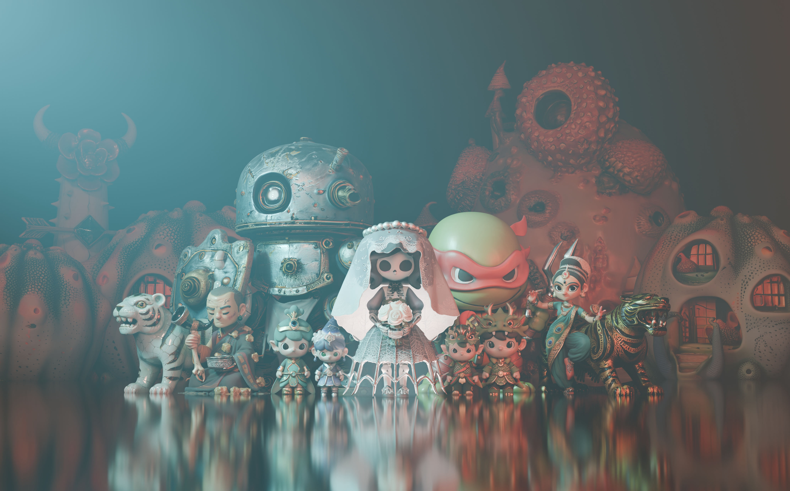
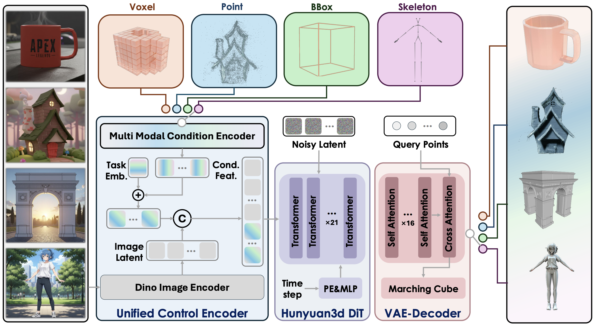

# Hunyuan3D 图生 3D 物体资产



## 链接

- 官方在线平台: [腾讯混元 3D](https://3d.hunyuan.tencent.com/)
- Hunyuan3D-2.1: [GitHub](https://github.com/Tencent-Hunyuan/Hunyuan3D-2.1) / [模型](https://huggingface.co/tencent/Hunyuan3D-2.1) / [Demo](https://huggingface.co/spaces/tencent/Hunyuan3D-2.1) / [技术报告](https://arxiv.org/abs/2506.15442)
- Hunyuan3D-2.0: [GitHub](https://github.com/Tencent-Hunyuan/Hunyuan3D-2) / [模型](https://huggingface.co/tencent/Hunyuan3D-2) / [技术报告](https://arxiv.org/abs/2501.12202)
- Hunyuan3D-2mv: [多视图模型](https://huggingface.co/tencent/Hunyuan3D-2mv)
- Hunyuan3D-2.5: [技术报告](https://arxiv.org/abs/2506.16504)
- Hunyuan3D-Omni: [GitHub](https://github.com/Tencent-Hunyuan/Hunyuan3D-Omni) / [模型](https://huggingface.co/tencent/Hunyuan3D-Omni) / [技术报告](https://arxiv.org/abs/2509.21245)
- Hunyuan3D-Part: [GitHub](https://github.com/Tencent-Hunyuan/Hunyuan3D-Part) / [模型](https://huggingface.co/tencent/Hunyuan3D-Part)

## 一句话结论

Hunyuan3D 是一组面向 **单物体 3D asset generation** 的模型，而不是从扫描视频恢复整房间的 scene reconstruction 模型。它适合把一张或多张物体参考图变成 object-local triangle mesh，再生成 UV 和 PBR 材质；它不会自动恢复 Video2Mesh 所需的真实尺度、场景位姿、语义 ID、支撑关系、碰撞体、质量和惯量。

对 Video2Mesh 的推荐顺序是：

1. **Hunyuan3D-2.1 作为可复现基线**：公开 shape / PBR 权重、推理代码和训练代码，能输出 watertight visual mesh 与 albedo / metallic / roughness 材质。
2. **Hunyuan3D-Omni 作为更匹配扫描数据的实验路线**：除了图像，还能加入 object mask cloud、voxel 或 3D bbox 控制，比单图自由生成更有机会保留扫描物体的结构。
3. **Hunyuan3D-2mv 作为真实多视图对照**：消费同一实例的不同观测视角，不能把一张图复制或伪装成多视图。
4. **2.5 与在线 v3.x 只作为质量上限或人工服务对照**：截至 2026-07-23，本次核对未在腾讯官方 GitHub / Hugging Face 找到对应 2.5 或 v3.x 的公开权重与本地推理仓库，不能写成已具备可复现的本地 backend。

## 版本地图

| 版本 | 公开状态 | 主要输入 | 主要产物 | 官方资源需求或规模 | 对 Video2Mesh 的意义 |
|---|---|---|---|---|---|
| Hunyuan3D-2.0 | 推理代码与权重公开 | 单图；另有 2mv 多视图 checkpoint | bare mesh + RGB texture | 1.1B shape；0.6B mini；官方称 shape 约 6 GB VRAM，shape + texture 约 16 GB | 低成本基线、2mv 多视图对照 |
| Hunyuan3D-2.1 | 权重、推理与训练代码公开 | 单张主体图 | watertight mesh + PBR texture | 3.3B shape、2B paint；shape 10 GB、texture 21 GB、完整流程官方标注 29 GB VRAM | 当前最完整的开源质量基线 |
| Hunyuan3D-2.5 | 技术报告公开，未发现官方公开权重 | 单图或 4 视图 | high-detail mesh + PBR material | 报告中的 LATTICE 最大 10B；材质推理最高使用 768 x 768 多视图图像 | 可作为闭源/在线效果上限，不适合作为本地可复现依赖 |
| Hunyuan3D-Omni | shape 权重与代码公开 | 图像 + point / voxel / bbox / skeleton 中一种控制 | GLB mesh + 派生 sampled-point PLY | 3.3B；官方称 10 GB VRAM；HF 完整文件约 25.7 GB，包含普通与 EMA 权重 | 最值得测试 object mask cloud 与 bbox 约束 |
| Hunyuan3D-Part | P3-SAM / X-Part 代码与权重公开 | 已有完整 mesh | part segmentation、part bbox、完整部件生成 | 当前 X-Part 是 light version | 生成后拆件、语义部件与可动结构候选，不是图生 3D 起点 |

### 在线平台的 v3.x 不能等同于开源版本

2026-07-23 核对官方在线平台前端时，可以看到 `v3.0`、`v3.1` 和 `v3.5` 的模型枚举：

- v3.0 标注“36 亿建模体素”，强调复杂物体与人物生成。这里的“建模体素”不是 36 亿模型参数。
- v3.1 标注更精细几何、更还原的纹理颜色和更多参考视图控制。
- v3.5 标注更强的几何结构跟随、细节保真和更整洁纹理。

这些描述来自在线平台当前资源，账号是否可见、具体 API、参数量、显存、训练数据和输出许可仍以平台实际页面与服务协议为准。本次没有找到与这些在线版本一一对应的公开论文、权重和官方本地仓库，因此本文不把它们与 Hunyuan3D-2.1 的本地能力混为一谈。

## Hunyuan3D-2.1 Pipeline


```text
single-object image
  -> background removal / resize / centering
  -> DINOv2 Giant image features
  -> flow-matching Hunyuan3D-DiT
  -> ShapeVAE latent tokens
  -> SDF field query
  -> Marching Cubes
  -> untextured watertight triangle mesh
  -> normal + canonical coordinate maps + multi-view render conditions
  -> Hunyuan3D-Paint PBR diffusion
  -> albedo + metallic + roughness
  -> UV baking / GLB export
```

### 1. 输入图预处理

官方 shape pipeline 使用 DINOv2 Giant 对 518 x 518 图像提取条件特征。模型训练和推理都倾向于：

- 去掉背景，只保留一个主体。
- 保持主体完整，不裁掉腿、把手、靠背或底座。
- 将物体缩放到统一范围并居中。
- 使用白色或透明背景，减少原场景背景对隐面生成的干扰。

这与 Video2Mesh 的真实入口一致：`select-frames` 先挑选视角，`prepare-object-images` 根据 mask 生成带 padding 的方形透明 crop。原始整帧应作为 provenance 保留，但不建议直接把包含床、墙、窗户等多个实例的整图送给模型。

### 2. ShapeVAE 如何生成几何

Hunyuan3D-2.1 不是“先生成普通点云，再用 Poisson 重建 mesh”。它的几何路径是：

1. 训练数据中的 mesh 先归一化到以原点为中心的单位空间。
2. 对破损或非封闭网格构造 SDF，并用 generalized winding number 判断内外，再经 Marching Cubes 得到 watertight 训练表面。
3. 从表面均匀采样，并额外在高曲率、尖角和边缘区域做 importance sampling。
4. ShapeVAE encoder 把表面点及其几何信息压缩成可变长度 latent token；公开配置的最大 token 长度为 3072。
5. Hunyuan3D-DiT 用 flow matching 从噪声 latent 预测受输入图约束的 shape latent。
6. VAE decoder 在 3D query grid 上预测 SDF，最后用 Marching Cubes 提取三角网格。

公开 Gradio 路径默认 `octree_resolution=256`，界面允许提高到 512；更高分辨率通常会提高细节、面数、显存与解码时间。它不会生成可直接复用的 CAD 拓扑、四边面拓扑、骨骼或装配约束。

### 3. 点云产物应如何理解

模型内部会使用 mesh surface samples，Omni 代码也会把 `sampled_point` 另存为 ASCII PLY，但这个 PLY 是生成 mesh/隐式表面的派生采样，不是：

- 来自 Video2Mesh 相机和深度的实测点云。
- GraphDECO 3DGS 的 Gaussian PLY。
- 带 `object_id` / `object_probability` 的 semantic 3DGS。
- 保持真实场景尺度和坐标的 object mask cloud。

因此接入时应分别保存 `source_mask_cloud.ply` 和 `generated_surface_samples.ply`，不能用生成采样覆盖实测几何证据。Omni 的 point-control 输入可以消费 object mask cloud，但输出仍必须重新对齐与验收。

### 4. PBR 材质如何生成

Hunyuan3D-Paint 与 shape model 解耦，因此既能给生成 mesh 上色，也能给外部 mesh 生成材质。2.1 的主要步骤是：

1. 从 mesh 渲染 normal map 和 canonical coordinate map 作为几何条件。
2. 以参考图为外观条件，通过 multi-view diffusion 生成多个一致视角。
3. albedo 分支与 metallic-roughness 分支共享空间注意力信息，降低不同材质通道错位。
4. 3D-Aware RoPE 把 3D 坐标注入跨视图注意力，减少接缝与重影。
5. illumination-invariant training 尝试把输入图的灯光和阴影从固有 albedo 中分离。
6. 将多视图结果烘焙回 UV，输出带 PBR 材质的 OBJ/GLB。

官方 demo 配置支持 6 到 9 个生成视图、512 或 768 分辨率。PBR 输出对 Web/Unity/Unreal 的视觉资产更有价值，但它仍是从单图推断不可见材质；背面纹理、金属度与粗糙度不能视为实测物理属性。

## Hunyuan3D-Omni 为什么更适合 Video2Mesh



Hunyuan3D-Omni 继承 2.1 的图像编码、DiT、ShapeVAE 与 Marching Cubes 路线，并增加统一 control encoder。开源推理一次选择一种额外控制：

| 控制 | 官方输入 | 对 Video2Mesh 的映射 | 预期价值 | 主要风险 |
|---|---|---|---|---|
| `point` | 图像 + PLY/OBJ 表面点 | `export-object-mask-clouds` 的 object mask cloud | 尽量保留扫描到的粗几何和比例 | 输入点云有遮挡、混入背景或坐标错误时会把缺陷固化 |
| `voxel` | 图像 + voxelized PLY/OBJ | 清理后的对象占据栅格 | 给出更强的体积约束 | 体素分辨率与坐标归一化会损失细腿、把手和薄板 |
| `bbox` | 图像 + `[xmin,ymin,zmin,xmax,ymax,zmax]` | object 3D bbox 归一化后的形状约束 | 限制长宽高和占据范围 | bbox 只约束外包络，不保证内部结构和朝向正确 |
| `pose` | 人物图像 + skeleton points | 人形角色或骨架先验 | 控制人物姿态 | 与普通家具补全关系较弱，不输出 rigged character |

Omni 示例使用 50 个推理步、`octree_resolution=512`、`guidance_scale=4.5`，后处理包含 floater removal 与 degenerate-face removal，输出 GLB、sampled-point PLY 和输入图副本。这里的参数是官方示例，不是本项目已经调优的配置。

Omni 当前仓库主要是 **shape generation**。若需要 PBR 纹理，仍应把清理后的 GLB/OBJ 交给 Hunyuan3D-Paint-2.1 或另一套 texture backend；不能因 Omni 继承 2.1 shape 架构就默认它已经输出完整 PBR 资产。

## Hunyuan3D-Part 的相邻价值

Hunyuan3D-Part 由 P3-SAM 和 X-Part 两部分组成：P3-SAM 对完整 mesh 做原生 3D part segmentation，输出 part features、segments 和 part bbox；X-Part 再生成结构完整的独立部件。它适合接在 Hunyuan3D / TRELLIS 生成之后，用于：

- 把柜门、抽屉、把手、椅腿等拆成单独 part。
- 为后续 joint、affordance、grasp 和 collider 分解提供候选。
- 修复被整体 mesh 黏连或局部缺失的部件。

它不是从扫描图直接生成完整 object 的替代模型。官方还明确说明当前开源 X-Part 是 light version，完整版本在 Hunyuan3D Studio；所以不能把 online full version 的效果写成本地开源能力。

## 部署成本

### Hunyuan3D-2.1 官方环境

| 项 | 官方或代码证据 | 工程判断 |
|---|---|---|
| Python | 3.10 | 建独立环境，不与 Video2Mesh 主环境硬合并 |
| PyTorch | 2.5.1 + CUDA 12.4 | Linux + NVIDIA 是最稳妥参考路径 |
| shape VRAM | 10 GB | 仅 shape 可在中端 NVIDIA 卡测试 |
| texture VRAM | 21 GB | 24 GB 卡需要低显存/分阶段实测；32 GB 更稳妥 |
| shape + texture | 官方标注总计 29 GB | 不应假定 24 GB 卡无条件跑完整默认配置 |
| 模型文件 | HF 当前文件合计约 14.9 GB | 加 Python/CUDA 环境、编译缓存与输出，建议至少预留 35 GB 可用磁盘 |
| 自定义编译 | custom rasterizer、DifferentiableRenderer | PBR 路径需要编译工具链，部署风险高于 shape-only |
| 附加权重 | RealESRGAN x4plus | 用于纹理增强，需单独下载 |
| 系统支持声明 | macOS / Windows / Linux | requirements 含 `cupy-cuda12x`，完整 PBR 的参考部署仍明显偏 NVIDIA CUDA |

Hunyuan3D-Omni 官方标注 10 GB VRAM，但 Hugging Face 当前完整文件约 25.7 GB，包含普通模型、EMA 模型和 VAE。应使用独立模型缓存，并在服务器部署前确认到底选择普通权重还是 `--use_ema`，避免无计划地重复下载。

### 官方最小 2.1 调用形态

```python
from PIL import Image
from hy3dshape.pipelines import Hunyuan3DDiTFlowMatchingPipeline

shape = Hunyuan3DDiTFlowMatchingPipeline.from_pretrained(
    "tencent/Hunyuan3D-2.1"
)
image = Image.open("object.png").convert("RGBA")
mesh = shape(image=image)[0]
mesh.export("object_untextured.glb")
```

完整 PBR 路径还要加载 `Hunyuan3DPaintPipeline`，编译两个 renderer 扩展，并把未纹理 mesh 与原始参考图一起传入。建议把 shape 和 paint 拆成两个可恢复任务，分别记录峰值显存、运行时间、seed、steps、octree resolution 和失败日志，而不是放进一个不可观察的长进程。

## 官方评测应该怎样读

### Hunyuan3D-2.1 shape

技术报告在生成 mesh 表面采样 8,192 个点，用 ULIP / Uni3D 比较点云与输入图、VLM caption 的相似度：

| 模型 | ULIP-T ↑ | ULIP-I ↑ | Uni3D-T ↑ | Uni3D-I ↑ |
|---|---:|---:|---:|---:|
| TRELLIS | 0.0769 | 0.1267 | 0.2496 | 0.3116 |
| TripoSG | 0.0767 | 0.1225 | 0.2506 | 0.3129 |
| Step1X-3D | 0.0735 | 0.1183 | 0.2554 | 0.3195 |
| Hunyuan3D-Shape-2.1 | **0.0774** | **0.1395** | **0.2556** | **0.3213** |

### Hunyuan3D-2.1 texture

| 模型 | CLIP-FID ↓ | CMMD ↓ | CLIP-I ↑ | LPIPS ↓ |
|---|---:|---:|---:|---:|
| Hunyuan3D-2.0 | 26.44 | 2.318 | 0.8893 | 0.1261 |
| Hunyuan3D-Paint-2.1 | **24.78** | **2.191** | **0.9207** | **0.1211** |

### Hunyuan3D-2.5 报告

2.5 的最大 LATTICE 模型为 10B，报告给出的 shape 指标为 ULIP-T 0.07853、ULIP-I 0.1306、Uni3D-T 0.2542、Uni3D-I 0.3151；PBR texture 指标为 CLIP-FID 23.97、FID 165.8、CMMD 2.064、CLIP-I 0.9281、LPIPS 0.1231。

这些数字只能说明作者评测协议下的条件跟随和外观相似度，不能回答以下 Video2Mesh 问题：

- 与实测 object mask cloud 的 Chamfer / F-score 是否更好。
- 回填扫描场景后的 bbox、pose 和 support-plane 误差。
- mesh 是否 manifold、是否存在自交、薄片和内部空壳。
- collider 的接触稳定性、穿透率和物理仿真成功率。
- 输入视频多视角上的纹理重投影误差。

因此不能用论文的 ULIP / CLIP 指标替代本项目验收。

## 适合与不适合的输入

### 更适合

- 清晰、单主体、轮廓完整、背景已移除的物体图。
- 椅子、床头柜、台灯、花盆、小桌、玩具、工具等 object-local rigid asset。
- 有 3 到 4 个真实不同视角，并能保持同一实例与一致 mask 的输入。
- 扫描 mesh 已碎裂，但 object mask cloud 与 3D bbox 仍能提供粗结构的物体。
- 目标是 visual completion，允许未观测面带生成式先验。

### 风险较高

- 床、整面柜体、窗户、墙面等与房间结构强耦合的大物体。
- 镜子、玻璃、透明、反光和极薄结构。
- 多个实例互相遮挡、主体被严重裁切或 mask 混入背景。
- 必须保持真实制造尺寸、精确孔位、机械装配和工程公差的资产。
- 直接作为 dynamic collider、机器人抓取几何或安全关键仿真资产。
- 单图完全看不到背面，但要求背面与真实对象一致的任务。

## 在 Video2Mesh 中的正确位置

Hunyuan3D 应接在语义物体提取之后、simulator bundle 之前：

```text
scan video + cameras
  -> GroundingDINO / SAM2 object tracks
  -> 2D-to-3D semantic fusion
  -> object mask cloud + 3D bbox + selected frames
  -> prepare-object-images
  -> Hunyuan3D-2.1 / 2mv / Omni shape generation
  -> optional Hunyuan3D-Paint-2.1
  -> generated object-local visual mesh
  -> import-object-meshes
  -> bbox / pose / support alignment
  -> independent collider proxy
  -> semantic + physics + provenance sidecars
  -> simulator bundle / Web / MuJoCo / Isaac / Unity adapter
```

当前仓库已经有真实入口：

```bash
python -m video2mesh.cli select-frames \
  --project-root <project>

python -m video2mesh.cli prepare-object-images \
  --project-root <project> \
  --transparent

python -m video2mesh.cli prepare-multiview-mesh-jobs \
  --project-root <project> \
  --provider hunyuan3d \
  --mesh-format glb

python -m video2mesh.cli import-object-meshes \
  --project-root <project> \
  --mesh-manifest <mesh_manifest.json> \
  --provider hunyuan3d-2.1 \
  --coordinate-frame object_local \
  --copy-to-assets

python -m video2mesh.cli export-simulator-assets \
  --project-root <project> \
  --copy-meshes \
  --fit-object-local-meshes-to-bbox \
  --collision-proxy bbox
```

`export-image-blaster -> mesh-commands` 也能把 provider 设为 `hunyuan`，但那条路径负责 job 目录和外部 provider 调用，不代表当前 Video2Mesh 仓库已经内置 Hunyuan3D-2.1 Python 推理适配器。

## 推荐实验设计

先选择 3 个代表物体，不要一开始批量替换整场景：

| 物体类型 | 目的 | 建议路线 |
|---|---|---|
| 台灯或花盆 | 测试细杆、薄壁与小物体 | 2.1 single-image vs Omni point-control |
| 床头柜或椅子 | 测试规则结构、支撑面和 bbox | 2.1 vs 2mv vs Omni bbox-control |
| 床或大柜体 | 测试大物体与场景耦合失败边界 | 只做候选，不直接替换 collider |

每个物体跑三组：

1. **A / 2.1 单图基线**：primary transparent crop，固定 seed 与 octree resolution。
2. **B / 2mv 多视图**：同一实例 3 到 4 个真实观测视角，记录相机和 mask 来源。
3. **C / Omni 几何约束**：primary crop + 清理后的 object mask cloud；另做 bbox-control 消融。

三组 shape 都可以再用同一套 Hunyuan3D-Paint-2.1 上色，从而把 shape 差异与 texture 差异拆开。不要让不同版本、不同输入图、不同 texture backend 同时变化，否则无法判断改进来自哪里。

## 输出合同

每个生成物体至少保留：

| 字段 / 文件 | 说明 |
|---|---|
| `input/original_frame.*` | 原始视频帧，不做生成输入覆盖 |
| `input/object_crop.png` | mask 后的主参考图 |
| `input/selected_views.json` | 帧号、相机、mask、可见面积与选择分数 |
| `input/object_mask_cloud.ply` | 实测 object-level 点云，供 Omni 或几何 QA |
| `input/bbox_3d.json` | Video2Mesh scene frame 下的 bbox |
| `output/raw_mesh.glb` | 未做场景尺度回填的生成 mesh |
| `output/textured_mesh.glb` | PBR visual mesh |
| `output/albedo.*` / `metallic.*` / `roughness.*` | 可追踪的材质通道 |
| `output/collider.*` | 独立生成的 bbox / convex / compound proxy，不复用高面数 visual mesh |
| `run.json` | model id、revision、seed、steps、octree resolution、显存、耗时 |
| `qa.json` | mesh、alignment、render、physics 质量结果 |
| `provenance.json` | observed / generated 区域、模型许可和人工选择记录 |

## 验收门槛

### Geometry

- vertex / face count、连通分量、watertight、manifold、退化面、自交和法线方向。
- 与 object mask cloud 的 Chamfer / F-score，且分开统计 observed surface 与 hallucinated surface。
- 细腿、把手、灯杆、薄板有没有粘连、断裂或被 Marching Cubes 吃掉。
- 简化到 Web/引擎预算后，轮廓与关键结构是否仍保留。

### Alignment

- object-local mesh 回填后的 3D bbox IoU、中心误差、尺度比和朝向。
- 支撑面与 floor / tabletop 的距离。
- 与相邻物体的 penetration count 和 penetration depth。
- 真实相机视角下的 silhouette IoU 与可见区域重投影误差。

### Appearance

- selected source views 上的纹理重投影一致性。
- 背面接缝、颜色漂移、重复纹理、阴影是否被错误烘进 albedo。
- metallic / roughness 是否符合物体类别常识，并标记为生成估计而非实测材料。
- Web GLB viewer 和目标引擎是否正确解析 PBR channel。

### Physics

- visual mesh 不参与默认 raycast / collision；由 collider proxy 承担。
- collider 面数、凸性、接触稳定性、落地和抓取 smoke test。
- mass、density、friction、inertia 必须来自单独估计或标注，不能从 PBR texture 推断为真值。

## 当前本地状态

| 项目 | 状态 | 证据边界 |
|---|---|---|
| 官方 2.0 / 2.1 / 2.5 论文 | Passed | 已核对 architecture、训练数据、PBR 与官方评测表 |
| 官方 2.0 / 2.1 / Omni / Part 仓库 | Passed | 已核对 README、requirements、license、示例和当前公开 revision |
| 2.1 / Omni 权重下载 | Not tested | 只核对 Hugging Face 文件清单与体积，没有在本地下载大权重 |
| Hunyuan3D 本地推理 | Not tested | 当前没有生成 GLB、运行日志、峰值显存或耗时 |
| Video2Mesh object import | Not tested for Hunyuan3D | CLI 合同已存在，但没有 Hunyuan3D 产物回填证据 |
| 论文指标 | Reused | 仅引用官方协议，不能当作本项目实验指标 |
| 在线 v3.x | Platform observation | 只确认官方平台前端版本项，不代表公开权重或稳定 API |

因此本文是 **调研与接入设计**，不是 Hunyuan3D 已在 bedroom4 或其他 Video2Mesh 场景完成复现的实验报告。

## 许可证与发布风险

Hunyuan3D-2.1 和 Omni 使用 Tencent Hunyuan community license，而不是常见 MIT / Apache-2.0。2.1 当前许可证至少包含这些需要产品负责人和法务再确认的约束：

- 授权地域排除欧盟、英国和韩国，许可证还限制输出在地域外的使用、分发和展示。
- 版本发布时前一个月所有产品或服务月活超过 100 万的主体需要另行申请许可。
- 不得用模型输出改进其他 AI 模型，Hunyuan3D 自身或其 derivative 除外。
- 分发模型或衍生物需要附带 license / notice 与使用限制。
- 腾讯不主张用户生成 output 的权利，但 output 的使用仍受协议和 acceptable use policy 约束。

这不是法律意见。若把生成 GLB 发布到公开站点、面向海外用户、训练其他模型、提供 hosted API 或进入商业产品，必须按实际版本重新审阅仓库 `LICENSE`、模型页和在线服务协议，不能只依据“fully open-source”宣传语判断可用性。

## 风险与接入判断

- **P0：不进入。** P0 的 scene collider、3DGS visual layer 和 semantic sidecar 不应依赖生成式 object mesh。
- **P1：进入小规模 object visual completion 对照。** 首选 2.1 single-image；必须保留原始 object mesh / mask cloud，生成结果只作为可切换 visual candidate。
- **P1.5：优先研究 Omni point / bbox control。** 这是 Hunyuan3D 家族与 Video2Mesh 扫描证据结合最紧密的路线。
- **P2：评估 2mv 与 Hunyuan3D-Part。** 多视图改善一致性，Part 为抽屉、柜门、把手等后续交互结构提供候选。
- **在线 2.5 / v3.x：只做人工质量对照或有正式 API 合同后的 provider。** 不抓取私有 Web 接口，不把 UI 可见版本写成稳定自动化服务。
- **核心风险：好看不等于真实或可仿真。** 不可见面、内部结构、PBR 参数、尺度与 collider 都可能是合理化生成，必须通过场景证据和 simulator gate 验收。

## 最终建议

Hunyuan3D 值得接入，但不建议把工作重点放在“追最新在线版本”。Video2Mesh 当前最有信息增益的实验是：用同一批 `object_crop + object_mask_cloud + bbox`，比较 **2.1 单图、2mv 多图、Omni point/bbox-control**，统一走 2.1 PBR texture，再用本项目现有 `import-object-meshes -> export-simulator-assets -> qa-simulator-assets` 做闭环。

如果 Omni 能在保持扫描 bbox、支撑面和可见轮廓的同时补全隐面，它会比纯单图 Hunyuan3D 更适合成为 Video2Mesh 的长期 object completion backend；如果只能提升观感而几何偏差仍大，就应把它限制为 visual mesh 候选，collider 与真实尺度继续由扫描几何负责。

## 本次核对版本

调研日期为 2026-07-23，核对的官方仓库 revision：

- Hunyuan3D-2: `f8db63096c8282cb27354314d896feba5ba6ff8a`
- Hunyuan3D-2.1: `82920d643c0dc2f7bfd7255f45f62d386edfe60c`
- Hunyuan3D-Omni: `4d47c0cc2bd0c4281963a7314ab330a5af36bfa8`
- Hunyuan3D-Part: `e96be065375438962375b55326416291342958a7`
