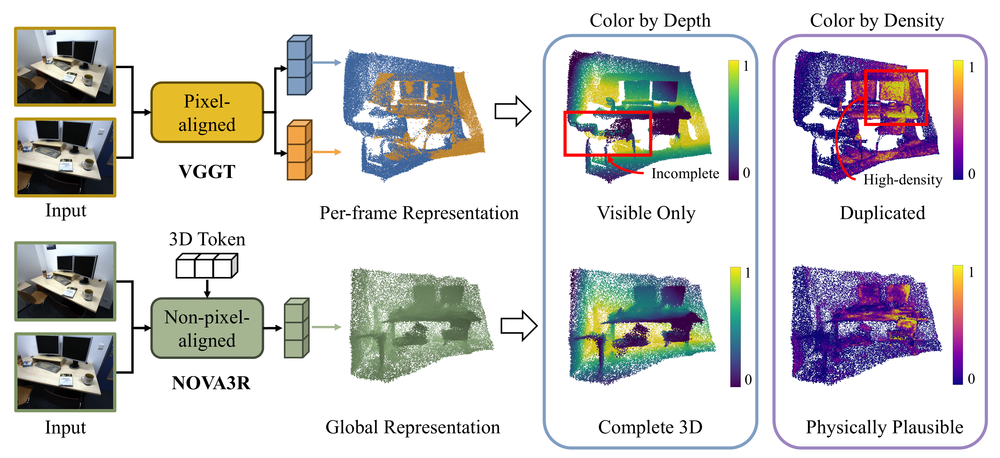
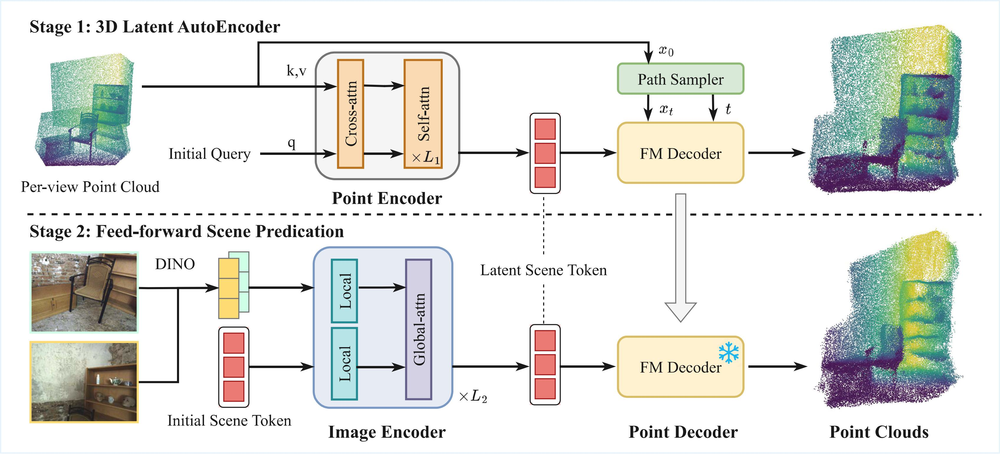
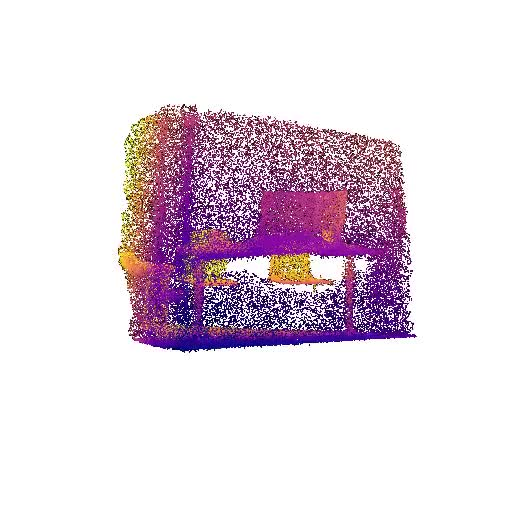
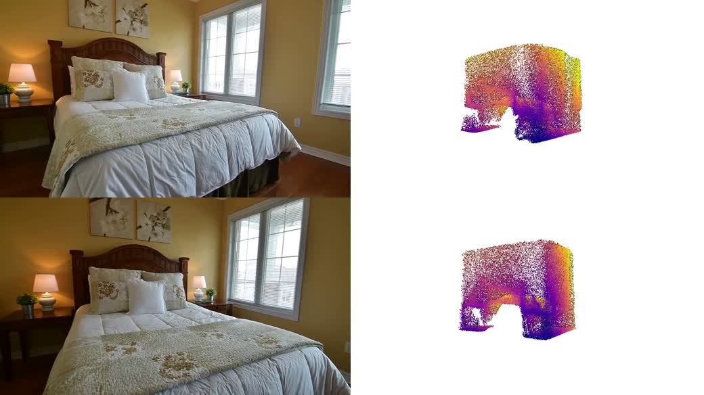
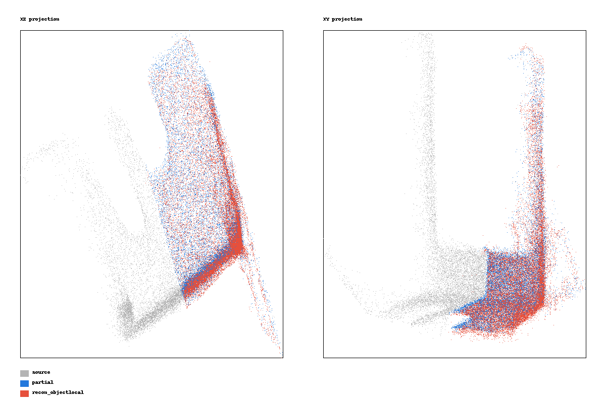
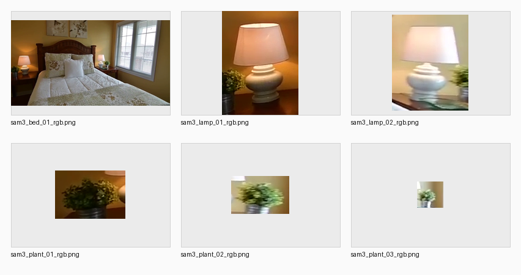
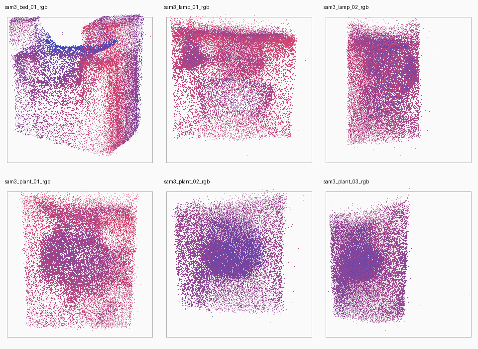
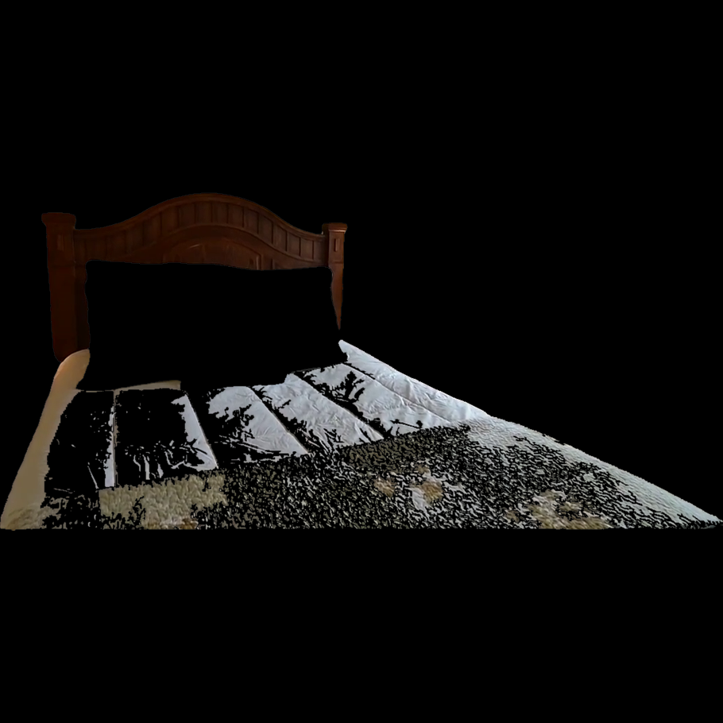
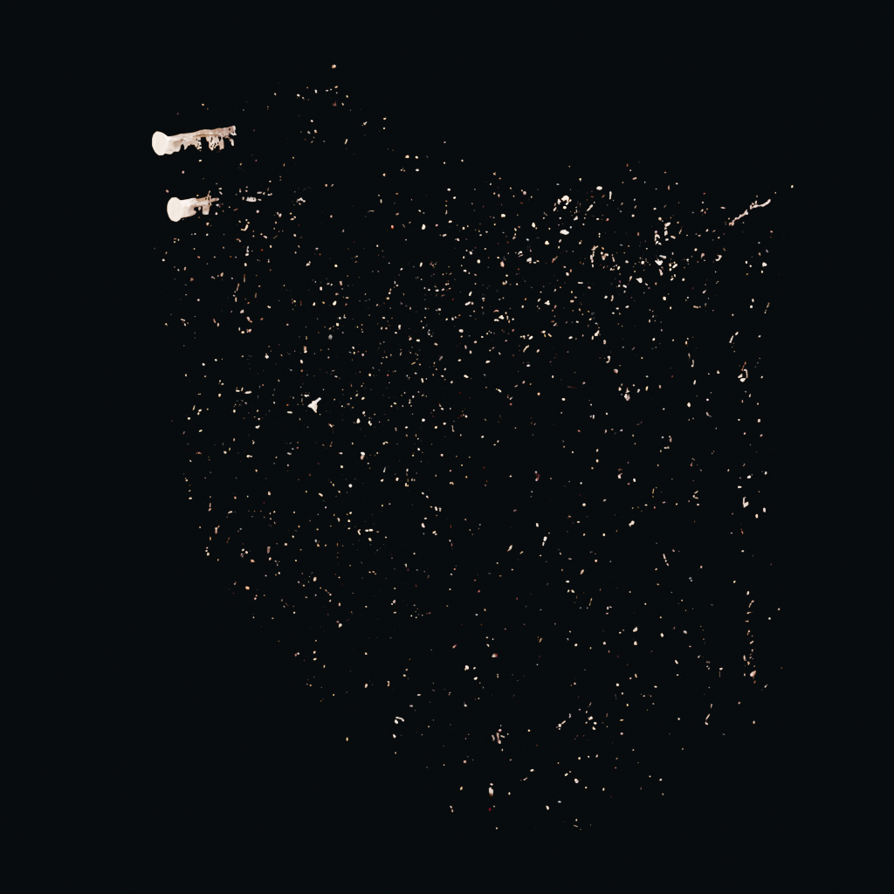

# NOVA3R



## 链接

- Paper: https://arxiv.org/abs/2603.04179
- PDF: https://arxiv.org/pdf/2603.04179
- Project page: https://wrchen530.github.io/nova3r/
- GitHub: https://github.com/wrchen530/nova3r
- Hugging Face checkpoints: https://huggingface.co/wrchen530/nova3r
- OpenReview: https://openreview.net/forum?id=c0QRZMKwSb
- 论文标题: NOVA3R: Non-pixel-aligned Visual Transformer for Amodal 3D Reconstruction
- 发表信息: ICLR 2026，arXiv v1 发布于 2026-03-04
- 作者与单位: Weirong Chen, Chuanxia Zheng, Ganlin Zhang, Andrea Vedaldi, Daniel Cremers；TU Munich、MCML、University of Oxford、NTU
- 许可证: GitHub README 标注 Apache-2.0；第三方组件保留各自许可证

## 摘要要点

NOVA3R 解决的是从未标定位姿图像做 amodal 3D reconstruction：输入 1-2 张未给 camera pose 的图像，模型不是按每个像素或每条 ray 输出点，而是学习全局、view-agnostic 的 scene tokens，再通过 diffusion / flow-matching 3D decoder 生成非像素对齐的完整点云。论文声称这样能缓解 pixel-aligned 方法的两个典型问题：只能重建可见表面，以及多视图重叠区域产生重复或密度不均的结构。

这对 Video2Mesh 的价值非常明确：NOVA3R 不是直接 mesh generator，也不是 simulator collider 工具；它更适合作为 object-level 或局部 scene-level 的点云补全器。它可以把被遮挡、只有少数视角、或 pixel-aligned 方法容易重复堆点的物体区域，先恢复为一个更完整的点云，再交给 Video2Mesh 的 surface reconstruction、bbox/pose 对齐、mesh cleanup、semantic sidecar 和 collider proxy 处理。

官方 README 已发布 demo、evaluation、training code 和 checkpoints。当前可下载权重包括 `scene_n1`、`scene_n2`、`scene_ae` 三个 Hugging Face 目录；README 表格标注 `scene_n1` / `scene_n2` 各约 5.8GB，`scene_ae` 约 262MB，模型仓库 API 显示总存储约 12.6GB。需要注意的是，官方 `scripts/download_checkpoints.sh` 当前默认只下载 `scene_n1` 和 `scene_n2`，没有把 `scene_ae` 纳入 `all` 逻辑；如要跑 AE demo，需要额外确认或手动下载 `scene_ae/checkpoint-last.pth` 和 Hydra config。

## Pipeline



| 阶段 | 输入 | 输出 | 作用 |
|---|---|---|---|
| Stage 1 Pts2Pts autoencoder | 完整点云或训练时的 aggregated per-view point clouds | scene tokens + 重建点云 | 学习非像素对齐、全局的点云 latent 表示；使用 farthest point sampling 降低可见区域重叠导致的密度偏置 |
| Flow-matching 3D decoder | scene tokens、随机 query points / noisy points | 非像素对齐完整点云 | 用 flow matching 而不是 Chamfer-only 最近邻目标来建模 unordered point cloud，提升全局结构和密度稳定性 |
| Stage 2 Img2Pts Transformer | 1-2 张未给 pose 的 RGB 图像 | image-conditioned scene tokens | 复用 VGGT 风格的 local/global attention 和图像 tokenizer，把图像条件映射到 Stage 1 的点云 latent 空间 |
| Feed-forward inference | 单图或双图，默认 resolution 518x392，`num_queries` 默认 50k | `pointcloud.ply` 和 360 度 `pointcloud.mp4` | demo 直接输出点云和预览视频；Python API 返回形状为 `(N, 3)` 的 numpy 点数组 |
| 可选 TRELLIS 集成 | NOVA3R 完整点云 | active voxel positions，再进入 TRELLIS Stage 2 | 官方项目页展示用 NOVA3R 替换 TRELLIS Stage 1 active voxel prediction，以提升真实场景几何约束和多视图一致性 |

## 输入与输出

| 模型 | 训练数据 | 输入 | 输出 | 权重 |
|---|---|---|---|---|
| Pts2Pts / `scene_ae` | 3DFront + ScanNet++ | point cloud | reconstructed point cloud | `checkpoints/scene_ae/checkpoint-last.pth`，README 标注约 262MB |
| Img2Pts / `scene_n1` | 3DFront + ScanNet++ | 1 张 RGB 图像 | complete point cloud | `checkpoints/scene_n1/checkpoint-last.pth`，README 标注约 5.8GB |
| Img2Pts / `scene_n2` | 3DFront + ScanNet++ | 2 张 RGB 图像 | complete point cloud | `checkpoints/scene_n2/checkpoint-last.pth`，README 标注约 5.8GB |

官方 demo 的主要命令：

```bash
python demo_nova3r.py \
  --images demo/examples/scene_1.png \
  --ckpt checkpoints/scene_n1/checkpoint-last.pth \
  --resolution 518 392

python demo_nova3r.py \
  --images demo/examples/scrream_scene09_200.png demo/examples/scrream_scene09_275.png \
  --ckpt checkpoints/scene_n2/checkpoint-last.pth \
  --resolution 518 392

python demo_nova3r_ae.py \
  --input_ply demo/examples/scrream_scene09.ply \
  --ckpt checkpoints/scene_ae/checkpoint-last.pth \
  --num_queries 50000
```

输出默认写入 `demo/outputs/<image_name>/`，包括 `pointcloud.ply` 和 `pointcloud.mp4`。代码里 `demo_nova3r.py` 支持最多 2 张图像，默认设备是 CUDA，默认 query 数量是 50,000；`predict()` 简化 API 会保存 PLY 并返回 `pts3d`。

## 几何生成路径

NOVA3R 的几何路径是“图像到点云”，不是“图像到 mesh”：

```text
RGB image(s), no input pose
  -> frozen image tokenizer / VGGT-style visual transformer
  -> global scene tokens in first-view coordinate frame
  -> flow-matching decoder samples unordered 3D points
  -> Open3D writes pointcloud.ply
  -> optional turntable renderer writes pointcloud.mp4
```

论文里强调输出点云是在第一视角坐标系中表达。评测时因为非像素对齐结果没有一一对应的 point-map correspondence，作者对预测点云和 GT 点云优化 3D translation 与全局 1D scale，不优化 rotation。这一点对 Video2Mesh 很重要：NOVA3R 给的是相对完整的形状点云，但不是自动落在 COLMAP/world 坐标系里的真实尺度几何。

如果要变成 Video2Mesh 能用的 visual mesh 或 collider，需要再走：

```text
NOVA3R object/local point cloud
  -> scale / rotation / translation fitting to observed object bbox or COLMAP points
  -> denoise / density normalization / normal estimation
  -> Poisson, BPA, alpha shape, Delaunay, TSDF, or TRELLIS active voxel path
  -> mesh cleanup / decimation / watertightness check
  -> visual mesh, simplified collider, semantic/provenance sidecar
```

因此，NOVA3R 的 mesh 价值来自“先补全点云，再由 Video2Mesh 或 TRELLIS 做表面/资产生成”。不能把 NOVA3R 输出的 PLY 直接当作可碰撞 mesh，也不能默认它有 texture、material、semantic labels、physics metadata。

## 对点云补全的价值

| 价值点 | 对 Video2Mesh 的意义 | 需要验证的地方 |
|---|---|---|
| Amodal completion | 对被床沿、桌面、柜体、窗帘遮挡的物体，可能恢复不可见背面和内部轮廓 | 生成区域是否符合真实物体类别，是否会过度补全 |
| 非像素对齐 | 不强制每个点绑定输入像素/ray，理论上减少多视角重叠区域的重复点和密度尖峰 | 与 VGGT/DUSt3R/MASt3R/COLMAP sparse/dense 融合后是否更稳定 |
| 1-2 图 feed-forward | 可以只给 selected object frames，不必先完成完整局部 SfM | 单图时歧义大；双图需要挑选 baseline 合理的视角 |
| Scene-level checkpoint | 不只做中心物体，也可尝试房间局部 geometry completion | 大场景 query 数量、尺度、内存会成为瓶颈 |
| Pts2Pts AE | 可作为点云清理/补全实验入口，把 Video2Mesh 的残缺 object cloud 输入 AE | 官方下载脚本未默认下载 AE 权重，需单独处理；AE 是否保留真实细节未知 |
| TRELLIS active voxel 集成 | 官方展示 NOVA3R 可为 TRELLIS 提供 active voxel positions，把点云补全连接到 mesh / 3DGS / radiance field asset generation | 该路径是否已在 repo 公开、接口是否稳定、和 Video2Mesh 坐标/尺度如何对齐 |

相比 Hunyuan3D、TRELLIS、Meshy 这类“直接生成完整资产”的路线，NOVA3R 更像一个低幻觉、重几何约束的中间层。它可能牺牲纹理和资产完整度，但更适合作为 Video2Mesh 的可解释几何补全 evidence：哪些点来自输入图像条件、哪些区域需要后续生成式模型或规则化 surface reconstruction。

## Video2Mesh 接入位置

推荐把 NOVA3R 放在 object mesh completion 之前、surface reconstruction 之前：

```text
Video2Mesh frames + COLMAP cameras
  -> semantic object tracks / selected views / masks
  -> crop object or local room patch
  -> NOVA3R Img2Pts N=1/N=2
  -> fit NOVA3R points to observed COLMAP/object bbox
  -> merge with observed object cloud or keep as generated completion layer
  -> surface reconstruction / TRELLIS active voxel path
  -> object-local mesh + collider proxy + provenance metadata
```

具体接入边界：

| Video2Mesh 模块 | NOVA3R 角色 | 不应承担的职责 |
|---|---|---|
| selected frames / object crops | 消费 1-2 张最可靠视角图像 | 不负责自动选择帧、mask 或 object track |
| COLMAP / GraphDECO | 提供 observed bbox、尺度、相机坐标系参考 | 不替代 COLMAP 相机、3DGS visual layer 或稠密重建 |
| semantic fusion | 用 object id 给 NOVA3R 输出写 provenance | 不直接输出 semantic sidecar |
| mesh reconstruction | 把补全点云转 mesh、清理、简化 | 不直接提供 texture 或 collider |
| simulator bundle | 只接收最终 visual mesh / collider / metadata | 不把 NOVA3R PLY 当作 physics mesh |

## 推荐实验

| 优先级 | 实验 | 输入 | 输出 | 成功标准 |
|---|---|---|---|---|
| P1 | 单物体双视角补全 smoke test | bedroom4 中遮挡明显但有两个清晰视角的 nightstand / chair / cabinet crops | NOVA3R `pointcloud.ply`、对齐后 object-local PLY、预览图 | 点云能形成完整物体主轮廓，bbox fit 后不明显漂移 |
| P1 | observed cloud + NOVA3R completion merge | SAM/Grounded-SAM mask 回投的 observed object cloud + NOVA3R output | merged point cloud、density stats、before/after screenshot | 可见区域不被生成点覆盖，缺失区域变完整 |
| P1 | 点云到 mesh baseline | NOVA3R PLY 经 Open3D Poisson / BPA / alpha shape | object-local mesh、face/vertex count、watertightness | mesh 可视化稳定，能生成简化 collider |
| P2 | NOVA3R vs Restore3D/TRELLIS/Hunyuan3D | 同一批 object crops | 多模型输出表格 | 比较几何完整性、纹理一致性、尺度对齐、碰撞可用性 |
| P2 | AE 修复 Video2Mesh 局部点云 | 从 COLMAP dense 或 3DGS sample 得到的残缺 object PLY | AE reconstructed PLY | AE 是否能补洞且不抹掉真实细节 |
| P2 | TRELLIS active voxel 路径复现 | NOVA3R 输出点云 | TRELLIS mesh / 3DGS / radiance field | 生成资产比纯 TRELLIS 更贴近输入场景 |

每个实验都必须记录 `source_frames`、`mask_source`、`nova3r_ckpt`、`num_queries`、`resolution`、`fit_transform`、`observed_vs_generated_region`、`mesh_reconstruction_method`、`collider_policy`。生成补全部分必须在 sidecar 中标注，避免把推断几何当作真实测量。

## 部署与硬件成本

官方 README 的运行要求是 Python 3.10、PyTorch 2.2+、CUDA 12.1+、NVIDIA GPU >=24GB VRAM，48GB 推荐，作者评测使用 NVIDIA L40s。`docs/INSTALL.md` 写到最低 >=11GB VRAM、24GB 推荐；两处口径不同，Video2Mesh 实验应按 24GB 作为可靠下限，单机 48GB 更稳。

环境成本：

- PyTorch + CUDA 12.1。
- `torch-cluster`，需要匹配 PyTorch/CUDA wheel。
- `pytorch3d`，官方文档建议 `FORCE_CUDA=1 MAX_JOBS=4 pip install --no-build-isolation git+https://github.com/facebookresearch/pytorch3d.git`，可能需要本地 CUDA 编译。
- CroCo RoPE kernels 可选编译，官方称推理可快约 2-3 倍。
- evaluation 需要 `chamferdist_custom`。
- 依赖包括 DUSt3R、CroCo、VGGT、TripoSG 等第三方代码，部署时要核对 license 和子模块。

存储与网络成本：

- 只跑 `scene_n1` 或 `scene_n2`：单权重约 5.8GB，外加 repo、依赖、缓存。
- 跑单图和双图两个模型：权重约 11.6GB。
- 加 AE：再加约 262MB，但 HF 模型仓库总存储显示约 12.6GB，因为还包括 Hydra config 和元数据。
- 训练复现需要 3DFront-LaRI、ScanNet++ 或 SCRREAM 等数据，不适合先放进 Video2Mesh P0。

推理成本：

- 官方 demo 的 `num_queries` 默认 50k，scene completion 论文评测提到 scene task 采样 100k points、object task 10k points。
- 对大尺度室内场景，query 数、点云密度、坐标尺度和后续 meshing 时间会共同成为瓶颈。
- 单图推理歧义高但便宜；双图更适合 Video2Mesh selected views。

## mil8 实测部署

2026-07-24 已在 `mil8` 上完成 `scene_n1` 单图 demo smoke test。当前状态是“代码、依赖、权重、官方 demo 推理可用”，不是 Video2Mesh object crop 集成完成。



| 层级 | 状态 | 证据 |
|---|---|---|
| 机器 | Passed | `mil8` hostname 为 `master`，8 张 RTX 3090 24GB；smoke test 使用 `CUDA_VISIBLE_DEVICES=1` |
| 代码 | Passed | `/data/zyx/workspace/nova3r`，由官方 GitHub repo 同步得到 |
| 环境 | Passed | 复用 `any-lisa`：Python 3.10、PyTorch `2.2.0+cu121`、PyTorch3D `0.7.8`、Open3D `0.18.0`、`torch_cluster 1.6.3+pt22cu121`；NOVA3R 额外依赖安装到 `/data/zyx/workspace/nova3r/.pyuser_any_lisa` |
| 权重 | Passed | `/data/zyx/workspace/nova3r/checkpoints/scene_n1/checkpoint-last.pth`，`6166878825` bytes；`.hydra/config.yaml` 已补齐 |
| 推理 | Passed | 官方单图 demo 推理 `4.07s`，peak CUDA memory `4538 MB`，resolution `518x392` |
| 输出 | Passed | `demo/outputs/codex_scene_n1_smoke/scene_1/pointcloud.ply`，`2400149` bytes，PLY header 为 `element vertex 100000`；`pointcloud.mp4`，`3116924` bytes |
| 未验证 | Not tested | `scene_n2` 双图 checkpoint、`scene_ae` Pts2Pts checkpoint、Video2Mesh object crop 对齐、点云到 mesh/collider 转换 |

复现命令：

```bash
cd /data/zyx/workspace/nova3r
CUDA_VISIBLE_DEVICES=1 \
PYTHONUSERBASE=/data/zyx/workspace/nova3r/.pyuser_any_lisa \
/data/zyx/bin/micromamba run -n any-lisa \
  python demo_nova3r.py \
    --images demo/examples/scene_1.png \
    --ckpt checkpoints/scene_n1/checkpoint-last.pth \
    --resolution 518 392 \
    --output_dir demo/outputs/codex_scene_n1_smoke
```

这次实测说明：NOVA3R 在 24GB 3090 上至少能跑官方单图 demo，显存余量很大；下一步真正有价值的是把输入换成 Video2Mesh 的 object crop / selected views，并补一个坐标拟合与 provenance sidecar，而不是继续只跑官方样例。

### Video2Mesh bedroom_4 场景帧实测

同日继续用 Video2Mesh 的真实 `bedroom_4` 片段跑了两张 full-scene frame。输入来自已有场景 run 的 `scene/frames`，没有裁物体、没有用 mask、没有做 COLMAP/world 坐标拟合；因此这组结果只验证 NOVA3R 对真实 bedroom 场景单图输入的 feed-forward 点云生成能力。



| Frame | 输入 | 远端输出 | 本地同步 | 推理与规模 | 观察 |
|---|---|---|---|---|---|
| `000030` | `/data/zyx/workspace/Video2MeshWorkspace/video2mesh_runs/bedroom_4_scene_only_v2mw_20260709_030359/scene/frames/000030.png`，1280x720 | `/data/zyx/workspace/nova3r/demo/outputs/bedroom4_scene_n1_frame000030_20260724_210934/000030/pointcloud.ply` | `tmp_remote_results/nova3r_bedroom4_scene_n1_frame000030_20260724/pointcloud.ply` | `3.47s`，peak `4538 MB`，100,000 points，PLY `2400149` bytes，MP4 `3723142` bytes | 能生成床、墙角、窗侧的整体盒状点云；床主体和房间边界可辨，但表面稀疏且没有颜色/语义 |
| `000040` | `/data/zyx/workspace/Video2MeshWorkspace/video2mesh_runs/bedroom_4_scene_only_v2mw_20260709_030359/scene/frames/000040.png`，1280x720 | `/data/zyx/workspace/nova3r/demo/outputs/bedroom4_scene_n1_frame000040_20260724_211206/000040/pointcloud.ply` | `tmp_remote_results/nova3r_bedroom4_scene_n1_frame000030_20260724/pointcloud_000040.ply` | `2.69s`，peak `4538 MB`，100,000 points，PLY `2400149` bytes，MP4 `3343050` bytes | 相隔 10 帧后输出尺度和房间轮廓仍相近，说明单图 `scene_n1` 对这段 bedroom 视角有一定稳定性 |

点云数值统计：

| Frame | finite | min XYZ | max XYZ | extent XYZ | center XYZ |
|---|---|---|---|---|---|
| `000030` | true | `[-2.099, -2.709, 0.631]` | `[2.183, 1.276, 3.986]` | `[4.282, 3.984, 3.355]` | `[0.163, -0.397, 2.637]` |
| `000040` | true | `[-2.129, -2.558, 0.623]` | `[1.945, 1.287, 3.779]` | `[4.074, 3.845, 3.156]` | `[0.279, -0.211, 2.599]` |

实际效果判断：这组 full-scene 单图结果比“直接失败”好，能给出卧室主要体块和遮挡后方空间的 amodal 几何猜测；但它仍不如 VGGT-Omega / PGSR / COLMAP dense 那类对真实场景结构和相机坐标更贴近的路线。对 Video2Mesh 来说，NOVA3R 更值得先用于 `bed`、`nightstand`、`lamp` 等 object crop 的补全实验，而不是把整帧输出直接当作房间 mesh。当前 `scene_n2` 双图权重尚未部署，本轮未测试双视角一致性。

### 缺损物体点云 AE 重建

同日继续补齐 `scene_ae` 权重并跑了 Pts2Pts autoencoder 路线。输入不是图片，而是真实 bedroom_4 的 `sam3_nightstand_01.ply` 物体点云；为了有可控缺损和可比较的 reference，从 75,728 点的 source 中按 PCA 主方向保留 55%，得到 41,650 点的 synthetic partial input。这个缺损是 debug/controlled deletion，不是原始扫描自带缺损。



| 项 | 结果 |
|---|---|
| AE 权重 | `/data/zyx/workspace/nova3r/checkpoints/scene_ae/checkpoint-last.pth`，`274260207` bytes；`.hydra/config.yaml` 已补齐 |
| Source | `/data/zyx/workspace/nova3r/experiments/bedroom4_object_ae/source/sam3_nightstand_01.ply`，75,728 points |
| Partial input | `/data/zyx/workspace/nova3r/experiments/bedroom4_object_ae/inputs/sam3_nightstand_01_pca55_partial.ply`，41,650 points，保留比例 55.0% |
| Direct-world AE | `bedroom4_nightstand01_ae_pca55_20260724_212451`，3.02s，peak 697 MB，输出 50,000 points |
| Object-local AE | `bedroom4_nightstand01_ae_pca55_objectlocal_20260724_212807`，2.96s，peak 697 MB，输出 50,000 points |
| 本地同步 | `tmp_remote_results/nova3r_bedroom4_nightstand01_ae_pca55_20260724/` 和 `tmp_remote_results/nova3r_bedroom4_nightstand01_ae_pca55_objectlocal_20260724/` |

需要特别注意坐标处理：官方 `demo_nova3r_ae.py` 会按 `norm_mode: median_3` 归一化输入，但保存输出时没有自动反归一化。本轮因此额外生成了两个可检查版本：

- `recon_denorm_median3.ply`：direct-world 输入的 median scale 反归一化结果。
- `recon_world_from_object_local.ply`：先用 partial bbox 转 object-local，AE 重建后再按 median scale + bbox transform 反变换回 bedroom_4 world 坐标。

最近邻距离显示 object-local 版并没有真正恢复被删掉的大块远侧几何：

| 指标 | Partial vs source | Object-local recon vs source |
|---|---:|---:|
| source-to-output mean NN distance | 0.538 | 0.541 |
| source-to-output p90 NN distance | 1.827 | 1.757 |
| output-to-source mean NN distance | 0.000026 | 0.0319 |

定性结论：NOVA3R `scene_ae` 能把残缺 nightstand 点云重采样成 50k 点，并在已有 partial 附近生成更连续的点云壳；但在这个 45% 删除的 controlled defect 上，它没有明显补回灰色 source 左侧的大块缺失区域。当前它更像点云 autoencoder / regularizer，不足以单独承担 Video2Mesh 的物体 amodal completion。下一步如果继续验证，应换 `scene_n2` 图像双视角 object crop，或把 AE 只作为 denoise/resample 组件，而不是主补全器。

### SAM3 物体图片补全实测

同日按 bedroom_4 已有 SAM3 segmentation 输出，直接把单物体 RGB crop 喂给 `scene_n1` 图像条件模型，覆盖床、台灯和植物。没有找到独立 `pillow` SAM3 crop，因此本轮没有伪造枕头输入；床图里包含床面和枕头区域，但仍按 `bed` 记录 provenance。这组实验验证的是“从 SAM3 分割物体图片到完整点云”的 feed-forward 能力，不包含真实尺度拟合、object bbox 对齐、mesh reconstruction 或 collider 生成。





远端路径：

- 输入：`/data/zyx/workspace/nova3r/experiments/bedroom4_sam3_object_completion/inputs/`
- 输出：`/data/zyx/workspace/nova3r/experiments/bedroom4_sam3_object_completion/outputs/bedroom4_sam3_scene_n1_20260724_213839/`
- 本地同步：`tmp_remote_results/nova3r_bedroom4_sam3_object_completion_20260724/`

运行命令骨架：

```bash
cd /data/zyx/workspace/nova3r
CUDA_VISIBLE_DEVICES=6 \
PYTHONUSERBASE=/data/zyx/workspace/nova3r/.pyuser_any_lisa \
/data/zyx/bin/micromamba run -n any-lisa \
  python demo_nova3r.py \
    --images experiments/bedroom4_sam3_object_completion/inputs/sam3_bed_01_rgb.png \
    --ckpt checkpoints/scene_n1/checkpoint-last.pth \
    --resolution 518 392 \
    --num_queries 50000 \
    --output_dir experiments/bedroom4_sam3_object_completion/outputs/bedroom4_sam3_scene_n1_20260724_213839
```

| SAM3 crop | 输入尺寸 | 输出 | 推理 | 观察 |
|---|---:|---|---|---|
| `sam3_bed_01_rgb.png` | 1210x650 | `pointcloud.ply` 100,000 vertices，`2400149` bytes；`pointcloud.mp4` `3319210` bytes | 2.83s，peak 4538 MB | 形成较完整的大体块，床面/靠背/侧边可辨；但仍是 scene-level bbox 风格点云，没有真实纹理和 world scale |
| `sam3_lamp_01_rgb.png` | 143x194 | `pointcloud.ply` 100,000 vertices，`2400149` bytes；`pointcloud.mp4` `4087688` bytes | 2.65s，peak 4538 MB | 小物体被明显放大后，输出更像带空洞的规则盒状体，台灯细杆/灯罩细节不足 |
| `sam3_lamp_02_rgb.png` | 125x157 | `pointcloud.ply` 100,000 vertices，`2400149` bytes；`pointcloud.mp4` `5269029` bytes | 2.74s，peak 4538 MB | 同样偏盒状，说明低分辨率单图 crop 对 `scene_n1` 的类别/形状约束不够 |
| `sam3_plant_01_rgb.png` | 115x79 | `pointcloud.ply` 100,000 vertices，`2400149` bytes | 2.82s，peak 4538 MB | 输出为中心密集、外围规则边界的体块，植物枝叶形态没有被稳定恢复 |
| `sam3_plant_02_rgb.png` | 95x62 | `pointcloud.ply` 100,000 vertices，`2400149` bytes | 1.02s，peak 4565 MB | 输出纵深跨度更大，但仍缺少植物结构；视频渲染跳过以避免 Open3D 卡顿 |
| `sam3_plant_03_rgb.png` | 43x43 | `pointcloud.ply` 100,000 vertices，`2400149` bytes | 1.01s，peak 4539 MB | 输入过小，结果主要是模型先验形状，参考价值最低 |

这次结果把定位进一步收窄：`scene_n1` 可以从 SAM3 物体图稳定生成完整 PLY，但它不是“给任意小 crop 就能还原真实物体”的补全器。床这类大范围、结构清晰、像 indoor scene patch 的对象最接近可用；台灯和植物这样的低分辨率小物体，单图 `scene_n1` 更容易生成盒状场景先验。下一步应优先补齐 `scene_n2` 双图权重，给同一物体两个 selected views，并在输入前保留更多上下文或使用 object-local bbox/observed cloud 做后验拟合。

### TRELLIS active voxel 替换代理实测

同日继续验证 NOVA3R 项目页展示的关键想法：不让 TRELLIS 自己从图像预测 Stage-1 sparse structure，而是把 NOVA3R 生成的点云体素化为 active voxel positions，再交给后续 shape / texture 解码。必须明确标注：这不是 official NOVA3R + original TRELLIS 复现，因为 `mil8` 缺少 `/root/autodl-tmp/physx-anything-trellis` 原版 TRELLIS 版权重；本次使用本机已有 `/root/autodl-tmp/trellis2-weights-4b`，即 TRELLIS2 作为 active voxel 替换代理，目标是验证接口链路可行性，不是声明达到官方 NOVA3R+TRELLIS 效果。





本轮还纠正了一个输入事实：之前报告里说的 `sam3_bed_01_cutout_gray.png` 其实是 RGB 灰底，不是真正透明背景；直接把它交给 TRELLIS/TRELLIS2 会触发背景移除或把灰底当作图像内容的一部分。本轮用灰底 flood-fill 生成 `sam3_bed_01_cutout_alpha_from_gray.png`，alpha 统计为 `alpha_zero_pixels=584546`、`alpha_nonzero_pixels=201954`，并在代理脚本里显式禁用 RMBG，避免把输入纠正和模型解码问题混在一起。

路径与脚本：

| 项 | 路径 |
|---|---|
| 远端脚本 | `/data/zyx/workspace/nova3r/experiments/nova3r_trellis2_active_voxel/tools/run_nova3r_trellis2_active_voxel.py` |
| 本地同步脚本 | `tmp_remote_results/nova3r_trellis_active_voxel_bedroom4_20260724/tools/run_nova3r_trellis2_active_voxel.py` |
| 成功远端输出 | `/data/zyx/workspace/nova3r/experiments/nova3r_trellis2_active_voxel/outputs/bedroom4_bed_scene_n1_trellis2_proxy_512_seed42_alpha_max3000/` |
| 成功本地同步 | `tmp_remote_results/nova3r_trellis_active_voxel_bedroom4_20260724/outputs/bedroom4_bed_scene_n1_trellis2_proxy_512_seed42_alpha_max3000/` |
| 输入图像 | `sam3_bed_01_cutout_alpha_from_gray.png`，由原 `sam3_bed_01_cutout_gray.png` 的 RGB 灰底 flood-fill 透明化得到 |
| NOVA3R 点云 | `scene_n1` 从床 crop 生成的 100,000 点 `pointcloud.ply` |

点云到 active voxels 的处理策略：

| 步骤 | 参数 / 结果 |
|---|---|
| 点云输入 | 100,000 点 bed `pointcloud.ply` |
| robust bbox | 使用 1%-99% percentile clip，保留 94,020 点 |
| voxel grid | `32^3` |
| padding | `2` voxels |
| dilation | `dilate=0` |
| 原始 active voxels | `5908` |
| 下采样 | `max_active_voxels=3000` |
| 成功解码 tokens | shape `3000`，texture `3000` |

成功 run 的性能和输出：

| 项 | 结果 |
|---|---|
| status | `completed` |
| load_seconds | `77.9868` |
| inference_seconds | `38.9896` |
| peak_vram_gb | `4.9411` |
| fill_holes | `skipped` |
| raw mesh | 27,461 vertices，24,700 faces，3,567 connected components，not watertight，not winding consistent |
| convex collision | 176 vertices，348 faces，watertight true，winding consistent true |
| 主要 artifacts | `asset_raw_vertex_color.glb`、`asset_raw_vertex_color.obj`、`surface_points_rgb.ply`、`collision_convex.obj`、`nova3r_active_voxels_preview.ply`、`processed_input.png`、`asset_raw_vertex_color_preview.png`、`report.json` |

失败尝试也有价值，因为它们界定了 24GB 3090 上当前代理路径的可跑边界：

| 尝试 | 结果 | 结论 |
|---|---|---|
| RGB 灰底 `cutout_gray` 输入 | 触发 RMBG / 背景处理歧义 | 必须把灰底纠正为真实 alpha，且记录 mask provenance |
| 原始 `5908` active voxels | shape decode 或后续 fill_holes OOM | NOVA3R 点云直接体素化后的 active token 数仍偏高 |
| 扩展到约 `9356` active voxels | shape decode / fill_holes 仍 OOM | naive dilation 会放大显存压力，不适合先作为默认策略 |
| `3000` active voxels + skip fill_holes | completed | 这是本轮在 24GB 3090 上完整跑通的代理配置 |

技术结论是偏积极但不夸大：NOVA3R 点云确实可以作为 TRELLIS/TRELLIS2 Stage-1 active voxel 替换输入，说明“图像/点云补全先验 -> sparse structure -> 生成式 3D asset decoder”的链路在工程接口上可行。raw mesh 能生成，convex collision 也能从碎 mesh 外包出一个 watertight 代理；这证明它可以继续作为 Video2Mesh 的 research experiment。

但当前输出不能直接作为高质量床补全 mesh：`scene_n1` 单物体点云本身已经偏 scene prior，加上 1%-99% bbox 和 naive `32^3` voxelization 后，active voxels 的空间分布不够贴合真实床结构，解码出的 raw mesh 有 3,567 个 connected components，碎片化很明显。下一步需要更好的透明 mask、坐标/尺度对齐、active voxel pruning/packing、原版 TRELLIS 权重，或在更大显存/分块 decode 下保留更多 active voxels 并恢复 fill_holes。对 Video2Mesh 主线来说，这一轮证明“可接”，还没有证明“可用作最终资产”。

## 风险

- 坐标和尺度风险：输出在第一视角坐标系中，必须和 COLMAP/object bbox 拟合，不能直接进入 world frame。
- Mesh 风险：官方 demo 输出 PLY 点云和 MP4，不输出 textured mesh；Video2Mesh 需要自己做 surface reconstruction、texture policy 和 collider。
- 纹理风险：NOVA3R 不解决材质/贴图，若最终需要漂亮 object asset，可能还要接 TRELLIS/Hunyuan3D/Restore3D 或 Video2Mesh texture baking。
- 幻觉风险：amodal completion 的不可见区域本质是推断，必须保留 provenance 和 confidence，不可当真实扫描。
- 视角选择风险：最多 2 张图的 released demo 对 Video2Mesh 帧筛选要求很高；错误 crop、错误 mask、宽 baseline/窄 baseline 都可能影响结果。
- 工程风险：PyTorch3D、torch-cluster、CUDA 12.1、CroCo kernels 和子模块会增加环境部署成本。
- 权重下载风险：官方 README 与 `download_checkpoints.sh` 在 AE 下载覆盖上不完全一致，跑 AE 前要单独确认权重和 `.hydra/config.yaml`。
- 评测风险：论文指标主要在 SCRREAM、NRGBD、object/scene datasets 上，不等于 Video2Mesh 室内视频、手机扫描、COLMAP 稀疏区域一定稳定。

## 接入判断

- P0：不进入主线。当前 Video2Mesh P0 仍应保证 COLMAP/GraphDECO/semantic fusion/mesh/collider bundle 稳定。
- P1：作为“遮挡物体点云补全”候选进入 research experiment，优先跑 `scene_n2` 双图 object crop。
- P1：把 AE demo 作为“残缺 object cloud 修复”小实验，但要先补齐 `scene_ae` 权重下载路径。
- P2：验证 NOVA3R + TRELLIS active voxel 路径，看是否比纯 TRELLIS/Hunyuan3D 更贴合真实视频几何。
- P3：如果后续要做局部房间 amodal completion，可扩展到 scene-level patch，但需要自适应 query 数和 COLMAP sparse guidance。

结论：NOVA3R 对 Video2Mesh 很值得调研和实验，但它的最佳定位是点云补全和生成式资产模型的几何先验，不是最终 mesh/collider 方案。建议先做 2 个 bedroom4 遮挡物体的双视角 PLY 实验，再决定是否投入 TRELLIS active voxel 集成。
