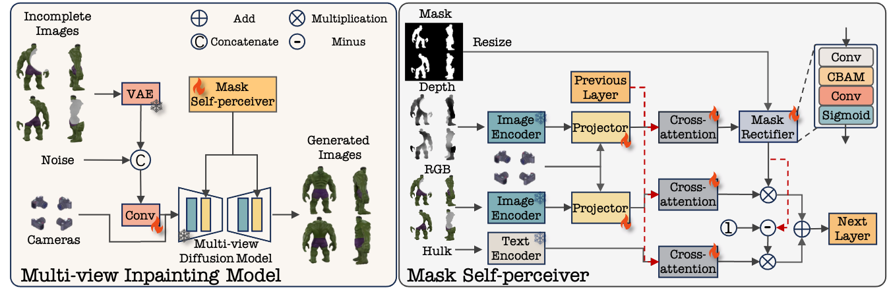
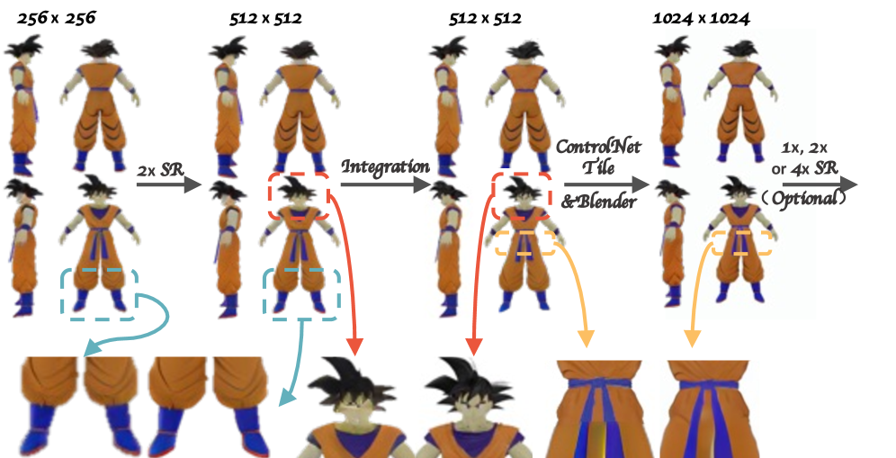
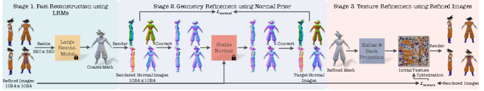

# Restore3D



## 链接

- Project page: https://restore3dx.github.io
- Paper: https://arxiv.org/abs/2607.00522
- PDF: https://arxiv.org/pdf/2607.00522v1.pdf
- 发表日期: 2026-07-01 arXiv v1
- 论文标题: Restore3D: Breathing Life into Broken Objects with Shape and Texture Restoration
- 作者与单位: Xiaolong Shen, Zongxin Yang, Yi Yang，ReLER / CCAI, Zhejiang University

## 摘要要点

Restore3D 关注的是一个比普通 image-to-3D 更贴近 Video2Mesh 后处理的问题：现实扫描里很多物体不是完整、干净、无遮挡的单图对象，而是破损、被遮挡、局部缺失，且需要同时恢复形状和纹理。已有方法往往偏几何补全，纹理恢复不足；Restore3D 则把多视角图像修复和 3D 重建连成一个完整框架。

它先自动构造训练数据：从大规模 3D 数据集中合成 incomplete-complete paired samples，缓解真实破损物体成对数据稀缺的问题。核心模块是 multi-view model 加 Mask Self-Perceiver，并配合 Depth-Aware Mask Rectifier，让模型能自动判断哪些区域需要补全，而不是要求人工给每个视角画一致 mask。随后通过 image integration and enhancement 保留已观测区域的形状和纹理模式，并把低分辨率生成结果提升到更高质量。最后采用 coarse-to-fine reconstruction，从修复后的多视角图像恢复带纹理的 3D mesh。

论文在 synthetic 和 real broken-object benchmarks 上与 inpainting、completion、reconstruction baseline 对比。重建方法对比中，Restore3D 相对 Open-LRM、InstantMesh、Unique3D、Direct3D、TRELLIS、Hunyuan3D-2、Amodal3R 等方法给出了更好的综合结果：PSNR 23.35、LPIPS 0.09、Chamfer Distance 0.005、F-score 0.389。作者也指出方法仍受 base model 分辨率和几何/材质细节上限影响。

## Pipeline





| 阶段 | 作用 |
|---|---|
| paired data synthesis | 从 G-Objaverse 等大规模 3D 数据中合成 broken/complete 物体对，建立训练数据 |
| multi-view rendering / input | 输入破损物体的多视角图像，目标是恢复多视角一致的完整对象 |
| Mask Self-Perceiver | 在多视角条件下自动识别需要补全的区域，降低人工 mask 成本 |
| Depth-Aware Mask Rectifier | 借助深度信息修正 mask，让补全区域更符合 3D 几何关系 |
| image integration and enhancement | 保留已观测纹理，增强生成区域细节，从低分辨率结果提升到更高质量图像 |
| coarse-to-fine reconstruction | 从修复后的多视角图像生成并细化 textured mesh |

## 和 Video2Mesh 的关系

Restore3D 很适合放在 Video2Mesh 的 object mesh completion 层，尤其针对这些情况：

- 扫描视频里物体被床沿、桌面、椅背、窗帘等遮挡，object crop 只看到一部分。
- 通过 SAM/Grounded-SAM 能拿到物体 mask，但 mask 在多视角下并不一致。
- image-blaster/Hunyuan3D/TRELLIS/InstantMesh 可以生成完整物体，但纹理和原视频不够一致。
- 需要把“缺损修复”和“物体资产生成”分开记录 provenance，告诉用户哪些区域是真实观测，哪些区域是生成补全。

在 Video2Mesh 里，Restore3D 不应该替代整条扫描重建链路，而应接在 object-level selected frames 之后：

```text
tracked object masks
  -> selected multi-view object crops
  -> optional depth / object mask rectification
  -> Restore3D shape + texture restoration
  -> textured object mesh
  -> import-object-meshes
  -> fit-object-local-meshes-to-bbox
  -> visual mesh + collider proxy + provenance metadata
```

## 接入判断

- P0：不进入。当前优先是稳定 scene collider 和 simulator bundle。
- P1：作为遮挡物体修复候选，优先选床头柜、椅子、柜子等多视角可见但局部缺失的物体做实验。
- P2：和 Hunyuan3D-2、TRELLIS、InstantMesh 进行同一批 object crops 的横向对比，关注纹理一致性、bbox 对齐、mesh 封闭性和 collider 难度。
- P3：如果后续需要文化遗产/破损物体类应用，Restore3D 比通用 image-to-3D 更贴近需求。

## 需要记录的输出

接入实验时，每个物体至少记录：

| 字段 | 说明 |
|---|---|
| observed_views | 参与修复的原始帧编号和相机位姿 |
| preserved_mask | 哪些区域来自真实观测 |
| restored_mask | 哪些区域由模型补全 |
| mesh_path / texture_path | 修复后的 object-local asset |
| bbox_fit_error | 对齐回 Video2Mesh 3D bbox 后的误差 |
| collider_policy | visual mesh、convex hull、primitive proxy 或手动 collider |
| provenance | Restore3D 版本、输入图、参数、是否人工筛选 |

## 风险

- Restore3D 当前更适合 object-level restoration，不适合作为完整室内场景重建方法。
- 它依赖多视角输入和 mask/depth 质量；如果 Video2Mesh 物体跟踪质量差，修复会被错误 mask 带偏。
- 输出 textured mesh 仍需 Video2Mesh 做尺度、坐标、支撑面和物理代理校准。
- “看起来完整”的补全部分不等于真实几何，必须把 restored mask 和 provenance 写入 sidecar。
