# Stream3D

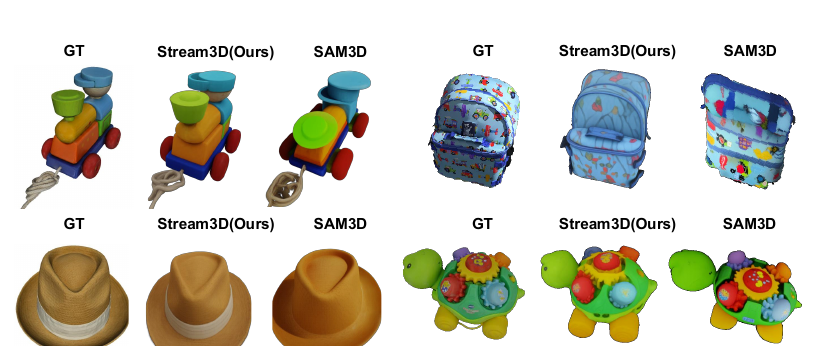

## 结论先行

Stream3D 不是新的端到端 3D 基础模型，而是一个 **training-free 的流式多视角包装层**：它冻结 SAM3D 或 TRELLIS.2，先用一次轻量 warmup 从 cross-attention 中估计“某个历史视角对某个 3D query token 是否有证据”，再用固定容量的证据记忆选出少量历史视角，最后把这些视角的扩散 / flow-matching 更新按证据加权融合。

对 Video2Mesh 最有价值的定位是：**已完成物体跟踪、逐帧 mask、相机与深度预处理之后的 object-level 生成式补全后端**。它能把同一物体的长视频观察压缩成固定大小的条件视角集合，并逐 chunk 生成视觉 3D 资产；它不能替代 SLAM / COLMAP / DA3 相机解算，也不能直接替代场景级 3DGS、网格清理、真实尺度对齐、collider、semantic sidecar 或 physics sidecar。

当前判断：

| 判断层 | 状态 | 结论 |
|---|---|---|
| 论文方法 | Paper evidence | 机制明确，100 帧 GSO / NAVI 实验显示相对单视图和多视图基线总体提升 |
| 官方代码 | Source verified | 公开推理代码支持 SAM3D 与 TRELLIS.2，数据加载、流式记忆、view selection / weighting、GLB / PLY 导出均已实现 |
| 本地源码静态检查 | Passed | 官方仓库快照可读；Python 源码已由主线完成 `compileall` 静态检查 |
| AutoDL 推理 | **Passed（官方样例、fast、chunk 0）** | RTX 4090 上复用现有 SAM3D 权重完成真实推理，exit 0，产出可读 GLB / Gaussian PLY；这只证明首 chunk 执行和资产合同，不证明跨 chunk 记忆收益或论文 full 指标 |
| `bedroom_4` 对象接入 | **Passed with limitations** | 已用连续 8 帧、SAM3 mask 与 DA3 相机/深度完成 6 个对象的 fast 首 chunk 生成和 GLB 视觉 QA；6 个均保留为 object-local 视觉候选，其中窗户是用户确认的最佳 window visual candidate，但仍只是薄窗面 |
| 床 / 枕头 guided refinement | **Passed with limitations** | Qwen-VL 结构化框 + SAM3 组件 mask 已驱动 TRELLIS2 / Hunyuan3D 2.1 对照；床得到最佳外观与最佳 watertight shape 两个互补候选，身份一致的最终枕头资产尚未完成 |
| Room alignment / simulator asset | Not tested | 尚未把 object-local 结果拟合回房间坐标，也未生成 collider、semantic 或 physics sidecar |

## 身份与官方资源

- 论文：<https://arxiv.org/abs/2605.21472>
- PDF：<https://arxiv.org/pdf/2605.21472>
- 项目主页：<https://stream-3d.github.io/stream3d.github.io/>
- GitHub：<https://github.com/kaichen-z/STREAM3D>
- 标题：*Stream3D: Sequential Multi-View 3D Generation via Evidential Memory*
- 作者：Kaichen Zhou, Zeyang Bai, Xinhai Chang, Mengyu Wang, Paul Pu Liang, Fangneng Zhan
- 单位：HKUST World Mind Lab、MIT Media Lab / EECS、Harvard Kempner Institute
- 论文快照：本地 `2605.21472v4.pdf`，v4 页面标注日期为 2026-06-11，SHA-256 `b25c03589f676f3c400d1d6788f6fbac7e4551fbbc9d287c27832f77943bb5aa`
- 代码快照：`ce781ae6ae139ed5eb54675703f5a3a2e525d76a`，提交时间 2026-07-24
- 许可证：**当前代码快照未发现顶层 LICENSE / COPYING / NOTICE，不能默认按开源许可证再分发或商用**

论文与源码必须按不同版本看待。下面的“论文指标”来自 v4 PDF；“代码事实”来自上述 Git commit，后者比论文版本更新约六周。

## 研究问题

单图 3D 生成器通常只接受一张或少量固定视角。真实手机绕拍或机器人观察却是不断到来的长单目流：

- 每帧独立生成会导致形状、纹理和不可见区域在时间上跳变。
- 把全部历史帧同时送入 multi-diffusion，计算和显存会随流长度增长。
- 固定窗口只看最近 chunk，会忘记早期曾经清楚看见、但当前被遮挡的表面。
- 直接传递 KV cache 或 latent state 会携带过期、模糊或错误证据，且没有可靠性筛选。

Stream3D 把问题改写为“保存哪些观测证据”，而不是“保存多少历史 latent”：每个 3D query token 只保留若干个最支持它的历史 frame index，使跨 chunk 状态与视频总长度无关。

## 方法机制

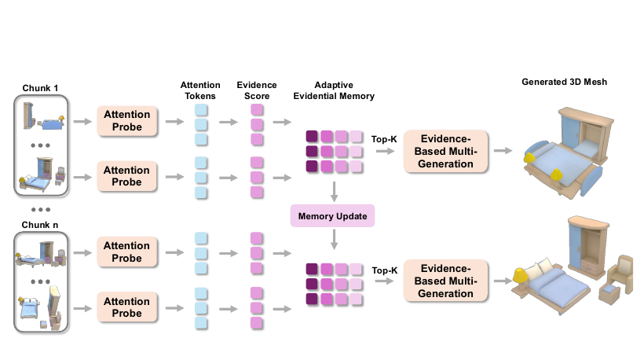

### 1. 一步 Attention Probe

对当前 chunk 的每个输入视角，模型复用同一份冻结噪声 `z0`，只跑一个 warmup denoising step，并在指定 cross-attention 层读取每个 3D query token 对图像 patch token 的注意力。

证据分数同时考虑两件事：

- **Attention mass**：该 query 是否强烈依赖这个视角。
- **Normalized entropy**：注意力是否集中、具有选择性，而不是平均散布在整张图上。

固定 `z0` 让不同 chunk 的证据分数可比较；只取第一步则尽量让证据来自输入图像，而不是后续 denoising 已经生成的内容。

### 2. Adaptive Evidential Memory

记忆由 `M, F in Q x D` 两个矩阵组成：

- `M` 保存每个 query token 历史上最高的 `D` 个证据分数。
- `F` 保存这些分数对应的全局 frame index。

新 chunk 到来时，仅把新候选与旧的 top-D 合并后重新取 top-D。论文以 SAM3D 的 `Q=4096, D=5` 估算，两个矩阵约占 65 KB；内存复杂度是 `O(QD)`，不随总帧数 `T` 增长。

### 3. Token Vote 选择 Top-K 视角

系统统计每个 frame index 在所有 token 的 top-D 槽位中出现多少次，相当于让各个空间 token 为最支持自己的历史视角投票，再选择票数最高的 `K` 帧作为当前完整生成的条件 bundle。

这里 `D` 和 `K` 含义不同：`D` 是每个 token 保留多少个历史候选，`K` 是底层 3D generator 每次完整 forward 实际消费多少个视角。

### 4. Evidence-Based Multi-Generation

被选中的 `K` 个视角分别产生 diffusion / flow-matching velocity。系统在每个 query token 上，用归一化证据分数对各视角 velocity 做加权平均，再更新共享 latent。

每个 chunk 的完整生成使用新的噪声 `zk`。因此 Stream3D 的跨 chunk 状态是“历史视角证据与索引”，**不是上一 chunk 的同一个 mesh 或 latent 被增量修改**；代码会按 chunk 生成一套新结果。

## 输入、输出与代码数据契约

当前默认 GSO loader 要求一个 object-level scene root：

```text
<object_root>/
  render_spiral_100/
    images/
      <frame>.png | <frame>.jpg
    masks/
      <same-frame-stem>.png
    da3/                         # SAM3D backend 需要
      camera_poses.txt
      results_output/
        frame_*.npz             # 每帧至少包含 depth 与 intrinsics
```

关键约束：

- 图片按文件名最后一个下划线后的数字排序，定制数据需要避免不可解析的 stem。
- mask 必须与图片同 stem；缺失时后端直接报错。
- 默认 `chunk_size=8`、`chunk_overlap=2`。
- SAM3D 路径从 DA3 `depth + intrinsics` 重建 point map，并读取 `camera_poses.txt`；DA3 结果数必须与图像数严格相等。
- 论文问题设定是 posed views；公开默认脚本以 DA3 提供 pose / depth / point map。若改成裁剪后的 object crop，必须同步修正 intrinsics 和 mask / depth 像素对应，不能只裁 RGB。
- 对 Video2Mesh，较稳妥的第一版输入是“保留原图分辨率、将非目标区域 mask 掉”的 object track，而不是未经相机内参修正的紧裁图。

官方 README 描述 SAM3D 每个 chunk 的主要输出为：

```text
<output_root>/<scene>/chunk_*/
  result.ply
  result.glb
  params.npz
  ... selection / weighting / profile metadata
```

这些文件的边界必须明确：

| 产物 | 正确解释 | 不能直接声称 |
|---|---|---|
| `result.ply` | SAM3D 解码的 Gaussian visual representation | 不是普通稠密点云，也不是 watertight mesh / collider |
| `result.glb` | 当前 chunk 的 visual mesh；默认脚本关闭 texture baking，配置倾向 vertex color | 不等于拓扑干净、封闭、真实尺度正确或可直接用于物理仿真 |
| `params.npz` | 生成器内部 Gaussian / sparse / pose 等参数包，具体 keys 应以实际 metadata 为准 | 不是稳定的跨项目公共资产协议 |
| selection metadata | 历史视角、证据分数、配置与运行 profile 的审计证据 | 不提供语义标签、材料物理属性或碰撞形状 |

TRELLIS.2 backend 也能导出 GLB，但依赖和资产语义与 SAM3D 分支不同，不能用 SAM3D 的实测结论代替 TRELLIS.2 验证。

## 论文指标

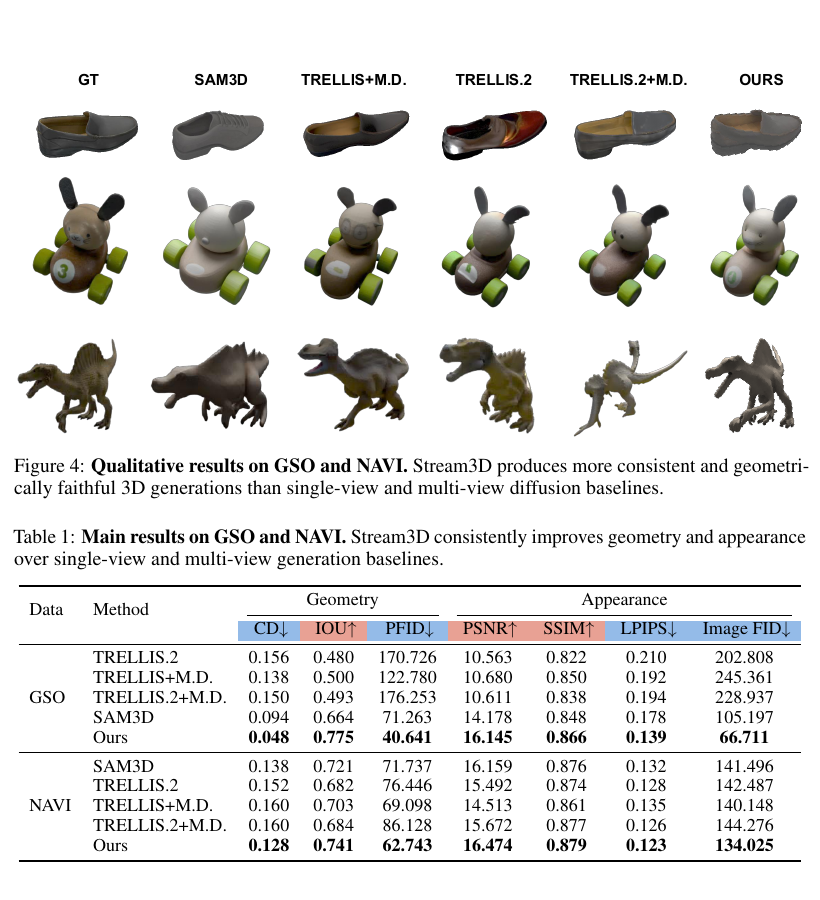

论文在 H100 上，以 100 帧流测试 GSO 与 NAVI。表 1 的核心数据如下：

| Dataset | 方法 | CD down | IoU up | P-FID down | PSNR up | SSIM up | LPIPS down | Image FID down |
|---|---|---:|---:|---:|---:|---:|---:|---:|
| GSO | SAM3D | 0.094 | 0.664 | 71.263 | 14.178 | 0.848 | 0.178 | 105.197 |
| GSO | Stream3D | **0.048** | **0.775** | **40.641** | **16.145** | **0.866** | **0.139** | **66.711** |
| NAVI | SAM3D | 0.138 | 0.721 | 71.737 | 16.159 | 0.876 | 0.132 | 141.496 |
| NAVI | Stream3D | **0.128** | **0.741** | **62.743** | **16.474** | **0.879** | **0.123** | **134.025** |

相对 SAM3D，GSO 上 CD 约下降 48.9%、Image FID 约下降 36.6%，PSNR 增加 1.967 dB；NAVI 上 CD 约下降 7.2%、Image FID 约下降 5.3%，PSNR 增加 0.315 dB。说明受控渲染的 GSO 增益很强，而真实、复杂轨迹的 NAVI 增益更温和，不能只引用 GSO 数字推断真实手机视频效果。

Table 2 还显示 Stream3D 在 GSO 上优于 FlowEdit、KV-cache、MV-SAM3D last-chunk 和随机 K-view 策略。它支持作者的核心判断：长流的关键不只是记住 latent，而是长期保留对不同空间 token 真正有用的视角证据。

## 消融与超参数

论文 Table 3 的主要结论：

- 证据抽取层从浅层推进到 `SS9 / SLAT6` 后趋于稳定，说明较深 attention 更能表达几何对应。
- normalized Evidence 比未归一化 evidence 和纯 entropy 更稳。
- `M=3` 的 P-FID 最低，`M=5` 是论文文字给出的综合折中；`M=7` 会引入较弱或陈旧证据。
- `K=4` 覆盖不足；`K=8` 已较稳定；`K=16` 多项指标最好，但计算更高。

## 论文与当前代码的不一致

这是复现时最需要保留的 provenance：

| 项目 | 论文 v4 | 当前代码 commit `ce781ae...` | 影响 |
|---|---|---|---|
| Memory depth | 4.1 实验设置写 `K=8, D=1` | `configs/streaming/view_condition_cache.yaml` 默认 `memory_depth: 5` | 论文主表究竟对应 D=1 还是 D=5 存在文本歧义，不能只凭默认配置复现 |
| Table 3 高亮 | 高亮 `M=5, K=8` | 默认 `D=5, K=8` | 与代码一致，但和 4.1 的 `D=1` 冲突 |
| Top-K 策略 | 正文描述按 token ownership count 直接取 top-K | 默认 `selection_strategy: va_div`，在 vote mass 上增加 frame-distance MMR，`lambda=0.1` | 当前默认不是论文正文描述的纯 top-K vote；必须记录该 override |
| Stage-2 selection | 论文以 SS / SLAT 层消融描述 | 当前代码单列 `stage2_selection`，默认开启、`topk=8` | 运行配置比算法伪代码更具体，比较时需保存完整 Hydra config |
| 快速模式 | 论文主体未给独立 fast protocol | `running_stream3d_fast.sh` 开 Stage-1 shortcut，Stage 1/2 都用 4 steps | fast 只能用于工程预览，不能直接冒充论文 full 设置 |

因此，正式报告至少要保存：`git_commit`、`backend`、`chunk_size / overlap / indices`、`memory_depth`、`topk`、`selection_strategy`、`selection_div_lambda`、Stage 1/2 layer 与 step、weight source、随机种子、pipeline config hash、权重 hash。

## 代码结构与部署成本

| 路径 | 作用 |
|---|---|
| `streaming/runner.py` | Hydra 入口，遍历 DataGSO examples 并调用 backend |
| `streaming/data/data_gso.py` | 校验 images / masks / DA3 目录，按 chunk 构建执行计划 |
| `streaming/utils/streaming_da3.py` | 读取 DA3 depth、intrinsics、camera poses 并生成 SAM3D point map |
| `streaming/backend/selector/` | token evidence memory、view vote、selection strategy |
| `streaming/backend/backend_sam3d.py` | SAM3D backend 与两阶段生成 / 导出 |
| `streaming/backend/backend_trellis2.py` | TRELLIS.2 backend 与 GLB 导出 |
| `configs/streaming/view_condition_cache.yaml` | D、K、attention layer、`va_div` 等当前默认值 |
| `configs/pipeline/streaming_sam3d.yaml` | 25/25 steps、Gaussian / mesh 解码、weighting 与 texture 配置 |
| `running_stream3d.sh` | SAM3D full 模式 |
| `running_stream3d_fast.sh` | SAM3D shortcut / 4-step 预览模式 |

官方环境文件要求 Python 3.11、CUDA toolkit 12.1；README 示例使用 PyTorch 2.5.1 + cu121。主要风险依赖包括 `spconv-cu121`、`xformers`、`gsplat`、`nvdiffrast`、`pytorch3d`、MoGe 以及本仓库内的 SAM3D 模块。SAM3D 还需要一个兼容的 `checkpoints/hf/pipeline.yaml`；代码库不随仓库提供模型权重。

硬件方面，论文只明确写实验运行在 NVIDIA H100。README 给出的工程测量是：空闲 H100 上 full steady-state 约 85 s / chunk，fast 约 55 s / chunk，fast 的 GSO 代价约为 CD-L2 增加 0.003-0.005、PSNR 降低 0.3-0.6 dB。**这些不是当前 AutoDL GPU 的实测速度，也不构成官方最低显存承诺。**

官方第一 chunk 的最小 smoke 形式可以是：

```bash
GSO=/path/to/GSO30 \
CKPT=/path/to/checkpoints/hf/pipeline.yaml \
PYTHON=/path/to/python \
bash running_stream3d_fast.sh 0 alarm /root/autodl-tmp/stream3d-smoke "[0]" 0
```

这仍要求 `alarm/render_spiral_100` 下至少有 8 张成对的 RGB / mask 以及完整 DA3 输出；命令退出不是成功，必须继续检查 PLY / GLB 可读性、mesh 拓扑统计、Gaussian 属性、metadata、预览图和视觉一致性。

## 本次 AutoDL 实测

本节记录 2026-07-31 在用户指定 AutoDL 节点上的真实运行。验证目标是“现有 SAM3D 环境和权重能否运行当前 Stream3D 官方代码并产出可读资产”，不是复现论文精度，也不是验证 Video2Mesh 自定义视频。

| Gate | 状态 | 本次证据 |
|---|---|---|
| SSH / 节点身份 | Passed | `connect.westb.seetacloud.com:14117`；hostname `autodl-container-spsvbuc50p-17d7c02c` |
| GPU 与进程 | Passed | NVIDIA GeForce RTX 4090，49,140 MiB；启动前约 48,509 MiB 空闲且无 compute process |
| 磁盘 | Passed | `/root/autodl-tmp` 350 GB，总占用 219 GB，剩余 132 GB；根 overlay 仅剩约 2 GB，因此全部新增状态放在数据盘 |
| 代码 | Passed | `/root/autodl-tmp/workspace/STREAM3D-20260731`，commit `ce781ae6ae139ed5eb54675703f5a3a2e525d76a`，checkout clean |
| Python / CUDA / torch | Passed | overlay env `/root/autodl-tmp/envs/stream3d-20260731`；Python 3.11、PyTorch `2.5.1+cu121`、CUDA 12.1；`spconv`、`xformers`、`gsplat`、`pytorch3d`、MoGe 可导入，并补装独立 `nvdiffrast 0.4.0` |
| SAM3D 权重 | Passed | 只读复用 `/root/autodl-tmp/sam-3d-objects/checkpoints/hf`，约 13 GB；通过 symlink 挂到 Stream3D `checkpoints/hf`，未复制或改写原权重 |
| GSO 输入 | Passed | 只下载 `alarm/render_spiral_100` 的 100 RGB + 100 mask + 100 DA3 NPZ + `camera_poses.txt`，301 文件 / 190,784,519 bytes；计数、同 stem、pose 行数、`depth` / `intrinsics` shape 与 finite 检查通过 |
| Stream3D inference | **Passed** | 官方 fast 脚本、`chunk_indices=[0]`、seed 0；exit 0，墙钟 105 s，1 s 采样峰值显存 19,073 MiB |
| 产物结构 QA | **Passed** | GLB / PLY / NPZ 均可读且数值 finite；本地同步后的 SHA-256 与远端一致 |
| 视觉 QA | **Passed with limitations** | 轮廓、提环、主体和底脚在 GLB / Gaussian 多视图中一致；表盘与细纹理被明显抹平，GLB 有 9 个很小的独立部件，颜色表现偏暗 / 低对比 |
| 跨 chunk 记忆收益 | Not tested | 本次仅跑 `chunk_0000`；没有比较后续 chunk，也没有和 SAM3D baseline 或 full 25/25 steps 对照 |
| GSO 定量评测 | Not tested | 未下载 `render_mvs_25` GT，未运行 Sim(3) registration 与 CD / IoU / PSNR 等评测 |

权重 provenance：`pipeline.yaml` SHA-256 为 `53c3d226b21df85c0bb3d16e6e4fa63abde0d6167525765eb929d02bfa9d358c`；两个生成器主权重 `ss_generator.ckpt` / `slat_generator.ckpt` 分别为 `225f40479e4cff4f39d6fa14c55be3abad1475bf55b61af3bec1e19ed2f6c146` 和 `91529bde8e7daa12d09618a66c319e3a5a6398db6b23b958cedcb1c3f28faabb`。

执行命令：

```bash
GSO=/root/autodl-tmp/datasets/stream3d-gso30/GSO30 \
CKPT=/root/autodl-tmp/workspace/STREAM3D-20260731/checkpoints/hf/pipeline.yaml \
PYTHON=/root/autodl-tmp/envs/stream3d-20260731/bin/python \
bash running_stream3d_fast.sh 0 alarm \
  /root/autodl-tmp/stream3d-runs/alarm-fast-chunk0-20260731-retry1/output \
  "[0]" 0
```

第一次启动尝试因节点不存在 `/usr/bin/time` 在模型加载前以 exit 127 退出，GPU 峰值为 0；审计目录保留在 `/root/autodl-tmp/stream3d-runs/alarm-fast-chunk0-20260731`。上表与下列产物只对应新的 `retry1` 真推理，不能把前一次启动失败并入成功耗时。

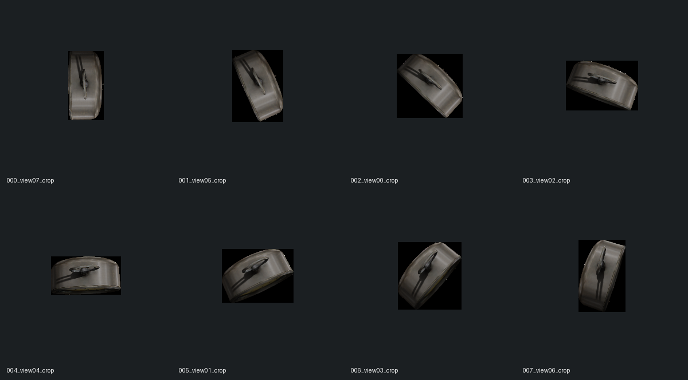

`result_metadata.json` 显示 Stage 1 对 8 个视角完成 token evidence 更新；Stage 2 最终采用全局帧 `[4, 1, 3, 7, 0, 5, 2]`，即 7 个获得有效 ownership 的视角。运行使用 `memory_depth=5`、`topk=8`、`selection_strategy=va_div`、`selection_div_lambda=0.1`、Stage 1 / 2 各 4 steps、`mass_relative` 权重与 `kappa=8`。

### 产物与结构 QA

远端结果目录：

```text
/root/autodl-tmp/stream3d-runs/alarm-fast-chunk0-20260731-retry1/output/alarm/chunk_0000/
```

本地同步目录：

```text
tmp_remote_results/stream3d_alarm_fast_chunk0_20260731/output/alarm/chunk_0000/
```

| 文件 | 大小 | SHA-256 | 结构结论 |
|---|---:|---|---|
| `result.glb` | 14,400,920 bytes | `b8e4d33186d8a90c38a2bb6f7f4cba83ef14f3d5ef5563f7cb21ea109d199881` | 359,994 V / 720,000 F；watertight、winding consistent、0 degenerate faces；10 个连通体，主连通体占 99.72% faces |
| `result.ply` | 26,012,320 bytes | `f7472918a83790e0099e706a1216d5744b79f8b7b3c38e16fa451d0a4bc75d75` | 382,528 Gaussians；含 XYZ、`f_dc_*`、opacity、scale、rotation 共 17 个属性，全部 finite |
| `params.npz` | 193,132 bytes | `6db3063466839563df8f1677eee6dcc364a45cd96afb799b31e345564ed35f69` | `coords` 为 `(11954, 4)`，并含 pose / pointmap scale-shift；数值 finite |
| `result_metadata.json` | 29,485 bytes | `2341f8c59ede99585134d94564ce06e1e1b7e45cc15910b60951d482ff7af0d3` | 保存输入、selection、weighting、steps 与输出清单 |

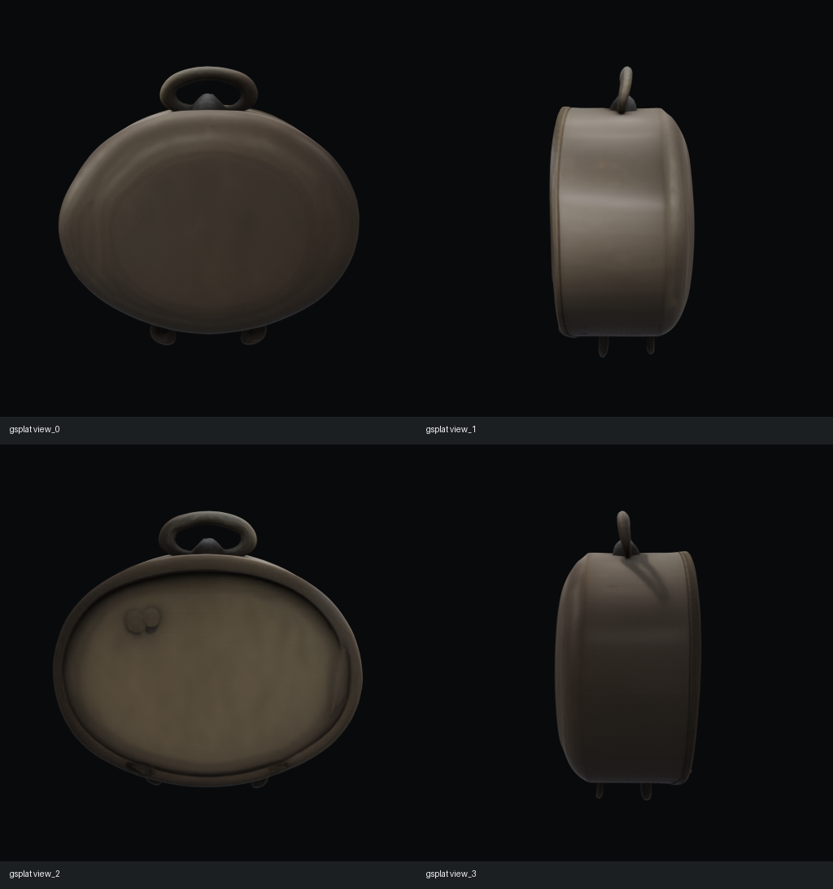

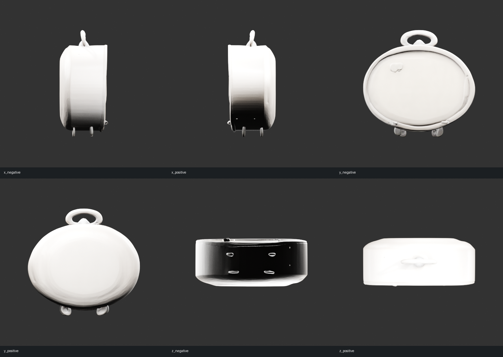

这组结果可以证明：当前 AutoDL 的 48 GB 4090、现有 SAM3D 权重和官方 GSO 数据合同能够运行 Stream3D fast 首 chunk，并同时导出结构有效的 visual GLB 与 Gaussian PLY。它仍不能证明生成物是场景坐标对齐、纹理精细、低面数、碰撞稳定或具备语义 / 物理 sidecar 的 simulator asset。

## `bedroom_4` 六对象实测

本节记录同一 AutoDL 节点上的第二组真实推理。目标从官方 GSO 闹钟换成 Video2Mesh 的 `bedroom_4` 连续视角，对床、中央白色枕头、左侧床头柜、左侧盆栽、左侧花盆和右侧窗户分别做 object-level 生成。这里的“六对象完成”只表示每个对象都产出了结构可读的 GLB / Gaussian PLY；视觉晋级、房间对齐和仿真可用性是独立门禁。

### 输入与运行合同

- 输入是 `bedroom_4` 第 20-27 帧，共 8 张连续 1280 x 720 全分辨率图像；没有把 RGB 紧裁成新的相机模型。
- 每个对象使用逐帧 SAM3 mask；point map、intrinsics 与 camera pose 来自上游 DA3，8 张图、8 张 mask、8 组 DA3 结果按 stem 对齐。
- Stream3D 代码为 commit `ce781ae6ae139ed5eb54675703f5a3a2e525d76a`；运行在 RTX 4090 节点，seed 0。
- 使用 fast 配置：Stage 1 / Stage 2 都是 4 steps，`va_div` 选择、`mass_relative` 权重、`kappa=8`，同时解码 mesh 和 Gaussian，关闭 texture baking。
- 官方多对象 shell 先完成床，但下一对象重新加载 DINO 时卡在 GitHub 源校验。后续 5 个对象使用隔离的 runner 副本复用已加载 pipeline，并把 DINO 指向本机 Torch Hub cache；官方 Stream3D worktree 保持 clean。

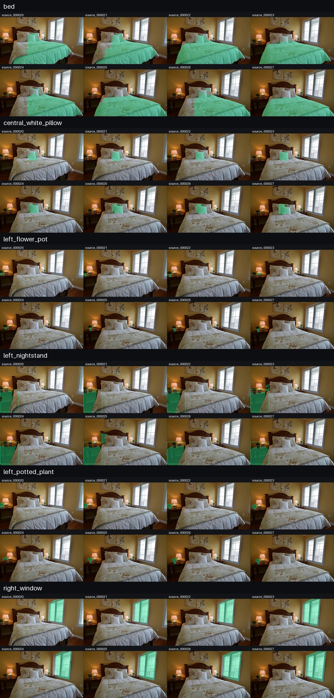

输入总览说明了一个重要边界：这是从正面相机弧线获得的证据，不是完整环拍。生成 mesh 的背面、底部和内部均包含模型补全；床的输出出现了输入 mask 中没有的床头板，也说明它不是逐像素观测表面的确定性重建。

### 产物与视觉 QA

六个 GLB 均可被 `trimesh` 读取，六个 PLY 均为 `binary_little_endian`、17 个 Gaussian vertex 属性，文件 payload 与 header 声明的 vertex count / stride 精确一致。12 个主文件在远端到本地同步后通过 SHA-256 对照。GLB 使用 vertex color，没有 UV/PBR texture。

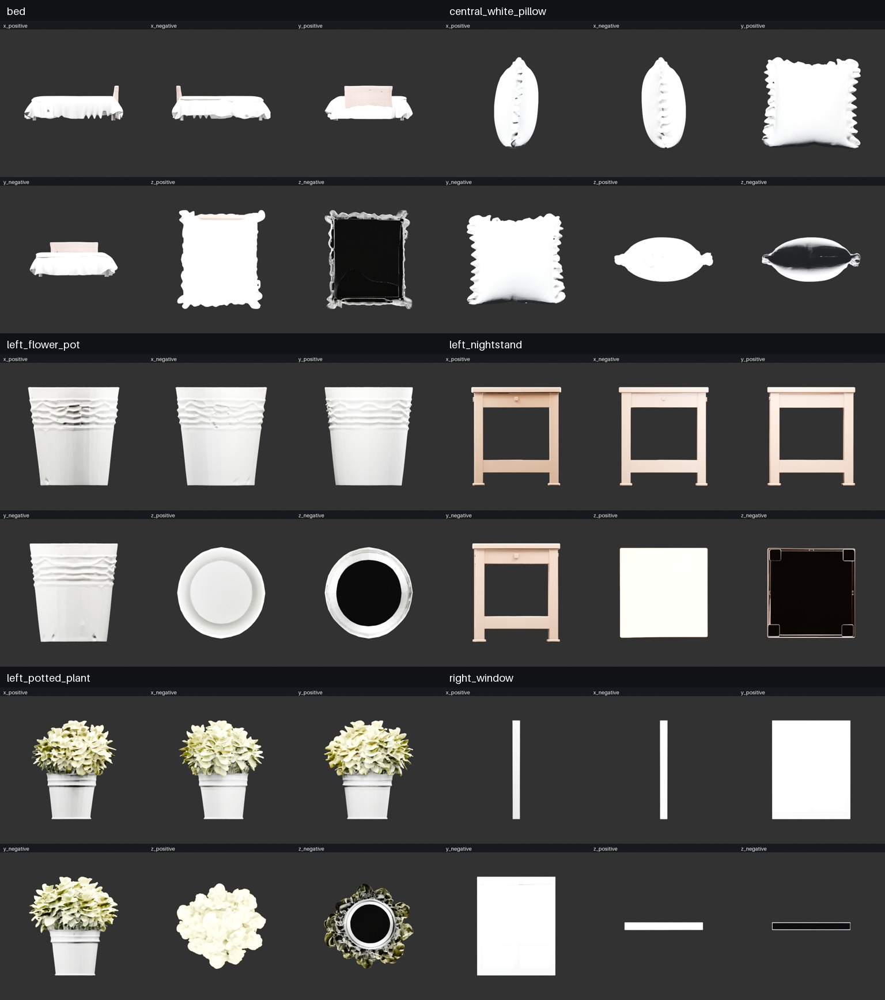

| 对象 | GLB vertices / faces | 连通体 | Watertight | Stage-2 视角 | 视觉判断 |
|---|---:|---:|---|---:|---|
| 床 | 409,334 / 818,834 | 11 | 否 | 8 | 可辨识床体、床品与生成式床头板；底部和布料开口使其不能直接作 collider |
| 中央白色枕头 | 392,622 / 785,500 | 61 | 是 | 8 | 枕头与边缘褶饰清楚；颜色和不可见侧细节属于生成结果 |
| 左侧床头柜 | 664,624 / 1,329,260 | 1 | 是 | 8 | 几何连贯，但更像开放式边桌，不是对源柜体的严格复刻 |
| 左侧盆栽 | 806,244 / 1,612,952 | 117 | 否 | 6 | 花冠与盆体轮廓完整；叶片高度离散，不能直接作为碰撞几何 |
| 左侧花盆 | 512,864 / 1,025,148 | 145 | 是 | 8 | 花盆可辨识，但比例和装饰相对原始小盆发生漂移 |
| 右侧窗户 | 264,184 / 528,372 | 2 | 是 | 5 | **用户确认的最佳 window visual candidate**：可读、watertight，但约 0.794 x 1.001 x 0.074 的薄窗面仍缺少可分离的窗框、窗扇与玻璃结构 |

结构层全部 `Passed` 不等于下游全部通过。当前 6 个对象都保留为 object-local 视觉候选；其中窗户是用户确认的当前最佳 window visual candidate，但这个判断只针对视觉候选排序，不把薄窗面升级成墙体 opening、带 sash / glass 语义的门窗组件或 room-aligned 物理资产。床和盆栽明确非 watertight；其余 mesh 即使 watertight，也没有经过减面、质量属性、碰撞稳定性或物理尺度验证。

本地审计包位于 `tmp_remote_results/stream3d_bedroom4_objects_20260731/`，包含输入 manifest、逐对象 metadata、SHA-256 清单、完整日志、GLB 六轴渲染和 Gaussian PLY。全包落盘约 463 MiB，其中 12 个 GLB / PLY 主文件共 428.4 MB（408.6 MiB）；因体积、授权与资产用途边界，不复制到公开文档站，站点仅发布经过压缩的输入/输出总览图和本节统计。

### 本轮能证明什么

| Claim | 状态 | 边界 |
|---|---|---|
| `bedroom_4` 数据合同可接入 Stream3D | Passed | 仅连续 8 帧、首 chunk、SAM3D backend |
| 六对象 GLB / Gaussian PLY 文件生成 | Passed | 文件结构与哈希通过，不等于视觉或物理可用 |
| 六个物体具有可辨识视觉候选 | Passed with limitations | 仍为 object-local、生成式补全、vertex-color 高模；窗户的晋级来自用户视觉确认 |
| 窗户可作为最佳 visual candidate | Passed with limitations | 仅为薄窗面；不是墙体 opening，也没有 sash / glass 语义、房间对齐或物理属性 |
| Stream3D 跨 chunk evidential memory 收益 | Not tested | 只有 `chunk_0000`，没有长流或 baseline / full 对照 |
| 房间坐标、米制尺度与支撑关系 | Not tested | metadata 中的生成 pose 不等于已验证的 room-world transform |
| Collider / semantic / physics / simulator bundle | Not tested | 需要 Video2Mesh 后处理与独立 QA |

## Qwen / SAM3 引导的床与枕头修复

这是在上述 Stream3D 六对象结果之后追加的 **downstream guided refinement**，不是 Stream3D 原生推理能力。流程用 Qwen-VL 给出对象与子组件的结构化框，SAM3 分别提取床体、床头板和三个枕头，再把组件证据并入最终 union mask；同一输入随后分别交给 TRELLIS2 和 Hunyuan3D 2.1。它用于验证“更完整的组件 mask + 两类 3D backend”能否修复床与枕头，不应归因成 evidential memory 的收益。

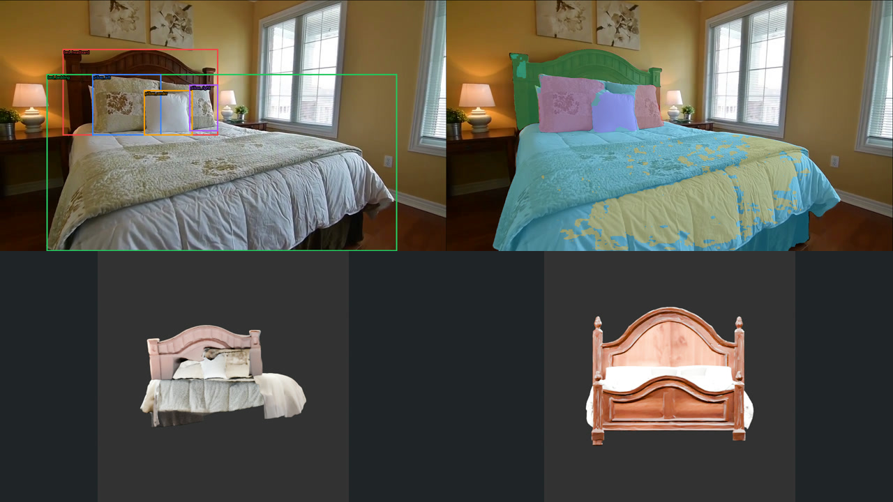

### 组件证据与 mask 合并

| 证据层 | 像素 / 增量 | 审计结果 |
|---|---:|---|
| 床体 core mask | 352,062 px | 主体基础证据；最终 union 前的核心区域 |
| 床头板 | 36,919 px / 新增 35,586 px | 主要补足原床 mask 未覆盖的木质床头结构 |
| 左侧枕头 | 24,721 px / 新增 130 px | 与 core 大部分重合，保留为独立组件证据 |
| 中央枕头 | 12,208 px / 新增 0 px | 已完全落在现有 union 内 |
| 右侧枕头 tight-box retry | 8,861 px / 新增 254 px | 使用窄框重试；wide box 会错误合并三个枕头和灯具碎片 |
| 最终 union mask | **388,033 px** | bbox `[133, 141, 1129, 720]`；1 个连通体，最大连通体占比 1.0 |

Qwen-VL 在这里提供的是结构化对象约束，不是像素 mask；SAM3 才负责组件分割。文本提示分支未跑完，不能宣称 text-prompt segmentation 成功。最终 union 保持单连通体，但组件像素增加和连通性只证明分割合同成立，不代表背面、底部或遮挡区域已被真实观测。

### 图像先验与 provenance

本轮 **没有完成 fresh image completion**：内置 image-edit 能力不可用，因此复用了较早的 EmbodiedGen V2 床 / 枕头参考图。对应 manifest 明确记录 `fresh_generation=false`；对复用 prior，`observed_region=0`、`generated_region=alpha`。Qwen 复核将床和枕头均判为 `shape_prior_only`：床的床品颜色与设计不一致，枕头则是不同的花卉纹理。它们只能帮助观察完整轮廓，不能作为 bedroom_4 对象身份或材质的证据。

### 两个 backend 的运行合同

| Backend | 固定配置 | 输出属性 |
|---|---|---|
| TRELLIS2 | 官方 commit `75fbf0183001ed9876c8dbb35de6b68552ee08bd`，model revision `af44b45f2e35a493886929c6d786e563ec68364d`；512 pipeline；12 / 12 / 12 steps；100k target；seed 1234 | PBR 外观 mesh；部分 raw mesh 含退化面，另存 repaired derivative，不覆盖原件 |
| Hunyuan3D 2.1 | 30 steps；resolution 256；guidance 5；seed 1234 | 白色 shape GLB / PLY、无纹理；4 个任务约 14.86-15.29 s / job，峰值 CUDA allocated 7.6264 GiB |

统一结构 QA 对 8 个交付 mesh 全部得到 readable、finite、winding consistent，即 **8/8 technical pass**。这里的 8/8 包含修复后 derivative，不代表 8 个视觉结果都可晋级，也不代表 mesh 都 watertight。

### 床：外观与闭合形状是两个候选

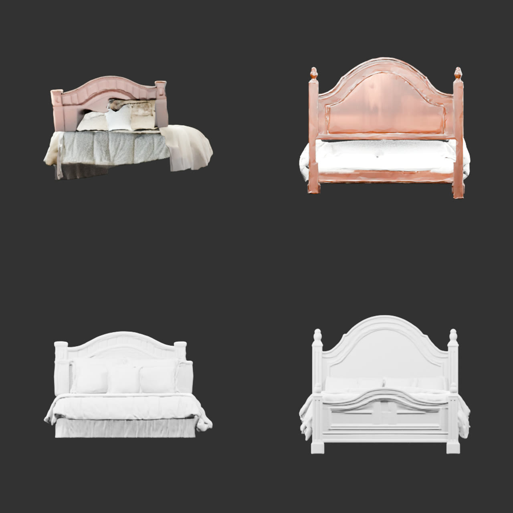

| 输入 / backend | Mesh QA | 视觉与用途判断 |
|---|---|---|
| TRELLIS2 observed | 59,116 V / 94,956 F；非 watertight；PBR；raw technical pass | **最佳外观候选**：床头板、三个枕头、床品与床裙可辨识；背部 / 底部仍不完整 |
| TRELLIS2 reused prior | raw 因 3 个 degenerate faces 未通过；repaired 为 95,099 V / 97,302 F、非 watertight | 仅 `shape_prior_only`；完整轮廓但设计、颜色和纹理不匹配 |
| Hunyuan observed | 261,486 V / 523,052 F；watertight；无纹理 | **最佳 watertight shape 候选**：适合闭合形状参考，但不是外观资产 |
| Hunyuan reused prior | 324,180 V / 648,396 F；watertight；无纹理 | 结构完整但设计不同，只能作 shape prior |

因此床已经得到两个互补结果：TRELLIS2 observed 是最佳外观候选，Hunyuan observed 是最佳 watertight shape 候选。二者当前 **没有融合，也没有相互配准或 room alignment**，不能把白模闭合性和 PBR 外观合并宣称为一个完成资产。

### 枕头：尚无身份一致的最终资产

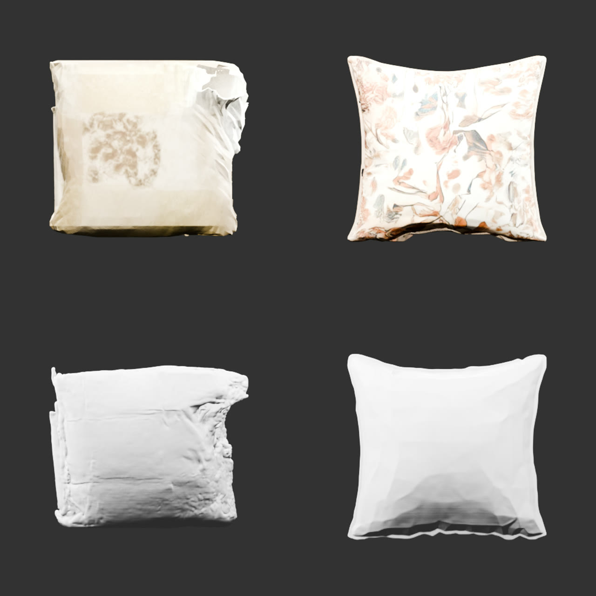

| 输入 / backend | Mesh QA | 视觉与用途判断 |
|---|---|---|
| TRELLIS2 observed | raw 有 1 个 degenerate face；repaired 为 58,410 V / 96,003 F、非 watertight | 右侧存在明显 tear / curl，不晋级 |
| TRELLIS2 reused prior | 60,756 V / 96,138 F；非 watertight；PBR；raw technical pass | 轮廓完整但花卉纹理来自另一只枕头，仅 `shape_prior_only` |
| Hunyuan observed | 208,980 V / 418,020 F；watertight；无纹理 | 仍有严重遮挡撕裂，不晋级 |
| Hunyuan reused prior | 188,204 V / 376,408 F；非 watertight；无纹理 | 形状较干净但底部有 seam，且对象身份不匹配 |

结论是：**枕头身份一致的最终资产没有完成**。下一步需要真正的 image completion 覆盖遮挡区域，再做 texture transfer 或观测 / 先验 3D fusion，并分别验证身份、材质、闭合性和房间坐标；不能从当前任一 repaired 或 prior 文件直接晋级。

guided 包的完整本地审计目录为 `tmp_remote_results/stream3d_bedroom4_guided_reconstruction_20260731/`，落盘约 116 MiB。公开站点只发布上述三张压缩报告图和统计结论，不发布 GLB / PLY。床头柜、盆栽、花盆和窗户沿用原 Stream3D 结果，本轮没有重新推理；所有候选仍缺 room alignment、collider、semantic sidecar 和 physics sidecar。

## Video2Mesh 接入位置

推荐将 Stream3D 放在 object track 已建立之后，而不是放在整场景 3DGS 或 collider 阶段：

```text
video frames + calibrated cameras
  -> semantic instance tracking
  -> same-object frame selection
  -> per-frame masks
  -> DA3 depth / intrinsics / poses or a verified equivalent adapter
  -> Stream3D (SAM3D backend first)
  -> choose and QA a final / accepted chunk
  -> object-local Gaussian PLY + visual mesh GLB
  -> fit to observed object points / 3D bbox in room coordinates
  -> mesh cleanup and material policy
  -> simplified collider generated separately
  -> semantic + physics + provenance sidecars
  -> simulator bundle
```

最小接入方案：

1. 先选一个刚性、单实例、遮挡适中且至少有 8 个有效视角的物体；不从整间 bedroom 的多物体 full frame 直接开始。
2. 复用 Video2Mesh 相机与 object track，导出 full-resolution masked frames；用 DA3 adapter 生成与图像严格同序的 point map / camera files。
3. 用 SAM3D fast 只跑 chunk 0，验证环境和资产格式；通过后再跑 full 设置与更长前缀。
4. 对最后 chunk 同时渲染 PLY 和 GLB 的轴向 / 斜向预览，并比较所有输入视角，不只看一个正面截图。
5. 用 observed object cloud / bbox 求 object-local 到 room-world 的 Sim(3) 或有尺度的刚体变换，并保存 fit residual 与 transform。
6. visual mesh 通过后再生成低面数 collider；semantic / physics 属性从 Video2Mesh sidecar 注入，不写回成 Stream3D 原生能力。

## 资产边界

| Video2Mesh 资产层 | Stream3D 能否直接提供 | 处理原则 |
|---|---|---|
| Visual 3DGS / Gaussian PLY | 是，SAM3D 分支可输出 | 用于新视角外观预览；不要称为 mesh、点云测量或碰撞资产 |
| Visual mesh / GLB | 是 | 先检查可读性、朝向、连通域、非流形边、退化面、贴图 / vertex color 和视觉质量 |
| Collider | 否 | 从通过 QA 的 mesh 单独简化、分解或规则化；高细节 GLB 不应直接当 collider |
| Semantic sidecar | 否 | 由 object track / scene graph 写 object id、class、observed / generated provenance |
| Physics sidecar | 否 | 由 Video2Mesh 写质量、摩擦、刚体类型、约束和支撑关系 |
| Room alignment | 否 | 官方 GSO evaluator 本身要做 global Sim(3) registration，说明输出不能默认已经在真实房间坐标与尺度中 |
| Amodal completion | 是，生成式推断 | 必须区分 observed surface 与 generated completion，不能把背面补全当作传感器观测 |

## 局限与风险

- **底座上限**：论文明确承认，单视图底座无法从任何视角恢复的结构，evidential memory 也无法凭空保证恢复正确。
- **物体中心假设**：公开 loader 和 benchmark 以单物体、成对 mask、绕物体轨迹为核心；复杂室内多物体、动态遮挡和切换目标不在已验证范围。
- **pose / depth 依赖**：SAM3D 分支不是“只给任意视频就跑”，输入还需要 DA3 格式的 depth、intrinsics 与 camera poses。
- **证据不等于真实性**：attention 强且集中只说明底座使用了某个视角，不代表该视角无模糊、mask 泄漏或错误深度。
- **chunk 结果可能波动**：完整 forward 使用 fresh noise，各 chunk 是重新生成的资产；理论上的 evidence 单调不下降不等于 mesh 拓扑逐帧单调变好。
- **真实尺度缺失**：官方评估包含 global Sim(3) registration；房间坐标、米制尺度、重力方向和支撑面仍需外部校准。
- **输出不是 simulator-ready**：视觉 GLB 不自动满足 watertight、低面数、碰撞稳定、语义完备或物理属性齐全。
- **版本漂移**：代码默认策略已超出论文伪代码；不锁 commit / config 就无法解释指标差异。
- **许可证风险**：当前仓库缺少顶层许可证声明；SAM3D、TRELLIS.2、数据集和各依赖也有独立条款。
- **资源成本**：H100 的 55-85 s / chunk 仅是官方参考；较小 GPU 的显存峰值和速度必须实测，不能线性外推。

## 建议决策

Stream3D 值得保留为 Video2Mesh 的 P1 object completion 候选，但应定位为 **“SAM3D 的长多视角证据聚合器”**，不是场景重建主干。本次已经完成官方 GSO 首 chunk、`bedroom_4` 六对象 fast 首 chunk，以及床 / 枕头的 guided downstream refinement。下一优先级不是继续扩充 object-local 资产数量，而是完成身份一致的枕头图像补全与 3D 融合，并用 observed object cloud / bbox 对候选做 room alignment。用户确认的窗户 visual candidate 应继续保留；墙体 opening、sash / glass 语义和物理属性仍应由平面实例与专用门窗建模路径补齐。

只有同时通过输入契约、真实推理、产物结构、视觉 QA 和 room-coordinate fit，才能把它升级为 Video2Mesh 的可用 backend。即使通过，collider、semantic 和 physics 仍是后续独立阶段。
