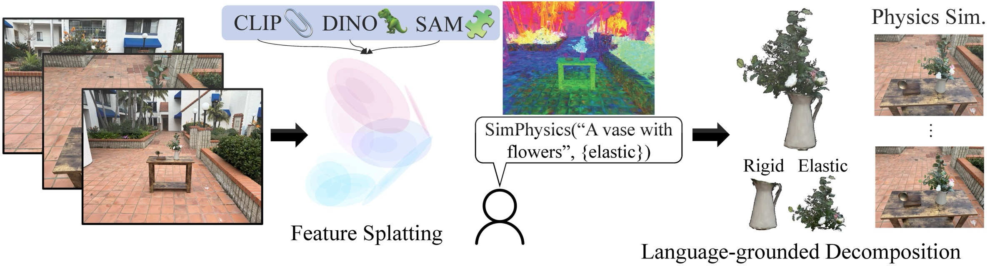
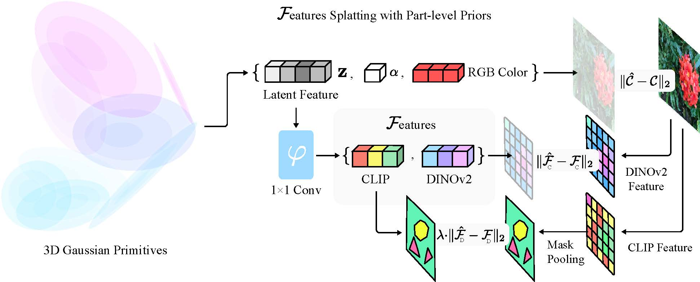
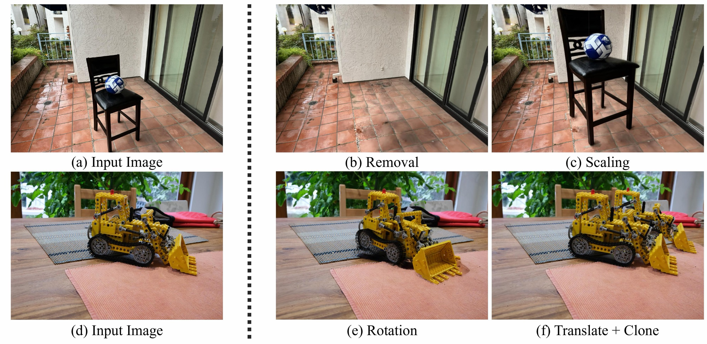
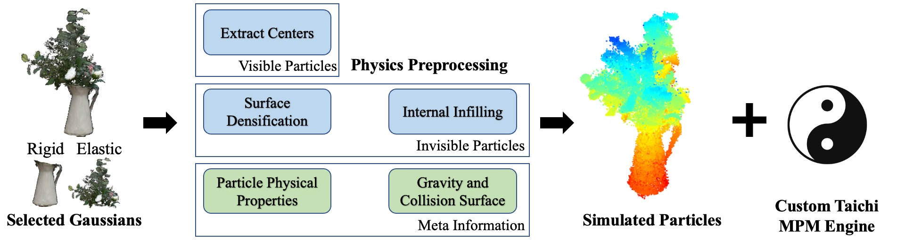

# Feature Splatting：语言驱动的物理场景合成与编辑



检查日期：2026-07-20

## 当前结论

Feature Splatting 是一条对 Video2Mesh **有直接参考价值、而且官方代码确实可审计** 的 dynamic Gaussian 路线。它从已有静态多视角重建出发，把 CLIP、DINOv2 和 SAM 提供的语义蒸馏进每个 3D Gaussian，再通过自然语言选中物体或部件，执行删除、缩放、旋转、平移、克隆，以及基于 Taichi MPM 的动态模拟。

但它不能被理解成“输入一句话，从零生成一个完整仿真场景”：

- 它首先需要真实或合成的多视角图像、相机参数和 COLMAP 稀疏点云。
- 论文里的 `scene synthesis` 指从静态捕获中合成新的物理动态，不是文本到完整 3D world generation。
- 官方 MPM 实现适合制作 Gaussian 动态渲染演示，不输出标准 mesh collider、GLB、URDF、MJCF 或 USD 仿真资产。
- 论文强调按语言判断材质，公开代码实际上主要由用户指定 `elastic`、`snow` 或 `sand`，再用文本查询分出 rigid 子部件；Young's modulus、Poisson ratio、密度和重力仍是固定启发式参数。
- 物理实验没有 ground truth 或定量物理指标，论文明确把它作为定性结果展示。

因此，对 Video2Mesh 最合理的定位是：

1. **近期可吸收**：把它作为 semantic 3DGS 的连续语言特征升级线，用文本做 object/part selection，并把选择结果映射回现有 `object_id`、semantic mesh 和 collider。
2. **可做研究演示**：选择植物、花瓶、窗帘或床品等对象，生成 MPM trajectory 和动态 Gaussian render。
3. **不替代主链路**：场景碰撞、导航、引擎交互仍由 mesh/collider 和 `simulator_asset_bundle.json` 负责。

本轮状态是 **Research / Code audited / Not reproduced**：已阅读 ECCV 2024 论文、项目页和两套官方仓库当前代码，没有在 `bedroom_4` 上训练或生成新实验结果。

## 链接与基本信息

- Official project: https://feature-splatting.github.io/
- ECCV 2024 paper: https://arxiv.org/abs/2404.01223
- Full INRIA/GraphDECO implementation: https://github.com/vuer-ai/feature-splatting-inria
- Nerfstudio Lite implementation: https://github.com/vuer-ai/feature-splatting
- Authors: Ri-Zhao Qiu, Ge Yang, Weijia Zeng, Xiaolong Wang
- Organizations: UC San Diego, MIT, IAIFI
- Venue: ECCV 2024

需要注意同名歧义：这里讨论的是 arXiv `2404.01223` 的物理场景编辑方法，不是后来的新视角合成论文 *Feature Splatting for Better Novel View Synthesis with Low Overlap*。

## 它解决的核心问题

普通 3DGS 的 Gaussian 保存位置、协方差、透明度和球谐颜色，适合高质量新视角渲染，但缺少以下能力：

- 不知道一句 `a vase with flowers` 对应哪些 Gaussians。
- 不知道花瓶和花茎分别属于刚性与弹性部件。
- 不能仅靠静态外观决定选中对象如何移动、形变和碰撞。
- 对物体做位移或移除后，没有稳定的对象级编辑边界。

Feature Splatting 的核心判断是：3D Gaussian 是显式粒子，因此可以同时承载外观、语言特征和物理轨迹。它为每个 Gaussian 增加一个视角无关的 latent feature，再把这个显式表示交给语言分割和粒子模拟。

## Pipeline

```text
multi-view RGB images
  + camera intrinsics/extrinsics
  + COLMAP sparse point cloud
  -> MobileSAMV2/SAM object and part masks
  -> MaskCLIP language features
  -> DINOv2 regularization features
  -> per-Gaussian 32D latent feature distillation
  -> text-query Gaussian selection
  -> KNN / DBSCAN / bbox / ground filtering
  -> object and rigid-part decomposition
  -> geometry editing or Taichi MPM
  -> per-frame Gaussian positions and rotations
  -> dynamic Gaussian renders
```

### 组件责任与数据流

| 组件 | 输入 | 输出 | 在 Feature Splatting 中的责任 | 不应误认为 |
|---|---|---|---|---|
| COLMAP | 多视角 RGB | 相机、稀疏点云 | 初始化静态 3DGS 的坐标与相机 | metric scale 或完整 mesh |
| GraphDECO 3DGS | 相机、RGB、稀疏点 | Gaussian 位置、协方差、透明度、SH | 外观与显式几何载体 | 可直接用于稳定碰撞的 scene collider |
| MobileSAMV2 / SAM | 每帧 RGB | object/part masks | 为粗糙 CLIP 特征提供边界和 mask pooling | 跨视角一致的 3D instance ID |
| MaskCLIP | RGB / crop | 768D language-aligned features | 支持开放词汇文本查询 | 精确物理参数预测器 |
| DINOv2 | RGB | 384D dense features | 作为平滑、结构一致的正则项 | 语言编码器 |
| Feature decoder | 渲染后的 32D latent | CLIP / DINO features | 以较低维 latent 减少高维 feature rasterization 成本 | 通用 scene graph decoder |
| Text selection | Gaussian features + prompts | selected Gaussian mask | 选中对象、背景、地面和 rigid part | 完全自动且免调参的实例分割 |
| RANSAC ground | `floor` / `tabletop` query points | ground plane and gravity orientation | 估计单一支撑平面 | 任意 mesh collision world |
| Taichi MPM | selected particles、rigid flags、ground | particle trajectories | 弹性、沙/雪等粒子动态 | MuJoCo/Isaac/Unity 标准资产生成器 |
| Gaussian renderer | 原始 Gaussian + trajectory | 动态视频/视图 | 渲染编辑后的外观 | 标准可移植 4DGS 文件格式 |

## 1. 语言特征如何写入 3D Gaussians



### 每个 Gaussian 增加视角无关特征

普通 3DGS 对按深度排序的 Gaussians 做 alpha blending。Feature Splatting 除了混合颜色，也混合每个 Gaussian 的 feature `f_i`：

```text
F_hat = sum_i f_i * alpha_i * product_{j < i}(1 - alpha_j)
```

颜色可以依赖视角，但语义应在不同视角保持一致，所以 feature 不接 view direction。论文使用一个浅层 decoder，把渲染出的低维 latent feature 解码为 CLIP 与 DINOv2 特征。

当前 full repo 的默认实现细节：

| 项 | 当前代码值 |
|---|---:|
| per-Gaussian latent dimension | 32 |
| decoded CLIP dimension | 768 |
| decoded DINOv2 dimension | 384 |
| full 3DGS iterations | 30,000 default；README sample 使用 10,000 |
| decoder update cutoff | 2,000 iterations |
| feature update cutoff | 2,500 iterations |
| feature loss | `CLIP cosine + 0.1 * DINO cosine` |
| total loss contribution | `RGB loss + 0.1 * feature loss` |

特征只训练到 2,500 步，而 RGB 继续优化到完整训练终点。后续 Gaussian densification 产生的新点会复制源 Gaussian 的 feature。这是一个重要工程设计：大物体语义在几百到几千步内已经出现，没有必要让 feature 和细纹理一起优化 30,000 步。

### 为什么不能直接蒸馏原始 CLIP feature

论文指出，显式 Gaussians 很容易过拟合低分辨率、带视角噪声的 CLIP feature。Feature Splatting 采用两层修正：

1. 用 SAM/MobileSAMV2 产生 object/part masks，在 mask 内对 CLIP feature 做 masked average pooling，使边界和物体内部更一致。
2. 联合拟合 DINOv2 dense feature，把结构连续性作为弱正则，降低验证视角上的高频噪声。

公开 full repo 已把论文里的 SAM 换成 MobileSAMV2，以提高特征提取速度；这属于官方实现对论文配置的工程折中，不能把它写成完全相同的 reference pipeline。

### 实际保存格式

full repo 不把 32D feature 直接写进标准 PLY property。当前 `GaussianModel.save_ply()` 输出：

```text
point_cloud/iteration_<N>/point_cloud.ply
point_cloud/iteration_<N>/point_cloud_distill_feat.pth
```

这意味着普通 SuperSplat/Spark 或 Video2Mesh 的 PLY loader 只能看到外观 Gaussian，不能自动获得语言 feature。加载 feature 还依赖 PyTorch `.pth` 和相同的 feature decoder。

## 2. 语言引导的物体与部件分解

论文方法将 positive prompt 与 generic negative prompts 编码成 CLIP text embeddings，计算每个 Gaussian 的 cosine similarity，并用阈值选择前景。论文给出的默认 foreground threshold 是 `0.6`。

full repo 的 `segment.py` 暴露了更完整的工程参数：

| 参数 | 作用 |
|---|---|
| `--fg_obj_list` | 正向对象词，如 `vase,flowers,plants` |
| `--bg_obj_list` | 邻近背景排除词，如 `tabletop,wooden table` |
| `--ground_plane_name` | 支撑平面查询，如 `floor` 或 `tabletop` |
| `--rigid_object_name` | 在已选对象内再次识别 rigid 子部件 |
| `--threshold` | 初始相似度阈值，默认 `0.6` |
| `--object_select_eps` | DBSCAN instance 过滤尺度 |
| `--inward_bbox_offset` | 收缩 ground-aligned bbox，降低邻近噪声 |
| `--final_noise_filtering` | 最终 inverse-KNN / cluster 去噪 |
| `--interactive_viz` | Open3D 交互式检查每一步选择结果 |

这个流程是 **半自动** 而不是 prompt-only：COLMAP scale ambiguity 会直接影响 DBSCAN `eps` 和 bbox offset，官方 README 也说明自定义场景通常需要调参。对 Video2Mesh 来说，已有 SAM2 多视角融合、`object_id` 和 semantic mesh 可以成为更稳定的先验，不应重新只靠 CLIP 阈值决定实例边界。

## 3. 场景编辑能力



显式 Gaussian 允许直接操作选中对象：

| 操作 | 实现方式 | 主要风险 |
|---|---|---|
| Removal | 删除选中 Gaussian | 被遮挡背景没有 clean plate 时会出现空洞或伪影 |
| Translation | 给 centroid 加位移 | 原位置暴露背景，目标位置可能穿插 |
| Rotation | 同时旋转 centroid/covariance | pivot、碰撞和支撑关系需额外定义 |
| Scaling | 缩放 centroid 与 covariance | 不会自动更新质量、惯量或 collider |
| Clone | 复制后平移/旋转 | 会复制训练视角中的外观和 feature，不等于生成新背面 |
| Appearance edit | 只优化选中 Gaussian 的 SH，使用 CLIP guidance | 论文示例训练 2,500 次，仍不是一次性 prompt edit |

论文结论部分明确承认：当前方法在移除或移动物体后不执行 inpainting，暴露区域可能出现背景 artifacts。项目页某些示例看起来较干净，不能据此推断所有真实扫描都能自动补出正确背景。

## 4. MPM 物体仿真



### 为什么需要体积填充

3DGS centers 主要分布在可见表面。若直接把这些表面点作为 MPM particles，弹性球碰到地面时会因为内部缺少支撑而塌陷。Feature Splatting 做两类补点：

1. 根据 Gaussian covariance 与 opacity 在表面 disk 上加密采样。
2. 从物体中心向表面插值不可见的透明 support particles。

透明粒子只参与物理计算，不参与 `T=0` 外观渲染，因此静态 3DGS 可以平滑切换到动态状态。

### Gaussian 旋转更新

物体发生大形变时，仅更新 centroid 会让 anisotropic Gaussian 的朝向错误。论文没有直接采用 deformation gradient 的局部旋转，而是用每个 Gaussian 及其两个近邻构造局部平面，以平面法向变化估计 rotation。论文定性消融显示，这在大形变下比直接使用 deformation gradient 的旋转伪影更少。

### 公开代码的真实物理边界

full repo 当前 `mpm_physics.py` 的默认值如下：

| 项 | 当前实现 |
|---|---|
| solver | custom Taichi MPM |
| grid resolution | `64 x 64 x 64` default |
| internal occupancy grid | `128 x 128 x 128` |
| surface voxel extraction | resolution `256` |
| max surface samples | 10,000 |
| internal support samples | 20 per real Gaussian ray |
| Taichi device memory request | 6 GB |
| max particles | `2^21` |
| material choices exposed by CLI | `elastic`, `snow`, `sand` |
| Young's modulus | `2.5 x 10^6` in normalized solver units |
| Poisson ratio | `0.24` |
| particle density | `1000` in solver units |
| gravity | `(0, -4.5, 0)` |
| collider | one sticky ground plane |
| simulation | 500 frames, `dt=4e-3` |

这不是 metric-scale、可校准的通用物理资产：对象先按最长边归一化到 unit box，模拟结束后再映射回 COLMAP 坐标。代码没有根据每个真实对象估计 kg、m、Pa、friction 或 restitution，也没有把 Video2Mesh scene mesh 作为任意几何 collider。`--rigid_object_name` 产生的 rigid subset 主要通过 motion override flag 固定或驱动，并不是完整的多刚体约束系统。

### 官方代码中的“自动材质”要如何理解

论文描述的是：用常见 rigid material vocabulary，如 `wood`、`ceramic`、`steel`，在选中物体内部识别刚性部件，并从 preset material bank 选择模拟类型。

公开代码的实际入口是：

```bash
python segment.py \
  -m output/garden_table \
  --rigid_object_name vase \
  --final_noise_filtering \
  --inward_bbox_offset 0.15 \
  --interactive_viz

python mpm_physics.py \
  -m output/garden_table \
  --material_type elastic \
  --rigid_speed 0.3 \
  --use_rigidity
```

`elastic` 仍由用户显式传入；代码不会从 `flower` 自动回归 Young's modulus，也不会生成带 provenance 的 physics JSON。因此它更接近 **语言辅助的对象/刚性部件选择 + 预设 MPM 模板**，不是 PhysSplat 所描述的 MLLM 物理属性分布预测。

## 官方代码与环境

### Full INRIA / GraphDECO 版本

本轮核验的远端 `main` HEAD：`e8647b3fdb19dfebd8bab61a8e495fde03ead119`，提交日期 2025-11-08。

| 项 | 当前状态 |
|---|---|
| Base | forked INRIA/GraphDECO 3DGS rasterizer |
| Python | 3.11 |
| PyTorch | 2.7.1 |
| CUDA toolkit | 12.8 |
| CUDA extensions | custom `diff-gaussian-rasterization` + `simple-knn` |
| Feature models | MaskCLIP, MobileSAMV2, DINOv2 |
| Physics | Taichi + custom MPM engine |
| Geometry/selection | Open3D, SciPy, pykdtree, DBSCAN/KNN helpers |
| Input formats | COLMAP-processed RGB；synthetic `transforms.json` |
| Sample data | garden vase、kitchen bulldozer download links in README |
| Own pretrained checkpoint | 无；每个场景需要 feature extraction 和训练 |

官方没有给出最低 GPU、推荐 VRAM、RAM 或总磁盘占用。可确认的是 MPM 代码显式请求 6 GB Taichi device memory，而 feature training 需要 CUDA rasterizer，并且仓库最近一次更新就是修复错误 GPU architecture/CUB 导致的 OOM。初次 Video2Mesh 复现建议使用 24 GB NVIDIA GPU 作为工程预算，但这不是论文官方硬件声明。

许可需要单独审计：full repo 根目录当前没有独立 `LICENSE` 文件，部分继承的 GraphDECO 源文件写有 non-commercial research/evaluation 条款。不能因为仓库公开就默认它可直接用于商业产品。

### Nerfstudio Lite 版本

本轮核验的远端 `main` HEAD：`e24870d26c62dfb70d9afbbd8361c86b5754b8d9`，版本 `0.0.3`，Apache-2.0。

Lite 版的定位是快速检查 feature quality 和在 Nerfstudio viewer 里编辑：

- README 示例使用 Python 3.8、PyTorch 2.1.2 + CUDA 11.8、Nerfstudio 与 `gsplat>=1.0.0`。
- 可直接对 Nerfstudio-format dataset 运行 `ns-train feature-splatting`。
- 使用 MobileSAMV2，并用简单 bbox 选 Gaussian，牺牲论文/full 版的完整 segmentation 后处理。
- 官方明确建议需要复现网站物理效果时使用 full INRIA 版本。
- 当前 TODO 包括更好的 segmentation、gravity/ground estimation，以及修复训练与编辑并发的 race condition；README 要求编辑前暂停训练。

对 Video2Mesh 来说，Lite 版更适合做第一阶段语义特征 smoke test，full 版才适合评估 MPM，但两套实现不能混写成同一个已经验证的 pipeline。

## 软件、硬件与运行成本

| 阶段 | 主要资源 | 官方可核实成本 | Video2Mesh 接入注意 |
|---|---|---|---|
| COLMAP preprocessing | CPU/GPU、RGB frames | 未给统一时间 | 可复用现有 cameras/sparse model，但要核对目录格式 |
| Feature extraction | MobileSAMV2、MaskCLIP、DINOv2、GPU | 项目页称约 `0.2 s/image`，未注明硬件和分辨率协议 | 首次会从 Torch Hub/外部仓库下载模型；应固定 cache 与 commit |
| Full training | CUDA 3DGS rasterizer | 论文称平均少于 1 小时；默认 RGB 30k、feature 2.5k | 不是 feed-forward；每个场景独立训练 |
| Object selection | CUDA feature decode + Open3D | 未给统一时间 | DBSCAN/bbox 阈值受 COLMAP scale 影响，通常需可视化调参 |
| MPM | Taichi CUDA | 论文称约 30 FPS，硬件未注明 | 代码使用 GUI 和单地面平面，headless server 需要额外处理 |
| Dynamic render | Gaussian CUDA rasterizer | 已计算 trajectory 后约 100 FPS，硬件未注明 | 输出主要是 render frames，不是引擎可直接消费的 bundle |

网络和磁盘成本不能只按 Git repo 估计。源码很小，但实际还要下载 Torch、CUDA toolkit、MobileSAMV2、MaskCLIP、DINOv2、样例数据，并为每帧保存多套 `.npy` feature。官方没有提供总权重与每场景 feature cache 的标准体量，需要在正式部署前用 `bedroom_4` 帧数和分辨率实测。

## 论文结果与指标

### 语言定位

论文在 LERF 的 5 个 localization scenes、72 个 objects 上评估：

| 方法 | 空间 | Localization accuracy |
|---|---|---:|
| OWL-ViT | 2D | 54.8% |
| LERF | 2D | 80.3% |
| Feature Splatting, CLIP only | 2D | 73.0% |
| Feature Splatting, CLIP + DINO variant | 2D | 71.4% |
| Feature Splatting, full | 2D | **81.7%** |
| Feature Splatting | 3D | 50.7% |

`81.7%` 说明 SAM-enhanced feature 和多模型融合对 2D query localization 有效，但 3D accuracy 只有 `50.7%`。论文解释为完整 3D 场景包含当前 view 看不到的候选，容易产生未被 2D label 覆盖的 false positives。对 Video2Mesh 而言，这正是不能直接用文本 feature 替代现有多视角 object ID 融合的原因。

### 外观与 feature rendering

| 方法 | PSNR | Train CLIP loss | Val CLIP loss | FPS |
|---|---:|---:|---:|---:|
| Vanilla GS | 26.45 | N/A | N/A | 129 |
| Ours without DINO | 26.48 | 0.029 | 0.048 | 102 |
| Ours full | 26.47 | 0.032 | **0.046** | 102 |

Feature Splatting 基本保持了 vanilla GS 的 PSNR，但 feature rendering 使渲染速度从 129 FPS 降到 102 FPS。DINO regularization 会略微增大 training feature loss，却降低 validation loss，符合“牺牲训练视角拟合，改善跨视角稳定性”的目标。

### 系统优化

论文的 timing ablation 显示，在同样 768D feature 下，FP16/Half2、shared gradient buffer 和 interleaved memory access 相对 naive baseline 合计降低约 `62.3%` 的训练时间；进一步将 splatted feature 压到 32D 后，表中时间从 `3.21` 降到 `0.06`，相对约 `97.1%`。论文还报告 full feature training 平均少于 1 小时，而 Feature3DGS 的实测约 6 小时。

这些数字只适合说明优化趋势。论文表格和项目页没有给出统一、足够完整的 GPU/scene protocol，不能直接外推成 `bedroom_4` 的运行时间。

### 物理结果

论文展示花瓶与弹性花茎、jelly statue、沙化 bulldozer、弹性球落地等动态序列，并报告 Taichi simulation 约 30 FPS、trajectory 已生成后的 Gaussian rendering 约 100 FPS。

但论文明确说明：物理编辑没有 ground truth images，也没有可比较的 previous baseline，因此只做 qualitative comparison。没有报告质量守恒、接触穿透、轨迹误差、能量漂移、材质参数误差或跨引擎一致性。它能证明“可以生成连贯且有物理观感的动态”，不能证明“物理参数准确”或“仿真可用于机器人策略训练”。

## 与相邻路线的区别

| 路线 | 语言语义 | 物理 | 输出重点 | 当前对 Video2Mesh 的价值 |
|---|---|---|---|---|
| Feature Splatting | CLIP + SAM + DINOv2 feature field | preset Taichi MPM + rigid query | 动态 Gaussian render、编辑 trajectory | 有完整公开代码，适合 semantic feature 与 dynamic demo baseline |
| PhysGaussian | 不以语言 grounding 为核心 | MPM，通常手工选择和赋材质 | physics-integrated Gaussian dynamics | 可作 MPM/rotation 对照 |
| PhysSplat / Sim Anything | MLLM 物理属性推断 | MPDP + PGAS + MPM | open-world dynamic Gaussian simulation | 思路更自动，但官方核心 pipeline 当前未公开可执行代码 |
| Video2Mesh 当前主链路 | GroundingDINO/SAM2 + 2D-to-3D fusion + object sidecar | mesh collider + physics metadata + adapters | 3DGS visual、mesh、GLB、object asset、simulator bundle | 更适合标准引擎与可审核资产交付 |

Feature Splatting 比 PhysSplat 更适合作为当前可执行研究 baseline；但 Video2Mesh 不应为了采用它而放弃现有的 mesh/collider 和结构化 sidecar。

## 在 Video2Mesh 中的位置

### 不能直接复用现有 semantic 3DGS PLY

当前 Video2Mesh 的 semantic 3DGS baseline 保存 `object_id` 与 `object_probability`，Feature Splatting 需要每个 Gaussian 的 32D latent feature、feature decoder 和训练时相机。二者语义合同不同：

```text
Video2Mesh semantic 3DGS
  = discrete object identity + probability

Feature Splatting scene
  = continuous CLIP/DINO latent + decoder + text query
```

所以不能只把 `semantic_3dgs_from_semantic_mesh_transfer.ply` 交给官方 `segment.py`。正确做法是从同一套 registered frames 和 COLMAP cameras 训练 feature field，再按空间或 Gaussian index 把文本选择结果映射回 Video2Mesh 的 object IDs。

### 推荐的分层接入

```text
Video2Mesh frames + COLMAP cameras
  -> Feature Splatting feature distillation branch
  -> prompt selection / part proposal
  -> align with semantic_3dgs object_id and semantic mesh
  -> language_selection.json with provenance

selected Gaussian object
  -> optional Taichi MPM trajectory
  -> dynamic_gaussian_trajectory.npz
  -> dynamic render demo

selected semantic mesh object
  -> existing collider / GLB / physics sidecar path
  -> simulator_asset_bundle.json
  -> Web / Unity / MuJoCo / Isaac runtime
```

### 建议新增的中间合同

下面是接入建议，不是当前已有实验产物：

```json
{
  "method": "feature_splatting",
  "status": "proposal",
  "scene_id": "bedroom_4",
  "source_gaussians": ".../point_cloud.ply",
  "feature_tensor": ".../point_cloud_distill_feat.pth",
  "feature_dim": 32,
  "prompt": "plant with pot",
  "negative_prompts": ["wall", "floor", "nightstand"],
  "selected_gaussian_indices": ".../selected_indices.npy",
  "mapped_object_ids": ["plant_01"],
  "selection_metrics": {
    "semantic_3dgs_agreement": null,
    "multiview_mask_iou": null
  },
  "physics": {
    "mode": "taichi_mpm_demo",
    "metric_calibrated": false,
    "trajectory": ".../dynamic_gaussian_trajectory.npz"
  }
}
```

不要继续沿用官方 `editing_modifier.pkl` 作为长期资产合同。Pickle 强绑定 Python 类和实现细节，不适合 Web/引擎、版本审计或跨语言消费。Video2Mesh 应把 selection metadata 保存为 JSON，把大数组保存为 NPY/NPZ，并显式记录 model commit、prompts、camera convention、scale 和 metric calibration 状态。

## 可落地实验方案

### P1：语言 feature 与现有语义的一致性实验，推荐先做

目标不是立即跑物理，而是回答 Feature Splatting 是否能补强 `bedroom_4` 的 object/part selection。

```text
bedroom_4 registered frames + COLMAP
  -> full 或 Lite feature distillation
  -> prompts: bed / lamp / plant / curtain / floor / window
  -> map selected Gaussians to current semantic 3DGS
  -> compare with SAM2/semantic mesh object IDs
```

验收指标：

- 2D rendered mask IoU，按 held-out views 报告。
- 3D Gaussian agreement / precision / recall，按现有 `object_id` baseline 报告。
- 跨视角 selection flicker。
- 每个 prompt 的 false positive clusters 和漏选边界。
- feature extraction、training、selection 的 runtime、峰值 VRAM、缓存体量。
- 原始 GraphDECO render 的 PSNR/SSIM/LPIPS 是否受到影响。

### P2：花盆与植物的 rigid-elastic 动态 demo

如果 P1 能稳定选出 `plant` 和 `pot`，再做最贴合论文的 MPM demo：

1. 用 `plant with pot` 选整个对象。
2. 用 `ceramic pot` 或 `rigid pot` 选 rigid subset。
3. 用 table/floor query 和现有 mesh plane 对照 ground estimation。
4. 保存官方 MPM trajectory，同时导出结构化 NPZ/JSON sidecar。
5. 渲染原静态视角、新视角和动态视频。
6. 检查背景暴露、Gaussian 拉伸、物体穿地、体积塌陷与 rigid/elastic 边界。

这只能标为 `Dynamic Gaussian Demo`，不能标为 simulator-ready。除非后续完成 metric scale、真实 scene collider、接触 QA 和引擎侧复现。

### P2/P3：只借语言选择，不采用官方 MPM

对 Video2Mesh 更稳的产品路径是：

```text
Feature Splatting prompt selection
  -> object_id / part_id proposal
  -> semantic mesh / completed object mesh
  -> collider + mass/friction/restitution sidecar
  -> existing simulator preflight
```

这条路线保留 Feature Splatting 的开放词汇交互价值，同时继续由标准 mesh collider 和引擎承担真实碰撞。它比直接把 Gaussian MPM trajectory 塞进 MuJoCo/Unity 更符合当前 layered asset contract。

## 风险与停止条件

| 风险 | 具体表现 | 停止或降级条件 |
|---|---|---|
| Feature/geometry index 不一致 | 现有 GraphDECO PLY 与 Feature Splatting fork densification 后 Gaussian 数量不同 | 不能证明一一映射时，按空间+可见性回投，不直接复制 index |
| 文本分割噪声 | 相邻同类物体混选，边界 floaters | held-out 2D IoU 和 3D agreement 未达基线时，不进入 MPM |
| Scale ambiguity | DBSCAN、ground plane、运动幅度随场景尺度变化 | 未完成 scale calibration 时只做归一化 demo |
| 背景空洞 | removal/translation 暴露未观测区域 | 没有 clean plate 时不展示为完整场景编辑结果 |
| 单平面碰撞 | 不能处理床、桌、墙和复杂 scene mesh 接触 | 需要复杂碰撞时切回 Video2Mesh collider/engine path |
| 物理参数不真实 | 固定 `E`、`nu`、density、gravity | 不用于机器人训练或现实预测，不报告为 measured physics |
| 输出不可移植 | `.pth` + `.pkl` + Python renderer | 未导出 JSON/NPZ/GLB contract 时只算研究产物 |
| Headless/server 兼容 | Open3D interactive window、Taichi GUI、Torch Hub 下载 | 先做无 GUI smoke；不能稳定运行时改用 Lite feature-only 路线 |
| License 不清晰 | full repo 无根 LICENSE，继承 GraphDECO 限制 | 商业或公开产品集成前必须完成许可审计 |

## 最终接入判断

| 目标 | 判断 |
|---|---|
| 替代 GraphDECO 视觉层 | 不建议；它是 GraphDECO fork 上的 feature 扩展，不是独立更高画质 renderer |
| 替代现有 semantic 3DGS | 不直接替代；适合补连续 open-vocabulary feature，再与离散 `object_id` 对齐 |
| 替代 COLMAP/mesh collider | 不可以；官方只提供单 sticky plane collision |
| 语言驱动对象/部件选择 | 值得做 P1 实验，是最直接的吸收点 |
| Gaussian 几何编辑 | 可做研究和 Web demo，但需 clean plate、support 和 collision QA |
| 软体/颗粒动态展示 | 值得做 P2 dynamic Gaussian demo |
| simulator-ready 资产生成 | 不足；缺 GLB/URDF/USD、metric physics、复杂 collider 和 engine preflight |
| 相比 PhysSplat 的近期可复现性 | 更高；Feature Splatting 有可执行 full repo，PhysSplat 当前核心代码未公开 |

推荐顺序是 **先验证语言 feature，再接现有 object/collider 资产，最后才做 MPM 动态演示**。这样可以吸收 Feature Splatting 最成熟的部分，也不会把漂亮的 Gaussian 动画误当成已经完成的物理场景资产。

## 参考资料

- Qiu et al., *Language-Driven Physics-Based Scene Synthesis and Editing via Feature Splatting*, ECCV 2024: https://arxiv.org/abs/2404.01223
- Official project page and videos: https://feature-splatting.github.io/
- Official full INRIA implementation: https://github.com/vuer-ai/feature-splatting-inria
- Official Nerfstudio implementation: https://github.com/vuer-ai/feature-splatting
- PhysGaussian paper: https://arxiv.org/abs/2311.12198
- Video2Mesh related note: [PhysSplat / Sim Anything](#/doc/video2mesh-object-simulation-physsplat-sim-anything)
- Video2Mesh related note: [VLM Physical Properties](#/doc/video2mesh-object-simulation-vlm-physical-properties)
