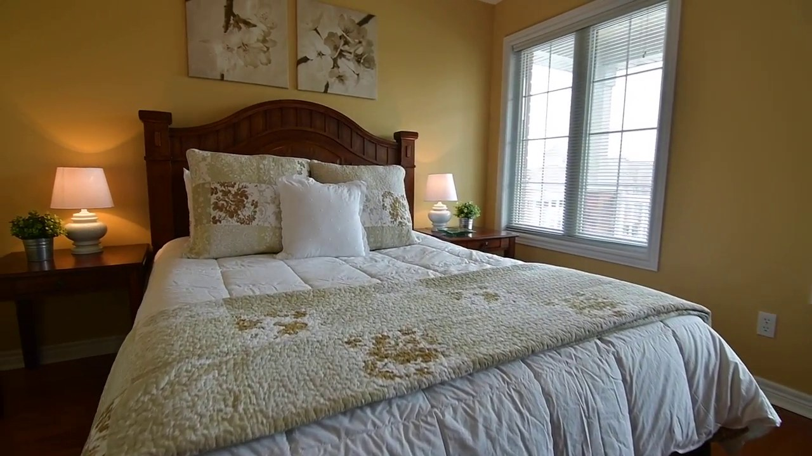

# PhysSplat / Sim Anything


检查日期：2026-07-11

## 当前结论

PhysSplat / Sim Anything 本体 **目前不能在 mil8 上按官方代码部署跑通**，原因不是 GPU 不够，而是官方公开仓库没有可执行 pipeline：

| 仓库 | 核验结果 |
|---|---|
| `Maxwell-Zhao/PhysSplat` | 仅 `README.md`，commit `29a1fe0516b97f969ef59e5445dbd7bee593736a`，无 `requirements.txt`、无脚本、无权重、无示例数据 |
| `CHNxindong/sim-anything` | 仅 `README.md`，commit `95cfac661ddf7fec1b3713dae08c31ca98e21188`，README 写明 `Code will come soon.` |
| `Maxwell-Zhao/RoboSimGS` | PhysSplat README 推荐的新项目，代码比 PhysSplat 完整，但目标变成机器人数据生成；已另写 [RoboSimGS 调研与 mil8 部署判断](../industrial-pipelines/robosimgs.md) |

所以这次不能写成“PhysSplat 已部署”或“bedroom_4 已跑通 PhysSplat”。真实状态是：**完成官方公开边界审计；PhysSplat 本体未公开可部署代码；mil8 上只验证了相邻 PhysX-Anything 路线的半成品环境和失败点。**

这条线对 Video2Mesh 仍然有价值，但价值主要是两个思想：

- dynamic Gaussian / particle simulation 适合后续软体、床品、窗帘、植物等非刚体动态展示。
- MLLM-P3 物理属性推断可转化为 Video2Mesh 的 physics sidecar 初稿，但必须保留模型、prompt、证据图和 QA 状态。

## 链接

- Project page: https://sim-gs.github.io/
- Paper: https://arxiv.org/abs/2411.12789
- Official PhysSplat repo: https://github.com/Maxwell-Zhao/PhysSplat
- Older Sim Anything placeholder: https://github.com/CHNxindong/sim-anything
- Related successor project: https://github.com/Maxwell-Zhao/RoboSimGS
- Adjacent single-image sim-ready asset project: https://github.com/ziangcao0312/PhysX-Anything
- Venue: ICCV 2025

## 摘要要点

Sim Anything / PhysSplat 的目标不是把 3DGS 转成传统 mesh collider，而是让静态 3DGS 场景里的物体获得可交互动态。它先做 open-vocabulary object segmentation，再用 MLLM 推断物体物理属性，接着用 Material Property Distribution Prediction 估计属性分布，最后通过 Physical-Geometric Adaptive Sampling 采样粒子并进行 MPM simulation。

这条路线和 Video2Mesh 当前“视觉代理 + 碰撞代理 + 语义/物理 sidecar”的分层思路不同。它更像是把物理仿真注入 Gaussian/particle 表示里，适合 deformable object 或动态效果研究；但如果要接 Unity/MuJoCo/Isaac 的标准 asset bundle，仍然需要传统 collider、mass、friction、restitution、joint/constraint 等结构化资产。

## Pipeline

## 输入与输出

| 阶段 | 作用 |
|---|---|
| 3D open-vocabulary segmentation | 从开放世界场景中定位需要仿真的目标物体 |
| multi-view inpainting | 补齐目标移动/变形后可能暴露的背景 |
| MLLM-P3 | 通过多模态大模型推断物体的平均物理属性 |
| MPDP | 将平均物理属性扩展为分布，降低精确手工标注需求 |
| PGAS + MPM | 按几何和物理属性采样粒子，执行 material point simulation |

输入：3DGS 场景、物体分割、交互力或动作条件。输出：物体动态响应、模拟粒子/动态 Gaussian 表示、渲染视频或交互结果。

## 官方代码公开边界

这次本地和远端都实际 clone 了官方仓库：

```text
/tmp/PhysSplat
mil8:/data/zyx/workspace/physplat_official_audit_20260711/PhysSplat
```

实际文件只有：

```text
README.md
```

没有以下部署必需品：

| 必需项 | 状态 |
|---|---|
| Python package / module | 未公开 |
| dependency file | 未公开 |
| 3DGS scene preprocessing script | 未公开 |
| open-vocabulary 3D segmentation script | 未公开 |
| MLLM-P3 provider wrapper | 未公开 |
| MPDP checkpoint / inference code | 未公开 |
| PGAS particle sampler | 未公开 |
| MPM simulation code | 未公开 |
| example scene / expected output | 未公开 |

`CHNxindong/sim-anything` 也只包含 README：

```text
# sim-anything
Code for Sim Anything: Automated 3D Physical Simulation of Open-world Scene with Gaussian Splatting
Code will come soon.
```

因此不存在一个可以直接执行的官方命令来把 `bedroom_4` 的 3DGS 或 semantic mesh 输入 PhysSplat。

## mil8 当前审计

远端检查结果：

| 项 | 实测 |
|---|---|
| GPU | 8 x RTX 3090 24GB，当前可用 |
| `/data` | 约 50GB 可用，99% 使用率，不适合再铺大模型/大数据 |
| 官方 PhysSplat clone | `mil8:/data/zyx/workspace/physplat_official_audit_20260711/PhysSplat` |
| 官方 PhysSplat commit | `29a1fe0516b97f969ef59e5445dbd7bee593736a` |
| `physsplat_bedroom4_20260711` | 存在，但它是 Video2Mesh/SimFoundry bedroom_4 资产打包，不是 PhysSplat 官方 pipeline |
| 可执行状态 | PhysSplat 本体无脚本可跑 |

`mil8:/data/zyx/workspace/physsplat_bedroom4_20260711` 目录里包含的是已有 Video2Mesh 代码和 SimFoundry-style 静态资产：

```text
assets/simfoundry_bedroom4_static_object_scene_p1_20260708_161534/
code/video2mesh/
code/tools/
```

这份目录可以作为未来 PhysSplat/MPM 适配的输入候选，尤其是 `semantic_3dgs_from_semantic_mesh_transfer.ply`、semantic object meshes、scene GLB 和 simulator bundle；但它不能证明 PhysSplat 已经部署或运行。

## PhysX-Anything 相邻 smoke

因为 PhysSplat 本体没有代码，本轮额外检查了 mil8 上已有的 PhysX-Anything checkout。注意：**PhysX-Anything 不是 PhysSplat**。

| 项 | PhysSplat | PhysX-Anything |
|---|---|---|
| 输入 | 3DGS 场景 + object segmentation + interaction | 单张物体图像 |
| 输出 | dynamic Gaussian / particle / MPM simulation render | sim-ready 3D asset、part split、URDF/XML |
| 适合 Video2Mesh 的位置 | P2/P3 dynamic Gaussian / soft body 研究 | object crop -> sim-ready object asset 旁路 |
| 当前 mil8 状态 | 官方无可执行代码 | 有 repo 和 venv，但依赖/权重未完整 |

远端路径：

```text
mil8:/data/zyx/workspace/PhysX-Anything
mil8:/root/autodl-tmp/physx-anything-venv
mil8:/data/zyx/workspace/physx_anything_bedroom4_audit_20260711/smoke.log
```

已准备的 `bedroom_4` 输入：

```text
mil8:/data/zyx/workspace/PhysX-Anything/demo/bedroom_4_center_frame.png
```

输入图像是 `1280 x 720`、约 `1.2 MB`。本地文档图像副本：



当前 venv 检查：

| 依赖 | 状态 |
|---|---|
| `torch` | OK，`2.2.2+cu121`，CUDA available |
| `transformers` / `diffusers` | OK |
| `trellis` / `qwen_vl_utils` | 在 repo cwd 下可 import |
| `trimesh` / `open3d` / `cv2` / `rembg` | OK |
| `spconv` / `kaolin` / `nvdiffrast` / `xatlas` / `utils3d` | MISSING |
| `pretrain/` weights | MISSING |

smoke 命令：

```bash
cd /data/zyx/workspace/PhysX-Anything

/root/autodl-tmp/physx-anything-venv/bin/python -u 1_vlm_demo.py \
  --demo_path ./demo \
  --save_part_ply True \
  --remove_bg True \
  --ckpt ./pretrain/vlm

/root/autodl-tmp/physx-anything-venv/bin/python -u 2_decoder.py
/root/autodl-tmp/physx-anything-venv/bin/python -u 3_split.py
/root/autodl-tmp/physx-anything-venv/bin/python -u 4_simready_gen.py \
  --voxel_define 32 \
  --basepath ./test_demo \
  --process 0 \
  --fixed_base 0 \
  --deformable 0
```

真实失败点：

| 步骤 | 结果 |
|---|---|
| `1_vlm_demo.py` | `transformers` 的 Qwen2.5-VL import 失败：`register_pytree_node() got an unexpected keyword argument 'flatten_with_keys_fn'`，根因是当前 `torch 2.2.2` 与 `transformers 4.50.0` 不兼容 |
| `2_decoder.py` | 缺 `easydict` |
| `3_split.py` | `./test_demo` 不存在，因为前两步没有生成结果 |
| `4_simready_gen.py` | 缺 `ipdb`；同样没有 `test_demo` 输入 |

这说明 PhysX-Anything 当前是半成品环境，不是已跑通；但它有比 PhysSplat 更明确的修复路线：按 README 建 `torch 2.4.0 + cu118` 环境，安装 `spconv/kaolin/nvdiffrast/xatlas/utils3d/easydict/ipdb`，下载 `pretrain/vlm` 和 decoder 权重，再用 object crop 而不是整房间 frame 运行。

## 在 Video2Mesh 中的位置

适合作为 P2/P3 的研究方向，尤其在“物体交互”阶段提供参考：如何从语义物体推断物理属性，如何处理软体/可变形物体，如何把 3DGS 视觉和物理动态联系起来。

短期不进入主链路。原因是当前可复现实验和工程接口仍不如传统 physics engine 稳定，而且它的输出不直接等价于 Video2Mesh 需要的 simulator asset bundle。

## 接入判断

- P0：不进入。
- P1：可以借鉴 MLLM 物理属性推断，把 material、mass、friction/restitution 的默认值写入 Video2Mesh sidecar。
- P2：PhysX-Anything 可作为“单图 object crop -> sim-ready asset”的旁路候选，但必须标注它不是 PhysSplat，并优先用床头柜、灯、植物、盒子这类单物体 crop，而不是整房间 frame。
- P3：等 PhysSplat / Sim Anything 真正释放 PGAS/MPDP/MPM 代码后，再尝试把 Video2Mesh semantic 3DGS 和 object sidecar 接入 dynamic Gaussian / MPM demo。

## 下一步建议

1. 不再尝试“部署 PhysSplat 本体”，除非官方发布实际代码。
2. 如果想继续推进可执行路线，优先修 PhysX-Anything 环境：重新按 README 建隔离 env，而不是在当前半成品 venv 上补丁式安装。
3. 从 `bedroom_4` 里裁一个明确单物体 crop，例如 lamp / nightstand / plant，再跑 PhysX-Anything；整房间 frame 只能作为 smoke input，不能作为可靠资产生成输入。
4. 若要调用大模型做物理描述，使用 Sub2API / `gpt-5-codex` provider wrapper，并只读取 `OPENAI_API_KEY` 环境变量，不写入明文 key。
