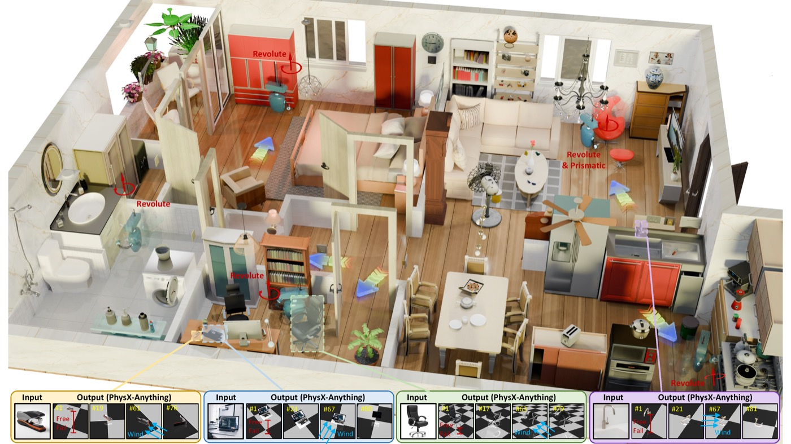
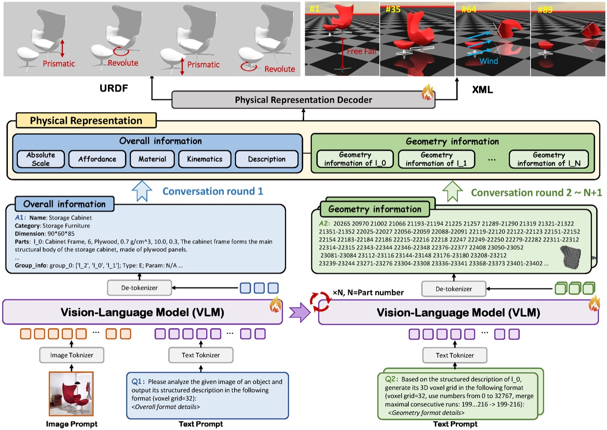
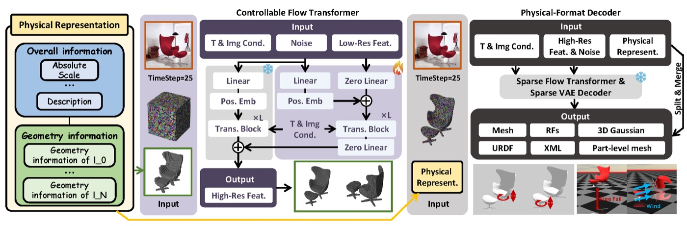
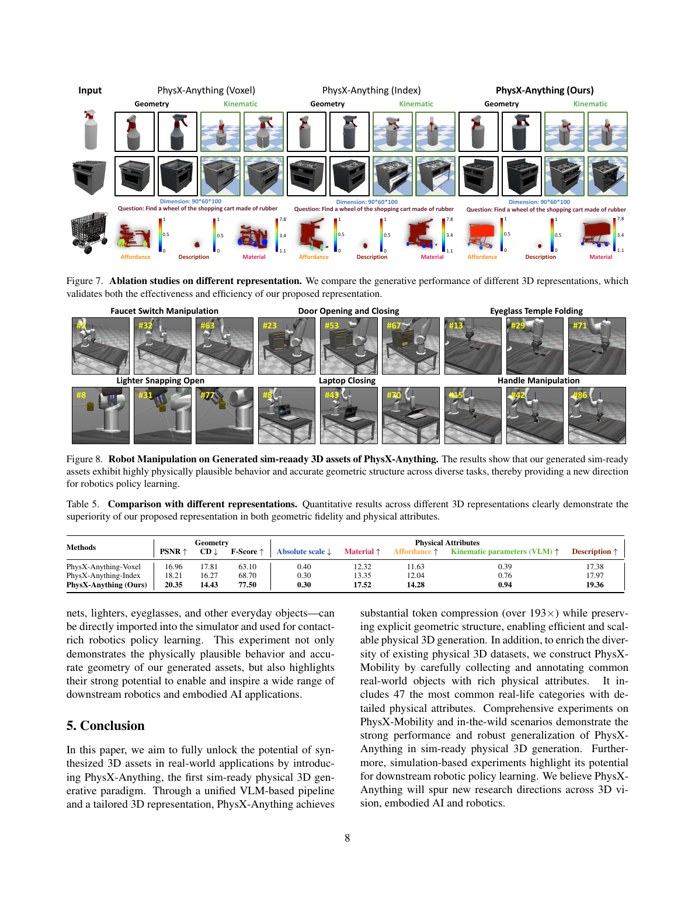

# PhysX-Anything

检查日期：2026-07-11

当前执行状态：论文 PDF、项目页、GitHub README 和 mil8 部署探针已完成；官方源码已克隆到 mil8，但 bedroom_4 只完成了单帧 smoke input 准备，尚未完成官方 `1_vlm_demo.py -> 2_decoder.py -> 3_split.py -> 4_simready_gen.py` 推理链路。主要 blocker 是共享环境缺 PhysX-Anything 指定的 Qwen2.5-VL/flash-attn/qwen-vl-utils/TRELLIS decoder 权重与若干仿真依赖；复测时旧隔离 venv 和共享 Python 的 `torch import` 均在 25 秒 timeout 内未返回。干净 PyTorch 2.4 venv 尝试也受阻：系统 Python 是 3.7 且无 `ensurepip`，而 `/opt/envs/max/bin/python -m venv` 生成的仍是无 pip 的 Python 3.7 venv。Hugging Face API 显示 `Caoza/PhysX-Anything` 约 39.94 GB、`microsoft/TRELLIS-image-large` 约 3.30 GB；`/data` 仅剩约 49 GB，不适合贸然下载全量权重和编译缓存。



## 链接

| 项 | 地址 |
|---|---|
| Project page | https://physx-anything.github.io/ |
| Paper | https://arxiv.org/abs/2511.13648 |
| Code | https://github.com/ziangcao0312/PhysX-Anything |
| Model | https://huggingface.co/Caoza/PhysX-Anything |
| Dataset | https://huggingface.co/datasets/Caoza/PhysX-Mobility |
| Related dataset / prior | https://huggingface.co/datasets/Caoza/PhysX-3D |
| Status on project page | CVPR 2026 accepted; inference and fine-tuning code released |

论文题目是 **PhysX-Anything: Simulation-Ready Physical 3D Assets from Single Image**。作者为 Ziang Cao、Fangzhou Hong、Zhaoxi Chen、Liang Pan、Ziwei Liu；机构为 NTU S-Lab 和 Shanghai AI Laboratory。arXiv PDF 标记为 `arXiv:2511.13648v1`，日期是 2025-11-17。

## 摘要要点

PhysX-Anything 要解决的问题不是“让 3D 看起来像”，而是从单张真实图像生成可以放进物理引擎的单物体资产。它同时预测几何、部件、关节、尺度、材质/密度/弹性等物理属性，并导出 URDF/XML 和 part-level mesh。

论文的核心贡献有四个：

| 贡献 | 论文含义 | 对 Video2Mesh 的意义 |
|---|---|---|
| VLM-based physical 3D generation | 用 Qwen2.5-VL 风格的 VLM 直接生成结构化物理描述和 part-level coarse geometry | 可以作为 object-level physics sidecar/URDF 生成器，而不是整场景 COLMAP/3DGS 替代 |
| 193x token compression | 先用 32^3 voxel grid 表示 coarse geometry，再只序列化 occupied voxel index，并把连续 index 合并成区间 | 说明它能把几何放进 VLM token budget，但输出尺度和局部几何仍需 decoder 修复 |
| Controllable flow transformer + structured latent decoder | 用 coarse voxel 条件控制 decoder，生成 mesh、radiance fields、3D Gaussians，再拆成 part-level meshes | 和 Video2Mesh 的 visual 3DGS/mesh 层不同，它偏单物体资产生成 |
| PhysX-Mobility | 基于 PartNet-Mobility 扩展到 47 类、2K+ 常见物体，并补充物理属性 | 对卧室内常见可动家具/器物有参考，但不是房间级语义重建数据集 |

## Pipeline



论文的流程可以按“全局结构 -> 局部部件 -> 几何解码 -> 仿真格式”理解：

```text
single real-world object image
  -> VLM multi-round dialogue
  -> overall physical information
       name/category
       absolute scale
       material / density / Young's modulus / Poisson ratio
       part descriptions
       group hierarchy and joint type
  -> per-part coarse geometry
       32^3 voxel indices
       occupied voxel serialization
       adjacent-index range compression
  -> controllable flow transformer
  -> structured latent diffusion decoder
  -> mesh / radiance field / 3D Gaussian
  -> nearest-neighbor part split
  -> physical-format decoder
  -> part-level meshes + URDF + XML
```

这里最关键的边界是：输入是一张物体图，而不是多视角房间视频；输出是物体级 sim-ready asset，而不是整场景 navigation mesh 或房间级 3DGS。

## 物理表示



论文把原始 mesh token 过长的问题拆成两层：

| 层 | 做法 | 目的 |
|---|---|---|
| coarse voxel | 把物体部件映射到 32^3 voxel grid | 保留显式空间结构，同时降低 VLM 输出难度 |
| index serialization | 将 occupied voxel 线性化为 0 到 32767 的 index | 避免输出三元坐标序列 |
| range compression | 将连续 index 写成 `start-end` | 把 token 量压到原始 mesh 级表示的约 1/193 |
| physical JSON-like representation | 保存 part、group、joint、scale、material 和描述 | 比直接 URDF 更适合 VLM 生成和推理 |
| voxel-space kinematics | 将 motion direction、axis location、range 等转成 voxel 坐标 | 保持关节参数和几何一致 |

这套表示的启发价值很明确：Video2Mesh 当前的 `simulator_asset_bundle.json`、`object_asset.json` 和 semantic sidecar 可以学习它的“物体结构 + 几何 + 物理属性 + 关节”的统一 schema；但 Video2Mesh 的场景坐标、COLMAP 尺度、mesh collider 和 3DGS visual layer 仍应保留为主链路资产。

## 代码与推理链路

官方 README 给出的推理入口是四步：

```bash
python 1_vlm_demo.py \
  --demo_path ./demo \
  --save_part_ply True \
  --remove_bg False \
  --ckpt ./pretrain/vlm

python 2_decoder.py
python 3_split.py

python 4_simready_gen.py \
  --voxel_define 32 \
  --basepath ./test_demo \
  --process 0 \
  --fixed_base 0 \
  --deformable 0
```

实际代码边界：

| 脚本 | 输入 | 输出/作用 | 关键依赖 |
|---|---|---|---|
| `1_vlm_demo.py` | `demo/*.png` 或 `demo/*.jpg`，`pretrain/vlm` | `test_demo/<name>/basic_info.txt`、`coord_<part>.txt`、`ind_<part>.npy/ply` | `transformers` 的 `Qwen2_5_VLForConditionalGeneration`、`qwen_vl_utils`、`flash_attention_2`、`rembg`、`trimesh` |
| `2_decoder.py` | `test_demo/<name>/allind.npy` 和原图，`pretrain/decoder` | `sample.glb` | TRELLIS `TrellisImageTo3DPipeline`、CUDA PyTorch、decoder 权重 |
| `3_split.py` | `sample.glb`、part voxels | part-level mesh | `trimesh`、`scipy.spatial.cKDTree` |
| `4_simready_gen.py` | part mesh、basic physical description | `basic.urdf`、XML/MJCF、物理参数和连接关系 | `trimesh`、`scipy`、XML/URDF 生成逻辑 |
| `render_urdf.py` | `basic.urdf` | PyBullet 渲染视频 | `pybullet`、`imageio` |

README 还明确建议 `deformable=0`，因为论文/代码可以生成 deformable 参数，但 deformable parts 在 MuJoCo 中不稳定。对 Video2Mesh 来说，这意味着短期只能把它当 rigid/articulated object asset generator，不能把软体结果算成稳定仿真资产。

## 实验结果

论文在 PhysX-Mobility 和 in-the-wild 图像上评测几何、尺度、材质、affordance、kinematic parameters 和 description。

| 评测 | 论文结果摘要 | 备注 |
|---|---|---|
| PhysX-Mobility quantitative | PhysX-Anything 达到 PSNR 20.35、Chamfer Distance 14.43、F-score 77.50；absolute scale error 0.30，优于 PhysXGen 的 43.44 | 物理属性提升比几何指标更明显 |
| In-the-wild human study | Geometry 0.98；absolute scale 0.95；material 0.84；affordance 0.94；kinematic 0.98；description 0.96 | 14 名志愿者，共 1,568 个有效评分 |
| In-the-wild VLM eval | Geometry 0.94；kinematic parameters 0.94 | 论文用 GPT-5 做 VLM-based evaluation |
| Ablation | full representation 比 voxel/index 变体更好，PSNR 20.35、F-score 77.50 | 支撑 193x token compression 设计 |
| MuJoCo-style simulation | 展示 faucet、cabinet、eyeglass、lighter、laptop、handle 等 manipulation | 更像可执行性 demo，没有给出 Video2Mesh 可直接复用的整场景 benchmark |



## 和 Video2Mesh 的边界

PhysX-Anything 可以补 Video2Mesh 的“单物体物理资产”短板，但不能替代当前房间级扫描重建：

| Video2Mesh 阶段 | PhysX-Anything 是否适合 | 判断 |
|---|---|---|
| 视频抽帧、相机位姿、COLMAP/MVS | 不适合 | 它不估计房间相机轨迹，也不做多视角 SfM/MVS |
| 3DGS visual layer | 局部可参考 | 它的 decoder 能产 3DGS/RF，但目标是单物体；Video2Mesh 仍应用 GraphDECO/Spark/SuperSplat 维护场景 visual layer |
| mesh/collider | 适合单物体补全 | 可对语义分割出的 chair/cabinet/laptop 等 object crop 生成 part mesh/URDF，再和场景 collider 对齐 |
| physics sidecar | 很适合 | material、density、Young's modulus、Poisson ratio、joint type、scale、affordance 可映射进 `object_asset.json` |
| dynamic readiness | 部分适合 | 对 articulated object 有帮助，但仍要做 support、penetration、scale、joint limit、sim smoke test |
| whole-room simulator bundle | 不能直接替代 | 房间级 bundle 仍由 Video2Mesh 汇总 visual mesh、semantic mesh、object assets、adapters |

推荐吸收方式：

```text
Video2Mesh semantic objects
  -> choose articulated / movable object candidates
  -> crop object image from registered frames
  -> PhysX-Anything single-object generation
  -> part mesh + URDF/XML + physical metadata
  -> align into Video2Mesh scene coordinates
  -> run simulator preflight QA
  -> write object_asset.json / simulator_asset_bundle.json
```

不要这样用：

```text
bedroom_4 full room frame
  -> PhysX-Anything
  -> claim room-level sim-ready scene
```

这会把单物体生成器误用为整场景重建器。整房间帧可以作为 smoke test 输入，不能作为有效实验结论。

## mil8 部署审计

本轮在 mil8 做了真实部署探针：

| 项 | 结果 |
|---|---|
| Host | `mil8` |
| GPU | 8 x NVIDIA GeForce RTX 3090, each 24 GB, probe 时均空闲 |
| Disk | `/data` 3.5 TB，已用 3.3 TB，仅约 50 GB 可用；`/` 440 GB，约 86 GB 可用 |
| Official repo | `/data/zyx/workspace/PhysX-Anything` |
| Repo commit | `e221826` |
| Repo size | 55 MB |
| Shared Python | `/opt/envs/max/bin/python`, Python 3.10.0 |
| PyTorch | 2.2.2+cu121，CUDA 12.1，`torch.cuda.is_available=True`，8 GPUs visible |
| Existing required packages | `torch`, `torchvision`, `transformers`, `huggingface_hub`, `PIL`, `numpy`, `scipy`, `cv2` |
| Missing packages in shared env | `qwen_vl_utils`, `trimesh`, `rembg`, `flash_attn`, `kaolin`, `nvdiffrast`, `spconv`, `mujoco`, `pybullet` |
| Isolated venv | `/root/autodl-tmp/physx-anything-venv`, created with `--system-site-packages` to reuse CUDA PyTorch |
| Packages added in isolated venv | `transformers==4.50.0`, `qwen-vl-utils==0.0.14`, `trimesh`, `rembg`, `accelerate`, `huggingface-hub` |
| New venv blocker | `Qwen2_5_VLForConditionalGeneration` import now reaches Qwen2.5-VL module but fails with `register_pytree_node() got an unexpected keyword argument flatten_with_keys_fn`, consistent with PyTorch 2.2.2 being older than the official PyTorch 2.4.0 recommendation |
| Missing weights | `pretrain/vlm` and `pretrain/decoder` do not exist |
| First real run blocker | Shared env fails before weight loading because current `transformers` lacks `Qwen2_5_VLForConditionalGeneration`; isolated venv then fails because PyTorch is still too old for the required Qwen2.5-VL import path |
| Re-probe on 2026-07-11 | `/root/autodl-tmp/physx-anything-venv/bin/python` and `/opt/envs/max/bin/python` both timed out on a 25 second `torch import` smoke check; clean venv creation via system Python failed because Python 3.7 lacks `ensurepip`; clean venv creation via `/opt/envs/max/bin/python` produced a Python 3.7 venv without pip |
| Weight size check | Hugging Face API reports `Caoza/PhysX-Anything` `usedStorage=39938791487` and `microsoft/TRELLIS-image-large` `usedStorage=3300497168`, so weights alone are about 43.24 GB before pip wheels, build cache, intermediate GLB/mesh outputs, and HF snapshot metadata |

实测失败日志的关键点：

```text
ImportError: cannot import name 'Qwen2_5_VLForConditionalGeneration' from 'transformers'
RuntimeError: register_pytree_node() got an unexpected keyword argument 'flatten_with_keys_fn'
```

我没有把这个状态写成“跑通”。当前完成的是源码部署、环境审计、bedroom_4 输入准备和最小失败定位。

## bedroom_4 smoke input

为了验证和 Video2Mesh 数据的连接，本轮从已有 `bedroom_4` 数据集中抽取了一张真实帧作为单图 smoke input：


| 项 | 路径/结果 |
|---|---|
| Source dataset | `/data/zyx/workspace/Video2MeshWorkspace/Video2Mesh/dataset/bedroom_4_CmEIg9gMI74` |
| Image folder | `/data/zyx/workspace/Video2MeshWorkspace/Video2Mesh/dataset/bedroom_4_CmEIg9gMI74/bedroom_4_images` |
| Image count / size | 35 PNG images, about 113 MB |
| Selected frame | `003069.png` |
| Prepared input | `/data/zyx/workspace/physx_anything_bedroom4_20260711/input/demo/bedroom_4_center_frame.png` |
| Manifest | `/data/zyx/workspace/physx_anything_bedroom4_20260711/input/physx_anything_bedroom4_input_manifest.json` |
| Local doc copy | `docs/video2mesh/research-catalog/assets/physx-anything/bedroom4-physx-smoke-input.jpg` |

这个输入是 full-room frame，所以只能用于环境 smoke test。要做有效 PhysX-Anything 实验，下一步应该从 Video2Mesh 语义结果里挑一个清楚的单物体 crop，例如 cabinet、chair、laptop 或 door-like articulated object；最好带 mask/alpha 或干净背景，再设置 `--remove_bg True`。

## 接入判断

短期建议是 **P1 research adapter，不进入主链路默认路径**：

| 层级 | 判断 | 原因 |
|---|---|---|
| P0 room reconstruction | 不进入 | 不是多视角房间重建器 |
| P1 object asset enrichment | 可以小规模试 | 能输出 part mesh、URDF/XML、物理属性，正好补 Video2Mesh object sidecar |
| P1 simulator QA | 需要真实跑通后再接 | 当前未有本地/mil8 输出 URDF；不能提前承诺 |
| P2 articulated object library | 值得跟踪 | 对柜门、抽屉、笔记本、箱子、龙头等 articulated objects 很有价值 |
| P2 deformable object | 暂不做 | 官方 README 也建议 deformable flag 设为 0 以获得更可靠的 simulation |

下一步更稳的执行路线：

1. 先修复 mil8 的基础 Python runtime：需要一个可靠 Python 3.10 venv/conda/micromamba 环境，不能复用当前会 `torch import` timeout 的 `/opt/envs/max`。
2. 在 `/root/autodl-tmp/physx-anything-torch24-venv` 或等价隔离路径安装 PyTorch 2.4.0 + CUDA wheel，再安装 `transformers==4.50.0`、`qwen-vl-utils`、`trimesh`、`rembg`、`accelerate`，然后单独处理 `flash-attn`。
3. 用 Hugging Face cache/resume 下载 `Caoza/PhysX-Anything` 和 `microsoft/TRELLIS-image-large`，缓存优先放 `/root/autodl-tmp` 或其它空闲盘；下载前必须再次检查 `/data` 和 `/root` 可用空间。本轮本地 HF API 已确认这两个模型合计约 43.24 GB，不能直接压在 `/data` 49 GB 剩余空间上。
4. 从 bedroom_4 语义结果中裁一个单物体，而不是直接喂整房间帧。
5. 只在四步脚本真实生成 `basic_info.txt`、`sample.glb`、part meshes、`basic.urdf`/XML 后，才把它写成“bedroom_4 物体跑通”。

## 风险

- **磁盘风险**：`/data` 只剩约 49 GB，而 PhysX-Anything 和 TRELLIS 权重合计约 43.24 GB，还不含 PyTorch wheels、CUDA 扩展、HF snapshot 缓存和中间结果。若不清理或改用 `/root/autodl-tmp`/外部缓存，下载很容易中断或把 `/data` 打满。
- **依赖风险**：官方 README 以 PyTorch 2.4.0 + CUDA 11.8 为默认，而 mil8 共享环境是 PyTorch 2.2.2 + CUDA 12.1；复测时共享环境甚至在 `torch import` 上 timeout，`xformers` 存在但 `flash_attn` 缺失，`setup.sh` 的 wheel 选择未必匹配。
- **输入风险**：PhysX-Anything 训练/推理假设单物体图像；`bedroom_4` full-room frame 会造成类别、尺度、部件和关节推理混乱。
- **坐标风险**：即使生成 URDF/XML，也还需要把单物体坐标、尺度和姿态对齐回 Video2Mesh 的 COLMAP/scene coordinate。
- **质量风险**：论文指标来自 PhysX-Mobility 和互联网单物体图像；不能直接外推到遮挡严重、背景复杂的室内扫描帧。
- **仿真风险**：自动物理属性必须经过 mass/friction/joint limit/penetration/support 的 simulator preflight，不可直接写进最终资产合同。
