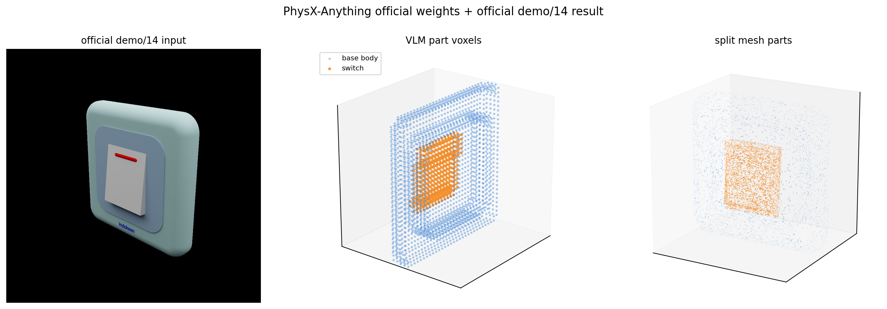
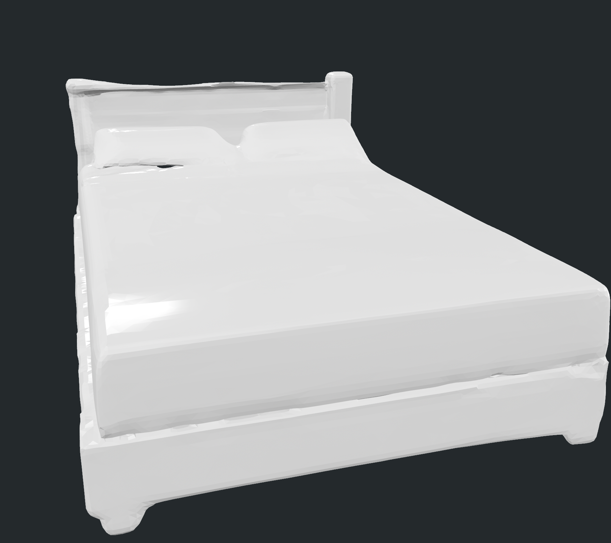
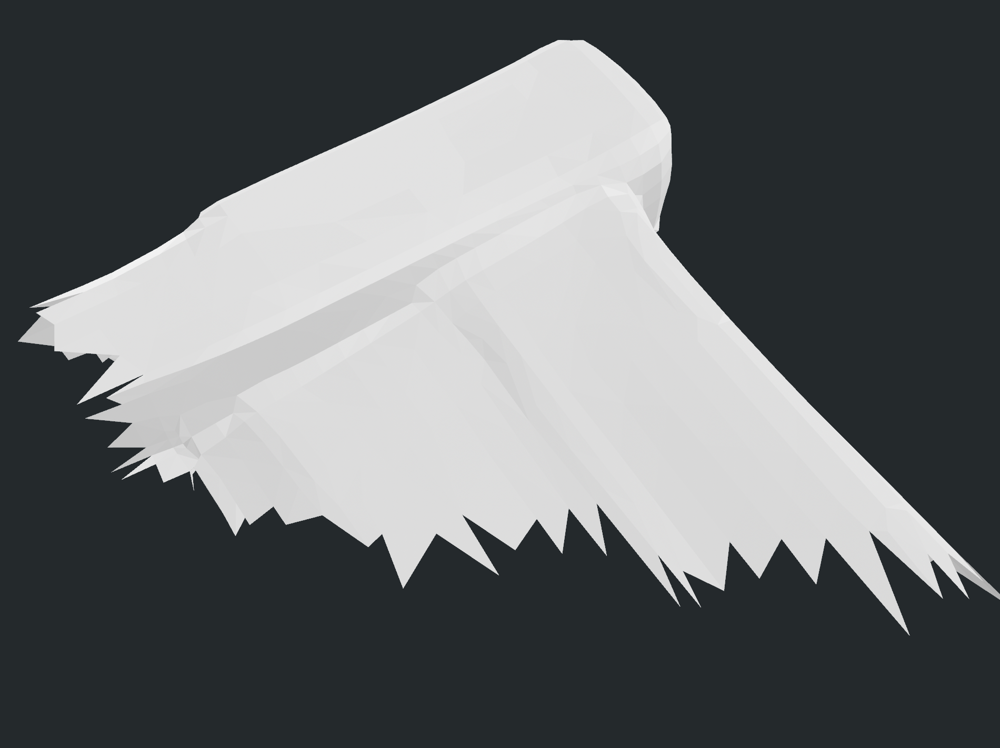
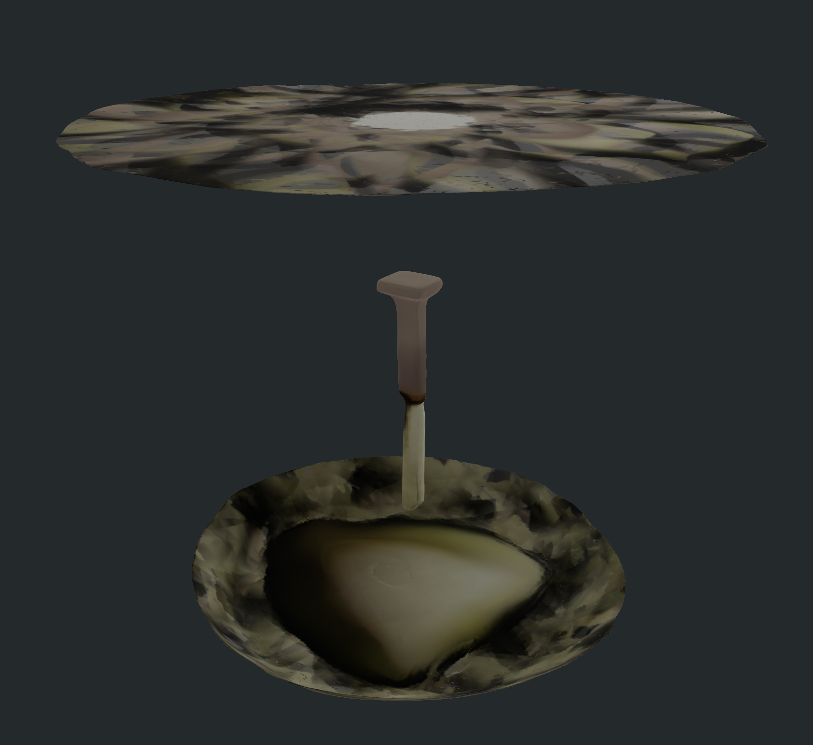
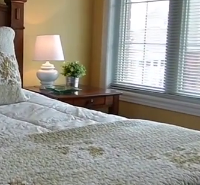

# PhysX-Anything

检查日期：2026-07-11；最新续跑：2026-07-14 02:14 CST

当前执行状态：论文 PDF、项目页、GitHub README、Hugging Face 权重页和 mil8 部署已复查；本轮没有下载完整 PhysX-Mobility 数据集，只下载并核验官方模型权重。官方 demo `demo/14.png` 在 mil8 的干净 checkout 中完成 VLM -> decoder -> split -> simready 链路：`test_demo/14/sample.glb`、part OBJ、`basic.urdf`、`basic.xml` 均已生成，MuJoCo 和 PyBullet 都能加载生成文件。`bedroom_4` 先用我们自己的 SAM3 单物体 crop `sam3_lamp_01` 完成了 VLM -> textured `sample.glb` -> split -> URDF/MJCF；随后扩展到 8 个 `bedroom_4` 物体候选（bed、lamp、nightstand、plant），每个候选都生成了 `sample.glb`、split OBJ、`basic.urdf` 和 `basic.xml`，并通过 MuJoCo/PyBullet 加载验证。证据边界必须写清楚：这不是“官方原版脚本无修改通过”，而是 **官方权重 + 官方/本项目输入 + 环境兼容 shim / 低显存兼容 decoder path**；其中 bed01、nightstand02、plant03 是 direct sparse coords mesh-only fallback，不是标准 textured GLB；lamp02、nightstand01、nightstand02、plant03 存在 VLM 语义误识别或低质量风险；`bedroom_4` 仍没有完成整房间 scene alignment 或最终资产质量验收。


## 链接

| 项 | 地址 |
|---|---|
| Project page | https://physx-anything.github.io/ |
| Paper | https://arxiv.org/abs/2511.13648 |
| Code | https://github.com/ziangcao0312/PhysX-Anything |
| Model | https://huggingface.co/Caoza/PhysX-Anything |
| Dataset | https://huggingface.co/datasets/Caoza/PhysX-Mobility |
| Related dataset / prior | https://huggingface.co/datasets/Caoza/PhysX-3D |
| Status on project page | CVPR 2026 accepted; inference and fine-tuning code released |

论文题目是 **PhysX-Anything: Simulation-Ready Physical 3D Assets from Single Image**。作者为 Ziang Cao、Fangzhou Hong、Zhaoxi Chen、Liang Pan、Ziwei Liu；机构为 NTU S-Lab 和 Shanghai AI Laboratory。arXiv PDF 标记为 `arXiv:2511.13648v1`，日期是 2025-11-17。

## 摘要要点

PhysX-Anything 要解决的问题不是“让 3D 看起来像”，而是从单张真实图像生成可以放进物理引擎的单物体资产。它同时预测几何、部件、关节、尺度、材质/密度/弹性等物理属性，并导出 URDF/XML 和 part-level mesh。

论文的核心贡献有四个：

| 贡献 | 论文含义 | 对 Video2Mesh 的意义 |
|---|---|---|
| VLM-based physical 3D generation | 用 Qwen2.5-VL 风格的 VLM 直接生成结构化物理描述和 part-level coarse geometry | 可以作为 object-level physics sidecar/URDF 生成器，而不是整场景 COLMAP/3DGS 替代 |
| 193x token compression | 先用 32^3 voxel grid 表示 coarse geometry，再只序列化 occupied voxel index，并把连续 index 合并成区间 | 说明它能把几何放进 VLM token budget，但输出尺度和局部几何仍需 decoder 修复 |
| Controllable flow transformer + structured latent decoder | 用 coarse voxel 条件控制 decoder，生成 mesh、radiance fields、3D Gaussians，再拆成 part-level meshes | 和 Video2Mesh 的 visual 3DGS/mesh 层不同，它偏单物体资产生成 |
| PhysX-Mobility | 基于 PartNet-Mobility 扩展到 47 类、2K+ 常见物体，并补充物理属性 | 对卧室内常见可动家具/器物有参考，但不是房间级语义重建数据集 |

## Pipeline


论文的流程可以按“全局结构 -> 局部部件 -> 几何解码 -> 仿真格式”理解：

```text
single real-world object image
  -> VLM multi-round dialogue
  -> overall physical information
       name/category
       absolute scale
       material / density / Young's modulus / Poisson ratio
       part descriptions
       group hierarchy and joint type
  -> per-part coarse geometry
       32^3 voxel indices
       occupied voxel serialization
       adjacent-index range compression
  -> controllable flow transformer
  -> structured latent diffusion decoder
  -> mesh / radiance field / 3D Gaussian
  -> nearest-neighbor part split
  -> physical-format decoder
  -> part-level meshes + URDF + XML
```

这里最关键的边界是：输入是一张物体图，而不是多视角房间视频；输出是物体级 sim-ready asset，而不是整场景 navigation mesh 或房间级 3DGS。

## 物理表示


论文把原始 mesh token 过长的问题拆成两层：

| 层 | 做法 | 目的 |
|---|---|---|
| coarse voxel | 把物体部件映射到 32^3 voxel grid | 保留显式空间结构，同时降低 VLM 输出难度 |
| index serialization | 将 occupied voxel 线性化为 0 到 32767 的 index | 避免输出三元坐标序列 |
| range compression | 将连续 index 写成 `start-end` | 把 token 量压到原始 mesh 级表示的约 1/193 |
| physical JSON-like representation | 保存 part、group、joint、scale、material 和描述 | 比直接 URDF 更适合 VLM 生成和推理 |
| voxel-space kinematics | 将 motion direction、axis location、range 等转成 voxel 坐标 | 保持关节参数和几何一致 |

这套表示的启发价值很明确：Video2Mesh 当前的 `simulator_asset_bundle.json`、`object_asset.json` 和 semantic sidecar 可以学习它的“物体结构 + 几何 + 物理属性 + 关节”的统一 schema；但 Video2Mesh 的场景坐标、COLMAP 尺度、mesh collider 和 3DGS visual layer 仍应保留为主链路资产。

## 代码与推理链路

官方 README 给出的推理入口是四步：

```bash
python 1_vlm_demo.py \
  --demo_path ./demo \
  --save_part_ply True \
  --remove_bg False \
  --ckpt ./pretrain/vlm

python 2_decoder.py
python 3_split.py

python 4_simready_gen.py \
  --voxel_define 32 \
  --basepath ./test_demo \
  --process 0 \
  --fixed_base 0 \
  --deformable 0
```

实际代码边界：

| 脚本 | 输入 | 输出/作用 | 关键依赖 |
|---|---|---|---|
| `1_vlm_demo.py` | `demo/*.png` 或 `demo/*.jpg`，`pretrain/vlm` | `test_demo/<name>/basic_info.txt`、`coord_<part>.txt`、`ind_<part>.npy/ply` | `transformers` 的 `Qwen2_5_VLForConditionalGeneration`、`qwen_vl_utils`、`flash_attention_2`、`rembg`、`trimesh` |
| `2_decoder.py` | `test_demo/<name>/allind.npy` 和原图，`pretrain/decoder` | `sample.glb` | TRELLIS `TrellisImageTo3DPipeline`、CUDA PyTorch、decoder 权重 |
| `3_split.py` | `sample.glb`、part voxels | part-level mesh | `trimesh`、`scipy.spatial.cKDTree` |
| `4_simready_gen.py` | part mesh、basic physical description | `basic.urdf`、XML/MJCF、物理参数和连接关系 | `trimesh`、`scipy`、XML/URDF 生成逻辑 |
| `render_urdf.py` | `basic.urdf` | PyBullet 渲染视频 | `pybullet`、`imageio` |

README 还明确建议 `deformable=0`，因为论文/代码可以生成 deformable 参数，但 deformable parts 在 MuJoCo 中不稳定。对 Video2Mesh 来说，这意味着短期只能把它当 rigid/articulated object asset generator，不能把软体结果算成稳定仿真资产。

### `sample.glb` 的角色


`sample.glb` 可以理解成 PhysX-Anything 的 **decoder 建模主输出**：它是带纹理的 whole-object mesh，也是 `3_split.py` 继续拆 part mesh 的输入。用户截图里的 `sample.glb` 看起来不错，说明官方 demo/14 的 decoder 在单物体样例上已经把整体几何和纹理恢复出来了。

但 `sample.glb` 不是最终 sim-ready 终点。真正进入仿真侧的文件还要经过 `3_split.py` 和 `4_simready_gen.py`：

| 层级 | 文件 | 是否是终点 | 说明 |
|---|---|---|---|
| VLM physical representation | `basic_info.txt`、`coord_*.txt`、`ind_*.npy/ply`、`allind.npy` | 不是 | 物体名、部件、材料、尺度、关节和 coarse voxel |
| decoder visual/modeling output | `sample.glb` | 是建模主输出，但不是 sim-ready 终点 | textured whole-object mesh；供 viewer 检查，也供 split 使用 |
| part mesh | `objs/<part>/<part>.obj` | 中间仿真几何 | 根据 part voxels 把 `sample.glb` 最近邻拆成部件 |
| simulator asset | `basic.urdf`、`basic.xml`、`basic_info.json` | 是当前代码导出的 sim-ready 格式 | 还需要 MuJoCo/PyBullet loading、尺度/支撑/穿插/关节 QA |

## 实验结果

论文在 PhysX-Mobility 和 in-the-wild 图像上评测几何、尺度、材质、affordance、kinematic parameters 和 description。

| 评测 | 论文结果摘要 | 备注 |
|---|---|---|
| PhysX-Mobility quantitative | PhysX-Anything 达到 PSNR 20.35、Chamfer Distance 14.43、F-score 77.50；absolute scale error 0.30，优于 PhysXGen 的 43.44 | 物理属性提升比几何指标更明显 |
| In-the-wild human study | Geometry 0.98；absolute scale 0.95；material 0.84；affordance 0.94；kinematic 0.98；description 0.96 | 14 名志愿者，共 1,568 个有效评分 |
| In-the-wild VLM eval | Geometry 0.94；kinematic parameters 0.94 | 论文用 GPT-5 做 VLM-based evaluation |
| Ablation | full representation 比 voxel/index 变体更好，PSNR 20.35、F-score 77.50 | 支撑 193x token compression 设计 |
| MuJoCo-style simulation | 展示 faucet、cabinet、eyeglass、lighter、laptop、handle 等 manipulation | 更像可执行性 demo，没有给出 Video2Mesh 可直接复用的整场景 benchmark |


## 和 Video2Mesh 的边界

PhysX-Anything 可以补 Video2Mesh 的“单物体物理资产”短板，但不能替代当前房间级扫描重建：

| Video2Mesh 阶段 | PhysX-Anything 是否适合 | 判断 |
|---|---|---|
| 视频抽帧、相机位姿、COLMAP/MVS | 不适合 | 它不估计房间相机轨迹，也不做多视角 SfM/MVS |
| 3DGS visual layer | 局部可参考 | 它的 decoder 能产 3DGS/RF，但目标是单物体；Video2Mesh 仍应用 GraphDECO/Spark/SuperSplat 维护场景 visual layer |
| mesh/collider | 适合单物体补全 | 可对语义分割出的 chair/cabinet/laptop 等 object crop 生成 part mesh/URDF，再和场景 collider 对齐 |
| physics sidecar | 很适合 | material、density、Young's modulus、Poisson ratio、joint type、scale、affordance 可映射进 `object_asset.json` |
| dynamic readiness | 部分适合 | 对 articulated object 有帮助，但仍要做 support、penetration、scale、joint limit、sim smoke test |
| whole-room simulator bundle | 不能直接替代 | 房间级 bundle 仍由 Video2Mesh 汇总 visual mesh、semantic mesh、object assets、adapters |

推荐吸收方式：

```text
Video2Mesh semantic objects
  -> choose articulated / movable object candidates
  -> crop object image from registered frames
  -> PhysX-Anything single-object generation
  -> part mesh + URDF/XML + physical metadata
  -> align into Video2Mesh scene coordinates
  -> run simulator preflight QA
  -> write object_asset.json / simulator_asset_bundle.json
```

不要这样用：

```text
bedroom_4 full room frame
  -> PhysX-Anything
  -> claim room-level sim-ready scene
```

这会把单物体生成器误用为整场景重建器。整房间帧可以作为 smoke test 输入，不能作为有效实验结论。

## mil8 部署审计

本轮在 mil8 做了三类事情：一是官方权重与官方 demo/14 的可复现性验证，二是用本项目 `bedroom_4` 的 `sam3_lamp_01` 单物体 crop 做真实接入尝试，三是保留旧 bedroom_4 debug/proxy 排障记录。下面的审计表要按阶段读，不能把 demo/14 的成功外推成整房间成功，也不能把旧 proxy 当成正式结果。

| 项 | 结果 |
|---|---|
| Host | `mil8` |
| GPU | 8 x NVIDIA GeForce RTX 3090, each 24 GB；最近探针时 decoder 指定 `CUDA_VISIBLE_DEVICES=0` |
| Disk | `/data` 3.5 TB，已用约 3.3 TB，仅约 19 GB 可用，Use% 100%；`/` 440 GB，约 56 GB 可用 |
| Official repo | clean run: `/root/autodl-tmp/physx-anything-official-repro-20260713`；old bedroom_4 debug repo: `/data/zyx/workspace/PhysX-Anything` |
| Repo commit | `e221826` |
| Repo size | 55 MB |
| Shared Python | `/opt/envs/max/bin/python`, Python 3.10.0 |
| PyTorch | 2.2.2+cu121，CUDA 12.1，`torch.cuda.is_available=True`，8 GPUs visible |
| Existing required packages | `torch`, `torchvision`, `transformers`, `huggingface_hub`, `PIL`, `numpy`, `scipy`, `cv2` 等 |
| Initially missing packages | `qwen_vl_utils`, `trimesh`, `rembg`, `flash_attn`, `kaolin`, `nvdiffrast`, `spconv`, `mujoco`, `pybullet` |
| Isolated venv | `/root/autodl-tmp/physx-anything-venv`, created with `--system-site-packages` to reuse CUDA PyTorch |
| Packages added in isolated venv | `transformers==4.50.0`, `qwen-vl-utils==0.0.14`, `trimesh==4.12.2`, `rembg`, `accelerate`, `huggingface-hub`, `xformers`, `spconv-cu120`, `flash_attn==2.5.8`, `mujoco==3.10.0`, `pybullet==3.2.7` 等 |
| CUDA extensions | `nvdiffrast` 已从 `/root/autodl-tmp/nvdiffrast-src` 编译安装；`EasternJournalist/utils3d` 已按 TRELLIS 需要安装；`numpy==1.26.4`、`scipy==1.11.4` 已回退到可用版本 |
| Compatibility shims used for official demo/14 | PyTorch 2.2.2 需要 pytree shim；mil8 不能稳定访问 Hugging Face，所以 Qwen processor 被重定向到本地 processor 目录；官方 decoder `pipeline.json` 的相对路径改为绝对路径副本；系统 `diff-gaussian-rasterization` 不支持 `kernel_size` / `subpixel_offset`，运行时过滤这两个 kwargs |
| Weight size check | VLM `16G`、decoder `3.3G`、TRELLIS `3.1G`、Qwen processor 小文件 `11M`、flash-attn wheel `116M`；没有下载 PhysX-Mobility 数据集 |
| Weight placement | `pretrain/vlm -> /root/autodl-tmp/physx-anything-pretrain/vlm`；`pretrain/decoder -> /root/autodl-tmp/physx-anything-decoder-abs-debug`；`pretrain/trellis -> /root/autodl-tmp/physx-anything-trellis`；原始 decoder 权重保存在 `/root/autodl-tmp/physx-anything-pretrain/decoder` |
| VLM weights | four `model-00001..00004-of-00004.safetensors` present under `/root/autodl-tmp/physx-anything-pretrain/vlm` |
| Decoder weights | `/root/autodl-tmp/physx-anything-pretrain/decoder/ckpt_new/denoiser_step0350000.pt`, size 3.47 GB |
| TRELLIS weights | `ckpts/*.safetensors` present under `/root/autodl-tmp/physx-anything-trellis`; DINOv2 cached at `/root/.cache/torch/hub/checkpoints/dinov2_vitl14_reg4_pretrain.pth` |
| SSH note | `mil8` 曾短暂卡在 FRP/SSH banner exchange，后续恢复；当前官方 demo/14 已完成，剩余主要风险是未改源码路径、RF decode OOM 和 `/data` 满盘压力 |
| Official VLM blocker | `flash_attn` 已安装，但未改源码的 `1_vlm_demo.py` 在 PyTorch 2.2.2 / Transformers 4.50 的 pytree API 与在线 Qwen processor 访问上仍不稳定；本轮成功的是 runtime shim 路径 |
| Official demo/14 VLM result | 通过 pytree shim + 本地 Qwen processor redirect，`test_demo/14` 已生成 `basic_info.txt`、`coord_0..1.txt`、`ind_0..1.npy/.ply` 和 `allind.npy` |
| PyTorch 2.4 attempt | A clean Python 3.10 venv at `/root/autodl-tmp/physx-anything-torch24-venv` was repaired, but downloading `torch==2.4.0+cu121` from `download.pytorch.org` was too slow and did not complete; the environment still has no `torch`, so the practical route remains the existing venv plus Qwen shim. |
| Decoder config fix | 官方 decoder `pipeline.json` 的相对路径会触发 HFValidationError；compat copy `/root/autodl-tmp/physx-anything-decoder-abs-debug/pipeline.json` 已把子模型改成绝对路径 |
| Pipeline load re-probe | 2026-07-12 `TrellisImageTo3DPipeline.from_pretrained("./pretrain/decoder_abs_debug")` 用本地 DINOv2 cache 成功，`from_pretrained` 44.4 s，`.cuda()` 1.3 s |
| Decoder official-script blocker | 未改源码的 `2_decoder.py` 先被 decoder/TRELLIS 相对路径阻塞；修成绝对路径后默认 `run_control()` 含 RF decode，在 24GB RTX 3090 上 OOM |
| Official demo/14 decoder compat result | 使用官方 decoder/TRELLIS 权重和官方 `demo/14.png`，改走 `formats=["mesh", "gaussian"]`，释放 pipeline 后 `to_glb(texture_size=1024)` 成功导出 textured `sample.glb` |
| Official demo/14 split + simready | 官方 `3_split.py` 生成 2 个 part OBJ；官方 `4_simready_gen.py --voxel_define 32 --basepath ./test_demo --process 0 --fixed_base 0 --deformable 0` 生成 `basic_info.json`、`basic.urdf`、`basic.xml` |
| Engine load validation | 生成的 `basic.xml` 可被 MuJoCo `MjModel.from_xml_path` 加载并 step 20 次；`basic.urdf` 可被 PyBullet DIRECT 加载，包含 1 个 revolute joint 和 2 个 fixed joints |
| `bedroom_4` `sam3_lamp_01` VLM result | 使用本项目 SAM3 instance crop，VLM 输出 `Decorative Lamp`、4 个 part 和 `allind.npy` `(2385, 3)` |
| `bedroom_4` `sam3_lamp_01` decoder compat result | 同样走 mesh+gaussian 兼容路径，导出 textured `sample.glb`，`6,654,052` bytes，`134,669` vertices / `213,392` faces |
| `bedroom_4` `sam3_lamp_01` split + simready | 隔离 runner 中只处理 lamp01，生成 4 个 part OBJ、`basic_info.json`、`basic.urdf`、`basic.xml` |
| `bedroom_4` multi-object continuation | 2026-07-14 继续处理 `bedroom4_bed01`、`bedroom4_lamp01`、`bedroom4_lamp02`、`bedroom4_nightstand01`、`bedroom4_nightstand02`、`bedroom4_plant01`、`bedroom4_plant02`、`bedroom4_plant03`；8/8 都有 `sample.glb`、split OBJ、URDF/XML |
| Standard textured results | `lamp01`、`lamp02`、`nightstand01`、`plant01`、`plant02` 生成 `TextureVisuals` GLB；其中 `lamp02` 和 `plant02` texture baking 日志出现 `loss=nan`，纹理可信度要人工复核 |
| Mesh-only fallback results | `bed01`、`nightstand02`、`plant03` 在标准 textured decoder OOM/失败后改走 direct sparse coords mesh-only fallback；GLB 为 `ColorVisuals`，可加载但没有 baked texture |
| `bedroom_4` multi-object engine load validation | 8/8 的 `basic.xml` 可被 MuJoCo 加载，8/8 的 `basic.urdf` 可被 PyBullet DIRECT 加载；验证日志为 `tmp_remote_results/physx_bedroom4_try_20260713/logs/bedroom4_all_5_load_validation_20260714.log` |

实测失败日志的关键点：

```text
ImportError: cannot import name 'Qwen2_5_VLForConditionalGeneration' from 'transformers'
RuntimeError: register_pytree_node() got an unexpected keyword argument 'flatten_with_keys_fn'
1_vlm_demo.py unmodified: PyTorch 2.2.2 pytree / Qwen processor online access still requires runtime compatibility handling
2_decoder.py unmodified: decoder/TRELLIS relative path failure, then default RF decode OOM on 24GB GPU
compat decoder: mesh+gaussian output succeeded; RF output not tested in this low-VRAM path
bedroom_4 old proxy: geometry-only proxy GLB was used only for historical debugging, not official evidence
```

结论边界：当前已经完成的是官方权重下载/核验、官方 demo/14 在兼容路径下的 VLM、textured `sample.glb`、官方 split、官方 simready 文件生成，以及 MuJoCo/PyBullet 加载验证；`bedroom_4` 的 8 个 SAM3 单物体候选也已经生成 `sample.glb`、split OBJ、`basic.urdf` 和 `basic.xml`，并通过 MuJoCo/PyBullet 加载验证。这里的“完整”只指每个候选的核心文件和 split 部件产物齐全，不等于几何/纹理/语义都达到最终交付质量。尚未完成的是未改源码的 official `1_vlm_demo.py` / `2_decoder.py` 端到端原版通过、默认 RF decode、以及把 bedroom_4 物体资产对齐回完整房间坐标后的质量验收；因此不能写成“官方原版四步无修改通过”，也不能写成“bedroom_4 整房间跑通”。

本地已回传的官方 demo/14 产物放在 `/Users/zhangyuxiang/Desktop/worksplace/Video2Mesh/tmp_remote_results/physx_official_repro_20260713`，包含 `sample.glb`、part OBJ、URDF/XML、运行日志和验证用依赖缓存。`bedroom_4` 多物体实测产物放在 `/Users/zhangyuxiang/Desktop/worksplace/Video2Mesh/tmp_remote_results/physx_bedroom4_try_20260713/test_demo_bedroom4_*`，日志在同级 `logs/`，其中 `bedroom4_all_5_load_validation_20260714.log` 是 8 个对象的 MuJoCo/PyBullet 加载核验。旧 bedroom_4 proxy 调试产物放在 `/Users/zhangyuxiang/Desktop/worksplace/Video2Mesh/tmp_remote_results/physx_anything_bedroom4_proxy_20260712`，仅用于复查历史排障，不进入正式复现实验结论。

## 官方 demo/14 实测



本轮选择官方 repo 自带的 `demo/14.png`，因为它是干净的 wall switch 单物体样例，符合论文的单图物体输入假设。没有下载完整官方数据集。

| 项 | 结果 |
|---|---|
| Remote clean repo | `/root/autodl-tmp/physx-anything-official-repro-20260713` |
| Upstream commit | `e221826e6176d940905126d1894f9c1c933b70a8` |
| Input | `demo/14.png`，本地副本 `tmp_remote_results/physx_official_repro_20260713/demo_14.png` |
| Local result copy | `tmp_remote_results/physx_official_repro_20260713/test_demo_14/` |
| VLM structured object | `Wall Switch`，category `Electrical Control Device`，dimension `8*8*3` |
| Parts | `l_0: Switch`，`l_1: Base Body` |
| Joint | group 1 relative to group 0，type `C` revolute，axis `[1, 0, 0]`，range `[0, 12]` degrees |
| Voxel outputs | `ind_0.npy` shape `(488, 3)`；`ind_1.npy` shape `(2085, 3)`；`allind.npy` shape `(2573, 3)` |
| Decoder output | `sample.glb`，`7,748,388` bytes，GLB header `glTF v2` |
| GLB mesh check | 1 textured geometry，`159,870` vertices / `277,428` faces，visual type `TextureVisuals` |
| Split output | `objs/0/0.obj`：`20,402` vertices / `29,196` faces；`objs/1/1.obj`：`140,287` vertices / `248,232` faces |
| Simready output | `basic_info.json`、`basic.urdf`、`basic.xml`、part textures and `desert.png` |
| File-reference check | URDF references `./objs/1/1.obj` and `./objs/0/0.obj`，all present；MJCF references OBJ/texture/skybox，all present |
| Engine load check | MuJoCo loads `basic.xml` and steps 20 frames；PyBullet loads `basic.urdf` with 3 joints: fixed, revolute, fixed |
| Logs | `tmp_remote_results/physx_official_repro_20260713/logs/official_demo14_*.log` |

官方 demo/14 这一节可以写成：**官方权重已完整核验；官方 demo/14 在兼容路径下生成了 textured GLB、part OBJ、URDF/XML，并通过 MuJoCo/PyBullet 加载验证。** 不能写成：**未改源码官方四步原版通过**，因为 VLM 和 decoder 都用了运行时兼容处理；也不能把这一节单独外推成 bedroom_4 结果，因为这里的有效样例是官方 `demo/14.png`。

## bedroom_4 `sam3_lamp_01` 单物体实测


这次不再用 full-room frame 或旧的床头柜 heuristic crop，而是从 `bedroom_4` 已有 Video2Mesh/SAM3 实例里选单物体输入。筛选脚本准备了 8 个 foreground object crops，最终选择 `sam3_lamp_01`，因为它在 contact sheet 中最接近 PhysX-Anything 的单物体假设。

| 项 | 结果 |
|---|---|
| Remote repo | `/root/autodl-tmp/physx-anything-official-repro-20260713` |
| Input source | `bedroom_4` 已有 Video2Mesh/SAM3 instance output；没有下载 PhysX-Mobility 数据集 |
| Selected object | `sam3_lamp_01`，name `lamp 1`，category `lamp` |
| Source frame / bbox | frame `000060`，bbox `[98, 340, 241, 534]`，crop size `143 x 194` |
| Mask support | visible points `37139`；mask support points `33776`；support ratio `0.9094482888607663` |
| Prepared input | remote `runs/bedroom4_physx_try_20260713/demo_lamp01/bedroom4_lamp01.png`；local `tmp_remote_results/physx_bedroom4_try_20260713/bedroom4_lamp01.png` |
| Local result copy | `tmp_remote_results/physx_bedroom4_try_20260713/test_demo_bedroom4_lamp01/` |
| Logs | `tmp_remote_results/physx_bedroom4_try_20260713/logs/bedroom4_lamp01_*.log` |

VLM 对该 crop 的结构化理解是 `Decorative Lamp` / `Lighting Fixture`，dimension `20*20*30`，包含 4 个 plastic parts。这个语义比旧 heuristic crop 的“Decorative Table with Vase”更贴近输入，但它仍然只是单物体 crop 级结果，不代表整房间理解完成。

| VLM part | 输出 |
|---|---|
| `l_0` | `lamp_base_part`，Plastic，density `1.2 g/cm^3`，Young's modulus `2.5`，Poisson ratio `0.38` |
| `l_1` | `lamp_body_solid`，Plastic，density `1.2 g/cm^3`，Young's modulus `2.5`，Poisson ratio `0.38` |
| `l_2` | `lamp_body_vertical_bar`，Plastic，density `1.2 g/cm^3`，Young's modulus `2.5`，Poisson ratio `0.38` |
| `l_3` | `lamp_unit`，Plastic，density `1.2 g/cm^3`，Young's modulus `2.5`，Poisson ratio `0.38` |
| Group | `group_0: ['l_0', 'l_1', 'l_2', 'l_3']; Type: E; Param: N/A` |

体素和 decoder/simready 结果如下：

| 阶段 | 文件/指标 | 结果 |
|---|---|---|
| VLM voxels | `ind_0.npy` / `ind_1.npy` / `ind_2.npy` / `ind_3.npy` | `(616, 3)` / `(774, 3)` / `(70, 3)` / `(925, 3)` |
| VLM union | `allind.npy` | `(2385, 3)`，min `[0, 0, 0]`，max `[31, 31, 27]` |
| Decoder input | image + `allind.npy` | `bedroom4_lamp01.png` `(143, 194)` RGB；coarse voxels `(2385, 3)` |
| Decoder path | compatibility path | `formats=["mesh", "gaussian"]`，filter unsupported raster kwargs，free pipeline before GLB export |
| Decoder output | `sample.glb` | `6,654,052` bytes，GLB v2，`TextureVisuals` |
| GLB mesh check | `trimesh.load(..., force="mesh")` | `134,669` vertices / `213,392` faces |
| Split output | part OBJ | part 0: `30,722` V / `51,858` F；part 1: `48,570` V / `78,886` F；part 2: `4,810` V / `8,358` F；part 3: `52,303` V / `74,290` F |
| Simready output | files | `basic_info.json`、`basic.urdf`、`basic.xml`、4 组 OBJ/MTL/texture、`desert.png` |
| File-reference check | URDF/MJCF refs | `./objs/0/0.obj` 到 `./objs/3/3.obj` 均存在 |
| MuJoCo load | `MjModel.from_xml_path` + 20 steps | ok；`nbody=2`、`njnt=1`、`ngeom=5` |
| PyBullet load | `p.loadURDF(..., DIRECT)` | ok；body id `0`，`4` joints |

这次可以写成：**`bedroom_4` 的 `sam3_lamp_01` 单物体 crop 在官方权重和兼容路径下生成了 textured `sample.glb`、part OBJ、URDF/MJCF，并通过 MuJoCo/PyBullet 加载验证。** 仍不能写成：**bedroom_4 整房间跑通**、**官方脚本无修改通过**、或 **最终可交付仿真资产已经验收**。下一步如果要进入 Video2Mesh 主链路，还要做物体坐标/尺度回贴、support/penetration 检查、质量预览和 asset sidecar 写入。

## bedroom_4 多物体续跑

2026-07-14 又按同一官方权重和兼容环境继续跑了更多 `bedroom_4` SAM3 单物体候选。这里没有下载官方数据集，输入仍然来自本项目自己的 crop。结果已经从 `mil8:/root/autodl-tmp/physx-anything-official-repro-20260713/test_demo/<obj>/` 同步到本地 `tmp_remote_results/physx_bedroom4_try_20260713/test_demo_<obj>/`。验证脚本在远端 venv 中用 `trimesh` 读取 GLB，用 MuJoCo 读取 `basic.xml`，用 PyBullet DIRECT 读取 `basic.urdf`；同步后的验证日志在本地 `tmp_remote_results/physx_bedroom4_try_20260713/logs/bedroom4_all_5_load_validation_20260714.log`。

| Object | VLM name | Decoder route | `sample.glb` | Split | Load validation | Caveat |
|---|---|---|---|---:|---|---|
| `bedroom4_bed01` | `Bed` | direct sparse coords mesh-only fallback | `1,807,816` bytes；`45,110` V / `90,420` F；`ColorVisuals` | 7 | MuJoCo `nbody=2,njnt=1,ngeom=8`；PyBullet `7` joints | 标准 textured decoder 和 mesh-only `run_control` 都 OOM；fallback 整体床形很好，但 split part/局部面片很破碎，无 baked texture |
| `bedroom4_lamp01` | `Decorative Lamp` | compat mesh+gaussian textured | `6,654,052` bytes；`134,669` V / `213,392` F；`TextureVisuals` | 4 | MuJoCo `nbody=2,njnt=1,ngeom=5`；PyBullet `4` joints | 当前最干净的 `bedroom_4` 单物体 baseline；视觉上能看出台灯伞面和支柱，但仍有生成式形变 |
| `bedroom4_lamp02` | `Table` | compat mesh+gaussian textured | `4,243,116` bytes；`100,064` V / `186,448` F；`TextureVisuals` | 5 | MuJoCo `nbody=2,njnt=1,ngeom=6`；PyBullet `5` joints | 输入名是 lamp，但 VLM 识别成 table；texture baking 日志有 `loss=nan` |
| `bedroom4_nightstand01` | `Potted Plant` | compat mesh+gaussian textured | `4,604,216` bytes；`91,372` V / `159,408` F；`TextureVisuals` | 2 | MuJoCo `nbody=3,njnt=2,ngeom=3`；PyBullet `3` joints | 对象名和 VLM 语义不一致，需人工复核；PyBullet 有 unsupported joint -> fixed warning |
| `bedroom4_nightstand02` | `Safe` | direct sparse coords mesh-only fallback | `1,329,740` bytes；`33,231` V / `66,419` F；`ColorVisuals` | 5 | MuJoCo `nbody=5,njnt=4,ngeom=6`；PyBullet `8` joints | VLM 误识别为 safe；4 个小部件很小，主体占绝大多数；无 baked texture |
| `bedroom4_plant01` | `Decorative Flower Pot` | compat mesh+gaussian textured | `7,498,328` bytes；`170,607` V / `263,372` F；`TextureVisuals` | 5 | MuJoCo `nbody=2,njnt=1,ngeom=6`；PyBullet `5` joints | 技术链路完整，质量仍需 viewer/scene alignment 复核 |
| `bedroom4_plant02` | `Potted Plant` | compat mesh+gaussian textured retry on GPU5 | `4,461,672` bytes；`110,417` V / `187,406` F；`TextureVisuals` | 2 | MuJoCo `nbody=3,njnt=2,ngeom=3`；PyBullet `3` joints | 首次 decoder OOM，GPU5 retry 成功；texture baking 日志有 `loss=nan`；PyBullet 有 unsupported joint -> fixed warning |
| `bedroom4_plant03` | `Safe` | direct sparse coords mesh-only fallback, no-preprocess | `1,544,588` bytes；`38,643` V / `77,107` F；`ColorVisuals` | 3 | MuJoCo `nbody=4,njnt=3,ngeom=4`；PyBullet `5` joints | crop 只有约 `43 x 43`，VLM 误识别为 safe；技术加载通过但几何和语义质量低 |








人工 viewer 复查后，bed01 的结论需要比加载验证更乐观也更谨慎：**整体床很好**，比之前只看日志时预期更可用，床头、床垫、枕头和底座轮廓都能看出来；但它的 split part 非常破碎，局部有薄片、尖刺、破洞和边界撕裂。台灯 lamp01 是当前最值得保留的 textured baseline，但图像上仍能看到伞面和底座被生成式重构成“像台灯但不完全真实”的形态。其它对象整体更偏 VLM/decoder 的生成式猜测，尤其语义误识别的 nightstand/plant/safe/table 结果，不应直接进入资产库。

这张表里的 “Load validation” 不是动力学仿真验收，只证明 GLB/OBJ/URDF/MJCF 文件是完整且能被目标引擎读取的。更严格的交付还需要把单物体资产对齐回 `bedroom_4` 场景坐标，再做 scale、support、penetration、关节方向、质量和纹理检查。尤其是 bed01 虽然已经重建并通过加载，但它不是标准 textured decoder 结果；nightstand02 和 plant03 虽然也完整生成了文件，但语义失败明显，不应该直接作为高质量资产宣传。

### Prompt override 判断

可以尝试用更详细的 VLM prompt 生成，但它主要会改善 **类别、部件划分、材料/关节描述和 32³ coarse voxel 先验**，不能保证 decoder 纹理和三角面质量一定变好。官方 `dataset/overall_prompt.txt` 目前是通用模板，只要求“分析图像并按 Name / Category / Dimension / Parts / Group_info 输出结构化描述”；后续每个 part 的问题也只是“基于 `l_i` 描述生成 32³ voxel index”。这对官方单物体图够用，但对 `bedroom_4` 这种遮挡、裁剪和低分辨率 crop，容易把 nightstand 看成 plant/safe，把 lamp 看成 table，或者把一个静态大物体拆成太多破碎 part。

下一轮更稳的 prompt 方式应该走 **known-object prompt override**，不要只让 VLM自由猜：

```text
You are given a masked crop from a bedroom scene. The target object is known:
object_id=<bedroom4_bed01>, class=<bed>, expected_state=<single complete bed>.
Describe only the target object, ignore background and occluders.
Do not invent unrelated categories such as safe, table, vase, or plant.
Prefer a small number of physically meaningful parts:
mattress, pillows, headboard, bed frame/base, optional drawers/legs.
For static furniture, use fixed groups unless a real drawer/hinge is visible.
Keep parts spatially contiguous in the 32^3 voxel grid; avoid thin isolated shards.
If a part is uncertain, merge it into the nearest large fixed structural part.
Output the same PhysX-Anything schema exactly.
```

对 lamp/nightstand/plant 也应把 `class`、`expected parts`、`negative categories` 和 `part merge policy` 写进 prompt。更进一步，可以两阶段跑：先让普通 VLM 做识别，再用我们自己的 SAM3 label、人工类别或 GroundingDINO label 覆盖 `Name/Category/expected parts`，最后再问每个 part 的 voxel。这样比单纯“更长 prompt”更可靠，因为它把最容易错的类别和部件边界从开放生成变成受控输入。

### Prompt-guided VLM 实测

2026-07-14 继续在 mil8 做了 prompt-guided generation 小实验，脚本和配置已回写到本项目：

| 文件 | 作用 |
|---|---|
| `tools/physx_anything_prompt_guided_vlm.py` | 在不改官方 `1_vlm_demo.py` 的前提下，注入 known-object prompt / seeded `basic_info`，生成 `coord_i.txt`、`ind_i.npy/ply`、`allind.npy` 和 `prompt_guided_report.json` |
| `tools/physx_anything_decode_one_compat.py` | 单对象 decoder 兼容脚本，只跑 mesh+gaussian path，过滤当前 rasterizer 不支持的参数，导出 `sample.glb` 和 `decode_report.json` |
| `configs/physx_anything_bedroom4_prompt_overrides.json` | bedroom_4 的 bed/lamp/nightstand known-object override：target class、expected parts、negative categories、part merge policy、seeded part schema |

第一版尝试是把较长的 known-object override 直接追加到官方 `overall_prompt.txt`。这个方案 **失败**：`bedroom4_bed01` 和 `bedroom4_lamp02` 的第一轮 VLM 没有输出 `Name/Category/Parts/Group_info`，而是直接进入 voxel index 输出模式，因此 part_count 变成 0。结论是：这个 PhysX-Anything VLM fine-tune 对 prompt 分布比较敏感，不能简单把很长的自然语言合同塞进第一轮描述问题里。

第二版改成 **seeded `basic_info`**：由 Video2Mesh/SAM3/人工标签生成 schema-valid `basic_info.txt`，把 `Name`、`Category`、`Dimension`、expected parts、material 和 fixed group 先固定住；VLM 只负责每个 `l_i` 的 32³ voxel。这个方案跑通了：

| Object | Baseline VLM | Seeded prompt result | Coarse voxel effect | Decoder |
|---|---|---|---|---|
| `bedroom4_bed01` | `Bed` / `Furniture`，7 parts：mattress、2 pillows、headboard、base、horizontal surface、drawers | `Bed` / `Furniture / bed`，4 parts：mattress、pillow cluster、headboard、bed frame/base | `allind` 5836 voxels，1 connected component；旧结果中 `horizontal surface` 是 3 个组件、`drawers` 是 2 个组件，seeded 后碎片部件被合并 | 未跑标准 decoder；bed 旧路线已 OOM，本轮只验证 VLM/coarse voxel |
| `bedroom4_lamp02` | 误识别为 `Table` / `Furniture`，5 table parts | `Table Lamp` / `Lighting fixture / table lamp`，4 parts：lampshade、stem/stand、base、bulb/diffuser | 每个 part 自身都是 1 connected component；`allind` 有 3 个组件，说明部件之间还有 coarse voxel 间隙 | mesh+gaussian compat decoder 生成 `sample.glb`，`4,948,472` bytes，`95,078` V / `157,228` F，`TextureVisuals` |

本地同步目录为：

```text
tmp_remote_results/physx_prompt_guided_vlm_20260714/
  prompt_guided_vlm_failed_long_prompt/
  prompt_seeded_vlm_success/
```

这次可以写成：**seeded `basic_info` 是比“更长 overall prompt”更稳的控制方式，可以把类别和 part schema 固定住，并能指导 VLM 生成新的 coarse voxels；lamp02 的 seeded voxels 已经成功驱动 decoder 产出 textured GLB。** 不能写成：**prompt 已经证明能提升最终视觉质量**，因为 bed 没跑 decoder，lamp02 还没做 viewer 质量检查，也没跑 split/simready/MuJoCo/PyBullet。

## 早期 bedroom_4 smoke/debug input

以下是早期为了验证 Video2Mesh 数据能否接到 PhysX-Anything 而做的 smoke/debug 输入。它们已经被上面的 `sam3_lamp_01` 单物体实测取代，只保留为排障历史。


| 项 | 路径/结果 |
|---|---|
| Source dataset | `/data/zyx/workspace/Video2MeshWorkspace/Video2Mesh/dataset/bedroom_4_CmEIg9gMI74` |
| Image folder | `/data/zyx/workspace/Video2MeshWorkspace/Video2Mesh/dataset/bedroom_4_CmEIg9gMI74/bedroom_4_images` |
| Image count / size | 35 PNG images, about 113 MB |
| Selected frame | `003069.png` |
| Prepared input | `/data/zyx/workspace/physx_anything_bedroom4_20260711/input/demo/bedroom_4_center_frame.png` |
| Manifest | `/data/zyx/workspace/physx_anything_bedroom4_20260711/input/physx_anything_bedroom4_input_manifest.json` |
| Local doc copy | `docs/video2mesh/research-catalog/assets/physx-anything/bedroom4-physx-smoke-input.jpg` |

这个输入是 full-room frame，所以只能用于环境 smoke test，不能作为 PhysX-Anything 有效物体复现实验。

为了继续靠近单物体假设，本轮又从同一帧裁了一个右侧床头柜/台灯区域：



| 项 | 路径/结果 |
|---|---|
| Remote crop | `/data/zyx/workspace/physx_anything_bedroom4_20260711/object_crop_demo/demo/bedroom_4_bedside_lamp_table_crop.png` |
| Remote manifest | `/data/zyx/workspace/physx_anything_bedroom4_20260711/object_crop_demo/crop_manifest.json` |
| Crop box | `(614, 216, 947, 525)` in the original 1280 x 720 frame |
| Local doc copy | `docs/video2mesh/research-catalog/assets/physx-anything/bedroom4-physx-bedside-crop.png` |
| Caveat | Heuristic crop only；它已被 `sam3_lamp_01` 语义实例 crop 取代，仍不作为正式 object-level 结果。 |

## bedroom_4 debug/proxy 记录

> 注意：本节只记录旧 debug/proxy/smoke evidence，不能替代上面的 `sam3_lamp_01` 单物体实测；它只证明部分代码路径和文件格式生成链路可执行。

这段是 2026-07-12 的旧 bedroom_4 排障记录。它只把 VLM debug wrapper 记为通过；该 wrapper 没有改官方 repo 源码，但绕开了 PyTorch 2.2.2 的 Qwen pytree 兼容问题，并且当时还没有完成 `flash_attn` wheel 安装。因此它是 debug path，不是官方原版 `1_vlm_demo.py`，也不是本轮官方 demo/14 的有效复现证据。

| 阶段 | 状态 | 证据 |
|---|---|---|
| `1_vlm_demo.py` official on bedroom_4 | Not tested after env fix | 旧记录发生在 `flash_attn` 安装前；后续没有把 bedroom_4 heuristic crop 作为正式输入重跑官方 VLM |
| VLM debug wrapper | Debug evidence only | `/data/zyx/workspace/PhysX-Anything/test_demo/bedroom_4_bedside_lamp_table_crop/` 已生成 `basic_info.txt`、`coord_0..2.txt`、`ind_0..2.npy/.ply`、`allind.npy` |
| `2_decoder.py` official on bedroom_4 | Not passed | bedroom_4 只跑过 debug decoder 和 geometry proxy；没有生成官方 textured `sample.glb` |
| Decoder low-texture debug | Partial debug evidence | `run_control` 生成 mesh `343214` vertices / `686376` faces；geometry OBJ 已导出；textured GLB export 卡在后处理末段 |
| Geometry-only proxy GLB | Proxy artifact only | `sample_geometry_proxy.glb` 由 geometry OBJ 转出，12 MB，并软链为 `test_demo/.../sample.glb`；不是官方 decoder 输出 |
| `3_split.py` official on proxy GLB | Proxy path executed | 生成 3 个 part OBJ：board-like `0.obj`、tiny `1.obj`、vase-like `2.obj`；输入不是官方 textured `sample.glb` |
| `4_simready_gen.py` official on proxy split | Proxy path executed, not sim-validated | 生成 `basic_info.json`、`basic.urdf`、`basic.xml`；XML/URDF 已解析验证，OBJ 引用均存在，但没有对 bedroom_4 proxy 做仿真加载或动力学验证 |
| Simulator smoke test for bedroom_4 proxy | Not tested | 旧 proxy 路径没有做 MuJoCo/PyBullet 加载；新的 `sam3_lamp_01` 结果已在上节单独验证 |

VLM 对 bedside crop 的结构化理解如下：

| 项 | 值 |
|---|---|
| Name | Decorative Table with Vase |
| Category | Furniture |
| Dimension | `90*90*75` |
| Part 0 | `board`, Wood, density `0.65 g/cm^3`, Young's modulus `10.0`, Poisson ratio `0.3` |
| Part 1 | `table_base`, Wood, density `0.65 g/cm^3`, Young's modulus `10.0`, Poisson ratio `0.3` |
| Part 2 | `vase`, Ceramic, density `2.4 g/cm^3`, Young's modulus `300.0`, Poisson ratio `0.24` |
| Group 0 | `['l_0', 'l_1']`, equivalent/fixed group |
| Group 1 | `['l_2']`, attached relative to `group_0` |

对应 voxel 输出：

| 文件 | shape | dtype | min xyz | max xyz |
|---|---:|---|---|---|
| `allind.npy` | `(2693, 3)` | `int64` | `[0, 0, 1]` | `[31, 31, 26]` |
| `ind_0.npy` / board | `(2166, 3)` | `int64` | `[0, 0, 24]` | `[31, 31, 26]` |
| `ind_1.npy` / table_base | `(435, 3)` | `int64` | `[2, 17, 1]` | `[30, 31, 1]` |
| `ind_2.npy` / vase | `(92, 3)` | `int64` | `[14, 14, 15]` | `[19, 20, 18]` |

decoder / split / simready 脚本路径的 proxy 产物如下，只用于排障复查：

| 产物 | 路径 | 大小/规模 | 说明 |
|---|---|---|---|
| Geometry OBJ | `/root/autodl-tmp/physx-anything-outputs/bedroom_4_bedside_lamp_table_crop/sample_lowtex_geometry.obj` | `27499041` bytes；`343214` V / `686376` F；not watertight | debug decoder mesh 输出，未带官方 texture |
| Proxy GLB | `/root/autodl-tmp/physx-anything-outputs/bedroom_4_bedside_lamp_table_crop/sample_geometry_proxy.glb` | `12355984` bytes | geometry-only GLB，用于喂给官方 `3_split.py`；不是官方 textured `sample.glb` |
| Part 0 OBJ | `/data/zyx/workspace/PhysX-Anything/test_demo/bedroom_4_bedside_lamp_table_crop/objs/0/0.obj` | `336794` V / `673544` F；`27207161` bytes | 主体几何，吸收了绝大多数 faces |
| Part 1 OBJ | `/data/zyx/workspace/PhysX-Anything/test_demo/bedroom_4_bedside_lamp_table_crop/objs/1/1.obj` | `24` V / `27` F；`1231` bytes | 很小，说明 crop/VLM/proxy split 的 part 质量不稳定 |
| Part 2 OBJ | `/data/zyx/workspace/PhysX-Anything/test_demo/bedroom_4_bedside_lamp_table_crop/objs/2/2.obj` | `6415` V / `12805` F；`445593` bytes | vase-like 子部件 |
| URDF | `/data/zyx/workspace/PhysX-Anything/test_demo/bedroom_4_bedside_lamp_table_crop/basic.urdf` | `2233` bytes | XML parser 通过，引用 3 个 OBJ 均存在；未做 simulator smoke test |
| MJCF/XML | `/data/zyx/workspace/PhysX-Anything/test_demo/bedroom_4_bedside_lamp_table_crop/basic.xml` | `2847` bytes | root 为 `mujoco`，引用 3 个 OBJ 均存在；未做 simulator smoke test |
| Structured JSON | `/data/zyx/workspace/PhysX-Anything/test_demo/bedroom_4_bedside_lamp_table_crop/basic_info.json` | `1576` bytes | 由 `basic_info.txt` 转换出的结构化物理描述 |

这个记录只能说明 VLM debug wrapper 能把 bedroom_4 crop 转成 coarse physical representation，debug decoder 能产出一份可供脚本继续读取的几何，官方 split/simready 代码也能在 geometry-only proxy GLB 上走到 URDF/XML 文件生成。它没有证明 bedroom_4 物体被正确重建：复杂 crop 被理解成“桌子+花瓶”，没有恢复台灯/床头柜的真实语义；part 1 只有 24 个 vertices；mesh 非 watertight；官方 textured `sample.glb` 与 bedroom_4 的真实 simulator smoke test 都缺失。因此这不是 bedroom_4 有效跑通，也不是可用于项目结论的 sim-ready 资产。

## 接入判断

短期建议是 **P1 research adapter，不进入主链路默认路径**：

| 层级 | 判断 | 原因 |
|---|---|---|
| P0 room reconstruction | 不进入 | 不是多视角房间重建器 |
| P1 object asset enrichment | 官方 demo 和 `bedroom_4` 多个单物体 crop 已验证兼容路径 | 官方 `demo/14.png` 与 `bedroom_4` 8 个候选都已生成 GLB、part mesh、URDF/XML；其中 5 个是 textured，3 个是 mesh-only fallback；旧 proxy 记录仍不能作为有效证据 |
| P1 simulator QA | 文件加载通过，场景接入未验收 | demo/14 与 `bedroom_4` 8 个候选的 MJCF/URDF 可被 MuJoCo/PyBullet 加载；还没做 Video2Mesh scene coordinate 的 scale、pose、support、penetration、关节方向和质量 QA |
| P2 articulated object library | 值得跟踪 | 对柜门、抽屉、笔记本、箱子、龙头等 articulated objects 很有价值 |
| P2 deformable object | 暂不做 | 官方 README 也建议 deformable flag 设为 0 以获得更可靠的 simulation |

下一步更稳的执行路线：

1. 若目标是官方原版复现，继续修未改源码路径：PyTorch/Transformers/Qwen processor 兼容、官方 decoder/TRELLIS 相对路径，以及默认 RF decode 在 24GB GPU 上的 OOM。
2. 若目标是 Video2Mesh 接入，下一步应从这 8 个候选里筛掉语义失败和低质量 crop，优先保留 `lamp01`、`plant01`、`bed01` 这类可读结果，再继续选 mask-clean、物体完整的柜门、抽屉、开关、椅子等 articulated object。
3. 把官方 demo/14 作为“环境和权重可用”的基线，把 `bedroom_4` 8 物体续跑作为本项目单物体 crop baseline，把 bedroom_4 proxy 仅作为历史排障 trace；正式 baseline 需要保留 `source`、`official_step_status`、`compatibility_shims`、`fallback_route`、`semantic_caveat`、`qa_status`。
4. 对接 Video2Mesh 时必须新增 alignment/preflight：把单物体坐标、尺度和姿态对齐回 COLMAP/scene coordinate，再检查 support、penetration、mass、joint limit 和 simulator loading。
5. 不下载完整 PhysX-Mobility 数据集；除非要做论文 benchmark，当前只需要官方权重、官方 demo 和本项目自己的干净 crop。

## 风险

- **磁盘风险**：`/data` 只剩约 19 GB 且 Use% 100%；权重和输出已尽量放到 `/root/autodl-tmp`，但 decoder 中间 GLB/mesh/texture 仍可能因为误写 `/data` 失败。
- **依赖风险**：官方 README 以 PyTorch 2.4.0 + CUDA 11.8 为默认，而 mil8 共享环境是 PyTorch 2.2.2 + CUDA 12.1；`flash_attn` 已安装，但官方原版 VLM 仍受 pytree/Qwen processor 兼容影响。
- **GLB export 风险**：官方 demo/14 的 textured `sample.glb` 已在 mesh+gaussian 兼容路径下导出；默认 RF decode 在 24GB GPU 上 OOM，不能写成完整 decoder 默认输出通过。
- **debug 标记风险**：pytree shim、Qwen processor redirect、absolute-path decoder config、diff-gaussian raster kwargs filter、mesh+gaussian-only decoder path 都是 compatibility workaround，不能写成官方原版复现。
- **输入风险**：PhysX-Anything 训练/推理假设单物体图像；`bedroom_4` 8 物体续跑已规避 full-room 输入，但遮挡、低分辨率和 mask 边界仍会影响类别、尺度、部件和关节推理，实际已经出现 lamp/table、nightstand/plant、nightstand/safe、plant/safe 等语义错配。
- **fallback 风险**：bed01、nightstand02、plant03 的 direct sparse coords mesh-only fallback 可以产出可加载文件，但没有 baked texture；这类结果只能算 geometry/simready fallback，不能和标准 textured decoder 结果混写。
- **坐标风险**：即使生成 URDF/XML，也还需要把单物体坐标、尺度和姿态对齐回 Video2Mesh 的 COLMAP/scene coordinate。
- **质量风险**：论文指标来自 PhysX-Mobility 和互联网单物体图像；不能直接外推到遮挡严重、背景复杂的室内扫描帧。
- **仿真风险**：自动物理属性必须经过 mass/friction/joint limit/penetration/support 的 simulator preflight，不可直接写进最终资产合同。
