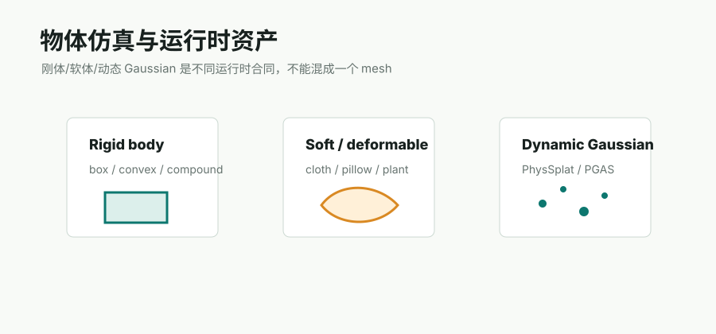

# VLM Physical Properties

## 链接

- GPT-4o model docs: https://platform.openai.com/docs/models/gpt-4o
- LLaVA project: https://llava-vl.github.io/
- PhysSplat / Sim Anything: https://sim-gs.github.io/

## 简介

VLM 可估计物体类别、材质、可抓取性、是否可移动、是否支撑其他物体等属性，也可以为 mass、friction、restitution 给出初始范围。Sim Anything / PhysSplat 也使用 MLLM 推断物理属性，这说明视觉语言模型在物理 sidecar 里有价值。

但 VLM 输出不应直接作为真值：数值物理参数仍需默认表、规则约束和运行时 QA。

## Pipeline

| 阶段 | 作用 |
|---|---|
| evidence packing | 收集 object crop、多视角截图、label、bbox |
| VLM inference | 输出 material、movable、fragile、support 等 hints |
| rule normalization | 映射到 mass/friction/restitution/body_type 默认表 |
| confidence/provenance | 记录模型、prompt、证据图和置信度 |
| QA loop | 运行物理引擎检查稳定性 |

## 输入与输出

输入：图像、object crop、语义标签、bbox、support relation。输出：material/body hints、physics defaults、affordance、可读描述。

## 在 Video2Mesh 中的位置

P1 辅助填写 simulator asset bundle。比如 bed -> static/support/cloth material，floor -> static/high friction，lamp -> dynamic/fragile/low mass 等，都可以先由 VLM 给初稿，再人工或规则校正。

## 接入判断

- P0：不进入必需链路。
- P1：进入 metadata 生成和审核工作流。
- 风险：VLM 幻觉和单位不一致，需要 schema、默认表和数值范围约束。
