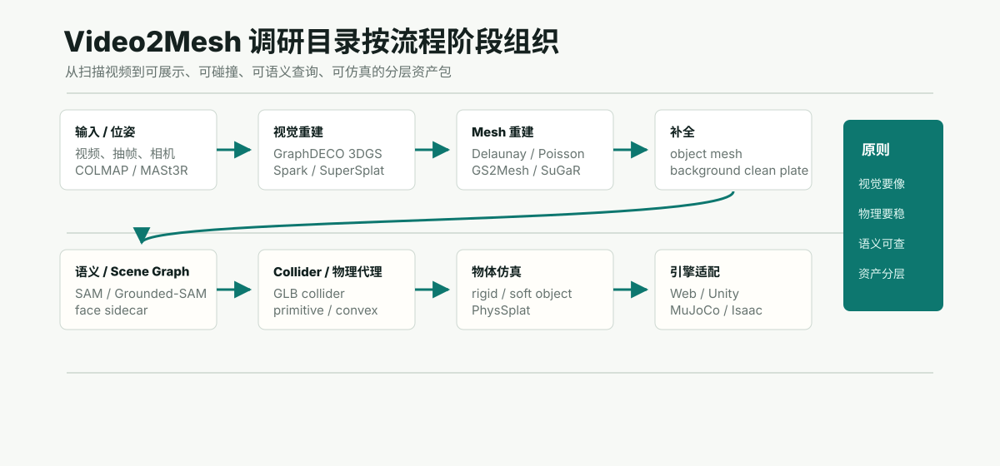

# 场景扫描与可交互资产调研目录

这个目录把调研内容按 Video2Mesh 的流程阶段重新组织。目标不是堆论文名，而是回答一个更工程化的问题：**从扫描视频到可交互仿真/游戏资产，每个阶段有哪些可借用模型、项目和产业方案，它们应该接在我们 pipeline 的什么位置。**



## 阶段目录

| 阶段 | 子目录 | 主要关注 |
|---|---|---|
| 输入、位姿与点云 | [input-pose-pointcloud](input-pose-pointcloud/overview.md) | COLMAP、MASt3R/DUSt3R/VGGT、MVS、稠密点云、尺度和坐标合同 |
| 视觉重建 / 3DGS | [visual-3dgs](visual-3dgs/overview.md) | GraphDECO 3DGS、Spark、SuperSplat、3DGS 作为 visual proxy |
| Mesh 重建 | [mesh-reconstruction](mesh-reconstruction/overview.md) | COLMAP Delaunay、Poisson/Open3D、GS2Mesh、SuGaR、2DGS/GOF |
| 点云/背景补全 | [pointcloud-completion](pointcloud-completion/overview.md) | 点云清理、背景 clean plate、inpainting、场景结构补全 |
| 物体 Mesh 补全 | [object-mesh-completion](object-mesh-completion/overview.md) | Hunyuan3D、Meshy、TRELLIS、InstantMesh、image-blaster object jobs |
| 语义与 Scene Graph | [semantic-scene-graph](semantic-scene-graph/overview.md) | SAM/Grounded-SAM、2D-to-3D fusion、semantic splats、face sidecar |
| Collider 与物理代理 | [collider-physics-proxy](collider-physics-proxy/overview.md) | static collider、primitive proxy、convex decomposition、Rapier/Unity collision |
| 物体仿真 | [object-simulation](object-simulation/overview.md) | rigid body、soft body、PhysSplat/Sim Anything、动态 Gaussian |
| 工业资产管线 | [industrial-pipelines](industrial-pipelines/overview.md) | SimFoundry、World Labs / Icare、image-blaster、Spark viewer、GLB runtime asset convention |

## 当前总判断

Video2Mesh 的目标产物应是分层资产包，而不是一个全能 mesh：

```text
scan video
  -> camera / dense geometry
  -> 3DGS visual proxy
  -> scene collider mesh
  -> object visual mesh / completion
  -> semantic face and object sidecar
  -> physics proxy and material metadata
  -> Web / Unity / MuJoCo / Isaac adapters
```

核心原则：

- 3DGS / Spark / Splat 负责视觉真实感。
- mesh / collider 负责碰撞、导航、点击和交互。
- 语义应保存在 sidecar，而不是绑死在会被简化或替换的 mesh 里。
- 物体补全、背景 clean plate、物理代理补全要拆开。
- Sim Anything / PhysSplat 这类动态 Gaussian 方法值得跟踪，但短期不替代 mesh/collider 主链路。
