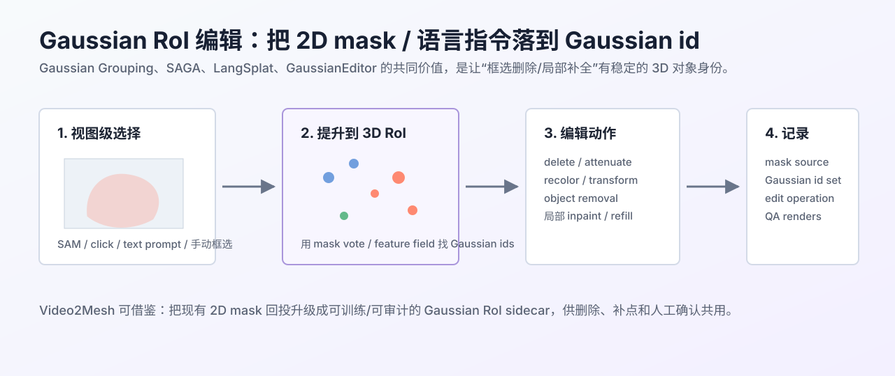

# Gaussian RoI 分割与局部编辑



## 链接

- Gaussian Grouping: Segment and Edit Anything in 3D Scenes: https://arxiv.org/abs/2312.00732
- SAGA: Segment Any 3D Gaussians: https://jumpat.github.io/SAGA/
- LangSplat: 3D Language Gaussian Splatting: https://langsplat.github.io/
- GaussianEditor: Swift and Controllable 3D Editing with Gaussian Splatting: https://arxiv.org/abs/2311.14521
- Segment Anything: https://segment-anything.com/

## 摘要要点

用户设想的“模型模拟人在 SuperSplat 里框选、删除、补洞”，真正难点不是按屏幕像素画一个框，而是把这个框稳定地映射到 3DGS 里的 Gaussian id。否则删除会只在当前视角看起来正确，换视角后就会漏删、误删或产生新缺口。

Gaussian Grouping、SAGA、LangSplat、GaussianEditor 这类方法给出的共同答案是：在 3DGS 训练或后处理时，为每个 Gaussian 附带对象/语义/语言/编辑特征，让 2D mask、点击、文本 prompt 或局部编辑能提升到 3D 的 Gaussian RoI。这样“删掉床边漂浮点”“选中墙面洞”“移除椅子并补地面”才有可追踪的 3D 对象范围。

Video2Mesh 不一定要完整复现这些大方法，但应该借鉴它们的 sidecar 思维：每次自动编辑都要记录 mask 来源、Gaussian id 集合、操作类型、置信度和 QA 结果。

## Pipeline

| 阶段 | 作用 | 可借鉴方法 |
|---|---|---|
| 2D RoI 生成 | 由点击、矩形、SAM mask、语义标签或 VLM prompt 产生视图级区域 | SAM、SAGA、LangSplat |
| Gaussian id 提升 | 通过渲染贡献、mask vote、feature similarity 把 2D 区域映射到 Gaussian 集合 | Gaussian Grouping、SAGA |
| 局部编辑 | 删除、降 opacity、颜色调整、object removal、局部补点 | GaussianEditor、SuperSplat |
| provenance | 记录 edit log，支持回滚和人工审核 | 工业编辑器工作流 |

## 输入与输出

| 类型 | 内容 |
|---|---|
| 输入 | 3DGS PLY、相机、2D masks/点击/文本、可选语义特征 |
| 输出 | `gaussian_roi.json`、编辑后的 PLY、operation log、before/after 多视角渲染 |

`gaussian_roi.json` 建议至少包含：

| 字段 | 说明 |
|---|---|
| roi_id | 本次编辑区域 id |
| source_views | 哪些视角产生了 mask 或点击 |
| gaussian_ids | 被选中的 Gaussian id 列表或压缩 bitmap |
| confidence | RoI 置信度和不确定原因 |
| operation | delete、attenuate、copy-fill、inpaint、rollback 等 |
| qa | 编辑前后指标和截图路径 |

## 在 Video2Mesh 中的位置

它是 Auto-SuperSplat 修复系统的中间层，接在诊断视角和实际编辑动作之间：

```text
diagnostic render
  -> mask / click / rule candidate
  -> Gaussian RoI lifting
  -> delete / fill / inpaint operation
  -> edit sidecar + QA
```

当前仓库已有 `backproject-gaussian-probabilities` 这类 2D mask 回投雏形，可以先把它升级成通用 RoI sidecar，而不是一开始就训练完整语言特征场。

## 接入判断

- P0：不训练大模型，先做基于渲染贡献和 mask vote 的 Gaussian id 回投。
- P1：结合 SAM/语义 mask，提高 object/background 边界的选中稳定性。
- P2：再评估 LangSplat/SAGA 风格特征场，让自然语言和点击能选中更复杂区域。

## 风险

- 2D mask 边缘误差会在 3D 中放大，需要 depth/alpha/contribution 约束。
- 语言特征场成本较高，且不是剔除 floaters 的必要前提。
- RoI 选错比阈值剪枝更危险，因为它可能批量删除真实结构。
