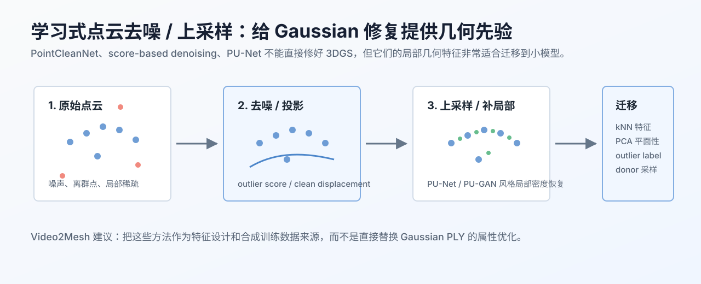

# 学习式点云去噪与上采样



## 链接

- PointCleanNet: Learning to Denoise and Remove Outliers from Dense Point Clouds: https://arxiv.org/abs/1901.01060
- Score-Based Point Cloud Denoising: https://arxiv.org/abs/2107.10981
- PU-Net: Point Cloud Upsampling Network: https://arxiv.org/abs/1801.06761
- PU-GAN: a Point Cloud Upsampling Adversarial Network: https://arxiv.org/abs/1907.10844
- Open3D outlier removal: https://www.open3d.org/docs/latest/tutorial/Advanced/pointcloud_outlier_removal.html

## 摘要要点

学习式点云去噪和上采样方法解决的是传统点云问题：哪些点是离群点、噪声点应该往哪里投影、稀疏区域如何补采样。它们的输入通常是 xyz 点云，不包含 3DGS 的 opacity、scale、rotation、SH color 等属性，所以不能直接拿来修复 Gaussian PLY。

但这些方法非常适合作为 Auto-SuperSplat 小模型的特征来源。PointCleanNet 强调局部 patch 中的 outlier classification 和 displacement correction；score-based denoising 用梯度/score 把 noisy points 推回潜在 clean surface；PU-Net/PU-GAN 则学习如何在局部 surface 上生成更均匀的新点。这些思想能帮助我们设计“该删哪些点”和“平面洞里应该在哪里补点”的几何先验。

## Pipeline

| 方法族 | 解决的问题 | 可借鉴到 3DGS 的部分 |
|---|---|---|
| PointCleanNet | 离群点判别、噪声点位移修正 | keep/delete 标签、小模型训练样本、kNN patch 特征 |
| Score-based denoising | 把 noisy points 往高概率 surface 推回 | 点到局部 surface 的 residual、修补后是否离面 |
| PU-Net / PU-GAN | 局部稀疏区域上采样 | 平面洞 copy-fill 的目标位置采样、密度控制 |
| Open3D 规则法 | SOR/ROR/voxel 等基础清理 | P0 baseline 和失败对照 |

## 输入与输出

| 类型 | 内容 |
|---|---|
| 输入 | xyz/RGB 点云、可选 normal、Gaussian center 派生点云 |
| 输出 | outlier score、cleaned point cloud、upsampled patch、局部几何特征 |

对 3DGS 修复，推荐把输出当作 side feature，而不是直接覆盖原 PLY：

```text
Gaussian PLY
  -> derive xyz point cloud and local patches
  -> compute denoise / outlier / upsample features
  -> merge with opacity / scale / visibility features
  -> keep-delete classifier or plane-fill sampler
```

## 在 Video2Mesh 中的位置

它属于 P1/P2 的训练数据和特征设计模块：

- 给 floater classifier 提供局部几何特征。
- 给平面洞 copy-fill 提供采样位置和密度约束。
- 给 mesh reconstruction 前的点云清理提供 baseline。

它不应该替代 3DGS 属性优化，因为视觉质量还取决于 opacity、anisotropic scale、rotation 和 spherical harmonics。

## 接入判断

- P0：保留 Open3D SOR/ROR 和现有规则 cleaner。
- P1：抽取 PointCleanNet 风格局部 patch 特征，训练轻量 keep/delete 分类器。
- P2：用合成洞/合成 floater 数据训练 acceptor，判断补点后是否该回滚。

## 风险

- 点云方法看到的是 Gaussian center，不一定等价于可见 surface。
- 上采样点没有 Gaussian 属性，必须从 donor splats 采样或重新拟合。
- 学习式模型需要干净标注；早期更适合用规则和人工编辑日志生成弱标签。
