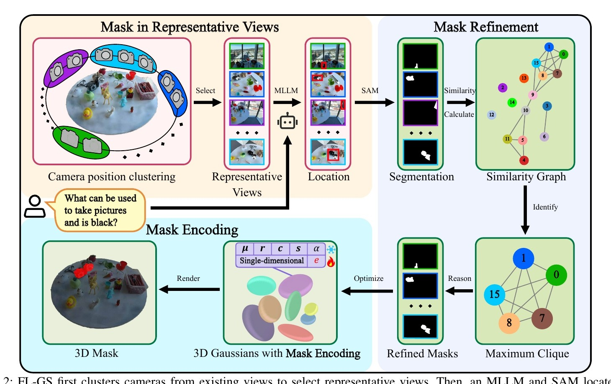
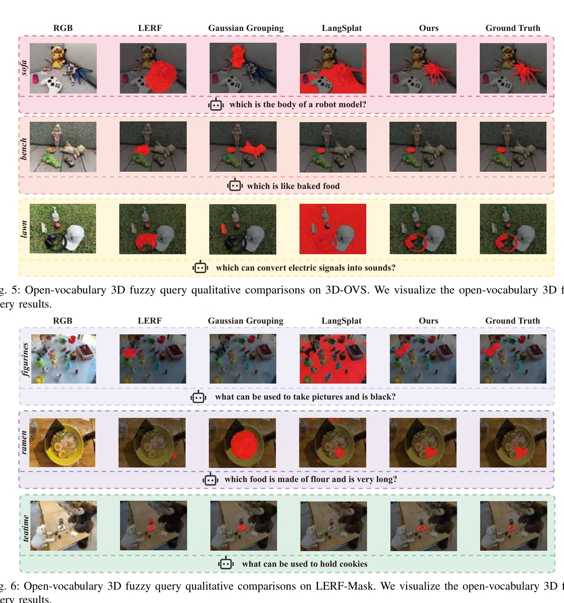
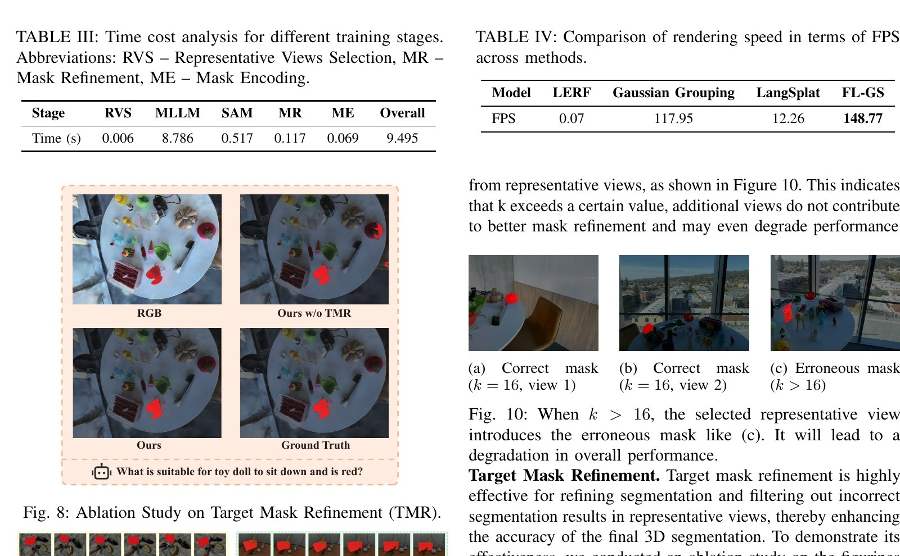

# FLGS：模糊语言驱动的 3D Gaussian 查询



检查日期：2026-07-26

## 当前结论

FLGS 把“模糊查询”定义为不直接说出对象名称，而是描述对象的属性、功能或特征，例如不用 `plate`，而说“可以用来放饼干的东西”。它从已有多视图 3DGS 和相机出发，只调用少量代表视角上的 Qwen2.5-VL 与 SAM，再利用跨视角 3D 尺度一致性过滤错误 mask，最后为当前查询优化一个单维 Gaussian mask encoding。

对 Video2Mesh 最值得吸收的不是“fuzzy”标签，而是 MLLM/SAM 结果进入 3D 前的 **跨视角去错**：将候选 masks 转到统一 3D 坐标，构图并选出相互一致的最大子集。它可放在现有 SAM2/SAM3 masks 与 `backproject-gaussian-probabilities` 之间，减少单帧误检污染 semantic splats。

需要明确：论文没有实现一般意义上的模糊集合推理，也没有输出物理不确定性。最终仍是 query-specific 3D hard mask；它不是 scene graph、材质推断、物理参数反演或 collider 方法。

本页状态为 **Paper audited / Local exact reproduction not tested**。论文指标和速度均不是 Video2Mesh 本地结果。

## 链接

- DOI: https://doi.org/10.1109/TFUZZ.2025.3644901
- IEEE Xplore: https://ieeexplore.ieee.org/document/11316279/
- 本地源 PDF：`钱塘观潮申报书/djj-paper/期刊-TFS25.pdf`

提供的 PDF 是 IEEE Transactions on Fuzzy Systems 接收作者版，页眉明确提示尚未完成最终编辑；本页引用 DOI，不把作者版排版当作最终版本。PDF 中没有给出公开代码仓库或项目页。

## 基本信息

| 项 | 内容 |
|---|---|
| 标题 | Fuzzy Language Gaussian Splatting |
| 期刊 | IEEE Transactions on Fuzzy Systems |
| DOI | 10.1109/TFUZZ.2025.3644901 |
| 作者 | Jiajun Ding、Zhijie Wang、Yaowei Liu、Hongxi Zhu、Juan Yang、Min Tan、Zhou Yu |
| 机构 | 杭州电子科技大学复杂系统建模与仿真重点实验室 |
| 论文状态 | 2025 接收作者版；SVLGaussian 参考文献列为 2026, 34(4):1165-1174 |
| 核心任务 | fuzzy query text + existing 3DGS -> precise query-specific 3D mask |
| 主要模型 | 3DGS、Qwen2.5-VL-7B-Instruct、SAM2.1 Hiera Large、hierarchical clustering、maximum clique |

## “Fuzzy Query”实际指什么

| Specific text | Fuzzy text |
|---|---|
| plate | what can be used to hold cookies |
| old camera | what can be used to take pictures and is black |
| black headphone | which can convert electric signals into sounds |
| green toy chair | what is suitable for toy doll to sit down and is green |

这些 prompt 主要是描述性 referring expressions。系统靠 MLLM 把描述还原成目标对象，再输出 3D mask。它不维护传统 fuzzy logic 的隶属函数、规则库或连续物理状态。

## Pipeline

```text
multi-view RGB + calibrated cameras + trained 3DGS + fuzzy query
  -> hierarchical clustering of camera positions
  -> choose k = 16 representative views
  -> Qwen2.5-VL-7B predicts one target box per view
  -> SAM2.1 Hiera Large converts boxes to masks
  -> back-project each mask with depth/camera to a 3D point set
  -> estimate target scale from XYZ standard deviations
  -> connect mask pairs whose scale ratio is greater than 0.8
  -> find the maximum clique of mutually similar masks
  -> retain clique masks as refined supervision
  -> freeze base 3DGS and optimize one scalar mask encoding per Gaussian
  -> BCE + DICE loss for 50 steps
  -> render a query-specific 3D mask
```

| 组件 | 输入 | 输出 | 论文中的作用 | 不负责什么 |
|---|---|---|---|---|
| Camera clustering | camera positions | 16 representative views | 减少 MLLM 调用并覆盖不同观察方向 | 判断目标语义 |
| Qwen2.5-VL | representative RGB + fuzzy query | boxes | 理解属性、功能和上下文描述 | 精细 mask 或 3D consistency |
| SAM2.1 | RGB + box | binary mask | 得到目标像素边界 | 识别不同视角是否同一实例 |
| 3D scale estimation | mask + camera + depth | scale scalar | 用 3D extent 比较跨视角目标 | 完整形状或公制尺寸真值 |
| Similarity graph | pairwise scale ratio | undirected graph | 将可能属于同一目标的 masks 相连 | 语义特征匹配 |
| Maximum clique | mask graph | refined masks | 去除与多数视角不一致的候选 | 保证唯一正确解 |
| 1D mask encoding | refined masks + frozen 3DGS | per-Gaussian scalar `e_i` | 快速渲染当前 query 的 3D mask | 通用多类别 language field |

## Mask Refinement

论文假设同一对象从不同视角回投到 3D 后尺度近似不变。对每个 mask，使用其 3D 点的 `X/Y/Z` 标准差组合成尺度；两 mask 的尺度比大于 `0.8` 时，在相似图中连边。最大团代表相互都相似的最大 mask 子集。

这个方法可以过滤“某个视角把错误对象当成目标”的情况，但尺度只是弱判据：场景中两个大小相近的椅子、瓶子或装饰品仍可能被误连。Video2Mesh 若吸收该思路，应同时加入 object feature、camera visibility、3D centroid、instance track 和 mask overlap，不应只照搬一个尺度阈值。

## 单维 Mask Encoding

FLGS 不为每个 Gaussian 写入高维 CLIP feature，而是只优化一个 scalar `e_i`。渲染时按 3DGS opacity compositing 得到 mask，再用 sigmoid、BCE 和 DICE loss 对 refined masks 监督。

优点是 50 步即可完成，且不需要额外 decoder；缺点是 encoding 只针对当前 query。要支持多个对象或多条语言查询，需要分别保存多组 query masks 或建立额外 object/query sidecar，不能把单维结果直接当成通用开放词汇场。

## 论文结果

### Benchmark

论文把 3D-OVS 的 5 个场景与 LERF-Mask 的 3 个场景重新标成 specific/fuzzy prompt pairs。

| Dataset | Qwen2.5-VL | LERF | Gaussian Grouping | LangSplat | FLGS |
|---|---:|---:|---:|---:|---:|
| 3D-OVS mIoU / mBIoU | 88.9 / 82.3 | 37.2 / 17.4 | 69.8 / 66.7 | 65.0 / 57.7 | **94.3 / 87.9** |
| LERF-Mask mIoU / mBIoU | 71.3 / 68.5 | 20.7 / 15.1 | 34.3 / 30.3 | 23.8 / 20.5 | **80.6 / 76.5** |



Qwen2.5-VL baseline 已经很强，FLGS 的增益主要来自跨视角一致性过滤与 3D mask encoding。数据集只有 8 个场景，且 fuzzy prompts 多为人工改写的单目标描述，因此尚不足以证明对任意开放世界歧义都稳定。

### 消融与效率



| 项 | 论文报告 |
|---|---:|
| 最佳代表视角数 | `k = 16` |
| 无 Target Mask Refinement | 57.8 mIoU / 56.0 mBIoU |
| 有 Target Mask Refinement | 83.0 mIoU / 81.2 mBIoU |
| Mask encoding steps | 50 |
| MLLM | 8.786 s |
| SAM | 0.517 s |
| Mask refinement | 0.117 s |
| Mask encoding | 0.069 s |
| Overall | 9.495 s |
| Query mask rendering | 148.77 FPS |

MLLM 占据绝大多数查询时间。148.77 FPS 是训练好当前 query mask encoding 后的渲染速度，不是从文本到 3D mask 的端到端速度。

## 风险与证据边界

- “fuzzy”主要是间接描述，不等于形式化 fuzzy logic，也不输出物理不确定性。
- 3D 尺度一致性依赖相机、深度和 base 3DGS。遮挡、floaters 或错误深度会改变 mask 点云尺度。
- 最大团只保留内部一致的最大子集；若多数 MLLM 视角同时识别错对象，它仍可能选出错误但一致的 clique。
- 每个 query 优化一组 1D encoding，适合单目标查询，不等于可一次保存所有类别的 persistent language field。
- Benchmark 场景数量小，prompt 由 specific labels 人工改写，真实用户指令的歧义、否定、复合关系和多目标请求覆盖有限。
- 论文没有公开代码链接，本页没有验证复现依赖、许可证或训练脚本。

## 在 Video2Mesh 中的位置

```text
existing Video2Mesh evidence
  selected multi-view frames
  + calibrated cameras
  + SAM2/SAM3 masks
  + depth / clean visual 3DGS
        |
        v
FLGS-inspired mask consistency gate
  3D extent + centroid + feature + visibility graph
  -> retain consistent mask subset
        |
        v
backproject-gaussian-probabilities
  -> semantic splats / query sidecar
```

这条路线应放在 semantic evidence filtering 层，而不是替换 object mesh completion 或 collider：

```json
{
  "query_id": "hold-cookies",
  "object_id": "plate_01",
  "accepted_frames": ["frame_0008", "frame_0021", "frame_0035"],
  "rejected_frames": ["frame_0014"],
  "consistency": {
    "scale_ratio_min": 0.84,
    "centroid_distance_max": 0.09,
    "feature_similarity_min": 0.78
  }
}
```

## 官方 Pipeline 与本地状态

| FLGS 阶段 | Video2Mesh 当前对应 | 状态 |
|---|---|---|
| 多视图 3DGS + cameras | GraphDECO / PGSR / registered cameras | Reused |
| Hierarchical camera clustering `k=16` | 当前 `svlgaussian` anchor/offset 选帧不是相机层次聚类 | Proxy |
| Qwen2.5-VL fuzzy query | 有 Qwen review tooling，但未按 FLGS query contract 运行 | Not tested |
| SAM2.1 Hiera Large | 当前有 SAM2/SAM3 evidence，模型与 prompt 流不同 | Reused |
| 3D scale similarity graph | 尚无 FLGS 最大团 mask gate | Not tested |
| Single-dimensional mask encoding | 当前写 `object_id/object_probability`，未训练 query scalar | Not tested |
| 2D probability back-projection | `backproject-gaussian-probabilities` 是更直接的工程替代 | Proxy |
| 3D-OVS / LERF-Mask fuzzy benchmark | 未下载、未运行 | Not tested |

## 接入判断

- P1：先实现不训练 Gaussian 的 mask-consistency report，用 scale、centroid、camera visibility 和 DINO/CLIP crop feature 共同构图。
- P1：把 accepted/rejected frames 写入 sidecar，再让现有 back-projection 只消费通过一致性 gate 的 masks。
- P2：若 query-specific mask 需要实时渲染，再比较 FLGS 1D encoding 与直接 `object_probability` 写回的成本和质量。
- 不直接采用：只按尺度阈值连边；室内场景大量同尺寸对象会造成错误 clique。
- 不替代：persistent object IDs、scene graph、mesh face semantics、collider、物理属性和 simulator adapters。
