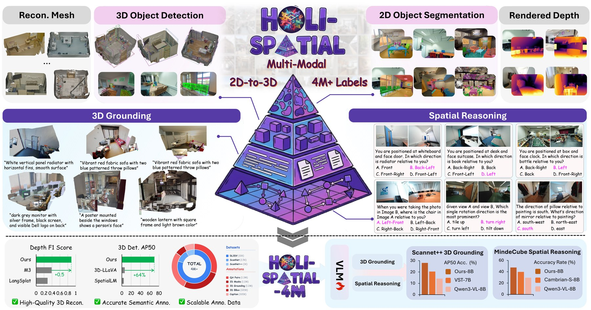

# Holi-Spatial 调研与 bedroom_4 实验报告

本页只保留 `bedroom_4_fresh_da3_sam3_pgsr_20260714_184217` 这一份真实实验。此前 schema smoke、SAM2 proxy、早期 SAM3 适配和早期 PGSR 结果均已从文档与实验目录清理，不参与当前结论。



## 链接

- Paper: https://arxiv.org/abs/2603.07660
- Project page: https://visionary-laboratory.github.io/holi-spatial/
- Code: https://github.com/Visionary-Laboratory/Holi-Spatial
- Hugging Face: https://huggingface.co/Holi-Spatial
- 本次正式实验归档：[Holi-Spatial bedroom_4 全链路重跑](../../experiments/holi-spatial-bedroom4-fresh-run-20260714.md)

## 项目定位

Holi-Spatial 的目标不是只重建一个 mesh，而是把视频场景转成可训练、可检索、可评测的空间数据：优化后的 3DGS、稠密深度、2D masks、3D bbox、实例描述、3D grounding 和 spatial QA。对 Video2Mesh，它属于语义空间标注与评测层，不替代 COLMAP、3DGS visual layer、mesh collider 或物理资产导出主链路。

论文公开描述的 Holi-Spatial-4M 规模约为 12K 场景、百万级 2D masks / spatial QA 与数十万 3D boxes。Hugging Face 已公开 `HoliSpatial-2M-QA-Qwen3-VL-8B` 等 QA 模型和部分数据集；这些是空间问答/grounding 模型或训练数据，不是可直接把任意视频重建成 3D 场景的通用 checkpoint。

## 论文 Pipeline

```text
raw video / scene images
  -> camera metadata and scene coordinates
  -> DA3 dense depth and initial point cloud
  -> PGSR / 3DGS per-scene optimization
  -> VLM class discovery and category memory
  -> SAM3 text-prompted 2D masks
  -> depth / visibility filtering and 2D-to-3D lifting
  -> multi-view instance merge and bbox postprocess
  -> captions, grounding and spatial QA generation
  -> VLM training / evaluation records
```

| 组件 | 输入 | 输出 | 在 Holi-Spatial 中的作用 | 不负责什么 |
|---|---|---|---|---|
| SfM / camera loader | 帧、标定或数据集相机 | intrinsics / extrinsics | 统一 3D 坐标和投影关系 | 语义识别 |
| DA3 | 图像、相机上下文 | depth maps、dense point cloud | 稠密几何 prior | 最终无伪影表面或语义标签 |
| PGSR / 3DGS | 图像、相机、几何 prior | optimized Gaussians、rendered depth、mesh | 场景级几何优化 | 物体检测器 |
| VLM | sampled frames | 开放词汇类别和命名记忆 | 发现类别、保持跨帧名称一致 | 精细像素分割 |
| SAM3 | image + text label | bbox、score、mask | 文本提示 2D 实例分割 | 3D bbox、跨帧 ID 或 QA 答案 |
| 2D-to-3D lifting | masks、depth、cameras | object-local 3D points | 将 2D 证据回投到统一坐标 | 物体 mesh 补全 |
| bbox refinement | local points / proposals | AABB / OBB | 多视图合并、过滤和重力对齐 | 公制标定 |
| QA generation | bbox、cameras、covisibility | spatial QA records | 将几何关系变成训练/评测样本 | 自由形式物理仿真 |

### DA3、SAM3、PGSR 的边界

- **DA3** 生成 `depth_da3/*.npy` 与 `pointcloud_da3.ply`，为后续 lifting 和 PGSR 提供几何证据。直接回投仍可能有遮挡边缘残影和 floaters。
- **SAM3** 由类别文本提示得到自己的 bbox、score 和 masks。它不需要 GroundingDINO 的 box；本实验中 GroundingDINO 仅筛选类别词表。
- **PGSR** 对单一场景训练 Gaussian 并从 rendered depth 导出 TSDF mesh。它改善多视图几何，不自动附带物体语义。
- **semantic 3DGS** 是额外的语义投影步骤：以 SAM3 的 2D mask 概率、相机和可见性为证据，为 PGSR Gaussian 写入 `object_id/object_probability`。

## 当前正式实验

| 项 | 结果 |
|---|---|
| 远端 run | `mil8:/data/design/zyx/workspace/holi_spatial_runs/bedroom_4_fresh_da3_sam3_pgsr_20260714_184217` |
| 输入 | 80 帧 `bedroom_4` 与校正相机；world-to-camera round-trip 最大误差 `1.33e-15` |
| DA3 | 官方 `DA3NESTED-GIANT-LARGE`；80 张 depth；4,000,000 点 |
| 类别筛选 | GroundingDINO：68 candidates -> 20 prompts -> 9 类别候选；不向 SAM3 传 detection box |
| SAM3 | 957 个真实源 mask -> 616 个 class-frame 概率 mask；8 个有效类别 |
| lifting / bbox | 遮挡过滤、至少 2 次多视图投票、voxel DBSCAN、robust AABB/PCA OBB；13 个 3D records |
| PGSR | 30,000 iterations；871,317 Gaussians；L1 `0.0118202`、PSNR `33.1155 dB`；missing-depth warning `0` |
| TSDF mesh | 694,773 vertices / 1,351,454 faces |
| semantic 3DGS | 10/10 preview frames 有效；8/8 类有选中 Gaussian；共 701,608 个 selected Gaussians |

本次实际类别为 `bed`、`ceiling`、`floor`、`lamp`、`nightstand`、`plant`、`wall`、`window`。`wall art` 只停留在候选词表，没有被虚构成有效 SAM3 语义。13 个 records 由 10 个前景实例和 3 个结构类别组成。

### 产物

| 产物 | 规模 | 说明 |
|---|---:|---|
| `pointcloud_da3.ply` | 57.2 MiB，4,000,000 points | DA3 RGB 初始点云 |
| `semantic_da3_points.ply` | 87.7 MiB | binary RGB + `object_id/object_probability` 审计输出 |
| `semantic_da3_points_palette.ply` | 87.7 MiB | 可直接显示类别颜色的 DA3 companion |
| `object_masks_3d/sam3_*.ply` | object-level | bed、lamp、nightstand、window 等对象云 |
| `point_cloud/iteration_30000/point_cloud.ply` | 206.1 MiB，871,317 Gaussians | 官方 PGSR 原始 Gaussian |
| `mesh/tsdf_fusion_post.ply` | 34.6 MiB | 官方 PGSR TSDF mesh |
| `semantic_gaussian_probability_supersplat.ply` | 206.1 MiB | 语义 3DGS 的 SuperSplat 友好展示派生物 |
| `semantic_pgsr_30k_projected.ply` | 212.7 MiB | SAM3 直接投影的主语义 3DGS |
| `semantic_pgsr_30k_nearest_da3.ply` | 212.7 MiB | DA3 最近邻语义对照，不作为主结果 |
| `semantic_supersplat.ply` | 946.0 MiB | 大型展示导出，保留在远端，未在 MacBook 上直接加载 |

本地归档位于 `tmp_remote_results/holi_spatial_bedroom4_fresh_da3_sam3_pgsr_20260714_184217/`，远端是完整权威产物；本地不强行回传所有训练缓存和近 1 GiB viewer 文件，避免低速网络传输和本机查看器显存占满。

### 人工 QA

- `tsdf_fusion_post.ply` 的床、墙、窗和地面连续，场景表面重建效果很好。
- 30k 原始 Gaussian 的主体空洞已基本修复，仍有少量场景边缘拉丝、漂浮点和放射状伪影。
- DA3 RGB 点云整体结构可辨；床、台灯、床头柜和窗口对象云均可归档、可审阅。
- `semantic_da3_points_palette.ply` 在普通 viewer 中语义边界清楚；semantic 3DGS 的类别空间关系也与重建对齐。
- 大型语义 Gaussian PLY 未在 MacBook 上直接打开。对此只报告 PLY 字段、顶点数和投影 QA，不把未做的交互查看写成质量验证。

完整的九张截图、人工 QA、文件路径与结果边界见：[正式实验报告](../../experiments/holi-spatial-bedroom4-fresh-run-20260714.md)。

## 硬件与部署

完整管线不是轻量单模型：DA3、SAM3、PGSR CUDA 扩展和 VLM 服务分别有依赖、显存和磁盘压力。本地 Mac 适合文档、输入准备和小型结果检查；本次单场景重跑在 `mil8` 的 8 张 RTX 3090 24GB 环境上完成。大规模批量化还需要独立规划模型缓存、PGSR 单场景输出和数据集存储，不能把单场景结果外推为全量部署成本。

## 接入判断与限制

- 可以接入：DA3 几何 prior、SAM3 masks、直接 semantic Gaussian projection、bbox sidecar 和空间 QA 的后续数据结构。
- 不替代：COLMAP 主相机链路、现有 visual/collider 分层、mesh collider 和物理属性建模。
- 未执行：论文中的 VLM/vLLM 类别发现、instance caption、VLM-agent verification、官方 spatial QA、LLaMA-Factory 数据转换和 benchmark。
- 坐标与尺度：bbox 处于 Video2Mesh/COLMAP scene units，尚无公制标定；TSDF mesh 也尚未做 watertightness、collider 或物理可用性 QA。

下一步应处理 PGSR 原始 Gaussian 的 elongation / floater，并提供分块或下采样语义 3DGS 预览，之后再评估是否把该 mesh 或 semantic sidecar 接到 simulator 资产层。
