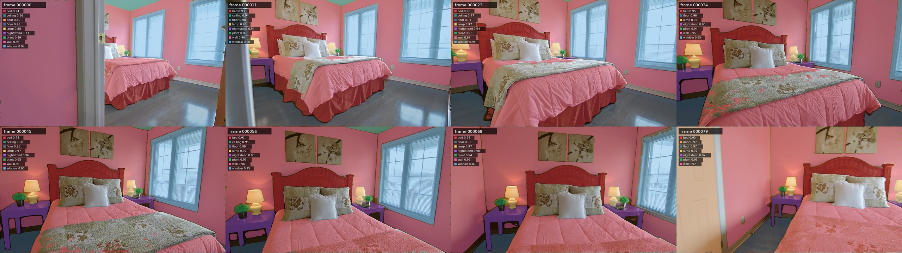
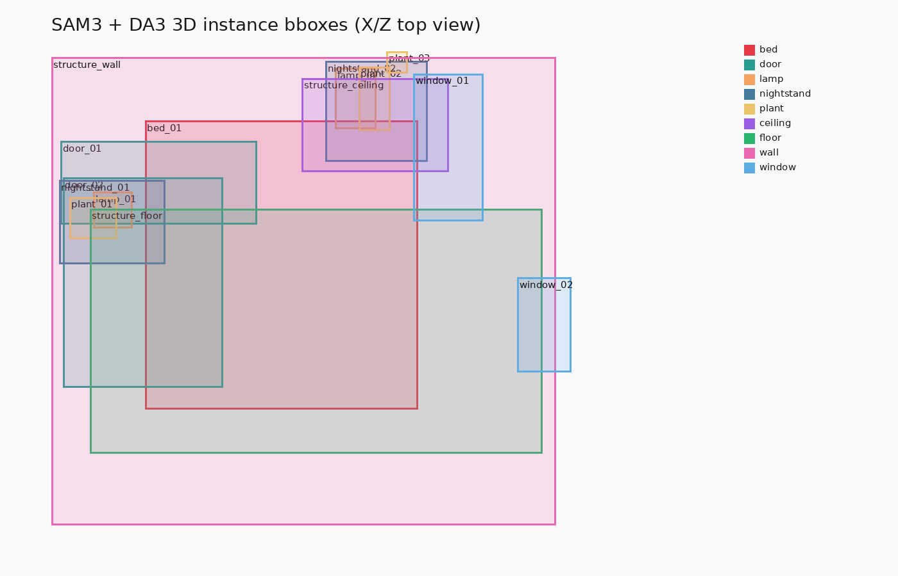
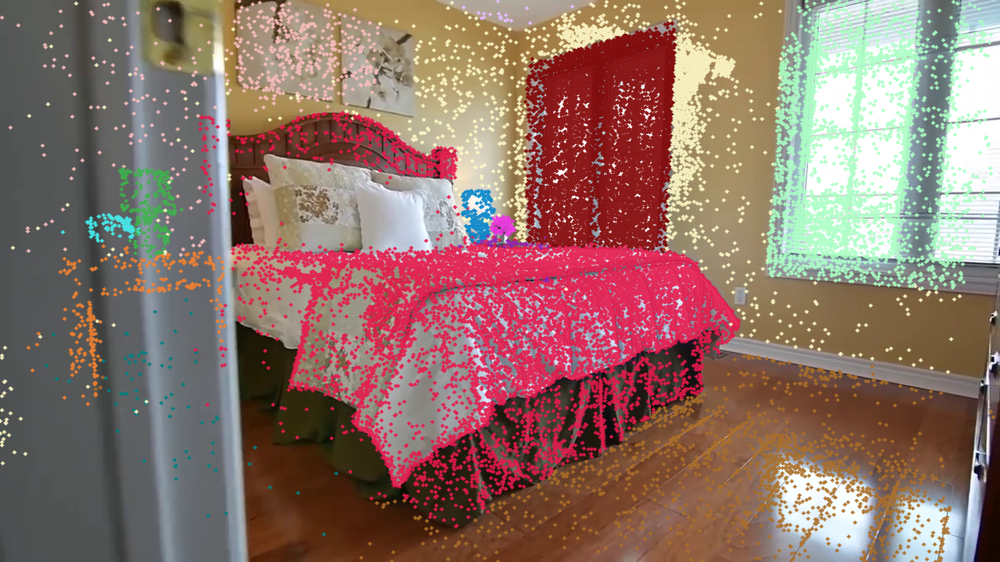

# Holi-Spatial 调研与 bedroom_4 实验报告

这份报告记录 Holi-Spatial 论文、官方仓库、公开模型/数据集状态，以及 Video2Mesh `bedroom_4` 片段接入 Holi-Spatial 后处理和 spatial QA 的实际实验结果。文中保留历史 **Holi-Spatial-compatible smoke run**，并在末尾新增 2026-07-13 的真实 DA3、SAM3、PGSR 运行；两者不能混为一条实验结论。


## 链接

- Paper: https://arxiv.org/abs/2603.07660
- Project page: https://visionary-laboratory.github.io/holi-spatial/
- Code: https://github.com/Visionary-Laboratory/Holi-Spatial
- Hugging Face org: https://huggingface.co/Holi-Spatial
- Local PDF: `/Users/zhangyuxiang/Desktop/worksplace/Holi-Spatial/2603.07660v1.pdf`
- Local official clone inspected: `/tmp/Holi-Spatial-official`

## 基本信息

| 项目 | 内容 |
|---|---|
| 论文标题 | Holi-Spatial: Evolving Video Streams into Holistic 3D Spatial Intelligence |
| arXiv | 2603.07660v1, submitted on 2026-03-08 |
| README 标注 | ICML 2026 Oral |
| 作者 | Yuanyuan Gao, Hao Li, Yifei Liu, Xinhao Ji, Yuning Gong, Yuanjun Liao, Fangfu Liu, Manyuan Zhang, Yuchen Yang, Dan Xu, Xue Yang, Huaxi Huang, Hongjie Zhang, Ziwei Liu, Xiao Sun, Dingwen Zhang, Zhihang Zhong |
| 目标 | 从 raw video 自动生成 3DGS、深度、2D mask、3D bbox、instance caption、3D grounding 和 spatial QA |
| 对 Video2Mesh 的定位 | 不是替代 COLMAP/3DGS/mesh 主链路，而是可以作为语义空间标注、空间 QA benchmark、VLM 训练数据生成层 |

## 核心结论

Holi-Spatial 最值得借鉴的是它把视频场景整理成 **可训练、可评测的空间监督数据**：每个场景不只是有重建结果，还带有 2D masks、3D bounding boxes、instance captions、3D grounding pairs 和 spatial QA。对 Video2Mesh 来说，它适合作为 P1/P2 的语义空间数据层，用来检验“我们的重建、mask、bbox、camera pose 是否足够支撑空间推理”。

它不应该被理解成一个轻量部署模型。完整 pipeline 依赖 DA3、PGSR/3DGS、SAM3、VLM/vLLM 服务、CUDA 扩展和大量数据存储。当前本地 Mac 不适合跑完整链路；`mil8` 有 8 张 RTX 3090 24GB，算力够做单场景实验，但 `/data` 在 2026-07-10 核验时只剩约 85GB 可用、98% 使用率，不适合直接下载大模型和批量数据。

## 论文方法

Holi-Spatial 的自动数据生成分三段：

| 阶段 | 论文/官方代码中的作用 | 关键产物 |
|---|---|---|
| Geometric Optimization | 用 Depth-Anything-V3 等 monocular prior 初始化，再优化 3D Gaussian Splatting/PGSR 场景，提高多视角几何和深度一致性 | optimized 3DGS, rendered depth, point cloud, mesh |
| Image-level Perception | 抽关键帧，用 VLM 发现开放词汇类别，再用 SAM3 生成每帧 instance masks | per-image class list, SAM3 masks, mask index |
| Scene-level Lift and Refinement | 用深度、相机内参和位姿把 2D mask 回投到 3D；跨视角合并、过滤、生成 3D bbox/caption/grounding/QA | 3D bbox, instance caption, 3D grounding, spatial QA |

### 组件分工与完整数据流

Holi-Spatial 的关键不是某一个单模型，而是把多个组件串成自动标注 pipeline。DA3、SAM3、VLM、PGSR/3DGS 各自只负责一个边界清楚的中间环节：

```text
raw video / scene images
  -> SfM / dataset camera metadata
  -> DA3 depth prior and point cloud initialization
  -> PGSR / 3DGS per-scene geometry optimization
  -> rendered refined depth and mesh-guided depth evidence
  -> VLM class-label memory from sampled keyframes
  -> SAM3 text-prompted 2D instance masks
  -> mask erosion + mesh-guided depth filtering
  -> 2D mask pixels back-projected into 3D
  -> initial OBB / bbox proposals
  -> multi-view merge and floor-aligned postprocess
  -> confidence filtering and VLM-agent verification
  -> instance captions, 3D grounding pairs, spatial QA
  -> LLaMA-Factory / VLM training and evaluation data
```

| 组件 | 输入 | 输出 | 在论文中的角色 | 不能误解成 |
|---|---|---|---|---|
| SfM / camera loader | 视频帧或数据集相机文件 | camera intrinsics / extrinsics | 给深度回投、3DGS 和 QA 提供坐标系 | 语义标注器 |
| DA3 / Depth-Anything-V3 | 图像和相机上下文 | `depth_da3/*.npy`, `pointcloud_da3.ply` | 提供 dense depth prior 和初始点云 | 最终几何真值 |
| PGSR / 3DGS | images, cameras, DA3 point/depth prior | optimized 3DGS, rendered depth, mesh | 多视角优化，压制 DA3 直接回投的 ghosting / floaters | 物体识别模型 |
| VLM class discovery | sampled keyframes, class-label memory | per-image class list / region list | 发现开放词汇类别，并保持跨帧命名一致 | 精细分割器 |
| SAM3 | image + text prompt label | 2D mask, bbox, score, RLE | 按 VLM 类别生成 open-set instance masks | 3D bbox 或 QA 生成器 |
| Mask erosion | SAM3 2D mask | reliable interior mask | 去掉 mask 边缘误差，减少物体边界处深度噪声 | 新物体发现 |
| Mesh-guided depth filtering | 3DGS depth, mesh depth, mask | filtered object point set | 过滤深度不连续处的 3D outliers | mesh 重建主算法 |
| 2D-to-3D lifting | mask pixels, refined depth, intrinsics, extrinsics | object-local 3D points and initial OBB | 把 2D instance 变成 3D object proposal | 语言推理 |
| Multi-view merge | 多帧同类 OBB proposals | merged instance bbox | 用类别和 3D IoU 合并同一物体的多视角观测 | 任意关系图构建 |
| Floor-aligned postprocess | merged OBBs, floor/up axis | gravity-consistent AABB/OBB | 对齐重力方向，减少 roll/pitch 误差 | 自动修复错误语义 |
| VLM-agent verification | highlighted object crops, zoom-in, SAM re-segmentation | accept/reject/correct label | 过滤低置信或错标实例 | 无需复核的真值来源 |
| QA generation | camera poses, covisibility, bbox/caption | spatial QA JSON / training records | 用几何规则合成空间推理题和答案 | 大模型自由回答 |

### DA3 的具体用法

DA3 在第一阶段提供初始深度和点云。官方入口是 `run_da3.sh` 和 `inference_da3_scannetppv2.py`，脚本会加载 `depth-anything/DA3NESTED-GIANT-LARGE`，对 ScanNet v2、ScanNet++ 或 DL3DV 风格场景输出：

```text
<scene>/depth_da3/<image_stem>.npy
<scene>/pointcloud_da3.ply
```

论文里没有把 DA3 depth 当最终结果。直接用 DA3 多视角回投会产生 ghosting artifacts 和 floaters；Holi-Spatial 后续用 PGSR/3DGS 的 per-scene optimization 和几何正则，把 depth / point cloud 变成更一致的 rendered refined depth，再用于 2D-to-3D lifting 和 bbox 估计。

### SAM3 的具体用法

SAM3 在第二阶段做 text-prompted instance segmentation。类别来自 VLM，而不是 SAM3 自己决定。官方 `classic_vllm.py` 先对 keyframes 生成开放词汇类别并维护 class-label memory；`sam3.py` 再对每个 image + label 调用：

```python
state = processor.set_image(image)
output = processor.set_text_prompt(state=state, prompt=label)
```

输出会规范成 mask、box、score 和 RLE：

```text
mask_path
mask_rle
bbox
score
```

这些 2D masks 随后会和 3DGS refined depth、camera intrinsics/extrinsics 结合，回投成 3D points。论文还特别处理 SAM3 的两类常见误差：2D mask 边缘不准，以及同一物体因遮挡被切成多个 instances。前者通过 mask erosion 和 mesh-guided filtering 缓解，后者通过 multi-view merge 和 VLM-agent verification 缓解。

官方 README 对应的代码入口也基本按这个边界组织：

| 官方入口 | 作用 |
|---|---|
| `run_da3.sh`, `inference_da3_scannetppv2.py` | DA3 depth / point cloud preprocessing |
| `3dgs_train.sh`, `PGSR/` | PGSR/3DGS 训练，输出 `point_cloud/iteration_30000/point_cloud.ply` |
| `mesh.sh` | 渲染 mesh 和 mesh-guided masks |
| `classic_vllm.py`, `classic_region.py` | VLM object / functional-region discovery |
| `sam3.py` | SAM3 text-prompted mask generation |
| `3d_bounding_instance_gs_rerun_da3.py` | object 2D-to-3D lifting/refinement |
| `postprocess_3d_bbox_aabb.py` | 基于 floor 的 AABB/OBB 对齐后处理 |
| `qa_generation/` | instance description、two-view spatial QA、LLaMA-Factory 格式转换 |

## 数据规模和论文结果

论文摘要给出的 Holi-Spatial-4M 规模是：

| 数据项 | 规模 |
|---|---:|
| optimized 3DGS scenes | 12K |
| 2D instance masks | 1.3M |
| 3D bounding boxes | 320K |
| instance captions | 320K |
| 3D grounding instances | 1.2M |
| spatial QA pairs | 1.2M |

论文正文另有一处写法是 12K scenes、1.2M 2D masks、1.3M spatial QA pairs；项目页顶部截至 2026-07-10 显示 13K+ scenes、1.3M+ QA pairs、300K+ 3D bboxes。报告里应以“论文版本与项目页口径略有差异”处理，不把这些数字混成一个唯一精确值。

论文报告的自动标注质量对比中，Holi-Spatial 是同时覆盖 depth、2D segmentation 和 3D detection 的方法。PDF 表格中可读到的主要结果：

| 数据集 | Depth F1 | 2D Seg IoU | 3D Det AP25 | 3D Det AP50 |
|---|---:|---:|---:|---:|
| ScanNet | 0.98 | 0.66 | 76.60 | 67.00 |
| ScanNet++ | 0.89 | 0.64 | 81.06 | 70.05 |
| DL3DV | 0.78 | 0.71 | 62.89 | 52.67 |

VLM fine-tuning 方面，论文用 Holi-Spatial-4M 的 QA/grounding 数据训练 Qwen3-VL 系列，并报告空间推理和 3D grounding 均有提升。PDF 中可读到：

| 任务 | Baseline | + Holi-Spatial data |
|---|---:|---:|
| Qwen3-VL-2B spatial QA 两列指标 | 26.1 / 33.5 | 27.6 / 44.0 |
| Qwen3-VL-8B spatial QA 两列指标 | 31.1 / 29.4 | 32.6 / 49.1 |
| Qwen3-VL-8B 3D grounding AP15/AP25/AP50 | 19.82 / 16.80 / 13.50 | 35.52 / 31.94 / 27.98 |

这里要注意：这些是论文原始 protocol 下的结果，不等于我们本地 `bedroom_4` smoke run 的指标。

## 公开模型与数据集状态

截至 2026-07-10 用 Hugging Face API 核验，`Holi-Spatial` 组织下有 1 个公开模型和 4 个公开数据集条目：

| 类型 | 名称 | 状态 |
|---|---|---|
| model | `Holi-Spatial/HoliSpatial-2M-QA-Qwen3-VL-8B` | public, safetensors, 4 个 model shard, lastModified 2026-03-29 |
| dataset | `Holi-Spatial/HoliSpatial-QA-2M` | public, webdataset/jsonl, lastModified 2026-03-22 |
| dataset | `Holi-Spatial/HoliSpatial-3D-Grounding` | public, tar shards, lastModified 2026-04-21 |
| dataset | `Holi-Spatial/ScanNetPP` | public |
| dataset | `Holi-Spatial/ScanNet_v2` | public |

官方 GitHub README 在本地 clone 的最新核验版本 `d988b16` 中写明：已发布 subset dataset、HoliSpatial-QA-2M、全部 model checkpoints，并已发布 pipeline code。项目页页面上仍有部分 “Data coming soon / Benchmark coming soon” 入口文案，因此以 GitHub README 和 Hugging Face API 核验为准。

## 硬件和环境需求

完整 pipeline 不是纯 Python 后处理。官方依赖包括：

| 层 | 需求 |
|---|---|
| Python deps | numpy, scipy, pillow, opencv, scikit-image, trimesh, open3d, pycocotools, openai, huggingface_hub, lpips, rerun-sdk, einops, timm, hydra-core, omegaconf |
| CUDA/PyTorch | PGSR README 要求安装 CUDA 版 PyTorch；官方示例用 cu118 |
| CUDA extensions | `PGSR/submodules/diff-plane-rasterization`, `PGSR/submodules/simple-knn` |
| Depth | `depth_anything_3.api.DepthAnything3`, 官方脚本会加载 `depth-anything/DA3NESTED-GIANT-LARGE` |
| Segmentation | SAM3 checkpoint/assets，`sam3.py` 可从 `facebook/sam3` 拉默认 checkpoint 和 BPE asset |
| VLM | OpenAI-compatible vLLM endpoint，默认 `http://localhost:8000/v1` 或 `/v1/chat/completions` |
| 数据 | ScanNet v2、ScanNet++ 或 DL3DV 格式的图像、相机、covisibility、训练输出目录 |

本机 Mac 更适合读论文、整理数据、写脚本和查看小输出，不适合完整 DA3/SAM3/PGSR/VLM 重跑。`mil8` 当前硬件核验结果：

| 项 | 状态 |
|---|---|
| GPU | 8 x NVIDIA GeForce RTX 3090, 24GB VRAM |
| `/data` | 3.5T total, 3.2T used, 85G available, 98% used |
| 结论 | 单场景轻量后处理和已有资产 smoke run 可以；完整官方单场景重跑需要先清空间/准备模型；批量数据生成不适合在当前磁盘状态直接开始 |

## Video2Mesh 接入判断

Holi-Spatial 和 Video2Mesh 的关系应该是“语义空间标注与 QA 层”，不是“替换几何主链路”。

```text
Video2Mesh:
  video frames
  -> COLMAP / GraphDECO 3DGS / scene mesh / object masks
  -> simulator asset bundle

Holi-Spatial-style extension:
  existing frames + cameras + masks + 3D bbox
  -> optional DA3/SAM3/PGSR official rerun when resources permit
  -> floor-aligned bbox postprocess
  -> instance descriptions
  -> two-view spatial QA
  -> LLaMA-Factory / VLM evaluation data
```

可吸收部分：

- 用 Holi-Spatial 的 bbox schema 和 QA schema 作为 Video2Mesh 语义空间 sidecar 的候选格式。
- 用 two-view QA 检查相机位姿、bbox、object label 是否自洽。
- 用 `HoliSpatial-2M-QA-Qwen3-VL-8B` 作为空间 QA/推理模型候选，而不是几何重建模型。
- 后续如果要做正式 benchmark，可以把每个 Video2Mesh run 自动转成 Holi-Spatial-style QA，再喂给多个 VLM 做横向比较。

暂不吸收部分：

- 不把 Holi-Spatial 的 PGSR/DA3/SAM3 全量 pipeline 直接塞入 Video2Mesh 主线。
- 不把 QA 输出当作 simulator-ready physics 属性。
- 不用 proxy floor/covisibility 产物训练正式模型。

## 本次实验：bedroom_4 Holi-Spatial-compatible smoke run

### 实验目标

目标不是完整复现论文，而是回答两个工程问题：

1. Video2Mesh 的 `bedroom_4` 现有输出能否整理成 Holi-Spatial 期望的目录和 JSON schema。
2. 在不下载完整 DA3/SAM3/PGSR 权重、不重训场景的前提下，能否跑通官方 AABB 后处理和 object-only two-view QA。

### 输入来源

| 项 | 路径 |
|---|---|
| Video2Mesh 源结果 | `/Users/zhangyuxiang/Desktop/worksplace/Video2Mesh/tmp_remote_results/bedroom_4_full_pipeline_valid_1280_20260708_160328` |
| 本地 Holi-Spatial run package | `/Users/zhangyuxiang/Desktop/worksplace/Video2Mesh/holi_spatial_runs/bedroom_4_smoke_20260709` |
| 远端执行路径 | `mil8:/data/zyx/workspace/holi_spatial_runs/bedroom_4_smoke_20260709` |
| 准备脚本 | `/Users/zhangyuxiang/Desktop/worksplace/Video2Mesh/tools/prepare_holi_spatial_bedroom4.py` |

准备脚本完成的转换：

| Holi-Spatial 期望项 | 本次来源 |
|---|---|
| `scannetppv2/data/bedroom_4/dslr/resized_undistorted_images` | Video2Mesh GraphDECO COLMAP source images |
| `transforms_undistorted.json` | Video2Mesh `scene/reconstruction/3dgs/cameras.json` 转换 |
| `Qwen3VL-32B-Scannetppv2/bedroom_4.json` | Video2Mesh object labels 适配 |
| `sam3_masks_scannetppv2_new/bedroom_4/mask_index.json` | Video2Mesh `masks/2d` 转换，包含 RLE |
| `pgsr_scannetppv2_all/.../point_cloud.ply` | 复用 Video2Mesh GraphDECO 3DGS PLY |
| `pgsr_scannetppv2_all/.../mesh/tsdf_fusion_post.ply` | 复用 Video2Mesh COLMAP Delaunay scene mesh |
| `output_scannetppv2_new/bedroom_4.json` | Video2Mesh `masks/3d/object_masks.json` 的 bbox_3d 转成 Holi-Spatial bbox schema |
| `scannetppv2_wai/.../covisibility.npy` | 用相机中心距离生成的 proxy covisibility |

### 实际执行命令

在 `mil8` 上使用 `/data/anaconda3/bin/python` 执行：

```bash
cd /data/zyx/workspace/holi_spatial_runs/bedroom_4_smoke_20260709

/data/anaconda3/bin/python postprocess_3d_bbox_aabb.py \
  --input_dir output_scannetppv2_new \
  --output_dir output_scannetppv2_new_aabb \
  --floor_label floor \
  --axis_method largest_face \
  --extent_mode keep

/data/anaconda3/bin/python qa_generation/generate_two_view_qa.py \
  --scene-id bedroom_4 \
  --data-root scannetppv2/data \
  --wai-root scannetppv2_wai \
  --bbox-json-folder output_scannetppv2_new_aabb \
  --output output_QA_new_lang \
  --num 2 \
  --covis-threshold 0.05 \
  --marker-types language_description
```

这两步是官方后处理和 QA 生成脚本。它们没有训练模型，也没有调用大 VLM 生成答案；QA 答案由相机位姿、共视矩阵、3D bbox 中心/边长和方向规则计算得到。

和论文完整 pipeline 的对应关系：

| 论文组件 | 完整 Holi-Spatial 应做 | 本次 `bedroom_4` smoke run |
|---|---|---|
| DA3 | 生成 `depth_da3/*.npy` 和 `pointcloud_da3.ply` | 未跑；源包没有 DA3 depth |
| PGSR/3DGS | 用 DA3 / cameras / images 重训 per-scene optimized 3DGS | 未跑；复用 Video2Mesh GraphDECO PLY |
| VLM class discovery | 通过 vLLM/Gemini/Qwen 逐帧发现类别并维护 label memory | 未跑；复用 Video2Mesh object labels |
| SAM3 | 按类别 prompt 生成 per-image open-set masks | 未跑；复用 Video2Mesh GroundingDINO/SAM2 masks |
| 2D-to-3D lifting | 用 refined depth 回投 SAM3 masks 并估计初始 OBB | 未跑完整官方脚本；用 Video2Mesh `object_masks.json` 转 schema |
| AABB/OBB postprocess | 基于 floor/up axis 对齐 bbox | 已跑官方 `postprocess_3d_bbox_aabb.py` |
| QA generation | 用 bbox、camera、covisibility 生成 spatial QA | 已跑官方 object-only `generate_two_view_qa.py` |

### 产物统计

| 产物 | 大小/数量 | 说明 |
|---|---:|---|
| run package | 192MB, 1025 files | 本地与远端均已同步 |
| images / frames | 50 / 50 | 来自 `bedroom_4` 片段 |
| categories | 13 | object labels + wall/floor/ceiling |
| `mask_index.json` | 4,792,104 bytes, 1000 items | 每个 object 最多取 50 帧 mask |
| reused 3DGS PLY | 149,987,219 bytes | 复用 Video2Mesh GraphDECO 输出 |
| reused scene mesh | 2,695,503 bytes | 复用 Video2Mesh scene mesh |
| proxy covisibility | 10,128 bytes | 50 x 50 matrix |
| raw bbox JSON | 166,091 bytes, 21 instances | 包含 proxy floor |
| AABB bbox JSON | 167,799 bytes, 21 instances | 官方 AABB 后处理输出 |
| QA JSON | 70,463 bytes, 24 records | object-only two-view QA |

21 个 bbox 实例包括 1 个 proxy floor 和 20 个 Video2Mesh object mask 实例：bed、cabinet、curtain、desk、door x2、lamp x4、nightstand x4、plant x4、table、window。

QA 类型分布：

| question_type | 数量 |
|---|---:|
| `cam_translation` | 8 |
| `cam_rotation` | 4 |
| `object_distance` | 4 |
| `object_height_or_length` | 4 |
| `object_cross_direction` | 4 |

### QA 示例

| 类型 | 图像对 | 问题摘要 | 答案 |
|---|---|---|---|
| camera translation | `000027.png` -> `000026.png` | 从 view A 到 view B 的主相机运动方向是什么 | A, up |
| camera rotation | `000040.png` -> `000019.png` | view B 相对 view A 的 dominant rotation direction | B, turn left |
| object distance | `000040.png` -> `000042.png` | table 与 desk 的 3D 中心距离 | 1.83 m |
| object size | `000040.png` -> `000042.png` | lamp 与 desk 哪个最长 | D, desk |
| object direction | `000040.png` -> `000042.png` | desk 相对 image B 的方向 | C, North |

### 2026-07-11 adapter 输出与可视化 QA

7 月 11 日补跑的 `bedroom_4_holi_adapter_20260711_041347` 主要验证“Video2Mesh 现有输出能否被整理成 Holi-Spatial 风格产物并继续生成 semantic PLY / bbox / QA”。这次不是完整 Holi-Spatial 复现：DA3 没有跑，PGSR/3DGS 没有重训，SAM3 没有跑，VLM class discovery 也没有换成 Holi-Spatial 官方 VLM；这里的 GroundingDINO 是 Video2Mesh baseline 里本来就有的 object discovery，不是 Holi-Spatial 新增能力。

| 阶段 | 本次状态 | 说明 |
|---|---|---|
| DA3 | Not run | `/data/wzj/Depth-Anything-3` 存在，但当前环境缺少依赖，没有生成 `depth_da3/*.npy` 或 DA3 point cloud |
| 3DGS | Reused | 复用 Video2Mesh GraphDECO `point_cloud_clean_strict.ply`，未做官方 PGSR/3DGS 重训 |
| VLM / object discovery | Reused baseline | 使用 Video2Mesh baseline 的 GroundingDINO object prompts；不是新增 VLM 语义发现 |
| SAM3 | Proxy | 本地/当前环境没有跑 SAM3，用 Video2Mesh 的 SAM2 masks 适配成 `sam3_masks_scannetppv2_new` |
| 2D-to-3D lifting | Adapter route | 复用 Video2Mesh mask fusion / object bbox，再转换为 Holi-Spatial bbox schema |
| AABB postprocess | Passed | 跑通官方 `postprocess_3d_bbox_aabb.py`，输出 17 个 bbox |
| QA generation | Passed | 跑通官方 `generate_two_view_qa.py`，输出 15 条 QA |

本地结果目录：

```text
/Users/zhangyuxiang/Desktop/worksplace/Video2Mesh/holi_spatial_runs/bedroom_4_holi_adapter_20260711_041347
```

本次统计：

| 项 | 数量/大小 |
|---|---:|
| frames | 80 |
| GroundingDINO candidates | 104 |
| GroundingDINO objects | 20 |
| SAM2 objects / masks | 20 / 1600 |
| fused 3D objects / points | 17 / 36,389 |
| `mask_index.json` items | 1,360 |
| AABB bbox instances | 17 |
| QA records | 15 |
| QA 类型 | `cam_translation` 8, `cam_rotation` 4, `object_distance` 1, `object_height_or_length` 1, `object_cross_direction` 1 |

主要 PLY 输出：

| 文件 | 格式/规模 | 可视化 QA 结论 |
|---|---|---|
| `ply/scene_mesh_tsdf_fusion_post.ply` | binary PLY, 94,249 vertices, 190,085 faces, 约 3.4-4.3MB | 网格与 Video2Mesh baseline / COLMAP Delaunay mesh 几乎一致，床、墙、柜体的大体结构可辨认，但三角面粗糙、噪声多，没有体现 Holi-Spatial 官方几何优化收益 |
| `ply/holi_point_cloud.ply` | binary little endian PLY, 966,618 vertices, 约 229MB | 与原 GraphDECO/3DGS 重建类似，仍有大量拉丝、漂浮 splats、高亮伪影和外扩结构；适合记录为复用 3DGS 源资产，不适合作为质量提升结果 |
| `ply/semantic_splats.ply` | ASCII PLY, 966,618 vertices, 额外包含 `object_id` 和 `object_probability`，约 668MB | 文件太大且是 ASCII；普通 SuperSplat 打开会卡死/崩溃，常规 viewer 也看不到语义着色或语义交互信息，因此当前不适合作为可交互展示资产 |


这次真正补齐的是 **adapter 输出的可视化 QA**，不是完整 Holi-Spatial 质量提升。`semantic_splats.ply` 虽然把语义字段挂到了 Gaussian 顶点上，但它目前只是数据层 sidecar 的粗基线；SuperSplat 不会自动把 `object_id` / `object_probability` 显示成可解释语义，而且 668MB ASCII PLY 会让浏览器端加载不可用。下一步需要单独做 viewer-safe 的语义导出：例如按 object / probability 过滤和降采样、转 binary PLY 或 compressed splat、生成独立 semantic palette sidecar，并在 Web viewer 中显式支持按 `object_id` 着色/筛选。

### 已完成和未完成

| 状态 | 内容 |
|---|---|
| Passed | 官方 `postprocess_3d_bbox_aabb.py` 跑通，生成 21 个 AABB bbox |
| Passed | 官方 `qa_generation/generate_two_view_qa.py` 跑通，生成 24 条 QA |
| Passed | 本地与 `mil8` 产物数量一致，`run_manifest.json` 状态为 `smoke_run_completed_on_mil8` |
| Not tested | DA3 depth inference |
| Not tested | PGSR/3DGS official retraining |
| Not tested | SAM3 mask inference |
| Not tested | Qwen/VLM object discovery 和 instance description |
| Not tested | region QA、repeat-description filtering、LLaMA-Factory conversion |

### 重要限制

这次实验不能写成“完整复现 Holi-Spatial”。具体原因：

- `bedroom_4` 源包没有官方 DA3 `depth_da3/*.npy`，本次没有跑 DA3。
- 没有重跑 PGSR/3DGS；3DGS PLY 和 mesh 都复用 Video2Mesh 现有输出。
- 没有跑 SAM3；mask 来自 Video2Mesh 的 GroundingDINO/SAM2 路线，再转换成 Holi-Spatial `mask_index.json`。
- 没有启动 vLLM/Qwen 做 object discovery 或 instance caption；class JSON 来自已有 object labels 适配。
- floor 是从场景 extent 插入的 proxy floor，用于让 AABB 后处理有 up axis。
- covisibility 是用相机中心距离生成的 proxy matrix，不是官方 WAI/covisibility 产物。

因此这批 QA 适合做 **管线验证样本** 和 schema smoke test，不适合作为正式 benchmark 或训练数据。

## 下一步建议

| 优先级 | 动作 | 目的 |
|---|---|---|
| P0 | 保留当前 `tools/prepare_holi_spatial_bedroom4.py`，把它作为 Video2Mesh -> Holi-Spatial schema adapter | 后续每个 run 都能生成可对比 QA |
| P0 | 为 `output_QA_new_lang/bedroom_4.json` 写一个轻量 verifier，检查问题类型、答案字段、图像路径、bbox 引用 | 防止 QA 生成静默退化 |
| P1 | 在空间允许时，单独选 1 个小场景补跑 SAM3 或 DA3 中的一步，和当前 adapter 输出比较 | 判断全官方链路收益 |
| P1 | 接入一个 VLM evaluation script，把这 24 条 QA 喂给 Qwen/GPT/Gemini，记录模型答题准确率 | 把 QA 从产物变成评测 |
| P2 | 生成 instance descriptions 和 LLaMA-Factory JSONL，但必须等真实 caption/VLM 服务跑通 | 训练数据化 |

短期最务实的路线不是追完整 Holi-Spatial 批量数据生成，而是把它的 **spatial QA schema + bbox postprocess + LLaMA-Factory conversion** 拆出来，成为 Video2Mesh 的语义空间评测层。

## 2026-07-11 当前状态

本周 Holi-Spatial 仍处在部署与适配阶段。已经确认 Video2Mesh 的 `bedroom_4` 现有 frames、cameras、object masks 和 3D bbox 可以被整理成 Holi-Spatial 风格 run package，并跑通官方 AABB postprocess 与 object-only two-view QA；7 月 11 日 adapter 还生成了 `scene_mesh_tsdf_fusion_post.ply`、`holi_point_cloud.ply` 和 `semantic_splats.ply` 三类 3D 输出。但可视化 QA 结论比较保守：mesh 基本等同 Video2Mesh baseline，`holi_point_cloud.ply` 与原始 3DGS 重建类似且伪影很多，`semantic_splats.ply` 因 668MB ASCII PLY 太大导致 SuperSplat 打开卡死，并且普通 viewer 看不到语义信息。

因此当前适合写成“schema smoke run / 空间 QA 适配成功 + 输出质量已审计”，不适合写成“完整复现 Holi-Spatial”。后续优先级是加 QA verifier、VLM evaluation、semantic splat viewer-safe export 和语义着色/筛选 viewer，把这批 QA 与 semantic PLY 从静态产物变成可比较、可查看的空间推理评测样本。

## 2026-07-13：真实 DA3、SAM3、PGSR 与 Video2Mesh lifting 重跑

这一节是独立的新实验，远端目录为：

```text
mil8:/data/zyx/workspace/holi_spatial_runs/bedroom_4_full_da3_sam3_pgsr_20260713_155751
```

它替代了上文的“DA3/SAM3/PGSR 未跑”状态，但没有替代或改写旧 smoke-run 的历史记录。目标是对 `bedroom_4` 的 80 帧片段执行真实 DA3 depth、真实 SAM3 文本分割、官方 PGSR 训练和 mesh 提取，并按 Video2Mesh 自身的多视角概率投影融合完成 2D-to-3D lifting 与 3D bbox 后处理。

### 实际链路与边界

```text
80 frames + corrected cameras
  -> official DA3NESTED-GIANT-LARGE depth + 4M-point cloud
  -> GroundingDINO query-bank category filtering
  -> SAM3 text prompt -> bbox, score, 2D instance masks
  -> class probability masks
  -> Video2Mesh projection + visibility filtering + multi-view votes
  -> DBSCAN instance split + robust AABB/PCA OBB
  -> official PGSR 30k optimization + TSDF mesh
  -> nearest semantic transfer from DA3 fused points to PGSR Gaussians
```

| 阶段 | 本次执行 | 状态 | 证据 |
|---|---|---|---|
| 相机与数据包 | 80 个相机、OpenGL/Colmap 坐标约定校正 | Passed | 相机 round-trip 最大误差 `1.33e-15` |
| DA3 | 官方 Holi-Spatial DA3 inference，`depth-anything/DA3NESTED-GIANT-LARGE` | Passed | 80 张 depth、4,000,000 点 `pointcloud_da3.ply` |
| 类别筛选 | Video2Mesh 已有 GroundingDINO query bank | Passed，但不是官方 VLM | 66 candidates -> 24 prompts -> 11 categories |
| SAM3 | 真实 checkpoint text-prompt inference | Passed | 977 instance masks；11 类提示中 9 类有有效 mask |
| 2D-to-3D lifting | Video2Mesh probability fusion，不使用论文的 lifting 脚本 | Passed | 630 class-frame probability masks；遮挡过滤、`p >= 0.6`、至少 2 次多视角投票 |
| 3D instance/bbox | voxel `0.04`、DBSCAN `eps=0.12`、0.5% robust AABB、PCA OBB | Passed | 15 条 3D 记录 |
| PGSR / mesh | 官方 PGSR 单场景训练至 iteration 30,000，随后官方 render/TSDF | Passed | 877,848 Gaussians；TSDF mesh 703,028 vertices / 1,362,793 faces |
| caption / 官方 QA | 未在这轮真实重跑中执行 | Not tested | 不把旧 smoke-run QA 计入本轮 |

GroundingDINO 在这次运行中没有向 SAM3 传入任何 detection box。它只从预设 query bank 里保留类别名称；SAM3 用这些文本类别直接预测自己的 `bbox + score + mask`。因此它不是 SAM3 的技术依赖：类别已知时可直接 SAM3；类别未知时，正式 Holi-Spatial 应由 VLM 发现类别，GroundingDINO 仅可作为候选筛选或 baseline 对照。

### 真实产物与数值

| 产物 | 规模 | 说明 |
|---|---:|---|
| DA3 depth | 80 个 `.npy` | 真实 DA3 深度；DA3 直接回投产出 4M 点初始几何 |
| DA3 semantic PLY | 4,000,000 vertices，binary，约 92MB | `semantic_da3_points.ply` 保留 DA3 RGB + `object_id/object_probability`；另有 `semantic_da3_points_palette.ply` 供普通 viewer 直接显示语义颜色 |
| SAM3 masks | 977 instances / 630 merged class-frame masks | `table`、`wall art` 没有有效 mask；其余 9 类产生实际结果 |
| 3D instances | 15 | bed 1、ceiling 1、door 2、floor 1、lamp 2、nightstand 2、plant 3、wall 1、window 2 |
| PGSR 30k | 877,848 Gaussians，约 208MB raw PLY | 最终训练 L1 `0.0117173`、PSNR `33.3479 dB`、缺失 depth warning 为 0 |
| PGSR TSDF mesh | 703,028 vertices / 1,362,793 faces，约 36MB | 原始 TSDF 768,324 vertices，最大连通域过滤后得到该 mesh |
| PGSR semantic transfer | 877,848 Gaussians | DA3 语义点到 PGSR Gaussian 的最近邻迁移；平均距离 `0.0484` scene units，不设置距离截断 |

本地交付目录：

```text
/Users/zhangyuxiang/Desktop/worksplace/Video2Mesh/tmp_remote_results/holi_spatial_bedroom4_full_20260713
```

其中 `semantic_da3_points.ply`、`pgsr_30k_raw.ply`、`tsdf_fusion_post.ply` 和 `object_masks_3d/` 是原始实验输出。完整 ASCII `semantic_pgsr_30k.ply` 约 608MB，保留在远端用于审计；本地提供等价语义标签的 viewer 包：

| viewer 文件 | 大小 | 用途 |
|---|---:|---|
| `viewer_plys_pgsr_30k/semantic_pgsr_30k_point_cloud.ply` | 约 38MB | 带语义调色板的普通点云，适合 CloudCompare/Preview |
| `viewer_plys_pgsr_30k/semantic_pgsr_30k_supersplat.ply` | 约 208MB，binary | SuperSplat 显示用的 3DGS PLY |
| `viewer_plys_pgsr_30k/semantic_pgsr_30k_supersplat_labels.json` | 约 24MB | 与 viewer PLY 按顶点顺序对应的 `object_id/object_probability` sidecar |

viewer PLY 为解决 ASCII 文件过大和 viewer 崩溃而生成。它保留 Gaussian center 与语义标签，但为了安全显示裁剪了 scale、归一化 rotation、限制 opacity；因此它是 **显示用派生产物**，不是原始 PGSR Gaussian 的无损替代。原始 PGSR 的数值审计中，scale p99 为 `0.6649`，elongation p99 为 `6.23e11`，存在明显长条 splat 风险；viewer-safe 版本将最大 scale 限制为 `0.04`、elongation 限制为 `12`。这能改善加载/显示，不应被解释为训练几何质量已经修复。

### 语义 PLY 显示修复与归档

2026-07-13 的真实 run 中，`semantic_da3_points.ply` 的 `object_id/object_probability` 本身已经有效，但它保留了 DA3 原始 RGB；普通 PLY viewer 优先显示 RGB 而不会自动把自定义 `object_id` 映射为颜色，因此画面会与原始 DA3 点云近似。新增 `semantic_da3_points_palette.ply` 后，仅将 RGB 替换为稳定的 object-id palette，逐点保留 `x/y/z/object_id/object_probability`。对 4,000,000 点的检查确认 16 个 semantic ID/颜色、`3,999,995` 行 RGB 改写，非颜色字段完全一致；原始 PLY 未被覆盖。

对应实现为 `video2mesh export-semantic-palette-ply`，`export-viewer-plys --include-labels` 也已改为识别 binary PLY 中的语义字段。四类 3D 查看器 QA、原始/显示产物边界和本地回传状态见：[Holi-Spatial bedroom_4 全链路实验归档](../../experiments/holi-spatial-bedroom4-full-run-20260713.md)。

### 投影与视觉 QA







定量投影检查中，DA3 semantic preview 抽查 10 帧全部有效，平均 projected foreground ratio 为 `0.9710`、平均 visible foreground ratio 为 `0.7163`；PGSR semantic preview 的对应值为 `0.9848` / `0.7910`。这些数字只说明投影与遮挡筛选没有静默失效，并不等于类别 IoU 或 3D detection AP。

定性结果需要保守解读：

- 2D SAM3 对床、窗、灯、床头柜的识别和边界总体可用；`table`、`wall art` 未检测到，door/ceiling 跨帧稳定性较弱。
- DA3 语义回投能正确覆盖床、窗、墙、地板等大结构，但点云仍有多视角浮点、边缘泄漏和室内大平面覆盖问题。
- `bed`、`door` 等三维 bbox 会吸收到相邻结构，尺寸明显偏大；`door`、`ceiling` 应标记为低可信，不能直接作为碰撞盒或物理尺寸真值。
- PGSR TSDF mesh 是真实官方 PGSR 输出，但视觉层的原始 Gaussian 仍有长条 splat 风险。mesh 适合作为几何检查产物，语义 viewer 适合审阅，不足以证明可直接进入 simulator 的干净视觉资产。

### 与论文完整复现的差异

这轮已经不再是 DA3/SAM2/旧 3DGS 的 proxy 路线：DA3、SAM3、PGSR、mesh 以及 Video2Mesh 的 2D-to-3D projection fusion 都真实执行了。不过它仍不应写成“完整官方 Holi-Spatial 复现”：类别发现使用的是 GroundingDINO query-bank filtering 而非官方 VLM/vLLM，lifting 与 bbox 使用用户指定的 Video2Mesh 实现而非论文脚本，instance caption、VLM-agent verification、官方 spatial QA、LLaMA-Factory 转换和论文 benchmark 也未运行。
